# Deep Dive: Reviews & Photos

### Hotel Toranomon Hills - The Unbound Collection by Hyatt
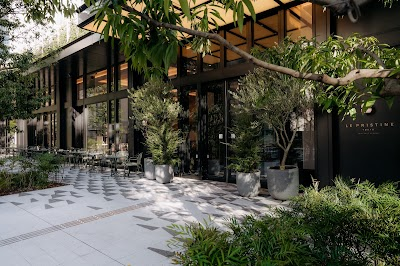

- **Place ID:** `ChIJozQeWWGLGGARcTAqsA7x6LE`
- **Address:** Japan, 〒105-0001 Tokyo, Minato City, Toranomon, 2-chōme−6−４ 虎ノ門ヒルズステーションタワー 1階
- **Overall Rating:** 4.6 ⭐
- **Review Summary:** {'text': 'Guests mention this hotel offers modern, clean rooms with stunning Tokyo Tower views and convenient direct subway access. They also highlight the exceptional, attentive staff and the delicious, high-quality breakfast. Visitors appreciate the complimentary 24-hour lounge with drinks and snacks, and the well-equipped gym.', 'languageCode': 'en-US'}
- **Amenities Summary:** Accessibility: {"wheelchairAccessibleParking": true, "wheelchairAccessibleEntrance": true}
#### Top 10 Positive Reviews:
- 5 Stars: This would be our second stay here in the last year in Tokyo; only this time we brought our 3 children ….. we all love this hotel… the modern design , spacious rooms with great amenities n fixtures.   Trains just downstairs n 2 stops to Ginza!! Best shower with fabulous water pressure. V comfy bed n my pillow with beads in it conformed to my neck nicely… perfect sleep with great blackout blinds. The staff from Bell boys Front office to Lounge staff are all so caring efficient n professionally trained…. No request is too hard…. Can’t wait till we come back again. There’s a complimentary Lounge for drinks snacks n coffee to be had 24/7 with view of Tokyo tower!… best yuzu bottle drink here … Upstairs there are showers freely available for hotel guests already checked out in the morning who have late night flights n a rest room too!! Such fantastic provisions!! If I could give 10 stars ….😝👌Big shout out to Makoto at Front desk and at the Lounge, Natsuki🥰
- 5 Stars: Great hotel - new, spacious, great location, and excellent breakfast.  This hotel is opened in 2023 so the hotel and facilities are new and modern.  It also has great location as many attractions such as Tokyo Tower, Ginza, Shinbashi, Tokyo Station, and Imperial Palace are all within 20-40 mins walk (if you are a walker like me). Alternatively, the hotel is located right above the Toranomon Hills station and a few minutes walk away from the Ginza line.  It also features a fantastic and modern 24/7 gym and lounge. The lounge also has a good view of Tokyo tower.  Lastly, the hotel breakfast, managed by La Prestine, is top notch. It offers a mixed buffet and made to order style high quality breakfast.  I will definitely stay here again!
- 5 Stars: We had a wonderful stay at the Toranomon Hills Hotel, Tokyo and it was the perfect start to our trip to Japan. The hotel is stunning, brand new, and everything felt very clean and thoughtfully designed with modern finishes.  We really appreciated the location. It’s slightly outside the busiest parts of Tokyo, which made it feel calm and relaxing to come back to. At the same time, it’s extremely convenient—Ginza is just a couple of stops away or a quick cab ride, and it’s very easy to access the train station right from the hotel via the escalator outside.  The surrounding area is also really nice and well planned, with a clean, open plaza and a 7-Eleven right in the station/Toranomon Hills complex, which was super convenient.  We stayed for the first part of our trip, then spent time in Kyoto and Osaka, and had planned to come back for one final night in Tokyo before our flight home because we enjoyed it so much. Unfortunately it was fully booked at that point, and when availability did open up later, the rates were quite high. I also mentioned to the front desk and followed up by email that we would have loved to return, but didn’t really hear back, which was a little disappointing.  Although we didn’t get to fully use all the amenities since we were out exploring most of the time, we did enjoy the lounge, which had a beautiful view of Tokyo Tower and was a really nice space to unwind.  Overall, we’re really glad we stayed here. It felt peaceful, comfortable, and well connected—perfect balance between quiet luxury and easy access to the city, and we would definitely stay again in the future.
- 4 Stars: A sleek, well-serviced hotel, though it has some "big city" spatial constraints to keep in mind.  The Highlights: The staff is attentive, professional, and helpful throughout the stay. The breakfast was also a standout, offering high-quality options that made for a great start to the day. Additionally, the location in the business district is a major plus if you value peace and quiet; the area is calm in the evenings.  The Trade-offs: The "5-star" experience hits a few friction points regarding the facilities. Even after upgrading for more space, the rooms are quite small, and the closet layout is particularly tight—if you are traveling with multiple pieces of luggage, staying organized is a bit of a challenge. The gym is also underwhelming for this tier; it’s very small and lacks the robust amenities you would typically expect.  Lastly, the elevators are noticeably slow, so you'll want to factor in a few extra minutes when heading out. Great for a quiet, professional home base, but those looking for typical luxury-scale room dimensions and facilities might find it a bit lean.

#### Top 10 Negative/Lowest Reviews:
No negative reviews available.

---
### Azabudai Hills
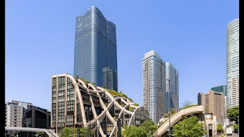

- **Place ID:** `ChIJJSI0QC6LGGARwWmKE3MWmj8`
- **Address:** 1-chōme-3-1 Azabudai, Minato City, Tokyo 106-0041, Japan
- **Overall Rating:** 4.4 ⭐
- **Amenities Summary:** Parking: {"paidParkingLot": true, "paidGarageParking": true} | Accessibility: {"wheelchairAccessibleParking": true, "wheelchairAccessibleEntrance": true, "wheelchairAccessibleRestroom": true, "wheelchairAccessibleSeating": true}
#### Top 10 Positive Reviews:
- 5 Stars: The perfect neighborhood for the rich, from an utopian future. If you enjoy gardens on the roof of luxury stores, with an international school for the ultra-wealthy, you came to the right place: Azabudai Hills. We wish we spent more time in this sublime neighborhood!
- 5 Stars: Upscale and diverse market. Lovely supermarket with good quality products and ready-made foods you can eat in the mall. A place that will help you create a custom dashi blends. An d several interesting bakeries, sweet shops and cafes. Also houses the Teamlabs Borderless interactive museum.
- 5 Stars: Azabudai Hills in Tokyo is a hidden gem. The upper viewing area provides breathtaking city views, and entry is as easy as ordering one drink. Not crowded, peaceful, and ideal for photography, with a spectacular view of Tokyo Tower. Highly recommended.
- 4 Stars: A sleek, modern complex with high-end shops and an impressive architecture — clearly one of Tokyo’s newer luxury destinations. We came specifically for the much-hyped Tokyo Tower view from the upper floors, but ended up being escorted out by security before we could enjoy it or grab a coffee. Apparently finding the right spot isn’t as straightforward as the blogs make it seem.  Interesting place to walk through, but we left without much to show for it. Do your research before visiting and make sure you know exactly where you’re allowed to go — could save you the same frustration.
- 4 Stars: Christmas market. Team lab. High end shops. Take the elevator on the JP Morgan building to the 34th floor. Observatory deck (500 Y admission) and bar (1000 Y  beer) to unwind and relax. Take in the scenic view of Tokyo Tower and city!

#### Top 10 Negative/Lowest Reviews:
No negative reviews available.

---
### ㈱PRism JAPAN
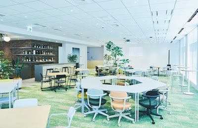

- **Place ID:** `ChIJAQDwXuOLGGARS3NX1jurBKk`
- **Address:** Japan, 〒104-0031 Tokyo, Chuo City, Kyōbashi, 2-chōme−13−１０ ４階
- **Overall Rating:** N/A ⭐
- **Amenities Summary:** Accessibility: {"wheelchairAccessibleParking": false}
#### Top 10 Positive Reviews:
No positive reviews available.

#### Top 10 Negative/Lowest Reviews:
No negative reviews available.

---
### TORANOMON HILLS CAFE
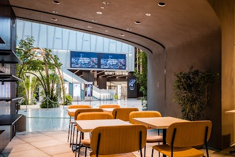

- **Place ID:** `ChIJ73iPHk2LGGARy6EKuZ-PkB4`
- **Address:** Japan, 〒105-5590 Tokyo, Minato City, Toranomon, 2-chōme−6−３ ヒルズ ステーションタワ 地下2階
- **Overall Rating:** 3.5 ⭐
#### Top 10 Positive Reviews:
- 5 Stars: As you exit the station, you'll be greeted by the stunning Toranomon Hills Cafe. The cafe is spacious and has plenty of seating to accommodate the large crowds that come to visit. They offer breakfast sets that cater to both local tastes and international travelers.  #andrewtanatomisingapore
- 5 Stars: Great cozy placed to have a good cup of coffee. We stoped there couple of times for breakfast and it was worth it. Staff was super nice and friendly. Thank you staff for being patient with us the tourist.

#### Top 10 Negative/Lowest Reviews:
- 2 Stars: Staff was fine atmosphere was pretty good but the food was not meeting my expectations

---
### teamLab Borderless: MORI Building DIGITAL ART MUSEUM
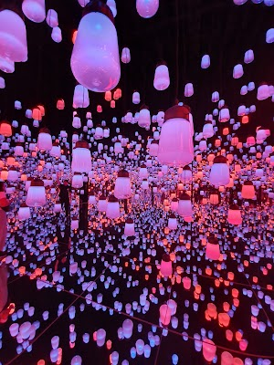

- **Place ID:** `ChIJQ5Sa1PqJGGARUSaNKKOrMVg`
- **Address:** Japan, 〒106-0041 Tokyo, Minato City, Toranomon, 5-chōme−9−９ Azabudai Hills Garden Plaza B, B1
- **Overall Rating:** 4.6 ⭐
- **Review Summary:** {'text': 'People say this digital art museum offers stunning, immersive, and interactive art installations that constantly change and flow between rooms, creating a unique, borderless world. Visitors highlight the value of the experience, mentioning the tea house as a worthwhile add-on and appreciating the convenient free lockers. They also praise the friendly and helpful staff, noting the engaging atmosphere is suitable for all ages.', 'languageCode': 'en-US'}
- **Amenities Summary:** Accessibility: {"wheelchairAccessibleParking": true, "wheelchairAccessibleEntrance": true, "wheelchairAccessibleRestroom": true}
#### Top 10 Positive Reviews:
- 5 Stars: I am extremely impressed. Probably one of the best art exhibits I have been to in a long time. The changing rooms, the light floral scents that change with the themes, the colors, the play on perspectives, the comments on humanity... it was all extremely well done.  We spent about an hour and fifteen minutes here wandering around - its easy to forget where you have been and where you are going because the same rooms you have been in change over time.  The support staff are locates throughout the exhibit and are extremely helpful and knew English very fluently. They also were inobtrusive in the way they showed us how to interact with some of the exhibits (pro-tip in the main big room, trying touching the walls!).  10/10 if we were going to be in Tokyo longer we would 100% visit their other locations. Worth the price and time to see, especially if you like a modern take on what art can be.
- 5 Stars: ⭐️⭐️⭐️⭐️⭐️  We've visited several immersive digital art exhibitions before, but teamLab Tokyo was on an entirely different level. The creativity, attention to detail, and the way technology and art blend together were simply breathtaking.  Every room offered a unique experience, and we constantly found ourselves saying, "Wow!" It wasn't just something to look at—it was something to truly feel and become part of. The interactive elements made it enjoyable for both adults and children alike.  We've seen similar exhibitions around the world, but this one was by far the best. It's the kind of place you could visit again and again and still discover something new each time.  An unforgettable experience and an absolute must-visit when you're in Tokyo! ✨🎨🌸🇯🇵🌌
- 5 Stars: Just wow. If you’re visiting Tokyo, you need to check out teamLab Borderless!  This is such a highly immersive digital art museum and truly an unforgettable experience. There are so many exhibits to walk through and explore, and each one feels completely different. The way the digital art moves, surrounds you, and blends into the space makes it feel endless and infinite, like the artwork has no boundaries.  Ending the visit with a cup of tea was also a really nice touch and made the whole experience even more memorable.  It was easy to access as well, located inside the building in the basement level of the shopping area. They also have free lockers available, which is super convenient for storing backpacks or bags while you explore.  Overall, this is a must-see experience in Tokyo and one of the coolest places we visited on our trip!
- 5 Stars: Great experience! The interactive tea house experience is what makes this location standout more than the others. However if that is not an interest to you and you will be in Kyoto then I would recommend the Biovortex location.  The tea house experience, which also serves ice cream, was lovely.  If you are here now/during sakura season, then the spot that is currently viral on social media for taking photos of the trees with the tower is very close and beautiful too. The cherry blossoms are currently in bloom here (early March 2026).
- 4 Stars: An interesting and unique experience overall. There are lots of PowerPoint-style presentations displayed on the walls, which gives the space a slightly unconventional and creative feel. The rooms are designed in different themes, making it feel a bit like an escape room experience as you explore and look for the best views.  The tea experience was also enjoyable, with many people around and a lively atmosphere that felt almost like a virtual or interactive world. Overall, it was a memorable and unusual place to visit.

#### Top 10 Negative/Lowest Reviews:
No negative reviews available.

---
### EN TEA HOUSE 幻花亭D rec
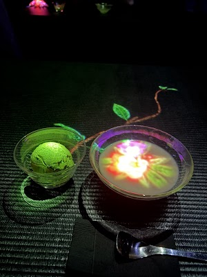

- **Place ID:** `ChIJ9cGNhBWJGGAR3iZTa0KQ_aE`
- **Address:** 1-chōme-3-8 Aomi, Koto City, Tokyo 135-0064, Japan
- **Overall Rating:** 4.3 ⭐
#### Top 10 Positive Reviews:
- 5 Stars: The whole vibe is mind-calming but slightly surreal; the dark room, dramatic spot lighting, and those slow-drip glass towers make it feel like a sci-fi tea lab crossed with a meditation chamber.  Calming, photogenic, and honestly one of the cooler tea experiences you’ll find in Japan.
- 5 Stars: The tea wasn't amazing by any stretch of the imagination, but the experience itself was great. If you went to the Odaiba location, this is exactly the same. The lights will follow your tea around - it's so cool. After a while, the lights will stop. I guess that's to prevent people from staying for too long. If you go to teamLab, definitely do this if you have a chance - it's super fun.
- 5 Stars: This is in the border less exhibit as the experience of drinking your tea is also a borderless experience. You have to go to the end and find the tea house and order your tea, it actually is fairly priced too. They’ll give you your leaves and tell you to wait until you’re seated. Try it out!! It’s pretty cool what happens to your tea.
- 5 Stars: It’s a small tea house in the teamLab experience that is definitely worth checking out. You have to line up and order and pay at the counter and the server will guide you to a designated spot. So if you want to sit together, make sure to go in at the same time.  I ordered the yuzu green tea with yuzu matcha ice cream. They were both really good but what really elevated the experience was the projections on the food. It was something that I’ve never seen before and is worth the higher price tag.  If you visit teamLab Borderless, I recommend it.
- 5 Stars: I did not have high hopes but the barley tea was so good. I had hopes from the matcha gelato but not the tea so was pleasantly surprised. The projection experience just made it all the more memorable. If you have time I’d recommend.

#### Top 10 Negative/Lowest Reviews:
No negative reviews available.

---
### Tomoegata Chanko
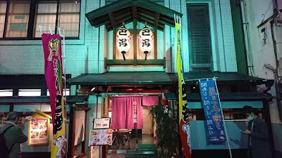

- **Place ID:** `ChIJAQA0kEqJGGAR93TbAoQ4x0Q`
- **Address:** 2-chōme-17-6 Ryōgoku, Sumida City, Tokyo 130-0026, Japan
- **Overall Rating:** 4.2 ⭐
- **Amenities Summary:** Parking: {"freeParkingLot": false} | Accessibility: {"wheelchairAccessibleParking": false, "wheelchairAccessibleRestroom": false}
#### Top 10 Positive Reviews:
- 5 Stars: The best restaurant we've been to on our trip! We have a 7 month old baby and the staff were beautiful and so helpful. When we came in there was a child seat set up and ready for him to use. He soon fell asleep and they brought out a bouncer for him to sleep in with a blanket. They also brought out some books for him to play with if he woke up.  Such friendly people and the food was amazing. Healthy and comforting with delicious flavours!!!
- 5 Stars: In sumo town Ryogoku, you should eat as sumo wrestlers do. And that means you gotta try Chankonabe!  Chankonabe is a kind of protein-rich stew that sumo wrestlers eat in vast quantities in order to quickly bulk up in size. They usually contain an assortment of vegetables and various kinds of protein. It is therefore essentially a hotpot/shabu-shabu sort of meal and can therefore be considered relatively healthy, as long as you are not eating it in vast quantities, I suppose😂  Ryogoku is full of Chankonabe restaurants opened by retired sumo wrestlers, each with their own unique recipe and ingredients for that perfect broth.  But perhaps one of the best places to try this traditional sumo dish is at Tomoegata Chanko. Despite the rather "Minas Morgul-ish" lighting of the entrance (lol), you will find that the interior is nice, warm and cozy.  You can choose from 4 different Chankonabe broth styles which differ in broth base and ingredients (and thus correspondingly price as well). Seeing as I only had a short time in Japan, I tried the most expensive option (Tachiyama w Prime Japanese Beef) and was very impressed. The beef came in clean, large sheets and when cooked tasted very nice with a good amount of marbling. The other ingredients were great to complement the entire dish as well, especially the daikon radish and konjac.  Overall, made for a very hearty and satisfying meal👌🏻
- 5 Stars: Sumo and Chanko Nabe!! We came here for dinner after watching a sumo match. It was just around the corner from the stadium and the reviews looked good so we decided to give it a try! They seated us upstairs and on this particular evening we were very much the only westerners in the room. The service was very kind and considerate. We had 2 servers who each spoke a little English and the menu had plenty of photos so we made it work. Even with the explanation of how to cook the soup yourself on the burner in front of you they were kind using hand gestures and explaining. It was a ton of food so go hungry!! It was a fun experience as well as delicious. The music is particular as it’s the singing which happens after a sumo match, we had just been so we understood but that might be a surprise if you don’t know what the style of music is.
- 4 Stars: We were a bit underwhelmed by the quality. The sushi was a bit dry and the tempura was average with some bones. After reading other reviews, however, it seems like Chanko is what we should have ordered. The restaurant itself was nice and the staff friendly so I'd probably give it another shot.
- 4 Stars: I’m not the biggest fan of soup, and one of the meal sets that I ordered included a big bowl of soup filled with vegetables and meat. It was actually pretty well. I know if I wasn’t feeling well, or had a cold, I’d definitely come over to this place to have there hot soup. Soup lovers would defintly enjoy this restaurant.

#### Top 10 Negative/Lowest Reviews:
No negative reviews available.

---
### Ryogoku Kokugikan Sumo Arena

- **Place ID:** `ChIJGeu4VDWJGGARdPoda8d8I3A`
- **Address:** 1-chōme-3-28 Yokoami, Sumida City, Tokyo 130-0015, Japan
- **Overall Rating:** 4.4 ⭐
- **Review Summary:** {'text': 'People say this arena offers an unforgettable experience with the intense atmosphere of live sumo, highlighting the powerful clashes and traditional rituals. Visitors also appreciate the wide variety of food options, including popular yakitori and chanko stew, and the extensive selection of sumo merchandise. They also mention the venue is clean and the staff are helpful.', 'languageCode': 'en-US'}
- **Amenities Summary:** Accessibility: {"wheelchairAccessibleParking": true, "wheelchairAccessibleEntrance": true, "wheelchairAccessibleRestroom": true}
#### Top 10 Positive Reviews:
- 5 Stars: Watching sumo live at Ryogoku Kokugikan Sumo Arena was something I will remember for a very long time. There is nothing quite like experiencing sumo in person. The atmosphere inside the arena was electric yet deeply respectful, with a strong sense of tradition and ritual that you can really feel the moment you step in.  Seeing sumo up close gave me a much deeper appreciation of the sport, the discipline, and the culture behind it. The crowd was fully engaged, reacting together with gasps, applause, and quiet anticipation.  A truly unique experience that goes far beyond sport. If you ever have the chance to watch sumo here, do not miss it.
- 5 Stars: Fantastic!! If you are in Tokyo and there's a tournament on it's a must visit. Great entertainment and brilliant atmosphere. We were so lucky to get tickets but we booked months in advance. Would definitely recommend.
- 5 Stars: If you visit Japan during an odd numbered month, you should seriously consider taking in a sumo tournament day. Weekends are packed so weekday visits are recommended. January, May and September feature tournaments here in Ryogoku but there are charity sumo events taking place all the time so check the website for the latest events.  Sumo is so deep, ritualized, spiritual and ceremonial that I suggest you read up a little or watch a few broadcasts before a visit. You will get more out of the experience.  I never tell people what to do as travel is very personal and taste is very subjective BUT in Japan, I highly recommend visiting sumo, climbing Mount Takao and watching kabuki. I lived in Japan for 20+ years but these would still be my first choices today.  Sumo Spectator Sinay says: Most people attend sumo in the afternoon around 3:00PM but if you go in the morning, you can sit at the dohyo edge (ringside) and see the up and coming lower ranked wrestlers. Why miss out on the opportunity?
- 5 Stars: One of my favorite areas to spending time in. Located behind the national museum. Amazing Colour in the summer / events. Tickets can be difficult to get, but amazing place to visit if you have time.
- 5 Stars: I had seen sumo wrestling on TV before, so getting the chance to attend a live tournament in Tokyo was something I was really looking forward to. I researched how to buy tickets ahead of time , the process was surprisingly easy. I purchased the tickets online and collected them from a Seven Eleven convenience store in Japan, which I then brought with me to the arena on the day.  Walking into the Kokugikan, we were amazed by the size of the arena. It’s massive, with a huge number of spectator seats all surrounding a single raised ring. From our seats up high (way up in the “nosebleeds”), the ring looked smaller than I expected. But during breaks, we walked around the lower level and got a much closer view of the action, which added a whole new level of appreciation.  The matches themselves were fascinating, each bout was intense but over quickly, and the rituals before each one were just as interesting. We thought we’d stay for about three hours but ended up staying for over five. The energy in the arena was fantastic, and the crowd was fully engaged.  If you're in Tokyo, this is a must-see cultural and sporting experience. I’d absolutely go again.

#### Top 10 Negative/Lowest Reviews:
No negative reviews available.

---
### 第一いろは坂(下り)
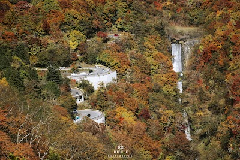

- **Place ID:** `ChIJG6734--pH2ARMGBGRNUkyH8`
- **Address:** Chugushi, Nikko, Tochigi 321-1661, Japan
- **Overall Rating:** 4.4 ⭐
- **Review Summary:** {'text': 'Visitors say this winding mountain road offers stunning autumn foliage and beautiful views of Lake Chuzenji and Mount Nantai. They also highlight the enjoyable driving experience, especially the continuous hairpin turns. Guests mention that driving early in the morning helps avoid congestion.', 'languageCode': 'en-US'}
- **Amenities Summary:** Accessibility: {"wheelchairAccessibleParking": false, "wheelchairAccessibleEntrance": false}
#### Top 10 Positive Reviews:
- 5 Stars: This is the road u use to visit Lake Chuzenji. Its one way. One up, other down. Plan your route carefully if you want to visit the Ropeway. Its on the Up route. Once u pass it u have to make a large loop, not ideal as this road gets congested during peak periods. Come early! 7am.
- 5 Stars: I was just walking around, and then some blue car decided to overtake a white one with a jump. I was in the jockey and almost got run over, but it looked epic.
- 5 Stars: **American Family Visiting** Visited this area during my Initial D pilgrimage to experience one of my favorite courses in the games.  The Irohazaka course is based on this winding road and is very true to the game (or vice versa really).  Drivers should be careful of traffic and the extreme winding roads.  Quite the experience really!
- 4 Stars: If you will visit lle chuzenji lake, you must drive througn this 48 turns trail, nice scenery spot at turn 35, must be fun if you drive you own vehicle.

#### Top 10 Negative/Lowest Reviews:
No negative reviews available.

---
### The Ritz-Carlton, Nikko
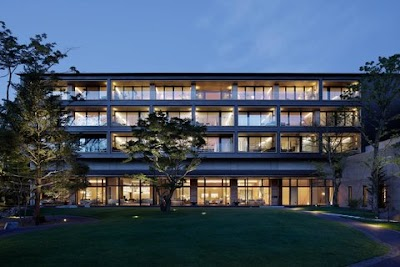

- **Place ID:** `ChIJdzXriwivH2ARRX_JL7-lc8M`
- **Address:** 2482 Chūgūshi, Nikko, Tochigi 321-1661, Japan
- **Overall Rating:** 4.4 ⭐
- **Review Summary:** {'text': 'People say this hotel offers stunning views of Lake Chuzenji and Mount Nantai, with spacious, well-maintained rooms featuring private onsen-style bathtubs. Guests also highlight the exceptional natural hot spring facilities, including indoor and outdoor baths, and the delicious food and drinks. They also appreciate the warm, attentive, and professional staff who provide outstanding hospitality.', 'languageCode': 'en-US'}
- **Amenities Summary:** Accessibility: {"wheelchairAccessibleParking": true, "wheelchairAccessibleEntrance": true}
#### Top 10 Positive Reviews:
- 5 Stars: Coming from Park Hyatt, our expectations were high and the Ritz Nikko didn’t disappoint. The room was clean and large. The breakfast was great. They included a nice continental bar with milk, juices and cereals free for everyone which was much appreciated. You gotta try the croissant waffle for breakfast. It’s amazing!!! Our stay was made special by a very special server in the Japanese restaurant. Her name is Galih.  She is truly amazing!  If you see her, tell her we said hi!!
- 5 Stars: I’m honestly obsessed with this hotel! It was our second visit in 2 years, it might just become the high standard I never knew I needed!  The drive is picturesque from the base of the mountain up to Lake Chuzenji through the winding roads. You might also see some local monkeys!  As you arrive, you’re greeted by every staff member with a cheerful smile. Whisked away from your car into the lobby lounge, fire place roaring and welcome drink in hand. The check in process is something you’d experience at a local ryokan.  The rooms are immaculate, modern and have their own onsen bath. The bed is super comfortable and the views, no matter what room you get is spectacular! We had the Mt Natai view.  We enjoyed all dinning options at the hotel, Japanese style breakfast, afternoon tea in the lobby lounge, dinner at the Lakehouse and late night drinks at the bar. The care in delivering a total package experience is something the Ritz Carlton should be celebrated for.  We’ll be back ❤️
- 5 Stars: Despite that its american chain they preserved japanese hospitality 🙏🏽🙂‍↕️🤍 this ine and Ritz in Okinawa are my favorites! Everything was perfect! And mattress (!!!!!!) so good! I slept very well here! I wish they would have in all their hotels same mattresses as here.  Also the “egg onsen” which is sulfur onsen is ultra beneficial for skin and joints and I wish guests would be acknowledged about that and hotel would bring kakenagashi without chlorine inside back…because why other guests should suffer in chlorine if others are clueless about onsen rules and minerals in water. Its gift from nature to have onsen with kakenagashi and have: special odor from water, special water colour and off course mineralisation on the edges of the pool.
- 5 Stars: This place is a bucket list must-visit once in a lifetime experience! Every staff of the team come together to make every guest’s stay memorable.  As a frequent traveller for leisure, I set my standards pretty high when visiting the highly anticipated Ritz Carlton Nikko after having a great experience at the RC Fukuoka. This place managed to top experience beyond.  Here’s how:  Every contact with the hotel is a well-executed plan by the staff. From the greetings and check-in by a lovely kimono lady at the lounge, to the caring tour staffs (who prepared coats and warm drinks for you), to the concierge who brings the car around before the guest arrives, to the chef who presents a meal just at the right timing.  While the location is perfect (nice view of mount nantai and the lake) and the rooms are a masterpiece of its own, the experience was definitely perfected to the extreme by the staff.  If the impeccable staff service is not a good enough motivation, the onsen hot spring inside the hotel is definitely another one.

#### Top 10 Negative/Lowest Reviews:
- 2 Stars: This was our first time staying at a Ritz Carlton, so we were super excited, but unfortunately this hotel didn't meet our expectations.  Though the property is stunning, the staff are kind, and the food is gorgeous, the biggest flaw is that you are unable to change the temperature in your room and it is stuck at 24 degrees. I'm pregnant and my husband runs hot, and we prefer to sleep in 18-19 degree temperatures, so the warm air in the room made it impossible to sleep. When we called the staff to ask if there was anything they could do, they suggested that we sleep with ice packs in our bed or open the balcony door. I obviously didn't want to sleep with ice in my bed, so we had to sleep with the balcony door wide open the whole night. It was winter, so this helped cool the room down but the wind was so loud so it made it really hard to sleep. Then as soon as the sun rose, the room was filled with light and we couldn't get back to sleep. I think we each slept maybe 2-3 hours the whole night.  We were supposed to stay two nights but unfortunately we had to change hotels after one night due to the temperature issue. It's definitely unfortunate to pay $1,000 a night for a hotel and then be unable to sleep.  A few other things to note:  - The gym is also really hot, which made working out uncomfortable. The gym is also in the same building as the onsen, and the onsen has a very strong sulfur smell, so the whole gym smelt like rotten eggs.  - There are two restaurants on the property but they start at 22,000+ per person for dinner (without drinks). I wish they had some other options. We ended up getting room service instead.  We did like the breakfast in our room, the aesthetics of the hotel, and the service from the staff, but if you also like to sleep in cooler temps, I wouldn't recommend this hotel.

---
### Nikkō Tōshōgū
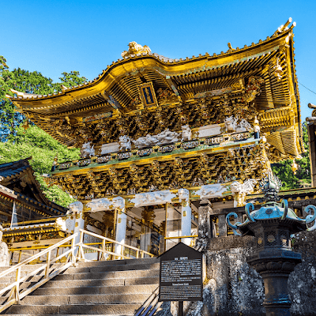

- **Place ID:** `ChIJNSAhU8WmH2ARlA7wenFbUKs`
- **Address:** 2301 Sannai, Nikko, Tochigi 321-1431, Japan
- **Overall Rating:** 4.5 ⭐
- **Review Summary:** {'text': 'People say this shrine features stunningly ornate and colorful architecture, including the intricate Yomeimon Gate and famous carvings like the Three Wise Monkeys and Sleeping Cat. Visitors also highlight the serene and spiritual atmosphere, especially in the quiet Okumiya area. They recommend purchasing tickets online in advance and wearing comfortable shoes due to numerous stairs.', 'languageCode': 'en-US'}
- **Amenities Summary:** Parking: {"paidParkingLot": true} | Accessibility: {"wheelchairAccessibleParking": true}
#### Top 10 Positive Reviews:
- 5 Stars: Nikkō Tōshō-gū is definitely worth visiting when in Nikkō, especially if you appreciate history and traditional Japanese craftsmanship. The shrine grounds are beautifully maintained, with intricate wood carvings and decorative details throughout the complex, including the famous “Three Wise Monkeys.”  What impressed me most was how well the entire area is preserved despite being surrounded by such a large forest landscape. The peaceful atmosphere, tall cedar trees, and shaded walking paths make the visit very relaxing and enjoyable.  It can get crowded later in the day, so visiting in the morning is recommended for a quieter experience. Overall, it’s a wonderful cultural spot that blends history, nature, and architecture beautifully.
- 5 Stars: An amazing shrine surrounded by tall, towering trees, giving the whole place a very serene and grand atmosphere.  It was raining during our visit, so we weren’t able to explore as much as we wanted. Still, the place felt majestic and impressive. It’s incredible how well it has been preserved over time — you can really feel its historical significance.  Being a UNESCO World Heritage Site, it’s definitely worth visiting at least once, especially if you’re in Nikko.
- 5 Stars: What a truly peaceful and grounding place. Visiting here offers a deeper glimpse into the Edo period – a time that shaped the foundation of modern Japan and stands as one of the longest eras of peace in its history.  Before even entering the temple, don’t miss the small souvenir shop nearby. The food there was an unexpected highlight – simple, authentic, and absolutely delicious. What made it even more special was the warm, humble service from the elderly ladies. There was something deeply touching about it – with every bite, you could genuinely feel a sense of tradition and heritage.  A beautiful experience in every sense ❤️
- 5 Stars: The most beautiful temples I have ever seen. I was amazed by how well the architecture blends with the surrounding nature. Every corner has something beautiful to discover, and the whole place has a calm and special atmosphere. It's easy to see why this is a World Heritage site. Definitely one of the highlights of my trip to Japan.
- 5 Stars: Every time I visit, I’m completely overwhelmed by the sheer grandeur of this place. It makes me wonder how people in ancient times were able to build something like this—it truly makes me want to see it with my own eyes. In an era without modern transportation or advanced materials, creating such a magnificent structure must have been an extraordinary challenge. It’s almost unbelievable that it still exists today. Every story you hear about it adds to its charm, and there are so many highlights to explore. If you ever find yourself in Nikko, this is a World Heritage site you should definitely make time to visit.

#### Top 10 Negative/Lowest Reviews:
No negative reviews available.

---
### The Lake House
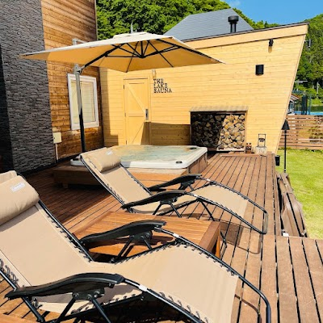

- **Place ID:** `ChIJAYArcT0j9l8RC3EuyMcs5Ek`
- **Address:** 5-4-3 Nojiri, Shinano, Kamiminochi District, Nagano 389-1303, Japan
- **Overall Rating:** 5 ⭐
- **Amenities Summary:** Accessibility: {"wheelchairAccessibleEntrance": false}
#### Top 10 Positive Reviews:
- 5 Stars: Great house in an amazing location! Sauna and hot tub are highlights. Great entertainment system in the house as well. The only negative might be limited toilets (only 2 and they are assigned genders).
- 5 Stars: What struck me immediately when I arrived at the inn was the overwhelming sense of openness and cleanliness, which I value above all else. It seemed like an inn cared for and loved by wonderful people, and the guests seemed to use it with refinement. The rooms were tasteful, and the food and drinks were excellent, with a spectacular view from the room. We enjoyed the sauna, SUP, and BBQ, and had a wonderful weekend. I'd definitely like to stay here again. Thank you so much. I'll definitely stay again.
- 5 Stars: The spacious wooden deck is equipped with a jacuzzi, cold plunge pool, and sauna, creating a truly wonderful space.  For sauna lovers, there are reclining chairs for enjoying the fresh air, and you can also enjoy a BBQ. The view of Lake Nojiri from the pier was also beautiful.  The guest rooms were clean, and we had a very comfortable stay. We were extremely satisfied!
- 5 Stars: The view of Lake Nojiri from the wooden deck is simply amazing. We enjoyed stand-up paddleboarding on the magnificent lake surrounded by nature. The sauna, cold plunge pool, and jacuzzi are also available, making it a great place to relax and enjoy nature all day long. It's also wonderful that we can bring our dog.  The interior is spacious, with a karaoke machine in the living room.  There are bedrooms on the second and third floors, so it can be enjoyed by large groups.
- 5 Stars: Not only is it spacious, but the best thing about it is that you can stay in the sauna all day. Of course, there's also a cold water bath set at 14°C all year round, a warm jacuzzi, and a lake right in front of you.  The room is fully equipped with everything you need, including a kitchen, washing machine, and towels.  It's a pet-friendly villa built by sauna lovers, for sauna lovers, and is perfect for adults to enjoy as well.  Best of all, it also has karaoke, so you don't have to go out at all for entertainment.

#### Top 10 Negative/Lowest Reviews:
No negative reviews available.

---
### Senjōgahara Moor
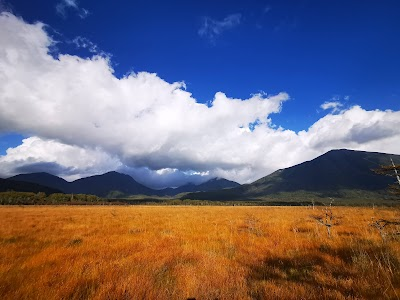

- **Place ID:** `ChIJDaPtMeetH2ARr7-eMNqEqpk`
- **Address:** Chugushi, Nikko, Tochigi 321-1661, Japan
- **Overall Rating:** 4.4 ⭐
- **Review Summary:** {'text': 'Visitors say this marshland offers stunning, expansive views of Mount Nantai and the surrounding mountains, with well-maintained wooden boardwalks that make for an easy and enjoyable hike. They also highlight the diverse plant life and abundant birdwatching opportunities, noting the landscape changes beautifully with each season. Guests mention the refreshing mountain air and peaceful atmosphere, making it a perfect escape for people.', 'languageCode': 'en-US'}
- **Amenities Summary:** Accessibility: {"wheelchairAccessibleEntrance": false}
#### Top 10 Positive Reviews:
- 5 Stars: Extremely beautiful place to explore! It makes for a great day trip from Nikko, just take the bus up and back and you’re set. The trails are clearly marked/visible and I saw many monkeys along the way. Great place for bird watching as well as just enjoying the great outdoors. Easy hiking and good vibes make this a great way to spend the day!
- 5 Stars: The route mostly have wooden deck and the incline is easy. It's beginner friendly hike. For the route, it's better to get off at Yudaki and then hike to Akanuma.
- 5 Stars: Absolutely loved this place! Walking through Senjōgahara felt like a true shinrin-yoku experience—calm, grounding, and deeply refreshing.  The peaceful marshland, fresh mountain air, and endless natural scenery make it the perfect escape from the city. Highly recommend if you’re in Nikko.
- 5 Stars: Senjōgahara is a vast high-altitude marshland located about 1,400 m above sea level. It covers roughly 400 ha and was formed thousands of years ago when eruptions from Mount Nantai blocked the flow of the Yukawa River, gradually transforming an ancient lake into a wide peatland.  The name Senjōgahara literally means “battlefield plain”, and it comes from a local legend telling that the gods of Mount Nantai and Mount Akagi once fought here over the possession of Lake Chūzenji. Today, however, this “battlefield” is one of the most peaceful landscapes in Nikko — an open plateau of grasses, streams, and mountain light.  The area is known for its rich biodiversity — with more than 350 species of plants and many species of birds — and is protected under the Ramsar Convention as a wetland of international importance. Wooden boardwalks make it easy to explore without disturbing the ecosystem, and the landscape changes dramatically with each season.  We walked the trail from Ryuzu Waterfall to Yumoto Onsen. The route passed through open plains framed by distant mountains, and the golden grasses shimmering in the sunlight made the whole scenery look almost surreal. Even in mid-October, many trees were still green, but the marsh itself glowed with warm autumn tones — a calm, quiet beauty.
- 5 Stars: Beautiful scenery, highly recommend it to anyone who enjoys nature, even on a cold day we had it was worth it. Good for novice to more advanced hikers as the trails offer many different routes.

#### Top 10 Negative/Lowest Reviews:
No negative reviews available.

---
### Kegon Waterfalls
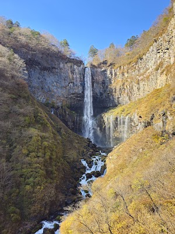

- **Place ID:** `ChIJwb6wwMioH2ARjVZDylifnCc`
- **Address:** 2479-2 Chūgūshi, Nikko, Tochigi 321-1661, Japan
- **Overall Rating:** 4.4 ⭐
- **Review Summary:** {'text': 'People say this waterfall offers breathtaking views and a powerful, majestic flow, especially when seen from the lower observation deck accessible by a paid elevator. Visitors also highlight the refreshing mist and cool air, making it a great escape during hot weather. They also like the convenient access to nearby food stalls and souvenir shops.', 'languageCode': 'en-US'}
- **Amenities Summary:** Parking: {"paidParkingLot": true, "freeStreetParking": true, "paidStreetParking": true} | Accessibility: {"wheelchairAccessibleParking": true, "wheelchairAccessibleEntrance": true}
#### Top 10 Positive Reviews:
- 5 Stars: Kegon Falls, located in Nikkō National Park, Tochigi, is one of Japan’s most beautiful waterfalls. Fed by Lake Chūzenji, the water plunges 97 meters down a massive cliff, creating a breathtaking scene surrounded by mountains and forests.  Each season reveals a different beauty of God’s creation — fresh greenery in summer, vibrant autumn colors, and magical frozen waterfalls in winter. The powerful sound of the falling water, cool mist in the air, and occasional rainbow under the sunlight make this place truly unforgettable.  Visitors can take an elevator to the observation deck below to experience the magnificence of nature up close and enjoy the peaceful scenery around the lake and mountains.
- 5 Stars: Not the best time to visit when we went. The surroundings hadn’t bloomed yet — trees were still dry coming out of winter, so the scenery wasn’t at its peak.  That said, the place is still magical and impressive. Seeing the waterfall in person is amazing.  It was around 8°C and raining during our visit, so we weren’t able to explore much. There are both free and paid viewing decks. Honestly, the free one is already good enough, but paying ¥600 for the closer view isn’t a bad option if you want a better perspective.  Overall, still worth visiting — just try to time it better for the full experience.
- 5 Stars: A spectacular, high waterfall cascading down into the basin below. There is an elevator service available for 600 yen per adult, which takes only about a minute to go up or down. There’s even an elevator operator to assist you.  The area is very convenient, with plenty of food stalls nearby offering local snacks. The parking lot is also quite large and easy to access. A must-visit spot in Nikko!
- 5 Stars: This place offers beautiful majestic mountain view with great foods. I visited it in late March so there was still some snow and not much water. Still, the viewpoint was surprisingly more gorgeous than in photos.  Besides, this place had so many good foods. The grilled trouts was absolutely delicious, totally recommended.
- 4 Stars: 26 May 2026. View from the lower observation deck. One of Japan's Three Great Waterfalls. The flow wasn't at its widest when visited, but the 97 m drop was still impressive. Fee to get to the lower observation desk is ¥600. No wait at all, we are allowed to take the elevator once we walked after we paid the fee

#### Top 10 Negative/Lowest Reviews:
No negative reviews available.

---
### Matsumoto Hotel Kagetsu
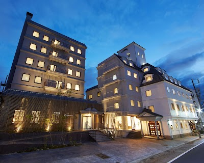

- **Place ID:** `ChIJV2ISx5EOHWAR-ftu9zlN0f0`
- **Address:** Japan, 〒390-0874 Nagano, Matsumoto, Ōte, 4-chōme−8−９ Matsumotohotel, 2F
- **Overall Rating:** 4.3 ⭐
- **Review Summary:** {'text': 'Visitors say this hotel offers spacious, clean rooms with traditional Japanese decor and a large communal bath featuring natural spring water. They also highlight the delicious breakfast buffet, which includes local specialties and Western options, and the excellent, friendly staff. Guests mention the convenient location, within walking distance of Matsumoto Castle and other attractions.', 'languageCode': 'en-US'}
- **Amenities Summary:** Accessibility: {"wheelchairAccessibleParking": true, "wheelchairAccessibleEntrance": true}
#### Top 10 Positive Reviews:
- 5 Stars: A lovely 'modern' hotel with all the amenities expected by Western tourists. Large king single beds in rooms were comfortable. AC has language choices so you can understand what you are setting. Windows open for a fresh breeze. We didn't use the public baths but there was a full size tub with shower overhead that had in a tank hot w a ter with pressure. A small fridge and rudimentary kettle and cups complement the room. Breakfast options were plentiful from a dlishious traditional Japanese menu to Western items such as toast, cereal, fruit and the eggs and bacon option. No English speaking channels on the TV.
- 5 Stars: The hotel rooms are a bit older, but they were very clean and well maintained. The location is excellent and very convenient for exploring the area. What stood out the most was the friendliness of the staff — everyone was welcoming, helpful, and made our stay very pleasant.
- 5 Stars: A nice, pleasant hotel. One minor drawback: there's a very high step when exiting the bathroom. You could fall. To close the window, you have to press a small, discreet button at the bottom. Judging by our group, many people don't notice this.
- 4 Stars: Took a Japanese-style room for two nights, for a family of five. The simplicity of the room gives a nice atmosphere, while still having everything needed - a TV, a Bluetooth speaker, a low-sitting table with a tea set, and a bathroom-toilet-sink set outside the tatami rooms.  The location is a 3 minute walk from Nawate and Nakamachi streets, so right in the middle of everything you would probably want in Matsumoto.  We came by car, and there's an adjoined public parking space which the hotel can supply affordable tickets to when checking out - talk about it in the reception.  Nice bathhouse, albeit only inside, which was a shame - I personally much prefer an open-air bath.  The breakfast was good. Highly recommend the curry, and the 100% apple juice.  Service - as always in Japan - was great and welcoming.

#### Top 10 Negative/Lowest Reviews:
- 2 Stars: Unfortunately this hotel is severely let down by the stink of the rooms, particularly the bathrooms. It was so bad in the shower room that we couldn’t even shower in the morning.  The rooms were somewhat dark but fairly spacious. Service was good though the welcome drinks and breakfast felt very modest to what we’ve been used to.  The location is perfect, close to so many restaurants and the castle.

---
### Matsumoto Castle

- **Place ID:** `ChIJmVmaCoUOHWARVPa8-iAOLZA`
- **Address:** 4-1 Marunouchi, Matsumoto, Nagano 390-0873, Japan
- **Overall Rating:** 4.5 ⭐
- **Review Summary:** {'text': 'People say this castle is beautiful, with a striking black exterior, and features interesting historical displays, including a collection of firearms. Visitors also highlight the well-maintained grounds, which are perfect for photography, and the option to purchase e-tickets for smoother entry. They also mention the staff are friendly and helpful, with some offering free English-speaking tours.', 'languageCode': 'en-US'}
- **Amenities Summary:** Parking: {"freeParkingLot": true, "paidParkingLot": true, "paidStreetParking": true} | Accessibility: {"wheelchairAccessibleParking": false, "wheelchairAccessibleEntrance": false}
#### Top 10 Positive Reviews:
- 5 Stars: Unlike many other rebuilt castles in Japan, this is an original castle, one of Japan's twelve original keeps. You can really feel the age and authenticity as you climb through the interior.  The exterior and the surrounding moat are impeccably kept and look very classy.  The wooden stairs inside are incredibly steep and narrow (almost like ladders in some spots). You’ll need to take your shoes off at the entrance, so wear nice socks!  They have free English-speaking volunteer guides, they are very friendly and knowledgeable.  The night illumination and light projection are a must-see. The reflection of the castle in the moat during the show is perfect for photos.
- 5 Stars: The exterior of the castle was my highlight along with the staff. The grounds were beautiful and I have a huge appreciation for the beautiful structure that is 3x older then our country! Truly impressive. We only just stumbled across this castle and last minute decided to stop as we were passing through and so pleased we did! We ended up buying a ticket and entering the castle - line was minimal but as we left we could see the line growing, so possibly worth purchasing online and getting there early.
- 5 Stars: Matsumoto Castle was an absolutely wonderful experience. We were lucky to visit on a stunning day with relatively light crowds, which made it even more enjoyable to take in the history and atmosphere of the castle.  Exploring inside really gives you a sense of its past, though be prepared — some of the stairs are quite steep and may be challenging for those with mobility issues.  The cherry blossoms were just beginning to bloom, adding a beautiful touch to the setting. One of my favorite moments was seeing all the koi fish gliding through the water around the castle — it made the whole scene feel especially peaceful and picturesque.  Highly recommend visiting if you’re in the area!
- 5 Stars: We stopped by Matsumoto Castle and even just seeing it from the outside was impressive. The castle looks stunning and striking against the surroundings and definitely has that classic, majestic feel.  There are quite a few parking lots around the area, so it’s easy enough to find a spot and just walk over. There are also clean public toilets right outside, which is convenient. We didn’t go inside this time, but honestly, even just taking in the view from the outside felt worth it. If you’re in the area, it’s an easy and worthwhile stop.
- 4 Stars: Beautiful Castle, But Not for Everyone  Matsumoto Castle is undoubtedly one of the most beautiful castles in Japan. The striking black exterior, the surrounding grounds, and the reflections in the moat make it a wonderful place to visit and photograph. The castle has a genuine historic feel and is far more authentic than many other castles that have been heavily reconstructed.  However, visitors should be aware that the interior is not suitable for everyone. The wooden staircases inside are extraordinarily steep, narrow, and, at times, quite claustrophobic. Going up is challenging enough, but coming down requires considerable care. A slip could easily result in a serious fall, particularly for older visitors or anyone with mobility issues.  That said, the steep staircases are part of the castle’s original character and history, so they do provide an authentic glimpse into how these structures were built centuries ago.  Overall, a fascinating and beautiful historic site that is well worth visiting, but it is important to know what to expect before climbing to the upper levels.

#### Top 10 Negative/Lowest Reviews:
No negative reviews available.

---
### Nawate Shopping Street

- **Place ID:** `ChIJR-XzQo4OHWAR3o9GleBXoi0`
- **Address:** Japan, 〒390-0874 Nagano, Matsumoto, Ōte, 3-chōme−4−３ 松本Ｍ―１
- **Overall Rating:** 4 ⭐
- **Amenities Summary:** Parking: {"paidParkingLot": true} | Accessibility: {"wheelchairAccessibleParking": false}
#### Top 10 Positive Reviews:
- 5 Stars: A charming little street on the way to Matsumoto Castle. Nawate Street is short but packed with character. I loved the scenic riverside walk with beautiful vintage lamp posts. It’s right next to Yohashira Shrine, where you can sit and enjoy a peaceful moment. Great local snacks and lovely small shops. Highly recommend for a relaxing break!"
- 4 Stars: Came here around first week of February 2026 at night time but there were no open stores, not sure why, thought I’ll be seeing food stalls or yatais. It’s the gateway towards Matsumoto castle and the views during my walk from Matsumoto station to here was pretty neat.
- 4 Stars: I think if you’re walking to the castle it’s worth the detour down here, there were a few shops selling a variety of things. It was very quiet and there’s a few cafes at the end. Wasn’t exactly a life changing experience but cute.
- 4 Stars: Long shopping street but it is not so happening. Slow and relaxing stroll with many shops selling food and sounviners. There is a big frog statue for photographing, and a frog shrine too
- 4 Stars: I visited this area in mid-July 2023. There are plenty of souvenir shops, cafes, and snack stalls around. Right at the entrance, you’re welcomed by a frog statue—super cute and unique! I really loved the retro vibe of the whole place. If you walk further in, there are lots of charming little alleys to explore. Definitely worth taking your time to wander around!

#### Top 10 Negative/Lowest Reviews:
No negative reviews available.

---
### Hikariya Nishi
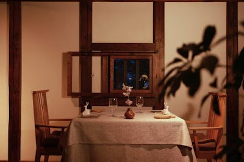

- **Place ID:** `ChIJQwN-gpEOHWARudHC_hi9rDU`
- **Address:** 4-chōme-7-14 Ōte, Matsumoto, Nagano 390-0874, Japan
- **Overall Rating:** 4.2 ⭐
- **Review Summary:** {'text': "Diners like this restaurant's delicious and beautiful French cuisine, which features sophisticated ideas and local ingredients. They also highlight the world-class service and the calming, character-filled setting. Guests mention feeling appreciated and welcomed, making for a memorable and special dining experience.", 'languageCode': 'en-US'}
- **Amenities Summary:** Parking: {"freeParkingLot": true} | Accessibility: {"wheelchairAccessibleParking": false, "wheelchairAccessibleEntrance": false, "wheelchairAccessibleSeating": false}
#### Top 10 Positive Reviews:
- 5 Stars: This was an amazing dining experience. It starts with a peaceful entrance accented by a beautiful flower arrangement floating delicately in a fountain. Then we were guided by lamplight to our dining table. We had seven courses and each was more perfectly plated and absolutely delectable than the last. The local vegetables and lily bulb with a yuzu foam sauce were surprising and spectacular. The lobster and steak transcended anything with the same names I had tasted before.
- 5 Stars: One of the best, or shall I say the best French restaurant I have yet to encounter in Japan. I live in Tokyo, but have travelled here only for this restaurant for 3 times until this day. Every time, the food here strengthen its position in my mind, never once did it fail me. Not only the food that is outstanding, the staff are also friendly and capable, the atmosphere is great. I’ve celebrated my birthday here couple of days ago, and the cake was amazing! (You can reserve it online)and I believe that they have out done themselves this time, not only the tastes but the food presentation were outstanding. Two of them reminds me of spring the instant I saw them. (I will leave you to guess which two)I can’t wait to visit again!
- 5 Stars: Beatutiful setting, completely welcoming people and imaginatively great food. Of the 800+ photos, notice there are very few the same. The chef is constantly revinenting. Lunch was better than reasonble- it was a bargain for the quality. Service was perfect and ended with a hand warmer put in our coat pockets! A first. Highly recommend and worth a special trip.
- 5 Stars: Have a dinner French course in here, and that was one of the best dinner I ever had! The place was old (they said it was hundred years old!) but very pretty, and the light was dim in the evening. The food was excellent. I cannot eat pork/meat and they can adjust it for me. Dish by dish it looks small, but truthfully I was full after the course ended! They taste very rich and delicious. And the price is reasonable! So if you go Matsumoto, better to reserve a seat in this restaurant!
- 4 Stars: Their interior and restaurant settings are really wow thing! Who would not like this?  The dishes are very artistic and creative Taste? I will say not better than their decorations.

#### Top 10 Negative/Lowest Reviews:
No negative reviews available.

---
### Taisho Ike Pond
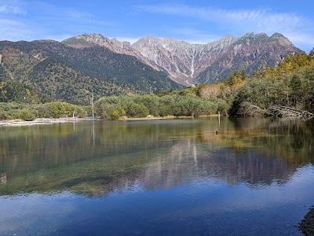

- **Place ID:** `ChIJrQS24NZFHWARD_fCBRWQw8U`
- **Address:** Japan, 〒390-1520 長野県松本市安曇上高地
- **Overall Rating:** 4.6 ⭐
- **Review Summary:** {'text': 'Visitors say this destination offers breathtaking views of the surrounding mountains and crystal-clear, emerald-green water, often reflecting the sky like a mirror. They also highlight the peaceful and serene atmosphere, especially in the early morning mist. Many recommend starting a walk from here to Kappa Bridge, noting the well-maintained walking paths.', 'languageCode': 'en-US'}
- **Amenities Summary:** Accessibility: {"wheelchairAccessibleParking": false, "wheelchairAccessibleEntrance": false}
#### Top 10 Positive Reviews:
- 5 Stars: Stepping into Kamikochi’s alpine valley, I was immediately enchanted by Taisho Ike Pond, a breathtaking natural masterpiece born from volcanic power. Formed in 1915 when an eruption of nearby Mount Yakedake dammed the Azusa River, this crystal-clear lake stands as a stunning testament to nature’s creative and destructive forces . Its most distinctive feature is the skeletal dead trees standing silently in the turquoise water, their stark forms creating an otherworldly contrast against the lush surrounding forest and snow-capped peaks of the Hotaka mountain range . On calm days, the glassy surface perfectly mirrors the mountains and sky, creating a mesmerizing double landscape that feels like stepping into a painting. A gentle wooden boardwalk circles the pond, allowing visitors to soak in the serene atmosphere and capture unforgettable photographs. Whether shrouded in ethereal morning mist or glowing under golden autumn sunlight, Taisho Ike Pond exudes a peaceful magic that makes it the crown jewel of Kamikochi’s natural wonders.
- 5 Stars: We get off at this pond on our way from shin shimashima station. Beautiful cloudy and full of tranquility, its foggy weather enhanced its mystical surroundings ambience
- 5 Stars: First drop off station of Kamikochi. Most of people start at here and walk across the forest to Kappa bridge. You will get welcome with the pond reflected the mountian and sky like mirror. Very impressive. To come to Kamikochi by bus recommend to book ticket in advance.
- 5 Stars: Beautiful spot! If going to kamikochi I would recommend getting off here and walking towards kappa bridge. Then continuing onto the first pond. And then taking the bus from kamikochi to wherever you need to go after.
- 5 Stars: We have wanted to trek from Taisho pond to Kamikochi information centre but due to thick snow, the designated path was closed by authority. This is not unexpected since it is the first day of opening for 2025. Nevertheless, nature still brings to us wonderful experience.

#### Top 10 Negative/Lowest Reviews:
No negative reviews available.

---
### Kappabashi Bridge
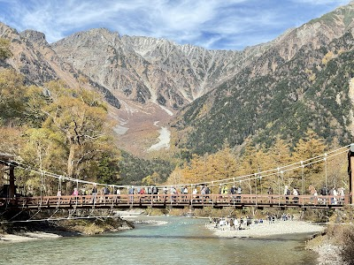

- **Place ID:** `ChIJFZWVcbRFHWARUByCssooFhk`
- **Address:** Kamikochi Azumi, Matsumoto, Nagano 390-1516, Japan
- **Overall Rating:** 4.7 ⭐
- **Review Summary:** {'text': "Visitors say this tourist destination offers breathtaking views of the Japanese Alps, including the majestic Hotaka mountain range and Mount Yake, with the clear Azusa River flowing below. They also highlight the clean air and water, making it a refreshing experience. Guests mention the area around the bridge has many shops and restaurants, and it's a great spot for hiking.", 'languageCode': 'en-US'}
- **Amenities Summary:** Parking: {"paidParkingLot": true} | Accessibility: {"wheelchairAccessibleParking": false}
#### Top 10 Positive Reviews:
- 5 Stars: At the heart of Kamikochi stands a famous wooden bridge— the Kappa Bridge.  The bridge spans the Azusa River, with the Japanese Alps as its backdrop, making it one of the most iconic views in Kamikochi. Its name comes from the mythical “kappa,” adding a touch of folklore to the scenery.  To preserve the natural environment, private vehicles are not allowed in Kamikochi. Visitors usually travel to Shinshimashima first, then transfer to a bus or taxi to enter the area.  I first visited more than ten years ago, when Kamikochi felt incredibly quiet and pristine. In recent years, however, the weaker yen has brought a noticeable increase in tourists. Compared to my first visit, it now feels more like a typical crowded tourist destination.  Around Kappa Bridge, it’s common to see large groups of people and hear many different languages. If you want to truly appreciate the scenery, it’s better to walk a bit farther away from the main area.  Even so, the natural beauty of Kamikochi is still absolutely worth experiencing. I would especially recommend visiting in late autumn, when the foliage and mountain scenery are at their most beautiful.  If you happen to catch it with snow, the landscape becomes even more peaceful and magical.
- 5 Stars: I visited late-May 2026. It is a very iconic wooden tension bridge with the stunning views of the Japanese Alps in the background and crystal clear water running below it.  I stayed the night in Kamikochi, so I had the privilege of viewing and walking through the bridge in the late evening, and at night, as well as in the morning when day-tourists have departed/haven’t arrived yet. In those times, it is very calm.  Temperatures range from the mid teens in the afternoon and 6-9 degrees Celcius at night. Monkeys may be present on the bridge but it doesn’t/bother interact with humans.  After the hordes of tourists arrive, the bridge was very full of people — I went to another place.
- 5 Stars: Visit at the beginning of opening season. In early morning round it's so good. Less people. You can find the place to take photo. Recommend to drop off at pond and walk quickly but collect moment with forest and river view. Have few desert, coffee and souvenir shop around here.
- 5 Stars: Kappabashi Bridge – Must-Visit Landmark in Kamikochi A classic check-in spot that you can’t miss in Kamikochi! We arrived early in the morning when it was still quiet, making it easy to enjoy the views and take photos without the crowds. We were lucky with sunny weather, so the scenery was beautiful with clear skies — perfect for photos. You can shoot from different angles: beside the bridge, on the bridge itself, or down by the rocky riverbank — each gives a unique and stunning perspective of Kamikochi.
- 5 Stars: I visited in late May—the weather was great, around 9°C. The surrounding scenery was absolutely stunning. I could sit and enjoy the view for hours. The air was incredibly fresh, though a bit chilly.  This area gets busy, but there are plenty of seating spots. There are also restaurants, souvenir shops, and even bear bells. I tried the ice cream and curry-filled bread—both were delicious.  The bridge is just a few hundred meters from the bus terminal. If you’re short on time, you can get off at the bus stop and walk to Kappa Bridge—it only takes a few minutes.

#### Top 10 Negative/Lowest Reviews:
No negative reviews available.

---
### Kamikochi Imperial Hotel
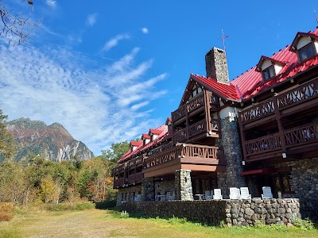

- **Place ID:** `ChIJpYzIeN9FHWAR4XY51pE5NHI`
- **Address:** Japan, 〒390-1516 長野県松本市安曇上高地
- **Overall Rating:** 4.4 ⭐
- **Review Summary:** {'text': 'People say this hotel offers delicious French and Japanese cuisine, with highlights like exquisite consommé soup, hearty hamburgers, and creamy cheesecake. Guests also appreciate the warm, classic atmosphere and the attentive, friendly staff who provide excellent service. Many mention the beautiful mountain views from the rooms and the convenient access to hiking trails.', 'languageCode': 'en-US'}
- **Amenities Summary:** Accessibility: {"wheelchairAccessibleEntrance": true}
#### Top 10 Positive Reviews:
- 5 Stars: Check-in at the Imperial Hotel, Kamikochi is from 2pm. We’d finished our walk and we’re ready to indulge. My darling husband had booked a deluxe twin room with double verandas. The rooms are gorgeous decorated with antique wood, upholstered double and single lounges, exquisite botanical prints through out, a wind up wooden musical box and a tantalising selection of cakes, chocolates and apple pastries. The views of the mountain from the balcony were beckoning, as we searched for climbers with the binoculars. My husband wouldn’t tell me the cost, saying only, that memories are what counts and indeed this stay will forever remain precious for the two of us. Among the delicacies was a gift memorial plate of the hotel dated 2025. The staff were young and  friendly, freely giving of their smiles, the commanding fireplace was burning in the lounge warmly and dressing up for dinner was so much fun. There seemed to be two waiters per table, champagne and five courses exquisitely presented. Breakfast was equally delightful and delicious and attention from our beautiful wait person Takagi san made us feel like royalty.  If there is someone in your life that you would like to spoil, the Imperial Hotel Kamikochi ticks all of the boxes.
- 5 Stars: Staff very friendly and outstanding customer service. The food that came with the room was outstanding. The bath house and sauna was very clean. Most all staff members speak English. Great stay and nice location.
- 4 Stars: Really lovely old hotel with wonderful staff, but a few things did niggle. For example, an additional charge of 600 yen for ordering pancakes (instead of toast or breakfast bread) on the 5,500 yen breakfast menu.  Everything should be included. And generally the drinks prices were really high compared to everywhere else we’ve stayed in Japan. But it’s a captive audience, you have no choice except to pay or go without.  Lovely area to go for walks and bus stop is directly outside.

#### Top 10 Negative/Lowest Reviews:
No negative reviews available.

---
### Myojin Pond
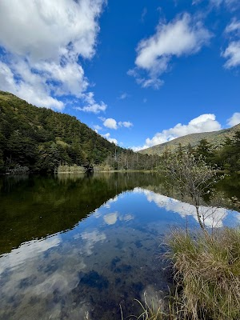

- **Place ID:** `ChIJxWTMO59GHWARvy1JmG_dTE4`
- **Address:** Myojin Pond, Azumi, Matsumoto, Nagano 390-1516, Japan
- **Overall Rating:** 4.6 ⭐
#### Top 10 Positive Reviews:
- 5 Stars: Beautifully located around 1,5 hours easy walk from Kappa bridge. Calm green lake in the middle of the forest. We need to pay 500 JPY to enter this lake area. Took a 10 minutes queue to be able to take a picture in the lake side where there is small tori.
- 5 Stars: If you visit Kamikochi in the first time and love basic hike, this place would be good for you. From Kappa bridge, it takes more than 6-7 km to reach here. Try to plan for morning or late afternoon. It gets dark around 4.30pm in autumn time. Paid entrance fee to visit this place.
- 5 Stars: I would think Myojin Pond 明神池 is at it's prettiest at early morning with the soft and warm sunlight and calm weather. If you are lucky enough like me you will see perfect reflection on both ponds, plus there are very few tourist.  I Visted at 6-7am, 28/4/23. But to be there so early one has to stay in one of the nearby lodge (e.g. 明神館, or like me in Tokusawa-en and set off at 5am to catch the first sunlight at Myojin bridge and pond)  (Also attached are some photos of Myojin Bridge at early morning)
- 5 Stars: Gorgeous at 9am, definitely even more beautiful earlier in the morning with the morning light and mist! There is a cafe and a restaurant nearby to grab breakfast too. JPY500 entrance fee
- 5 Stars: costs 500Y entrance but it’s so worth it

#### Top 10 Negative/Lowest Reviews:
No negative reviews available.

---
### Mount Yake
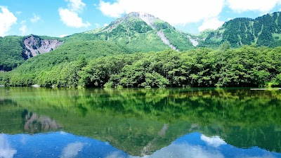

- **Place ID:** `ChIJdZZkZUpPHWARL7veuPgj6MA`
- **Address:** Mount Yake, Azumi, Matsumoto, Nagano 390-1516, Japan
- **Overall Rating:** 4.6 ⭐
#### Top 10 Positive Reviews:
- 5 Stars: Quite fun hike, beautiful views and quite special being on an active vulcano and stepping between steaming holes. If you have knee problems or hate having to climb even a bit then I don’t recommend, otherwise YES, DO IT (we even saw some wild monkeys which was a first for me so very exciting:))
- 5 Stars: [Stunning Views, Great Effort to Reward ratio] My partner and I climbed Mt Yake through this Nakanoyu Onsen entrance on 10 Nov 2024 (Note that on this date, we found that the entrance to Mt Yake via Kamikochi (which is another trail) was closed for the winter season). We're average hikers and don't hike often, and it took us ~7.5 hours (including a 30 min lunch break at the top). 4hrs up, 3 hrs down (our feet was hurting, but could have done it in 2.5hrs). Trek poles is a good to have for beginner hikers, but not really necessary if you feel confident in general. We found the trek itself moderately challenging, with the main difficulty coming from the more technical middle rocky section and traversing around some big boulders at the top. Overall definitely doable! Note to come early to the start of this trek as parking is somewhat limited and you might have to park along the roadside if you come later.
- 5 Stars: Hello, I did this hike on 07 June from Kamikochi, and it took me 4hours to reach the summit and 2hr 50min to descend. I’m a person with average fitness, just for perspective.  The first 40min will take you through beautiful lush greenery in the forest, before start climbing. There are several wooden & metal planks crossing, for streams and rocky areas. You will also need to climb around 5 or 6 ladders, with the longest being 10m tall. All these are before you reach the mid-point, where there is a hut (for snacks and water?) As of date, it is not operational but I believe it will be open in July? Do check beforehand. Else bring sufficient water & food.  After the hut is where the real climb begins. Exposed rocks and strong winds. Do bring a windbreaker. This is a hike where poles will definitely help you.  The summit offers a stunning 360 view of the surrounding mountain ranges on a clear day. Congratulate yourself and take time to take it all in!
- 5 Stars: Very cool mountain with great views on the river and surrounding mountains. We went up in late July and started from kamikochi and went down to Nakanoyu-Onsen. A few tips for fellow hikers: There is warnings about the volcanic activities (we went in normal clothes without helmet, but you could borrow one) and there has been bear sightings further down by the river. The hike up from kamikochi took about 3,5 and down about 3 (without breaks). After around 2 hours through mostly forest, you can get drinks from the only hut on the mountain. The last part of the climb up was quite steep and stoney, so probably harder to go down that way. The trail ends near Nakanoyu-Onsen hotel and to get to the nearest bus station "Nakanoyu Onsen" you need to walk another 45 min downhill. For the Alpicon bus to Shin-Shimashima you should get a ticket for the bus ride back in kamikochi (there is the risk that the bus will be full, so wouldn't recommend getting the last one)
- 5 Stars: The view of the summit is amazing ! Wear good hiking shoes as the path can get very rocky and steep towards the summit. Bring your own food and water as well!

#### Top 10 Negative/Lowest Reviews:
No negative reviews available.

---
### Ōboke Station
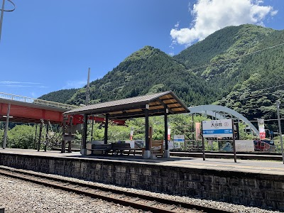

- **Place ID:** `ChIJ0ydzWkOKUTURLoUfscvdMjk`
- **Address:** Nishiiyayamamura Tokuzennishi, Miyoshi, Tokushima 778-0105, Japan
- **Overall Rating:** 4.3 ⭐
- **Review Summary:** {'text': 'Visitors say this station serves as a convenient gateway to popular tourist attractions like the Iya Valley and Kazurabashi Vine Bridge, with buses departing regularly. They also highlight the beautiful surrounding scenery, including the emerald green Yoshino River and cherry blossoms in spring. Guests mention the station has a quaint, old-fashioned charm, a heated waiting room, and helpful amenities like a tourist information office and lockers.', 'languageCode': 'en-US'}
- **Amenities Summary:** Accessibility: {"wheelchairAccessibleParking": false, "wheelchairAccessibleRestroom": true}
#### Top 10 Positive Reviews:
- 5 Stars: Cute little train station in the gorge. Limited express, and small local trains stop here and the bus to Iya valley, Mt Kunimi trailhead and other locations also goes from here.  A great English speaking guide named Masa man's the tourist information booth and is very helpfull In helping you figure out what busses and traina to get.
- 5 Stars: Oboke Station. Get off here to go to the famous Vine bridge at Kazurabashi or the spectacular Onsen at Hotel IyaOnsen where you need to use hotel private cable car to go down 250 meters to the Riverside Outdoor onsen ( Rotemburo ). Amazing sceneries with Autumn foliage. Don't miss it if you are stopping over here for a night or two. Your Travel fatigue will greatly reduced. 😁
- 5 Stars: There are a few lockers inside the station. There is a bus stop and restrooms outside the station. If you choose to walk to the Oboke Gorge Pleasure Boat, it will take about 22 minutes. After exiting the station, walk uphill along the road, cross the bridge, turn right, and then walk straight.
- 5 Stars: The local train station for traveling around Oboke Gorge and Kazurabashi Bridge. The station's atmosphere is lovely, surrounded by mountains and just a short walk to see the river and a small bridge. With only a few train routes per day, plan your trip wisely. The small station has seats and lockers. Besides the local train from Takamatsu, there's also a luxurious sightseeing train called "Shikoku Mannaka Sennen Monogatari," which is quite interesting.
- 4 Stars: Small station. Note that the services are very limited. There are a small turist information office, toilets, lockers (see pictures) and and old-school ticket machine that only takes cash. We took the limited express train from Kotohira to Oboke, and switched to bus to Kazurabashi. Note that IC cards such as Suica does NOT work on these buses! (November 2025) Cash is king. Fortunately we found this out before boarding. Read the notes posted right by the bus stop to learn the correct procedure!

#### Top 10 Negative/Lowest Reviews:
No negative reviews available.

---
### Hotel Iyaonsen

- **Place ID:** `ChIJm-4Q1qUnUjURY2vUy2wjhIA`
- **Address:** Matsumoto-367-28 Ikedachō Matsuo, Miyoshi, Tokushima 778-0165, Japan
- **Overall Rating:** 4.4 ⭐
- **Review Summary:** {'text': 'Guests mention this hotel offers a unique onsen experience with a private cable car descending to a riverside open-air bath, featuring skin-benefiting, naturally carbonated spring water. They also highlight the delicious local cuisine, including river fish and regional specialties, and the stunning views of the Iya Valley from both the rooms and baths. Visitors consistently praise the staff for their friendly, attentive, and helpful service.', 'languageCode': 'en-US'}
- **Amenities Summary:** Accessibility: {"wheelchairAccessibleParking": true, "wheelchairAccessibleEntrance": true}
#### Top 10 Positive Reviews:
- 5 Stars: The staff were extremely helpful and went above and beyond to help us despite the language barrier.  We were only there for one night but wished we were able to stay longer.  An extremely serene and magical experience.  Both the indoor and outdoor hot springs were beautiful and the food was a wonderful taste of local and seasonal cuisine.  Highly recommended.
- 5 Stars: This is a wonderful Ryokan nestled high in the Iya valley. The cable car onsen here is famous in Shikoku, and the Onsen, which is located adjacent to the river at the bottom of the Iya valley will leave your skin feeling like you are wearing Silk. The meals here were delicious, reflecting the variety of local dishes in the area.  Though it is no fault of the Ryokan, the remote location of this onsen makes the drive/travel here difficult, especially if arriving from the north. The roads leading through the valley are very narrow, so be careful if driving in low light conditions.
- 5 Stars: Amazing experience being at this hotel with the outdoor onsen and cable car that takes you there. Friendly staff with great attitude and service, a pleasure to meet them. Super comfortable and brand new bedroom. Breakfast and dinner one of the best we’ve had in Japan :) thanks for welcoming us and for your kindness, we are very appreciative of Iya Valley.
- 4 Stars: The staff were extremely friendly and helpful throughout our stay. We had a room with a bathroom view, and the scenery was absolutely stunning!  We really enjoyed both onsens. The outdoor onsen was slightly cooler, which made it perfect for relaxing for a longer time, while the indoor onsen felt warmer, looked gorgeous, and was often completely empty, I had it all to myself a few times.  That said, the hotel does feel a bit outdated in some areas, especially considering it’s marketed as a 4-star hotel with relatively high prices. The room also did not have proper blackout curtains, and light leaked through the toilet door, which meant we woke up quite early every morning since sunrise was around 5am.  Breakfast was amazing. Dinner, however, did not meet our expectations, particularly for the price we paid.
- 4 Stars: Amazing hotel in a beautiful valley. Great food and the service is top rated as expected of Japan hospitality. The hotel was under renovation but we were not inconvience in anyway. In hind sight, I should have gone for a better room since our room on Level 3 was right under the cable car. Not really an issue since its winter and it was dark early so not much view. Right decision to pay a little extra for the private onsen near the river, for the privacy and to fully enjoy the view in a leisurely manner. Must use the indoor onsen during the day since the view is amazing out the window. Highly recommend here.

#### Top 10 Negative/Lowest Reviews:
No negative reviews available.

---
### private, thrilling 42-degree incline cable car (Search Failed)
- No Place ID found.

---
### Ōboke Gorge
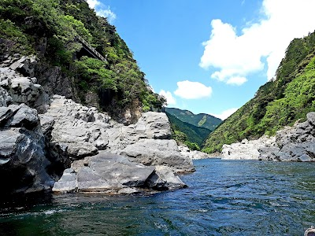

- **Place ID:** `ChIJV29vOUiKUTURs3cvt5La_n4`
- **Address:** Yamashirocho Shigezane, Miyoshi, Tokushima 779-5322, Japan
- **Overall Rating:** 4.3 ⭐
- **Amenities Summary:** Accessibility: {"wheelchairAccessibleEntrance": false}
#### Top 10 Positive Reviews:
- 5 Stars: One of the finest experiences I had in Japan. I truly enjoyed the nature surrounding the gorge. Highly recommended to you all to try this place if you love exploring nature.
- 5 Stars: The famous attraction in Tokushima offers a boat trip experience. While you can reach it by bus, be aware that bus schedules are infrequent, so it's highly recommended to check the bus schedules before coming.
- 5 Stars: Oboke gorge river cruise
- 4 Stars: An emerald green water surface, white rock faces, and cliffs jutting straight up to the sky are colored by fresh verdure in spring and by colored leaves in autumn. You could enjoy the Oboke Gorge Sightseeing Pleasure Boat which will take you for a cruise to see the beautiful gorge closely and enjoy a magnificent view spreading out in front of you.
- 4 Stars: Beautiful senic, worth to visit.

#### Top 10 Negative/Lowest Reviews:
No negative reviews available.

---
### YouMeRafting
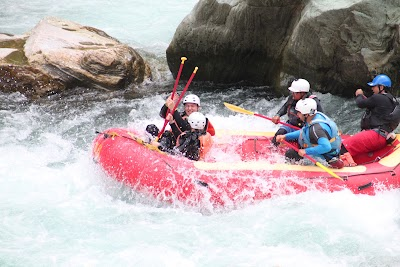

- **Place ID:** `ChIJeVUdLW71UTURXjhMNtawekU`
- **Address:** 6-1 Nagafuchi, Otoyo, Nagaoka District, Kochi 789-0245, Japan
- **Overall Rating:** 4.8 ⭐
- **Amenities Summary:** Accessibility: {"wheelchairAccessibleEntrance": false}
#### Top 10 Positive Reviews:
- 5 Stars: My group of 4 went rafting here on a Saturday morning. Our guides were informative, friendly and funny. We were provided with wet suits, helmets, float vests, hot shower after rafting, water, coffee and tea. The guides started by going through what to do when unexpected events happened. They then drove us down the road to the starting point.  We went through 3 rapids in total and 2 cliffs to jump off. We had plenty of opportunities to swim in the river and played games on the boat.  My friends are more adventurous, so they went into the water multiple times and jumped off the cliff. I mainly stayed on the boat since I’m not confident in swimming and dislike the cold. However, I felt safe and had plenty of fun fun. I went into the river at the end to swim back to the end point.  When we got back, we took hot shower. It’s mainly to warm ourselves up after being in the cold water. It’s not a full on shower with soaps and doors.  There were photos and videos of us to purchase. We ended up purchasing the photos.  Overall, highly recommend!
- 5 Stars: Had an amazing rafting experience! Lovely English-speaking staff, and we got the whole raft to ourselves on a calm day—just the two of us plus our guide. The photo and video package is definitely worth it!
- 5 Stars: We as a family had a great time during this half day  trip. The guides were very professional. There is a good safety instruction before. The rafting was very impressive. The atmosphere was very motivating and a lot lot lot of fun!!! Super nice people which love what they do! We can highly recommend this place.
- 5 Stars: We had amazing time, the guides are super experinced and you can see they love there job, would 110% recomend for rafting in the iya valley. Thanks again!!!!
- 5 Stars: Had a great time - arrived at 2.40pm  and they squeezed us in for a 2 hour raft- informative, safe and lots of fun. If we head back will definitely do a full day. thanks Hakeem !!!

#### Top 10 Negative/Lowest Reviews:
No negative reviews available.

---
### Iya Valley Vine Bridge
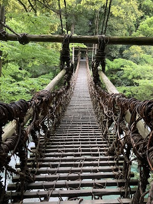

- **Place ID:** `ChIJEdgLLuUnUjUR691uAvUAg0U`
- **Address:** 162-2 Nishiiyayamamura Zentoku, Miyoshi, Tokushima 778-0102, Japan
- **Overall Rating:** 4.3 ⭐
- **Review Summary:** {'text': "Visitors say this vine bridge offers a thrilling experience with wide gaps between the planks and a noticeable sway, providing stunning views of the clear, emerald green river and surrounding nature. They also highlight the bridge's historical significance and the impressive craftsmanship involved in its construction and regular replacement. Guests appreciate the convenient parking options and the availability of local food stalls nearby.", 'languageCode': 'en-US'}
- **Amenities Summary:** Parking: {"paidParkingLot": true, "paidStreetParking": true} | Accessibility: {"wheelchairAccessibleEntrance": false}
#### Top 10 Positive Reviews:
- 5 Stars: We went around 9am on a cloudy Wednesday and there were very few to no people on the bridge.  The cloudiness made it extra atmospheric. The cost for one adult is 550¥, and is worth the price when there is no crowd.  Additionally there are paths nearby which allo you to walk down to the river bed, which was an even nicer view/experience than the bridge itself.
- 5 Stars: The most beautiful scenic spot in Iya Valley in my personal opinion. Entry is 500 yen but is an experience walking across. We went in December and it was a little foggy with light rain at the start but still stunning. Make sure to go to the river down below after.  Parking is 200 yen around the corner.
- 5 Stars: Entry is 500 yen but it's very worth it! So unique. And such a pretty view from the bridge midspan looking down to the rocks below.  There was quite a crowd when I arrived in mid December around 1pm. Had to patiently wait for people to cross as they also stopped midway and took selfies etc.  MAKE SURE YOU GO EARLY and avoid the crowds!  Also, watch your step and be sure you don't drop your phone!
- 5 Stars: Lots of places to park nearby for a small fee (generally 300 yen). We arrived too late so we took pictures at night, which were hauntingly beautiful. There is a bus stop here and we saw some people exit the bus.
- 5 Stars: Set in the beautiful Iya valley as a back drop, the Iya-no-Kazurabashi suspension bridge is worth the drive through winding mountain roads 🤢 to see it. Legend has it that it was built with wood and thick vines by warriors, so that it could be easily cut down and destroyed to prevent the enemy from crossing. The vines are replaced every 3 yrs nowadays. Bridge is a bit shaky, and the gap between each piece of wood plank on the bridge might be too wide for little feet, so might not be suitable for kids. (Pls see pics.)

#### Top 10 Negative/Lowest Reviews:
No negative reviews available.

---
### Iya Valley Vine Bridge

- **Place ID:** `ChIJEdgLLuUnUjUR691uAvUAg0U`
- **Address:** 162-2 Nishiiyayamamura Zentoku, Miyoshi, Tokushima 778-0102, Japan
- **Overall Rating:** 4.3 ⭐
- **Review Summary:** {'text': "Visitors say this vine bridge offers a thrilling experience with wide gaps between the planks and a noticeable sway, providing stunning views of the clear, emerald green river and surrounding nature. They also highlight the bridge's historical significance and the impressive craftsmanship involved in its construction and regular replacement. Guests appreciate the convenient parking options and the availability of local food stalls nearby.", 'languageCode': 'en-US'}
- **Amenities Summary:** Parking: {"paidParkingLot": true, "paidStreetParking": true} | Accessibility: {"wheelchairAccessibleEntrance": false}
#### Top 10 Positive Reviews:
- 5 Stars: We went around 9am on a cloudy Wednesday and there were very few to no people on the bridge.  The cloudiness made it extra atmospheric. The cost for one adult is 550¥, and is worth the price when there is no crowd.  Additionally there are paths nearby which allo you to walk down to the river bed, which was an even nicer view/experience than the bridge itself.
- 5 Stars: The most beautiful scenic spot in Iya Valley in my personal opinion. Entry is 500 yen but is an experience walking across. We went in December and it was a little foggy with light rain at the start but still stunning. Make sure to go to the river down below after.  Parking is 200 yen around the corner.
- 5 Stars: Entry is 500 yen but it's very worth it! So unique. And such a pretty view from the bridge midspan looking down to the rocks below.  There was quite a crowd when I arrived in mid December around 1pm. Had to patiently wait for people to cross as they also stopped midway and took selfies etc.  MAKE SURE YOU GO EARLY and avoid the crowds!  Also, watch your step and be sure you don't drop your phone!
- 5 Stars: Lots of places to park nearby for a small fee (generally 300 yen). We arrived too late so we took pictures at night, which were hauntingly beautiful. There is a bus stop here and we saw some people exit the bus.
- 5 Stars: Set in the beautiful Iya valley as a back drop, the Iya-no-Kazurabashi suspension bridge is worth the drive through winding mountain roads 🤢 to see it. Legend has it that it was built with wood and thick vines by warriors, so that it could be easily cut down and destroyed to prevent the enemy from crossing. The vines are replaced every 3 yrs nowadays. Bridge is a bit shaky, and the gap between each piece of wood plank on the bridge might be too wide for little feet, so might not be suitable for kids. (Pls see pics.)

#### Top 10 Negative/Lowest Reviews:
No negative reviews available.

---
