# Deep Dive: Reviews & Photos

### Ebisu Island
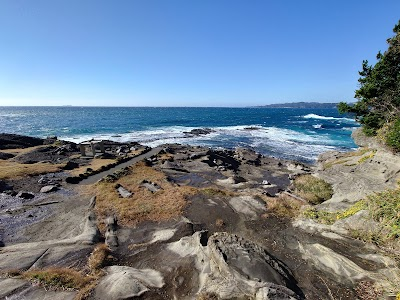

- **Place ID:** `ChIJ2_w2xc1eF2AR0gFv8D9amYQ`
- **Address:** 1638 Suzaki, Shimoda, Shizuoka 415-0014, Japan
- **Overall Rating:** 4.4 ⭐
- **Review Summary:** {'text': 'Visitors say this island offers stunning views of the Pacific Ocean and nearby islands, with clear blue waters perfect for snorkeling and observing diverse marine life. They also highlight the rugged volcanic rock formations and the peaceful, untouched atmosphere. Guests mention the convenient hot showers and changing rooms, as well as picnic areas for enjoying lunch.', 'languageCode': 'en-US'}
- **Amenities Summary:** Parking: {"freeStreetParking": true} | Accessibility: {"wheelchairAccessibleParking": false, "wheelchairAccessibleEntrance": false}
#### Top 10 Positive Reviews:
- 5 Stars: A hidden coastal gem — small but incredibly scenic. A short walk across the bridge brings you to rugged volcanic rock formations, clear blue waters, and sweeping views of the Pacific.  When I visited, it was incredibly quiet — the only other people there were two elderly men fishing. The peaceful atmosphere made the place feel almost untouched. It’s perfect for a slow walk, enjoying the sea breeze, and taking in the raw coastal beauty. Definitely worth a stop if you’re exploring the Shimoda area.
- 5 Stars: Great place for snorkelling. I went today lots of moray eels, fish of all kinds, anemones, small soft corals and a few hard corals. The current under the bridge is strong, only go there if you are more experienced. Today we had crystal clear waters. Also hot shower and changing room available.
- 5 Stars: A.small island you can walk to by crossing a little bridge. There are a few parking spots but it looks like most people only visit for 10-15 minutes, so just wait until a spot becomes available. The island has a small shrine, a lighthouse and some viewpoints.
- 4 Stars: Nice little island to walk around. Be aware that the walkway can get waves over it on a high tide or bad weather. The top of the island is very overgrown and the view is limited.

#### Top 10 Negative/Lowest Reviews:
No negative reviews available.

---
### Ise-Shima National Park
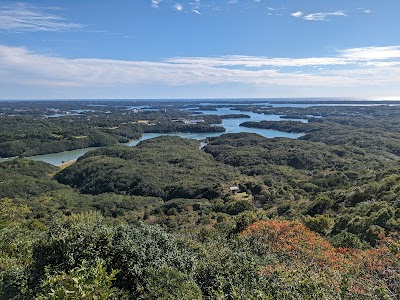

- **Place ID:** `ChIJVVVVVcJVBGARuNQU9Pgqjbk`
- **Address:** Mie, Japan
- **Overall Rating:** 4.4 ⭐
- **Review Summary:** {'text': 'Visitors say this national park offers stunning, expansive natural scenery and a rich historical atmosphere. They also highlight the beautiful night sky and recommend visiting on a clear day. Others also mention the delicious local food, including choux creme and pearl salt soft-serve ice cream.', 'languageCode': 'en-US'}
- **Amenities Summary:** Accessibility: {"wheelchairAccessibleParking": true, "wheelchairAccessibleEntrance": true}
#### Top 10 Positive Reviews:
- 5 Stars: This park is very large and have remarkable views. The environment is cool and shady with lots of trees and fresh air ...  Prepare a good stamina for hiking along way to panorama viewpoint and also many other viewpoints too. Beautiful scenery around each viewpoints.  There is so many interesting places to explore. Spend more time to enjoy the nature ...
- 5 Stars: Such a beautiful, calm and natural place. It was hot and there were a lot of people but we managed to find such magnificent in to simple beauty of this place. It was easy to navigate and walking through the tall trees was cooler on such a hot summer's day. Take time to marvel at the craftsmen that built this place.
- 5 Stars: The whole area of Ise is beautiful and a little hidden away from all the tourists. Still lots of hidden gems to find here!
- 5 Stars: We go nearly every year,great place to have fun, take a break and feel good.
- 4 Stars: I know City of Shima is not wealthy, but it requires more maintanance. The view from the observatory deck is outstanding-especially the sunsets from Yokoyama deck is magnificent.

#### Top 10 Negative/Lowest Reviews:
No negative reviews available.

---
### Nara Park
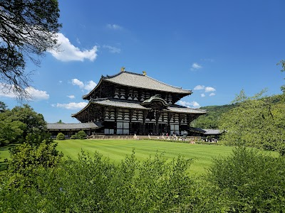

- **Place ID:** `ChIJYWCMvZY5AWARVnREV_OsbPk`
- **Address:** Nara, Japan
- **Overall Rating:** 4.6 ⭐
- **Review Summary:** {'text': 'Visitors say this park offers a unique experience with hundreds of friendly, free-roaming deer that often bow for special crackers. They also highlight the vast, well-maintained grounds, which feature historic temples, shrines, and beautiful seasonal scenery. The park is easily accessible and provides a peaceful escape for nature and people.', 'languageCode': 'en-US'}
- **Amenities Summary:** Parking: {"freeParkingLot": true, "paidParkingLot": true, "freeStreetParking": true, "paidStreetParking": true} | Accessibility: {"wheelchairAccessibleParking": true, "wheelchairAccessibleEntrance": true}
#### Top 10 Positive Reviews:
- 5 Stars: I would recommend climbing more up because the deer in the park are pretty aggressive. The deer that were up were so chill and I gave them crackers because people probably don’t give them as much as in the tourisy area. But the deer are very cute and it is so surprising seeing them cross the road. Recommend!
- 5 Stars: Absolutely worth the time and effort to visit this place. An easy 35-45 minute train ride from Osaka or Kyoto. Many wild, free-roaming deers within the park. You can purchase some deer crackers and feed them. They will bow for the crackers, but do be careful. A few of them can be aggressive. They can bite and even knock you down, especially the large bucks. They're wild animals. But don't just feed the deers. Go and explore the UNESCO World Heritage, Todai-ji Temple. Discover the Kasuga Taisha Shrine, and visit the Kofuku-ji Temple five-story pagoda; all within walking distance. You can easily spend at least half a day exploring this area on foot. Put on your good walking shoes. There's a restaurant up on the hill of Kasuga Taisha Shrine area servings delicious udon noodle. It can be a long wait, but definitely worth the time.
- 5 Stars: Visiting Nara Park was an absolutely amazing experience! Walking through the park surrounded by friendly deer is truly unforgettable. You can purchase special deer crackers for about 200 yen and feed them, which makes the visit even more interactive and fun.  One tip: be sure not to have loose items hanging from your bag or pockets, as the deer may try to nibble on them. When feeding the deer, it’s best to take out one cracker at a time rather than holding the whole stack, since they can become a bit eager and crowd around you.  Overall, if you’re comfortable around animals, this is a unique and memorable experience that I highly recommend!
- 5 Stars: Visiting Nara Park was such a unique and memorable experience. It’s incredible how just a short 3-minute walk from the train station brings you face-to-face with deer casually roaming the area. You can purchase deer food for 200 yen (cash only), which makes the experience even more interactive. The deer are absolutely beautiful, but it’s important to remember they are still wild animals. We heard quite a few startled screams from visitors who weren’t paying attention to the posted signs, so definitely stay aware and respectful. If you walk further into the park, you’ll find the deer are much calmer and more relaxed. A helpful tip: when feeding them, bow and wait for the deer to bow back before offering food. Once you’re out, raise both hands and gently wave them to signal you have no more. The temples throughout the park are extraordinary and add such a deep sense of history to the visit. The scenery is truly breathtaking, photos don’t fully capture it. And don’t miss out on the sakura and matcha ice cream, both were delicious. Overall, an unforgettable experience, just remember to be respectful!
- 4 Stars: I first visited Nara over 10 years ago, and it truly feels like the deer population has multiplied since then — there are so many deer everywhere. One thing to keep in mind is that these are wild animals. They are friendly, but do not provoke them. If I’m being honest, some tourists were behaving a bit silly. Be gentle with the deer. Be respectful. Female deer can become aggressive in spring after giving birth as they protect their offspring, and male deer may show aggression in autumn during mating season, so extra caution is needed. The Japanese consider them sacred animals. You can purchase deer biscuits to feed them. Deer crackers have been part of Nara’s culture since the Edo period and represent a long-standing tradition of interaction between people and the deer. Do not feed them anything else. Watch your belongings. If, like me, you get a little nervous around animals, you can cross the road to avoid some of the deer — though you will most likely encounter a few while exploring Nara.

#### Top 10 Negative/Lowest Reviews:
No negative reviews available.

---
### Yakushima Island
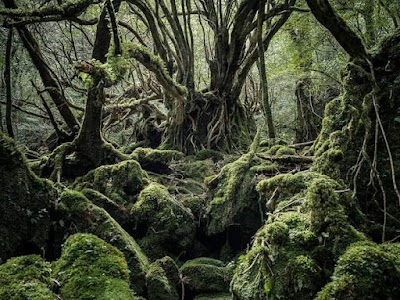

- **Place ID:** `ChIJpRELt08iPTURA1MypPdwmCA`
- **Address:** Yakushima Island, Yakushima, Kumage District, Kagoshima, Japan
- **Overall Rating:** 4.7 ⭐
#### Top 10 Positive Reviews:
- 5 Stars: This island stole my heart and took my breath away. Hard to put into words how incredible the nature here is. Theres just gorgeous view after gorgeous view at every corner. All of the people we met on the island were the kindest human beings ever. I didn‘t want to leave and wish i couldve stayed here forever. I hope the island never changes and the people on it will keep protecting and nurturing the nature and animals here.
- 5 Stars: One of those places that magic you away from the rest of the world.  Incredible views of clouds over mountains, forests, cliffs and heaps of deer and monkeys.  A car is a must! I recommend the travel company YES Yakushima. They make everything very easy and will organise your car, ferry and accommodation if you want it (free service). The car through them was $350aud ishh for 5 days.  We spent 5 days, did the Jomon Sugi hike and part of the Shiratani Unsuikyo trail, do Jomon Sugi but don't underestimate it.  Food around is great when the restaurants are open, very friendly and helpful locals. Also recommend the kayak tour!
- 5 Stars: I highly recommend visiting this island. One of the best destinations to hike and roam around, the secluded nature setting is just very heart warming. The waterfalls are amazing, the people are really kind.  This island is famous for the UNESCO, world heritage, and has the oldest cedar tree in Japan! Better to rent a car and drive around, it rains very often so please have all the gear needed for very heavy rain, just to be safe! Don’t forget to try the flying fish!
- 5 Stars: Mountains, forests, beaches, rivers - what else could you ask for? The perfect escape from city life, do spend at least 3 days on this beautiful island.
- 5 Stars: This Island is very-well know for UNESCO world heritage and Moss forest, everywhere it is green and thick, good place to escape from all your stress, not crowded countryside with limited buses where you could have new experience, it is worth a visit just try once

#### Top 10 Negative/Lowest Reviews:
No negative reviews available.

---
### 大通公園７丁目

- **Place ID:** `ChIJJ47l6NMpC18REW53fKccZ3k`
- **Address:** 7 Chome Odorinishi, Chuo Ward, Sapporo, Hokkaido 060-0042, Japan
- **Overall Rating:** 4.2 ⭐
- **Review Summary:** {'text': 'People say this park hosts vibrant festivals with a wide variety of food stalls offering regional ramen, BBQ, seafood like grilled scallops, and local beers. Visitors also highlight the reasonable prices for high-quality items and the lively, enjoyable atmosphere.', 'languageCode': 'en-US'}
- **Amenities Summary:** Accessibility: {"wheelchairAccessibleParking": false}
#### Top 10 Positive Reviews:
- 5 Stars: Visit 20 May 2026. There is Sapporo Lilac Festival 20-31 May 2026. 3 sections of food parade. Selection of the best ramen from each prefecture of Japan. BBQ meat, pizza & Hokkaido beers. Desserts ice cream, etc It's vibrant of all people to come and try in this Festive. Organized well & best curated food. 👍
- 5 Stars: The 2024 Sapporo White Illumination at Odori Park was nothing short of magical. This section of the park had a stunning light display, blending traditional winter charm with modern artistic installations. The arrangement of lights created a warm, enchanting glow against the crisp winter air, making every corner feel like a postcard moment.  One of the highlights was the centerpiece installation, which was intricately designed and illuminated in a way that felt both festive and elegant. The attention to detail in the light patterns and colors truly showcased the effort and creativity behind the event.  Despite the crowd, the area was well-organized, with clear pathways and plenty of spots to pause and take photos without feeling rushed. The atmosphere was lively yet serene, with soft background music enhancing the experience.  I also appreciated the food stalls nearby, offering hot drinks and local treats—perfect for warming up while strolling through the lights.  If you’re visiting Sapporo in winter, Odori Park during the White Illumination is an absolute must-visit. It’s not just a visual treat but a beautiful way to experience the magic of a Sapporo winter night.  Pro Tip: Visit in the early evening to catch the transition from dusk to full illumination—it’s breathtaking!
- 5 Stars: Odori Park West 7th Street Visited 2024/08/01 This is "Odori Park West 7th Street," located in Odori Park in Sapporo, Hokkaido. The greenery of the trees and flowers are beautiful, giving a real sense of summer's arrival. A major summer event, a beer garden, was taking place. Despite it being early on a weekday, it was bustling with many people. Summer in Hokkaido is short, so many tourists and locals were visiting. The grass was neatly mowed. Restrooms are relatively close from this location. It seems that various events, such as the Lilac Festival and the Snow Festival, are held here throughout the year.
- 4 Stars: Odori Park 7-chome is located in the center of Sapporo and is known as one of the main venues for the Sapporo Snow Festival, held every winter. This festival attracts many tourists from both Japan and abroad and is famous for its huge, elaborate snow and ice sculptures. 7-chome is particularly known for its many themed snow sculptures, which impress visitors. It is also used as the venue for the summer Yosakoi Soran Festival, where dancers in colorful costumes perform powerful dances. These events symbolize Sapporo's culture and vitality and contribute to revitalizing the local economy. Odori Park 7-chome is an important cultural spot in Sapporo, providing fun and excitement to many people throughout the year.

#### Top 10 Negative/Lowest Reviews:
No negative reviews available.

---
### Izukyū-Shimoda

- **Place ID:** `ChIJ_TqXa7xYF2ARxTvbeUsgTwA`
- **Address:** 1-chōme-6-1 Higashihongō, Shimoda, Shizuoka 415-0035, Japan
- **Overall Rating:** 4 ⭐
- **Review Summary:** {'text': 'Visitors say this station offers a comfortable waiting room, spotless restrooms, and a wide variety of local souvenirs and ekiben. They also highlight the helpful staff and convenient access to buses and taxis for local sightseeing.\n\nSome reviews mention the seating can be limited.', 'languageCode': 'en-US'}
- **Amenities Summary:** Accessibility: {"wheelchairAccessibleParking": true, "wheelchairAccessibleEntrance": true, "wheelchairAccessibleRestroom": true}
#### Top 10 Positive Reviews:
- 5 Stars: The line’s final sigh opens to open sea. Ships rest in the harbor where Japan once met the wider world. Light dances on the water, and the breeze tastes of both history and freedom. You arrive, yet feel the story only beginning.  Tourist Tip: Explore Perry Road, Tatado Beach, and Shimoda Park. Stay till twilight—when harbor lamps ignite, the entire journey hums softly back through memory.  From steam to salt, forest hush to harbor light, the Izu Kyūkō Line is a pilgrimage of senses. Each stop deepens the color of calm until, at Shimoda, you realize the train hasn’t simply carried you south—it has taught you how to drift, gently, into wonder.
- 5 Stars: One great hub train station for cyclists with hefty heavy bags. Still, hope the station facilities and service systems get friendlier to bicycle users.
- 4 Stars: Nice station. Last stop for several trains. The station is really the heart of the quiet town of Shimoda. Trains do not run often so don't be late or you'll be waiting forever
- 4 Stars: Nice station, the shops selling local produce are great. If you want an ekiben from the ekiben shop you need to get in quick as they sell out quick!!

#### Top 10 Negative/Lowest Reviews:
No negative reviews available.

---
### Perry Road
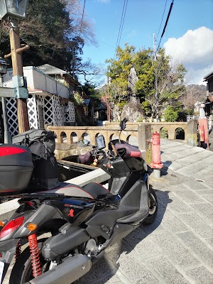

- **Place ID:** `ChIJI4EnxcBYF2ARqHsIcpEN-2c`
- **Address:** Perry Rd, Sanchōme, Shimoda, Shizuoka 415-0023, Japan
- **Overall Rating:** N/A ⭐
#### Top 10 Positive Reviews:
No positive reviews available.

#### Top 10 Negative/Lowest Reviews:
No negative reviews available.

---
### Kintetsu World Express USA Inc
- **Place ID:** `ChIJGXuDiAOuD4gRdWr8IkOiUA8`
- **Address:** 1 Pierce Pl #270c, Itasca, IL 60143, USA
- **Overall Rating:** 3.3 ⭐
- **Amenities Summary:** Accessibility: {"wheelchairAccessibleParking": true, "wheelchairAccessibleEntrance": true}
#### Top 10 Positive Reviews:
- 5 Stars: Highly efficient, issued shinkansen passes for my family of five without any glitch.
- 4 Stars: Fast unloading. Tight turnaround n lot.

#### Top 10 Negative/Lowest Reviews:
- 1 Stars: 👎

---
### Kotai Jingu (Ise Jingu Naiku, Inner Sanctuary)
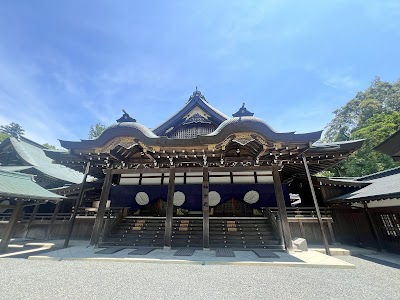

- **Place ID:** `ChIJ8zef3-tQBGARpwz2UzdmCfA`
- **Address:** 1 Ujitachichō, Ise, Mie 516-0023, Japan
- **Overall Rating:** 4.7 ⭐
- **Review Summary:** {'text': 'People say this shrine offers a deeply spiritual and serene atmosphere, with beautifully maintained grounds, ancient forests, and the clear Isuzu River. Visitors also highlight the sense of peace and renewal experienced when walking the gravel paths, and appreciate the respectful staff. They also mention the convenient access to nearby Oharaimachi and Okage Yokocho for dining and shopping.', 'languageCode': 'en-US'}
- **Amenities Summary:** Accessibility: {"wheelchairAccessibleParking": true, "wheelchairAccessibleEntrance": true}
#### Top 10 Positive Reviews:
- 5 Stars: This shrine is not just a tourist spot. It is a living sacred place full of nature and history. I felt relaxed and amazed at the same time. I strongly recommend visiting Naiku. It is one of the most beautiful and spiritual places in Japan. Highly recommended
- 5 Stars: Ise Jingu is considered one of the most sacred and important spiritual sites for Japanese people. It’s often called the soul of Japan, and you can truly feel that significance the moment you step onto the grounds.  The atmosphere is incredibly peaceful and solemn, surrounded by ancient trees and the sound of the Isuzu River.  Walking through the forest to reach the main shrines felt like a deep spiritual cleansing. Even if you aren't religious, the sense of history and the pure, crisp air make it a truly unforgettable experience. It is a place of profound beauty and tradition that everyone should visit at least once.
- 5 Stars: I visited Ise Grand Shrine (Naikū) on January 1st for Hatsumōde, and as expected, it was incredibly crowded. Yet even among the sea of people, there was a profound sense of reverence. You could truly feel the collective respect and awe that visitors hold for Amaterasu Ōmikami and the other kamisama enshrined here.  Despite the crowds, the atmosphere remained solemn and deeply moving. Simply walking through the grounds, surrounded by ancient trees and sacred silence between moments, felt grounding and uplifting at the same time.  This is a place where one’s energy feels renewed and elevated. For me - and I believe for many others - this is the number one power spot in Japan, not because of anything dramatic, but because of its quiet, timeless spiritual presence.
- 5 Stars: Love the spiritual feeling.  I went during the weekend and parking near the shrine are closed.  Have to park about 2km away.  I will recommend to go during weekday.
- 5 Stars: Ise Grand Shrine (Ise Jingū) is one of the most sacred and beautiful places in Japan. Visiting here feels peaceful, spiritual, and deeply connected to nature.  From the moment you cross Uji Bridge, the atmosphere changes completely. The shrine grounds are surrounded by ancient forests, flowing rivers, and beautifully maintained paths, creating a calm and refreshing experience. The simple yet powerful architecture adds to the deep sense of tradition and spirituality.  The area is spacious and well organized, and even with many visitors, it never feels crowded. Walking through the grounds encourages you to slow down, reflect, and truly appreciate Japanese culture and Shinto beliefs.  Travel tip: If you are traveling by bus, it’s very convenient to go via Toba Station. I used this route on my visit, and getting a one-day travel pass made transportation easy, affordable, and stress-free.  Important note: Please make sure to respect the rules and local culture when visiting this spiritual place, especially if you are a foreign visitor. A respectful attitude helps preserve the sacred atmosphere for everyone.  This is a must-visit destination for tourists, solo travelers, families, and anyone interested in Japanese culture, spirituality, and nature. Visiting early in the morning is highly recommended for a more serene experience.  A truly unforgettable place that represents the heart of Japan.

#### Top 10 Negative/Lowest Reviews:
No negative reviews available.

---
### Kōdaiji Temple
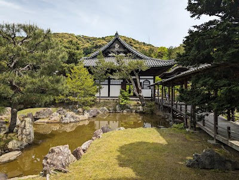

- **Place ID:** `ChIJuU17z9oIAWARgMhsX3kqUSQ`
- **Address:** Japan, 〒605-0825 Kyoto, Higashiyama Ward, Shimokawarachō, 高台寺下河原町５２６
- **Overall Rating:** 4.4 ⭐
- **Review Summary:** {'text': 'Visitors say this temple features beautifully maintained gardens, elegant architecture, and a serene bamboo grove, offering a peaceful atmosphere. They also highlight the stunning seasonal night illuminations and projection mapping, especially during autumn and spring, which create a magical experience. Guests mention the reasonable entrance fee and the opportunity to enjoy matcha and sweets in a tea house.', 'languageCode': 'en-US'}
- **Amenities Summary:** Parking: {"freeParkingLot": false, "paidParkingLot": true, "freeStreetParking": false, "paidStreetParking": true, "freeGarageParking": false, "paidGarageParking": false} | Accessibility: {"wheelchairAccessibleParking": true}
#### Top 10 Positive Reviews:
- 5 Stars: Kōdai-ji Temple is one of those Kyoto sites that quietly exceeds expectations the moment you step past the entrance. While it’s often mentioned alongside other Higashiyama-area temples, the overall experience here feels more complex due to it containing many things such as a historic site, landscape garden, and reflective walking space that unfolds gradually as you explore. There is an entrance fee, but well worth it to explore the place.  The temple was originally established in the early 17th century in memory of Toyotomi Hideyoshi, and that historical weight still shapes the atmosphere today. There’s a sense of refinement throughout the grounds.  You move from the main hall into meticulously maintained gardens, then into quieter paths that lead toward bamboo groves and hidden corners like Hashin-tei. Each section feels distinct, yet nothing feels disconnected. It’s a well-composed flow rather than a checklist of sights.  Seasonality plays a big role here as well. In autumn, the maple trees turn the grounds into one of Higashiyama’s most photographed spots, while in other seasons the gardens lean more into minimalism and structure. Even on busy days, there are pockets of calm where the temple’s original contemplative purpose still comes through.  Compared to Kyoto’s more famous temples like Kiyomizu-dera, Kōdai-ji feels slightly more understated, but also more immersive if you take the time to walk through it slowly. It rewards attention to detail rather than quick sightseeing.
- 5 Stars: Absolutely worth a visit during the autumn season. We only visited it during the day time but we heard their night illuminations are also great too. It's a short walk from Kiyomizu-dera, so highly recommend to visit this temple after it.  The Garyourou walkway is super beautiful with the autumn leaves. They also have a bamboo garden that imo can be compared to the famous Arashiyama, but on a smaller scale.
- 5 Stars: Kodaiji Temple is one of the most serene and beautifully curated temple experiences in Kyoto. Tucked away in the Higashiyama district, it offers the perfect balance of history, nature, and peaceful atmosphere.  One of the highlights here is the bamboo grove inside the temple complex, which many people actually prefer as a quieter alternative to the crowded Arashiyama Bamboo Grove. You can walk through it calmly, take photos, and truly enjoy the surroundings without the rush of tourists.  The temple grounds are stunning, with Zen gardens, reflective ponds, and well-maintained walking paths. As you explore further, you also come across different shrines within the complex, each representing unique aspects like love, prosperity, and blessings, which adds a meaningful cultural touch to the visit.  Another beautiful surprise is the viewpoint offering a surreal glimpse of Kyoto city, especially during sunset—it adds a completely different dimension to the experience beyond just temple exploration.  You’ll also find a distinct Buddha statue within the premises, which stands out for its peaceful presence and design. Around the temple area, there are plenty of opportunities to rent a kimono and do photoshoots, with multiple aesthetic spots that make every picture look elegant and traditional.  The temple has strong historical roots as well—it was established in 1606 by Nene in memory of Toyotomi Hideyoshi, which adds depth and significance to the visit.  If you visit during seasonal events, the night illumination is absolutely magical, transforming the temple into a dream-like setting with artistic lighting.  Visit early morning or evening for fewer crowds * Plan 1–2 hours to explore properly * Try combining it with nearby Higashiyama streets for a full experience  It has entry ticket 300 yen per person
- 5 Stars: Kodaiji Temple Night Illumination Review  Kodaiji Temple’s nighttime illumination was one of the most breathtaking experiences of our Kyoto trip. The entire garden comes alive after dark — fall trees glowing with soft spotlights, colors looking even richer and brighter, and a gentle light show projected near the temple that adds to the atmosphere without feeling overwhelming.  The walk through the grounds felt serene and almost magical. There’s a small bamboo forest here, and with the lights shining upward, the bamboo looked like it was glowing from within. Every corner felt peaceful, quiet, and beautifully designed to highlight the natural surroundings.  If you’re in Kyoto during the illumination season, this is an absolute must-see. It turns an already beautiful temple into a completely unforgettable evening experience.
- 5 Stars: Kōdaiji Temple stands out for its beautifully maintained gardens, elegant architecture, and peaceful walking paths that guide visitors through a variety of scenic viewpoints. The temple buildings are rich in detail, and the surrounding bamboo grove adds a dramatic touch that feels uniquely Kyoto. The grounds are spacious enough to explore at a comfortable pace, offering a mix of shaded areas, reflective ponds, and traditional structures. Even during busier hours, the temple manages to feel calm and well‑organized.  The seasonal changes add another layer of beauty, with autumn leaves and spring blossoms transforming the atmosphere throughout the year. The pathways are easy to follow, making it a pleasant stop for both casual visitors and those who enjoy taking their time with photography. The temple’s blend of history, nature, and design creates a balanced experience that feels both cultural and relaxing. It’s a strong addition to any Higashiyama itinerary and pairs well with nearby attractions.

#### Top 10 Negative/Lowest Reviews:
No negative reviews available.

---
### Kenninji Temple
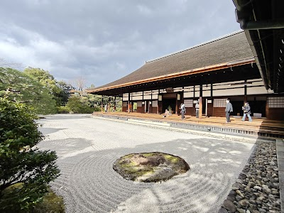

- **Place ID:** `ChIJJ3srJMEIAWARUrvFhhmPYH4`
- **Address:** ５８４番地 Komatsuchō, Higashiyama Ward, Kyoto, 605-0811, Japan
- **Overall Rating:** 4.5 ⭐
- **Review Summary:** {'text': 'Visitors say this temple features stunning artwork, including the powerful Twin Dragons ceiling painting and the famous Wind and Thunder Gods screens. They also highlight the beautiful and serene Zen gardens, offering a peaceful atmosphere for quiet contemplation. Guests mention the spacious grounds and well-maintained facilities, making it a worthwhile visit.', 'languageCode': 'en-US'}
#### Top 10 Positive Reviews:
- 5 Stars: Visited this beautiful temple during my two week stay in Japan. I recommend to everyone! I was in awe with the art and there is a a part of the temple where you must remove your shoes and wear red slippers given to you at the entrance. I heard this so to preserve the flooring and wood walkways. It was gracefully quiet even with other tourists around. Everyone respected the space. Costs about 1,000-1200 yen to enter at the main corridor. Also some areas do not allow photos and security enforced this.
- 5 Stars: Absolutely underrated place that I don't see a lot of people talking about. The best time to visit is during autumn where the zen garden takes on a beautiful shade of red and orange.  Note that photography are only allowed in certain parts of the temple.  There are four main attractions that makes this temple worth a trip: 1) Fujin and Raijin Two Fold Screen - although a replica (original in Kyoto National Museum), it's still nice to appreciate the artwork close up. 2) Chountei Zen Garden - this garden is magnificient with the red autumn leaves under the sun, very peaceful and beautiful 3) o△□ Garden - we jokingly called this garden the "squid game garden", tho the signs represent fire, earth, and water, fundamental forms of the universe in Zen 4) Twin Dragons - A super epic ceiling painting  Definitely put this place in your itinerary when you visit in autumn!
- 5 Stars: Beautiful gardens and if you enter via the Southern gate the side of the temple complex comes as a pleasant surprise. The dragon ceiling is impressive and the zen garden area probably the highlight. The temple with blue dragon just off of the Bamboo forest in North Tokyo is probably more impressive but the grounds here at Kenninji are bigger.
- 5 Stars: Kennin‑ji is a Buddhist temple belonging to the Zen sect, founded in 1202. With its ceiling covered by an impressive ink painting of two giant dragons and its beautifully designed interior gardens, the temple is also home to the famous painted screen depicting the gods of wind and thunder — a work reproduced throughout Kyoto. The Chō’ontei Garden, known as the “Garden of the Sound of the Tide,” is a serene and elegant Zen garden tucked behind the main hall of Kennin‑ji. Truly beautiful. Highly recommend.
- 4 Stars: Beautiful Zen temple with clean wooden architecture and a well-balanced rock garden. Atmosphere calm and structured.  To see the famous Twin Dragon ceiling painting you need to pay the inner area entrance fee I skipped it this time. Still worth visiting for the overall setting and Zen aesthetics.

#### Top 10 Negative/Lowest Reviews:
No negative reviews available.

---
### 大阪難波-あをによし(AONIYOSHI)起點站
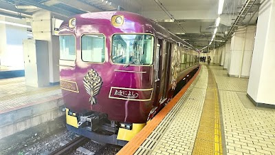

- **Place ID:** `ChIJzTl2d5TnAGARChtbAZHzak4`
- **Address:** Japan, 〒542-0076 Osaka, Chuo Ward, Namba, 4-chōme−1−１７ 大阪難波駅
- **Overall Rating:** 4.8 ⭐
- **Amenities Summary:** Accessibility: {"wheelchairAccessibleParking": false, "wheelchairAccessibleEntrance": true}
#### Top 10 Positive Reviews:
- 5 Stars: AONIYOSHI sightseeing train is not meant to be just a way to get from point A to point B, it’s an experience.  The journey is relatively short (a bit over one hour between Osaka, Nara, and Kyoto), but that’s not the point. You take this train for the atmosphere, the design, and the feeling it gives.  The train itself is beautiful, with a strong sense of history and elegance. It’s a place where you slow down, enjoy the ride, and take in a different side of Japan. Quiet, comfortable, and thoughtfully designed.  It’s not an entertainment-heavy or flashy experience and it’s not meant to be. If you come expecting something like a show, you might miss the point. This is about enjoying the moment, the space, and the journey.  Tickets sell out quickly, and that’s a good thing, the limited number of seats keeps the experience calm and enjoyable. Make sure to book in advance.  For around 3,000 yen, it’s honestly one of the best experiences you can have. Great value for something simple but meaningful.  Bottom line: don’t take it for transportation, take it for what it is. And if you do, you’ll understand why it’s worth it.
- 5 Stars: The Aoniyoshi Train is a luxurious sightseeing express operated by Kintetsu Railway, offering passengers a unique travel experience in Japan’s Kansai region. Named after an ancient Japanese term meaning “beautiful Nara,” the train pays homage to the region’s rich history and natural beauty. Launched in 2022, the Aoniyoshi runs between Osaka, Kyoto, and Nara, connecting some of the region’s most culturally significant destinations.  Designed with elegance and comfort in mind, the Aoniyoshi Train blends modern luxury with traditional Japanese aesthetics. Its interiors feature warm wooden accents, artistic motifs, and spacious seating arrangements, ensuring a relaxing journey. Large windows provide panoramic views of the surrounding landscapes, allowing passengers to fully appreciate the scenic beauty of the Kansai countryside.  The train offers a first-class experience with a premium lounge car and reserved seating. Passengers can enjoy locally inspired meals, snacks, and beverages, often prepared using seasonal ingredients from the Nara region. The onboard menu frequently showcases traditional flavors, creating a dining experience that complements the journey.  A key highlight of the Aoniyoshi Train is its focus on culture and history. The train serves as a moving cultural experience, with design elements and decor inspired by the Heian period, reflecting the region’s historical significance.  The Aoniyoshi Train is not just a mode of transportation but a celebration of the region’s heritage, offering a sophisticated and immersive way to explore one of Japan’s most historically and culturally rich areas.
- 5 Stars: Old style train fixed up for luxury ride, fine seats, with snacks and drinks you can purchase on board. You can also bring your own food and drinks much cheaper. About an hour ride from Osaka to Kyoto enjoying your food and drinks while taking in the countryside sites.
- 5 Stars: Amazing experience inside this sightseeing train. Not much to see along the way but makes your journey to Nara interesting and enjoyable. Note that you have to pay base fare ticket around $700 each, on top of the limited express ticket.
- 5 Stars: A sweet experience on this really adorable train! It was a 35 minute ride from Nara to Kyoto and we had the prettiest cookies, also yummy. When you buy treats you get complementary train tickets to remember your experience. We loved it!

#### Top 10 Negative/Lowest Reviews:
No negative reviews available.

---
### The Hotel Yakushima Ocean & Forest
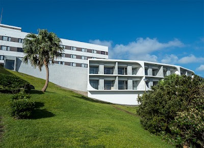

- **Place ID:** `ChIJXdqGc6QePTURyIZsVyW0mdk`
- **Address:** 1208-9 Miyanoura, Yakushima, Kumage District, Kagoshima 891-4205, Japan
- **Overall Rating:** 4.1 ⭐
- **Review Summary:** {'text': 'Guests consistently praise this hotel for its spacious, clean rooms that boast breathtaking ocean views, along with delicious breakfast and dinner options featuring local specialties. The exceptionally kind staff, convenient hiking gear rentals, and shuttle services further enhance the positive guest experience.\n\nSome reviews mention the staff can be unhelpful.', 'languageCode': 'en-US'}
- **Amenities Summary:** Accessibility: {"wheelchairAccessibleParking": true, "wheelchairAccessibleEntrance": true}
#### Top 10 Positive Reviews:
- 5 Stars: I cannot express enough how kind, helpful, and dedicated the staff at this hotel were during our stay last May. We stayed four nights on our honeymoon, and Yoko-san and Hirata-san went far beyond their duties to help us.  When we realized we could not get cash for our early morning hiking tour, Yoko-san helped us contact the tour guide and arranged payment directly through the hotel, allowing us to enjoy the tour without any problems. (Also, thank you @greentrekyakushima for the amazing hike to Jōmon Sugi, I highly recommend him as a guide.)  Later, when our flight from Yakushima was unexpectedly cancelled, Hirata-san worked tirelessly to find alternate routes. Together with Yoko-san, they coordinated buses, ferries, and flights, personally driving us to the port and assisting with tickets, ensuring we made it to Tokyo safely and on time.  Their professionalism, dedication, and ultimately their kindness turned potentially stressful situations into a seamless experience. Thanks to them, our time on Yakushima became one of the most memorable parts of our honeymoon. I highly recommend this hotel and its amazing staff.
- 5 Stars: Staying here was the highlight of my trip. The location is breathtaking—waking up to the panoramic view of the wild ocean and crashing waves right from my balcony was pure therapy. Drifting off to sleep with the natural lullaby of the wind and crashing waves was pure bliss.  The dining experience was exceptional. The 'Yakushima Sound Art Immersive Dinner' is not just a meal, but a journey. The chef brilliantly highlights local terroir. Impeccable service, stunning views, and exquisite food. Highly recommended for anyone looking for a luxury retreat in nature.
- 5 Stars: Gorgeous hotel/resort 5min walk from the ferry with breathtaking views of the ocean and mountain. The new wing has ultra-modern western rooms with floor-to-ceiling window views of ocean. Delicious breakfast buffet. Exceptional value. Hotel has ample hiking gear for rent and concierge to plan tours.
- 5 Stars: I highly recommend upgrading for a deluxe ocean room with a balcony. The room was modern, beautiful, and comfortable. The onsen was lovely and quiet. The rrstaurant and gift shop were terrific as well. The location is 100 meters from the marina and about a 12 min drive to the airport. Also, a convenient location to the Shiratani Gorge (15 min drive).

#### Top 10 Negative/Lowest Reviews:
No negative reviews available.

---
### Shiratani Unsuikyo Gorge
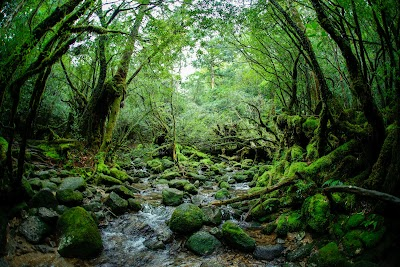

- **Place ID:** `ChIJ2d70aRUfPTURDlCRzuGnAps`
- **Address:** Miyanoura, Yakushima, Kumage District, Kagoshima 891-4200, Japan
- **Overall Rating:** 4.7 ⭐
- **Review Summary:** {'text': 'Visitors say this trekking spot features stunning moss-covered forests that evoke a fantasy world, along with diverse trails suitable for various fitness levels. They also highlight the breathtaking panoramic views from Taikoiwa Rock and the opportunity to see ancient Yakusugi cedars. Guests mention the fresh air, clear streams, and the convenience of accessible parking and well-maintained paths.', 'languageCode': 'en-US'}
- **Amenities Summary:** Parking: {"freeParkingLot": true, "freeStreetParking": true} | Accessibility: {"wheelchairAccessibleParking": false, "wheelchairAccessibleEntrance": false}
#### Top 10 Positive Reviews:
- 5 Stars: 4 hour hike to the top for great view lookout. hiking boots were needed as there were tiny streams to cross. we went on 15 May 2026, and it did not rain. Weather was great. you get to see moss covered forest that inspired princess mononoke from studio ghibli. we didn’t get a guide, but if you have mobility issues or want peace of mind, we saw some people with guides.
- 5 Stars: Amazing trail, especially the moss covered forrest. I found the trails not difficult, but please come prepared with proper equipment and food.
- 5 Stars: Shiratani Unsui Gorge in Yakushima is one of the most magical places I’ve ever visited. The moss-covered forest feels like stepping into a fantasy world — no wonder it inspired Princess Mononoke. The air is fresh, the sound of running water is soothing, and every corner looks like a scene from a movie. Even in light rain, the mist adds to the mystical atmosphere. The hike can be a bit challenging, but it’s completely worth it. A truly unforgettable experience in Yakushima.
- 5 Stars: If you're a fan of Hayao Miyazaki's films—especially *Princess Mononoke*—then this place is perfect for you. Whether it's raining or the sun is shining, everything is beautiful.
- 5 Stars: Fabulous walk through the gorge and on through the forest. The current walk can be completed in an hour with little effort. The drive up is stunning if a little nerve wracking in places. Well worth a visit.

#### Top 10 Negative/Lowest Reviews:
No negative reviews available.

---
### Anbo
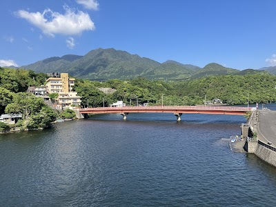

- **Place ID:** `ChIJC3m-jYbfPDURWfx6TBw3VDo`
- **Address:** Anbo, Yakushima, Kumage District, Kagoshima 891-4311, Japan
- **Overall Rating:** N/A ⭐
#### Top 10 Positive Reviews:
No positive reviews available.

#### Top 10 Negative/Lowest Reviews:
No negative reviews available.

---
### 4 to 6 months in advance (Search Failed)
- No Place ID found.

---
