# Deep Dive: Reviews & Photos

### Bar ANIME HOLIC アニメホリック
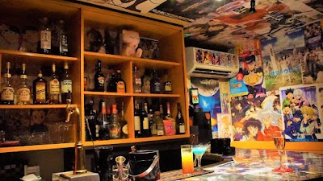

- **Place ID:** `ChIJHS6Q5JiNGGAR6hPfl4WgpMg`
- **Address:** Japan, 〒160-0021 Tokyo, Shinjuku City, Kabukichō, 1-chōme−1−１０ 2F
- **Overall Rating:** 4.7 ⭐
- **Review Summary:** {'text': "People say this bar offers a wide variety of anime-themed drinks, including character-inspired cocktails, and features entertaining karaoke. They also highlight the friendly and welcoming atmosphere, making it easy to connect with fellow anime fans and staff. Guests mention the reasonable prices and the staff's ability to communicate effectively, even with limited Japanese.", 'languageCode': 'en-US'}
- **Amenities Summary:** Accessibility: {"wheelchairAccessibleParking": false, "wheelchairAccessibleEntrance": false, "wheelchairAccessibleRestroom": false, "wheelchairAccessibleSeating": false}
#### Top 10 Positive Reviews:
- 5 Stars: The bartender here was amazing. The drinks were great, the prices were amazing, and the bar decor itself is everything a weeb may be looking for. We were able to vibe with the other patrons and staff with limited Japanese knowledge just talking about our favorite anime’s. Highly recommend for your next trip to golden gai, we will be back!
- 5 Stars: Awesome and unique experience with great themed anime decor and an entertaining karaoke vibe. I've also enjoyed the traditional snake liquor! Many thanks to Mizuki the bartender a very nice and friendly person. This will be my favorite place in Tokyo!
- 5 Stars: Super friendly environment!!! A great place to talk with fellow anime fans in many languages. I liked this spot for practicing japanese and sharing with strangers my favourite anime. They were very kind to make me a blue Hawaiian also.  Try the snake drink!!!
- 5 Stars: This might be my favorite bar experience to date. I arrived around 9 PM and didn’t leave until about 5 AM. Both bartenders were incredibly cool and made me feel like a regular the second one even spent hours singing with me! The drinks were great, and their Naruto cocktail was especially delicious. Overall, the vibes were immaculate no one treated me like a foreigner, and everyone was so supportive when it came time to sing karaoke. 10/10 recommend if you get the chance to stop by!
- 5 Stars: There's a great little bar. Awesome bartender! Great people!  People fear about this place either by word of mouth or by doing a search for anime bar on Google. Either way everyone is very positive and although an intimate place, great drinks and great prices

#### Top 10 Negative/Lowest Reviews:
No negative reviews available.

---
### Kishiwada Danjiri (Festival Float) Hall
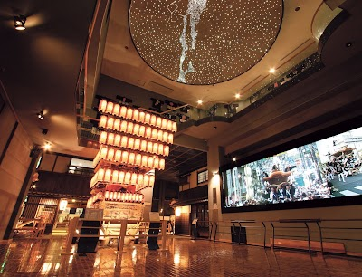

- **Place ID:** `ChIJ8UkEOwzGAGARo4MASnxj16c`
- **Address:** 11-23 Honmachi, Kishiwada, Osaka 596-0074, Japan
- **Overall Rating:** 4.1 ⭐
- **Review Summary:** {'text': 'Visitors say this museum offers a close-up view of elaborate danjiri floats and their intricate carvings, along with engaging theater presentations and hands-on taiko drumming experiences. They also highlight the helpful staff and the convenient combined ticket option with Kishiwada Castle.\n\nSome reviews mention the information can be unclear.', 'languageCode': 'en-US'}
- **Amenities Summary:** Accessibility: {"wheelchairAccessibleParking": true, "wheelchairAccessibleEntrance": true, "wheelchairAccessibleRestroom": true}
#### Top 10 Positive Reviews:
- 5 Stars: This is one of the most famous festivals in Japan. It was so cool and fun actually. The most exciting part was where the large danjiri are pulled at high speed around corners. There is carpenter (Daikugata) dancing on top of the gloat while it is moving. There's a vibrant and exhilarating atmosphere filled with rythmic drumming, flute music, and chants of the danjiri pullers
- 5 Stars: It was really hard looking for info in English on the Kishiwada Danjiri Festival Map or parade route online when we went in 2024 so I'm uploading it here!
- 5 Stars: Nice museum where you can have a close see to Daijiri (vehicles of matsuri)
- 5 Stars: Great environment, inetersting knowledge, fantastic experience !!
- 5 Stars: Nice cultural experience!

#### Top 10 Negative/Lowest Reviews:
No negative reviews available.

---
### Busta Shinjuku
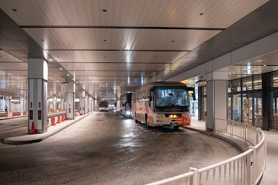

- **Place ID:** `ChIJQ6yrc9CMGGARH6diq4aOJwo`
- **Address:** Japan, 〒151-0051 Tokyo, Shibuya, Sendagaya, 5-chōme−24, 千駄ヶ谷５丁目２４ 55
- **Overall Rating:** 3.7 ⭐
- **Review Summary:** {'text': 'People say this bus terminal is conveniently located directly connected to Shinjuku Station, offering clear signage and a wide variety of bus routes. They also highlight the clean facilities, helpful staff, and the convenience of on-site shops and restrooms.\n\nOther reviews mention the service can be unprofessional.', 'languageCode': 'en-US'}
- **Amenities Summary:** Accessibility: {"wheelchairAccessibleEntrance": true, "wheelchairAccessibleRestroom": true}
#### Top 10 Positive Reviews:
- 5 Stars: Go to third floor to buy tickets. Recommended to take the 3300yen so you can change to earlier bus time if you are there early. There is a conbine beside to grab a quick bite. *Remember!! One person one luggage + one backpack only!!*
- 5 Stars: I first booked a bus ticket for Gotemba and Fujikawaguchiko. I didn't check the weather forecast beforehand, so I had to cancel and request a refund. I initially thought I could change the date, but it turned out not to be possible. Finally, I decided to repurchase the ticket. The refund process was quick, and I did it before departure. The refund I received was exactly what I had requested, with no deductions. The staff spoke little English, but they used a translator, making the conversation easier. Salute to Japan!
- 5 Stars: The newer south gate where the bus terminal is located.  This is where you ride if you want to go to Kawaguchi area of Mt. Fuji.  Very nice area with many relaxing spots and quieter vs the main corridors of Shinjuku station.  The area near Takashimaya Times Square is the new south exit of Shinjuku station and you get a nice view of the train tracks as well as Suica the Penguin.  The mascot of JR East.
- 5 Stars: This bus station is huge and cover mostly trip in Japan.  The departure is on 4th floor. In this floor you can also buy tickets, also theres gift shop and convenient store where u can buy ur food.  The arrival is on 3rd floor.  Make sure if u booked online the ticket, dont come late. The bus is on time
- 4 Stars: Located conveniently on Level 4 above the JR station, accessing the bus terminal is straightforward. Simply locate the lift next to the Eggslut café, and you see a lift in front of it, which takes you directly to the terminal.  The interchange serves as a hub for buses to major cities, airports, and sightseeing destinations. Ticketing is hassle-free, with both staffed counters and self-service machines available. These machines support multiple languages, accept major credit cards, and follow the high Japanese standards of clarity and efficiency. Tickets can be purchased days in advance or on the day of travel, depending on seat availability.  Operations are smooth and well-organized, from ticketing to boarding. Luggage handling is equally efficient, adding to the seamless experience.  One drawback, however, is the consistently long queues for the restroom whenever I visit.  Overall, it’s a well-designed, user-friendly terminal that lives up to Japan’s reputation for efficiency.

#### Top 10 Negative/Lowest Reviews:
No negative reviews available.

---
### Tokyo Supercars K.K.

- **Place ID:** `ChIJ6zMNb-aLGGAR-Thb3W4n7sI`
- **Address:** 1 Chome-6 Nihonbashimuromachi, Chuo City, Tokyo 103-0022, Japan
- **Overall Rating:** 4.7 ⭐
- **Review Summary:** {'text': 'People say this car rental service offers a wide variety of well-maintained supercars and JDM cars, providing an unforgettable driving experience through Tokyo and scenic routes. They also highlight the professional, friendly, and knowledgeable staff who provide excellent guidance and photography. Guests mention the seamless booking process, flexible arrangements, and convenient hotel pick-up and drop-off services.', 'languageCode': 'en-US'}
- **Amenities Summary:** Parking: {"freeParkingLot": true}
#### Top 10 Positive Reviews:
- 5 Stars: Highly recommended activity in Tokyo! The guys at Tokyo Supercar were friendly and very easy to deal with. A whole range of supercars to choose from and the team are in constant communication from the start until after the drive. Charles was our guide and took us on a good route and made the drive pleasurable!
- 5 Stars: Getting a chance to drive an actual race car in the legendary track such as Fuji Speedway was almost like a dream.  Thanks to Tokyo Supercars team and Tausif who spent a whole day with me from picking up at hotel, going through the license process and coordinating with 86 racers' team for the car.  His service and hospitality was beyond expectation. I had so much fun and enjoy there.  Now looking for a chance to be there again.
- 5 Stars: TokyoJDM/Tokyo Supercars was recommended to us through a friend and we were so impressed with our experience! From the booking down to the tour itself- the communication and customer service was exceptional. We had the pleasure of having Charles as our tour guide and he was wonderful- personable, fun and had great communication throughout the tour. We selected the GT-R and the car itself was clean and ran smoothly. It was all around amazing- highly recommend booking with them if you’re interested in driving Japanese sports cars!
- 5 Stars: I’ve driven with Tokyo Supercars several times over the last few years. Each time has been an exceptional experience. Whether you go for a quick drive or a longer one, it’s a unique way to see Tokyo. The cars are all well maintained, and the staff will make you feel comfortable even if you’ve never driven an exotic car before.  Most recently (October 2025) our guide Baxter was professional and friendly - we had a great time touring Tokyo with him. Everyone on the team who I’ve dealt with has been great. I highly recommend Tokyo Supercars, and will definitely be back for another drive soon!
- 5 Stars: Took both McLarens - 600lt and 720s out for the daikoku tour. The experience was amazing lead by the best guides, it was fun and nothing but good vibes all along. Strongly recommend if your in Tokyo 😊

#### Top 10 Negative/Lowest Reviews:
No negative reviews available.

---
### JAL Free Domestic Flight Hack (Search Failed)
- No Place ID found.

---
### Nui. Hostel & Bar Lounge
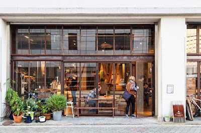

- **Place ID:** `ChIJ4U-9KsiOGGARARhaBLZLqS0`
- **Address:** 2-chōme-14-13 Kuramae, Taito City, Tokyo 111-0051, Japan
- **Overall Rating:** 4.5 ⭐
- **Review Summary:** {'text': "People say this hostel offers clean, comfortable rooms with privacy curtains and spacious, well-maintained shared bathrooms. They also highlight the delicious food and coffee available at the lively downstairs cafe and bar, which attracts both locals and travelers. Guests mention the friendly, helpful staff and the hostel's convenient location near public transport and local attractions.", 'languageCode': 'en-US'}
- **Amenities Summary:** Accessibility: {"wheelchairAccessibleParking": false}
#### Top 10 Positive Reviews:
- 5 Stars: Nui. is the perfect hostel for people who want a little bit of everything. The rooms had a perfect level of people between them, the beds were comfortable and everything was extremely clean. I loved that the downstairs café/bar was filled with locals and tourists alike making an incredible atmosphere when you arrive or when you want to have a few drinks after a long day of sightseeing making it easy to socialise with others. I ended up meeting so many people during my stay who I'm lucky enough to call my friends.  If you want to get away from the hustle and bustle and take in a great view of Tokyo Skytree and Sumida River, head to the top floor where there is a balcony.  The hostel is located right next to Asakusa where Sensō-ji temple is located making it a great spot for sightseeing, restaurants and bars. If you would like to head out for the day to another district, the subway is a 5 minute walk away making it easy to get around stress-free.  Big shoutout to Maki-san, Miku-san, Sora-san and all the bar staff for making my stay here as amazing as possible.  I genuinely cannot express how amazing of a stay I had here but one thing's for sure. I'll definitely be back in the future!
- 5 Stars: I didn’t stay at the hostel, but a friend of mine did and she enjoyed her experience. This was a nice place to meet up in the morning before heading out on our Tokyo adventures. They have a great soy latte and the atmosphere lends itself to making friends. While waiting one morning I made friends with someone else stopping over for a coffee and we all went to hangout together afterwards.
- 5 Stars: Really solid for a classic hostel. The 8 person mixed gender dorm room is clean, each bed is surrounded by privacy curtains which really help with the noise/light. The AC works great! The staff is all so friendly and kind. It’s on a quiet side street and it was really nice to come back to a less busy part of town each night for some calmness.
- 5 Stars: I highly recommend this place. It was great location imo (quiet neighborhood but ten min walk to Asakusa or twenty min train to Ginza or Shibuya). Room was so clean and they have curtains for the dorms. Bathroom also very clean. The one critique I have is that it was not as social as I was hoping for and people kinda ignored me when I tried to talk to them with like one exception. I’ve never experienced that before and I am super respectful so I promise it’s not just me. I’m not sure if that’s usually how it’s like at this place but regardless, I still highly recommend as everything that was in Nui’s control was beyond expectations.

#### Top 10 Negative/Lowest Reviews:
- 2 Stars: I ordered the rigatoni because they were the only dish on the menu that caught my attention and, most importantly, they did not have the spicy symbol. Since I have stomach issues, I chose them thinking it was a safe option. Unfortunately, the pasta turned out to be spicy. When I pointed this out to the waiter, he denied that it was spicy instead of checking or being helpful. I’m giving two stars because the pasta was well cooked and the ingredients were of good quality. However, the bartender’s attitude was not appropriate toward a customer who was simply pointing out a mistake on the menu, especially regarding something as important as spiciness.

---
### Shibuya

- **Place ID:** `ChIJ0Qgx67KMGGARd2ZbObLZHPE`
- **Address:** Shibuya, Tokyo, Japan
- **Overall Rating:** N/A ⭐
#### Top 10 Positive Reviews:
No positive reviews available.

#### Top 10 Negative/Lowest Reviews:
No negative reviews available.

---
### Shinjuku City
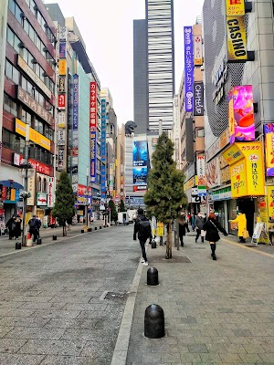

- **Place ID:** `ChIJS_23WSCNGGAR0u8y4o_GYew`
- **Address:** Shinjuku City, Tokyo, Japan
- **Overall Rating:** N/A ⭐
#### Top 10 Positive Reviews:
No positive reviews available.

#### Top 10 Negative/Lowest Reviews:
No negative reviews available.

---
### Shimokitazawa
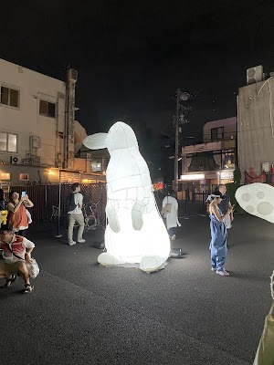

- **Place ID:** `ChIJw_teZ_8hGGARgsSeLR2OLjM`
- **Address:** Shimokitazawa, Kitazawa, Setagaya City, Tokyo 155-0031, Japan
- **Overall Rating:** N/A ⭐
#### Top 10 Positive Reviews:
No positive reviews available.

#### Top 10 Negative/Lowest Reviews:
No negative reviews available.

---
### 天神ロッジ (Tenjin Lodge)
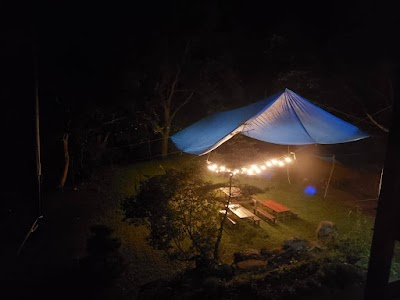

- **Place ID:** `ChIJ6Xn9VMkWHmARMlaXO_izH2I`
- **Address:** 220-4 Yubiso, Minakami, Tone District, Gunma 379-1728, Japan
- **Overall Rating:** 4.6 ⭐
#### Top 10 Positive Reviews:
- 5 Stars: We stayed at Tenjin Lodge for 1 night during our visit to the Doai and Tanigawadake area. The lodge is located about 10–15 minutes walk from Doai Station, around another 10 minutes to the Tanigawadake Information Center, and about 15 minutes walk to the Tanigawadake Ropeway station. The location is very convenient for hikers, skiers and nature lovers exploring this beautiful mountain region.  Compared to many traditional Japanese guesthouses nearby, Tenjin Lodge has a very different atmosphere. It is run by an Australian owner and international staff, giving the place a cozy mountain lodge vibe that feels both relaxed and welcoming. After several nights sleeping on futons during our Japan trip, it was such a nice surprise to finally sleep on a comfortable king-size bed 😄.  The common area is spacious and warm, with large dining tables, comfortable sofas, bookshelves filled with interesting books, a piano, and even a hammock. The lodge sits next to the Yubiso River, so throughout the day you can hear the relaxing sound of flowing water outside.  Downstairs there is a Japanese-style bathing area with a large hot bath, perfect after a day of walking or hiking. Meals were simple but delicious, and there is also a small bar corner where guests can enjoy sake, beer or wine while relaxing at night. One of the highlights of the stay was Lucky, the friendly lodge dog who quickly became everyone’s furry companion during the stay.  The owner, Kieren, was also extremely kind and even helped fetch us to Yubiso Station, which we truly appreciated.  If you are planning to hike, ski, visit Doai Station or simply enjoy the peaceful mountain atmosphere around Tanigawadake, Tenjin Lodge is a warm and comfortable place to stay.
- 5 Stars: The lodge is a vibe! Stay here if you want to meet other snow enthusiasts. Kieren and his staff work hard to provide guests with an experience, so you'll have a great time if you come with a good attitude. The dinner is amazing- big hearty, healthy meals that fill you up after a big day of riding. The rooms are traditional and functional and worked well for us.  We did 3 days of guiding with Patrick and he was super fun and knowledgeable to ride with. He made sure we got plenty of fresh powder, and was professional throughout.  Thank you Tenjin Lodge for a memorable stay!
- 5 Stars: Nice cozy lodge, particularly like the bar living room, very chilled out. Sauna nice and hot! Western beds comfy and warm shower. They also do guiding around Mt T, hiked up to the peak, they really know the area and are very safety conscious.
- 5 Stars: Came there as a last resort if i couldnt make it back to toyko after climbing mt tanigawa. Just wanted some place to rest my head, but got a full experience with sauna, cold plunge, onsen and Kirin even took us to the local bar. There is wildlife there and the stars at night are great. Kirin is a top bloke and would put this one my to do list if your in the area

#### Top 10 Negative/Lowest Reviews:
No negative reviews available.

---
### Busta Shinjuku

- **Place ID:** `ChIJQ6yrc9CMGGARH6diq4aOJwo`
- **Address:** Japan, 〒151-0051 Tokyo, Shibuya, Sendagaya, 5-chōme−24, 千駄ヶ谷５丁目２４ 55
- **Overall Rating:** 3.7 ⭐
- **Review Summary:** {'text': 'People say this bus terminal is conveniently located directly connected to Shinjuku Station, offering clear signage and a wide variety of bus routes. They also highlight the clean facilities, helpful staff, and the convenience of on-site shops and restrooms.\n\nOther reviews mention the service can be unprofessional.', 'languageCode': 'en-US'}
- **Amenities Summary:** Accessibility: {"wheelchairAccessibleEntrance": true, "wheelchairAccessibleRestroom": true}
#### Top 10 Positive Reviews:
- 5 Stars: Go to third floor to buy tickets. Recommended to take the 3300yen so you can change to earlier bus time if you are there early. There is a conbine beside to grab a quick bite. *Remember!! One person one luggage + one backpack only!!*
- 5 Stars: I first booked a bus ticket for Gotemba and Fujikawaguchiko. I didn't check the weather forecast beforehand, so I had to cancel and request a refund. I initially thought I could change the date, but it turned out not to be possible. Finally, I decided to repurchase the ticket. The refund process was quick, and I did it before departure. The refund I received was exactly what I had requested, with no deductions. The staff spoke little English, but they used a translator, making the conversation easier. Salute to Japan!
- 5 Stars: The newer south gate where the bus terminal is located.  This is where you ride if you want to go to Kawaguchi area of Mt. Fuji.  Very nice area with many relaxing spots and quieter vs the main corridors of Shinjuku station.  The area near Takashimaya Times Square is the new south exit of Shinjuku station and you get a nice view of the train tracks as well as Suica the Penguin.  The mascot of JR East.
- 5 Stars: This bus station is huge and cover mostly trip in Japan.  The departure is on 4th floor. In this floor you can also buy tickets, also theres gift shop and convenient store where u can buy ur food.  The arrival is on 3rd floor.  Make sure if u booked online the ticket, dont come late. The bus is on time
- 4 Stars: Located conveniently on Level 4 above the JR station, accessing the bus terminal is straightforward. Simply locate the lift next to the Eggslut café, and you see a lift in front of it, which takes you directly to the terminal.  The interchange serves as a hub for buses to major cities, airports, and sightseeing destinations. Ticketing is hassle-free, with both staffed counters and self-service machines available. These machines support multiple languages, accept major credit cards, and follow the high Japanese standards of clarity and efficiency. Tickets can be purchased days in advance or on the day of travel, depending on seat availability.  Operations are smooth and well-organized, from ticketing to boarding. Luggage handling is equally efficient, adding to the seamless experience.  One drawback, however, is the consistently long queues for the restroom whenever I visit.  Overall, it’s a well-designed, user-friendly terminal that lives up to Japan’s reputation for efficiency.

#### Top 10 Negative/Lowest Reviews:
No negative reviews available.

---
### Backstage Osaka Hostel & Bar
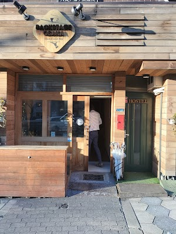

- **Place ID:** `ChIJ420bLUTnAGAR_J2VZ7LJY90`
- **Address:** 1-chōme-2-20 Kōzu, Chuo Ward, Osaka, 542-0072, Japan
- **Overall Rating:** 4.3 ⭐
- **Review Summary:** {'text': 'Visitors say this hostel offers a welcoming vibe and a great bar, making it easy to meet other travelers. They also highlight the friendly and helpful staff, who provide excellent company and recommendations. Guests mention the very clean facilities, comfortable beds, and excellent value for the price.', 'languageCode': 'en-US'}
- **Amenities Summary:** Accessibility: {"wheelchairAccessibleParking": false, "wheelchairAccessibleEntrance": true, "wheelchairAccessibleRestroom": false, "wheelchairAccessibleSeating": true}
#### Top 10 Positive Reviews:
- 5 Stars: Very clean and very well located (Namba walkable distance). Staff is super friendly and beds are very good for such a cheap hostel! Will definitely book again
- 5 Stars: I stayed here about a year ago in the private room. It was an ideal place to meet other travellers and adjust to the jet lag from a long journey. Hosts were very accommodating and welcoming. This was the most sociable hostel I stayed at during my trip to Japan, I met some great people. Hosts took us to a great local bar up the road and introduced us to some locals, it was a great way to start my trip. Overall, I rate this place highly—if you are looking for luxury perhaps not your place, but the private room is very spacious and comfortable. If you want to meet travellers and locals, come here.
- 5 Stars: I stayed here for a few nights and easily was one of my best stays in Japan. The staff were beyond friendly, made it super easy to settle in. I loved speaking with them at the bar and were great company. Nice central location close enough to the train station. The stay was comfortable and offered great privacy - if going to Osaka I'd highly recommend staying here!
- 4 Stars: A ridiculously well-located hostel. Just a 5-minute walk from several subway stations and about a 20-minute walk from the nightlife and many of the well-known tourist attractions of the beautiful (and big) gritty city of Osaka.  The price of my bed was really, really low, so I definitely knew what to expect. However, I did meet some travelers who complained about the lack of comfort. Indeed, the rooms are crowded, not very well air-conditioned, and there’s little space to sit when the bar downstairs is closed.  So, I recommend a hotel room if you’re looking for comfort. But if you’re looking for a cheap place full of friendly people, with very kind hosts who have plenty of recommendations to share, it’s worth staying there.

#### Top 10 Negative/Lowest Reviews:
- 2 Stars: First things first, it is a one star hostel and it is cheap of consequence, I don't expect to be in a three star hotel and it is fine with me, one toilet and shower for many people I can live with that. Notwithstanding this I did not stayed in the hostel as I left as soon as I saw the conditions of it all. AC is not working properly for the number of people in the rooms and in September with 30 degrees outside is a challenge. Also AC is only in the dorm room, means that is not present in the bathroom, in showers or in the stairs to reach the dorm room. The other weak point for me is the not comfortable bed and the cleanness of the bed. If I were to visit this hostel in a cooler weather maybe could have been bearable (maybe the only concearn would have been the bed conditions). Consider that you don't have space to lock your items if you want your belongings to be safe. The position is good and people seems to be chill. My experience was bad for my standards but maybe not for yours.

---
### Shinsekai
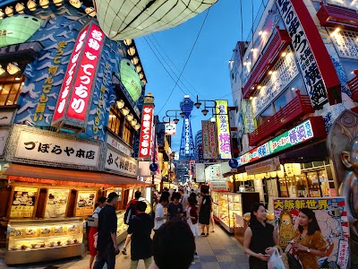

- **Place ID:** `ChIJV6JXdmDnAGAR-9a4atjXsTY`
- **Address:** 2 Chome-5 Ebisuhigashi, Naniwa Ward, Osaka, 556-0002, Japan
- **Overall Rating:** 4.2 ⭐
- **Amenities Summary:** Accessibility: {"wheelchairAccessibleParking": false, "wheelchairAccessibleEntrance": true}
#### Top 10 Positive Reviews:
- 5 Stars: Walking through Shinsekai as the sun starts to drop is like stepping into a different era of Osaka. While the rest of the city feels like it’s racing toward the future, this neighborhood feels happily stuck in a vibrant, neon-lit past.  The street in the photo is the main artery of the district, and it’s famous for that specific building with the massive sumo murals and the rows of glowing lanterns. It’s loud, colorful, and a bit chaotic in the best way possible.  The vibe here is completely different once it gets dark. The glow from the massive 3D signs and the paper lanterns creates this warm, cinematic atmosphere that you just don't get during the day. It’s the kind of place where the air smells like savory frying oil and the sound of people laughing in tiny standing bars follows you down the block.  What makes this spot special isn't just the flashy lights; it’s the history. It was originally built over a century ago to look like a mix of Paris and New York, and while that sounds strange, it resulted in a neighborhood that feels more "real" than the polished tourist hubs. If you wander off the main path into the narrow covered alleys nearby, you’ll find old men playing board games and tiny shops that look like they haven’t changed in fifty years.  It’s definitely a place that’s meant for slow walking. You’ll want to stop every few feet just to look up at the layers of signs or watch the chefs working in the windows. It’s gritty, unpretentious, and easily one of the most soulful walks you can take in the city.
- 5 Stars: A must see during your Osaka stay to see the traditional and retro streets. We loved it!  Shinsekai is one of Osaka’s most colorful and nostalgic districts, known for its retro atmosphere, bright neon signs, and classic local street food culture.  Centered around Tsutenkaku tower, the area feels lively and slightly old-fashioned, offering a very different vibe from Osaka’s modern shopping districts.  Shinsekai is especially famous for kushikatsu — deep-fried skewered food — along with casual izakayas, arcade games, and bustling side streets filled with local character. While the area can feel crowded and chaotic at times, that energy is part of its charm.  The mix of vintage storefronts, nightlife, and down-to-earth food culture makes Shinsekai one of the most memorable places to experience Osaka’s fun and informal personality.
- 5 Stars: Shinekai is a unique street with restaurants and bars placed either side. It looks most interesting in the evening because the storefronts are covered in fun, elaborate illuminated displays. There's not much else to do other than admire the lights and grab food/drink. Most of the bars close early and the surrounding area is dark and ominous. I wouldn't wander around off the beaten track alone. Worth a look, but once you've seen the Hitachi Tower and walked around, there's not much reason to return.
- 4 Stars: Shinsekai is a very lively and crowded area with a fun and energetic atmosphere. The streets are always busy, full of people, lights, signs, and shops. Walking around Shinsekai feels exciting, especially at night, because there is always something happening and many places to look at.  There are many small game shops and attractions in this area. Visitors can try different games and enjoy the playful environment. However, most of the games are shooting-style games, such as shooting guns or archery. At first, they look fun and easy, but after playing, many people feel that the games are designed to make players lose.  Some games use tricks or unfair rules, making it very hard to win prizes. Because of this, visitors often spend more money without getting good results. This can be disappointing, especially for tourists who are not familiar with these types of games.  Overall, Shinsekai is a fun and colorful place to visit and walk around. It is great for experiencing a lively local atmosphere. However, when playing games, visitors should be careful and not expect to win easily, as many games focus more on earning money than fair play.
- 4 Stars: Visiting Shinsekai feels like taking a joyful step back into Osaka’s retro past in the most delightful way. Renowned for the iconic Tsutenkaku Tower, glowing neon lights, and tasty kushikatsu (deep-fried skewers), this energetic area offers a nostalgic, gritty glimpse into 20th-century Osaka.  The neighborhood is bursting with color, a bit messy in the best way, and full of personality. You’ll encounter bright neon signs, gigantic puffer fish lanterns, classic arcades, and many tempting places to eat. It’s a perfect place to stroll around, enjoy some snacks, snap photos, and soak up its warm, nostalgic atmosphere. The area radiates a special Osaka energy—vibrant, nostalgic, and charming. Wandering through the narrow streets, surrounded by neon lights, vintage eateries, and quirky shops, feels like stepping into a different era of the city’s lively history.

#### Top 10 Negative/Lowest Reviews:
No negative reviews available.

---
### Hotel Iyaonsen
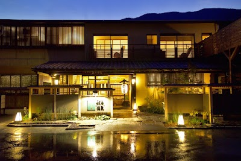

- **Place ID:** `ChIJm-4Q1qUnUjURY2vUy2wjhIA`
- **Address:** Matsumoto-367-28 Ikedachō Matsuo, Miyoshi, Tokushima 778-0165, Japan
- **Overall Rating:** 4.4 ⭐
- **Review Summary:** {'text': 'Guests mention this hotel offers a unique onsen experience with a private cable car descending to a riverside open-air bath, featuring skin-benefiting, naturally carbonated spring water. They also highlight the delicious local cuisine, including river fish and regional specialties, and the stunning views of the Iya Valley from both the rooms and baths. Visitors consistently praise the staff for their friendly, attentive, and helpful service.', 'languageCode': 'en-US'}
- **Amenities Summary:** Accessibility: {"wheelchairAccessibleParking": true, "wheelchairAccessibleEntrance": true}
#### Top 10 Positive Reviews:
- 5 Stars: The staff were extremely helpful and went above and beyond to help us despite the language barrier.  We were only there for one night but wished we were able to stay longer.  An extremely serene and magical experience.  Both the indoor and outdoor hot springs were beautiful and the food was a wonderful taste of local and seasonal cuisine.  Highly recommended.
- 5 Stars: This is a wonderful Ryokan nestled high in the Iya valley. The cable car onsen here is famous in Shikoku, and the Onsen, which is located adjacent to the river at the bottom of the Iya valley will leave your skin feeling like you are wearing Silk. The meals here were delicious, reflecting the variety of local dishes in the area.  Though it is no fault of the Ryokan, the remote location of this onsen makes the drive/travel here difficult, especially if arriving from the north. The roads leading through the valley are very narrow, so be careful if driving in low light conditions.
- 5 Stars: Amazing experience being at this hotel with the outdoor onsen and cable car that takes you there. Friendly staff with great attitude and service, a pleasure to meet them. Super comfortable and brand new bedroom. Breakfast and dinner one of the best we’ve had in Japan :) thanks for welcoming us and for your kindness, we are very appreciative of Iya Valley.
- 4 Stars: The staff were extremely friendly and helpful throughout our stay. We had a room with a bathroom view, and the scenery was absolutely stunning!  We really enjoyed both onsens. The outdoor onsen was slightly cooler, which made it perfect for relaxing for a longer time, while the indoor onsen felt warmer, looked gorgeous, and was often completely empty, I had it all to myself a few times.  That said, the hotel does feel a bit outdated in some areas, especially considering it’s marketed as a 4-star hotel with relatively high prices. The room also did not have proper blackout curtains, and light leaked through the toilet door, which meant we woke up quite early every morning since sunrise was around 5am.  Breakfast was amazing. Dinner, however, did not meet our expectations, particularly for the price we paid.
- 4 Stars: Amazing hotel in a beautiful valley. Great food and the service is top rated as expected of Japan hospitality. The hotel was under renovation but we were not inconvience in anyway. In hind sight, I should have gone for a better room since our room on Level 3 was right under the cable car. Not really an issue since its winter and it was dark early so not much view. Right decision to pay a little extra for the private onsen near the river, for the privacy and to fully enjoy the view in a leisurely manner. Must use the indoor onsen during the day since the view is amazing out the window. Highly recommend here.

#### Top 10 Negative/Lowest Reviews:
No negative reviews available.

---
### Nui. Hostel & Bar Lounge

- **Place ID:** `ChIJ4U-9KsiOGGARARhaBLZLqS0`
- **Address:** 2-chōme-14-13 Kuramae, Taito City, Tokyo 111-0051, Japan
- **Overall Rating:** 4.5 ⭐
- **Review Summary:** {'text': "People say this hostel offers clean, comfortable rooms with privacy curtains and spacious, well-maintained shared bathrooms. They also highlight the delicious food and coffee available at the lively downstairs cafe and bar, which attracts both locals and travelers. Guests mention the friendly, helpful staff and the hostel's convenient location near public transport and local attractions.", 'languageCode': 'en-US'}
- **Amenities Summary:** Accessibility: {"wheelchairAccessibleParking": false}
#### Top 10 Positive Reviews:
- 5 Stars: Nui. is the perfect hostel for people who want a little bit of everything. The rooms had a perfect level of people between them, the beds were comfortable and everything was extremely clean. I loved that the downstairs café/bar was filled with locals and tourists alike making an incredible atmosphere when you arrive or when you want to have a few drinks after a long day of sightseeing making it easy to socialise with others. I ended up meeting so many people during my stay who I'm lucky enough to call my friends.  If you want to get away from the hustle and bustle and take in a great view of Tokyo Skytree and Sumida River, head to the top floor where there is a balcony.  The hostel is located right next to Asakusa where Sensō-ji temple is located making it a great spot for sightseeing, restaurants and bars. If you would like to head out for the day to another district, the subway is a 5 minute walk away making it easy to get around stress-free.  Big shoutout to Maki-san, Miku-san, Sora-san and all the bar staff for making my stay here as amazing as possible.  I genuinely cannot express how amazing of a stay I had here but one thing's for sure. I'll definitely be back in the future!
- 5 Stars: I didn’t stay at the hostel, but a friend of mine did and she enjoyed her experience. This was a nice place to meet up in the morning before heading out on our Tokyo adventures. They have a great soy latte and the atmosphere lends itself to making friends. While waiting one morning I made friends with someone else stopping over for a coffee and we all went to hangout together afterwards.
- 5 Stars: Really solid for a classic hostel. The 8 person mixed gender dorm room is clean, each bed is surrounded by privacy curtains which really help with the noise/light. The AC works great! The staff is all so friendly and kind. It’s on a quiet side street and it was really nice to come back to a less busy part of town each night for some calmness.
- 5 Stars: I highly recommend this place. It was great location imo (quiet neighborhood but ten min walk to Asakusa or twenty min train to Ginza or Shibuya). Room was so clean and they have curtains for the dorms. Bathroom also very clean. The one critique I have is that it was not as social as I was hoping for and people kinda ignored me when I tried to talk to them with like one exception. I’ve never experienced that before and I am super respectful so I promise it’s not just me. I’m not sure if that’s usually how it’s like at this place but regardless, I still highly recommend as everything that was in Nui’s control was beyond expectations.

#### Top 10 Negative/Lowest Reviews:
- 2 Stars: I ordered the rigatoni because they were the only dish on the menu that caught my attention and, most importantly, they did not have the spicy symbol. Since I have stomach issues, I chose them thinking it was a safe option. Unfortunately, the pasta turned out to be spicy. When I pointed this out to the waiter, he denied that it was spicy instead of checking or being helpful. I’m giving two stars because the pasta was well cooked and the ingredients were of good quality. However, the bartender’s attitude was not appropriate toward a customer who was simply pointing out a mistake on the menu, especially regarding something as important as spiciness.

---
### Sensō-ji
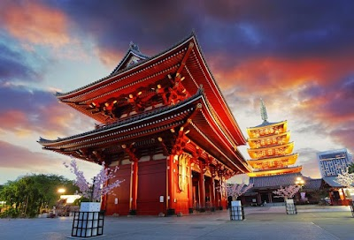

- **Place ID:** `ChIJ8T1GpMGOGGARDYGSgpooDWw`
- **Address:** 2-chōme-3-1 Asakusa, Taito City, Tokyo 111-0032, Japan
- **Overall Rating:** 4.6 ⭐
- **Review Summary:** {'text': 'People say this temple is beautiful, historic, and offers a vibrant atmosphere with stunning architecture, including the iconic Kaminarimon Gate and five-story pagoda. Visitors also highlight the lively Nakamise Street, which is full of shops selling traditional snacks and souvenirs. They also mention that visiting early morning or at night provides a more peaceful experience with beautiful illumination.', 'languageCode': 'en-US'}
- **Amenities Summary:** Accessibility: {"wheelchairAccessibleEntrance": true}
#### Top 10 Positive Reviews:
- 5 Stars: I visited Senso-ji during my Tokyo trip and honestly it lived up to the hype. The whole area feels very traditional and full of energy. Walking through the big gate and along Nakamise Street was one of my favorite parts. There are so many small shops and local snacks to try on the way to the temple. The main temple building is beautiful and well kept. I liked stopping near the incense area and just taking in the atmosphere for a few minutes. Yes, it gets crowded, but that also adds to the lively vibe of the place. If possible, try to come early morning or in the evening when it’s a bit less busy. The temple also looks really nice when it’s lit up at night. Overall, I really enjoyed my visit. If it’s your first time in Tokyo, Senso-ji is definitely a place you shouldn’t miss.
- 5 Stars: Senso-ji is absolutely stunning and one of the most memorable places I visited in Tokyo. My biggest recommendation is to come in the evening. As the day crowds begin to leave, the temple grounds become much calmer and more peaceful, allowing you to truly appreciate the beauty and atmosphere of this historic site.  The illuminated temple creates a magical setting, and walking through the grounds at dusk feels completely different from the busy daytime experience. The contrast between the traditional architecture and the city lights makes for incredible photos as well.  If you want to enjoy Senso-ji without the overwhelming crowds, an evening visit is definitely the way to go.
- 5 Stars: Sensō-ji Temple - A Must-Visit Masterpiece in Tokyo! Sensō-ji is absolutely breathtaking and an absolute must-visit when you’re in Tokyo. Walking through the iconic Kaminarimon (Thunder Gate) with its massive red lantern immediately sets the stage for an unforgettable experience. The energy here is incredible. It perfectly blends rich, ancient Japanese history with a bustling, vibrant community feel. Nakamise Shopping Street-The approach to the temple is lined with fantastic stalls selling traditional snacks, beautiful crafts, and great souvenirs. (traveler tip: Try the fresh ningyo-yaki cakes here) The five-story pagoda and the main hall are architectural marvels. The details, colors, and craftsmanship are stunning. My tips  for Visitors: Try the Omikuji, Don't miss out on drawing a fortune capsule for 100 yen. It’s a fun, traditional ritual. Go Twice if You Can, It is beautiful and lively during the day, but coming back late at night after the crowds thin out is magical. The structures are beautifully illuminated, offering a completely different, peaceful vibe. It can get very crowded, but the sheer beauty and cultural significance make it worth every single moment. An incredible glimpse into Tokyo's historic heart!
- 5 Stars: A must-visit place in Tokyo! Senso-ji was one of the most beautiful and memorable experiences of our trip. We first visited with a guide during the day, but since our hotel was nearby, we found ourselves coming back again and again.  The architecture is absolutely breathtaking, and the atmosphere feels truly magical and peaceful. You can also purchase beautiful omamori charms from the temple, which make wonderful souvenirs🌸  Behind the temple, you’ll find plenty of stalls selling traditional snacks 🍡🥠 and souvenirs. We especially recommend visiting in the evening as well, when the crowds are gone and the temple feels even more special and serene🏯  We will definitely return on our next visit to Tokyo! ✨
- 5 Stars: Visiting Sensō-ji was a beautiful and spiritual experience. The temple is full of tradition, history, and a peaceful energy that you can truly feel while walking through the area. Even though it is more touristy, it still feels culturally rich and deeply authentic.  I was there during their festival/carnival time, which was probably the reason there were so many people, but it also made the atmosphere feel even more alive and special. I especially loved the fortune ritual with the bamboo sticks — it adds a meaningful little activity that makes you feel connected to the spiritual side of the temple.  The mix of incense, prayers, traditional architecture, and festival energy created a very memorable experience. A beautiful place for reflection, culture, and a deeper connection with Japanese tradition.

#### Top 10 Negative/Lowest Reviews:
No negative reviews available.

---
### Akihabara Electric Town
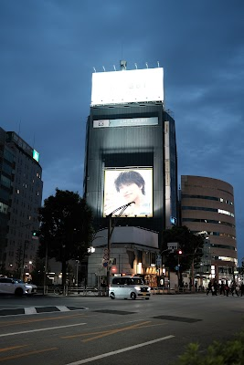

- **Place ID:** `ChIJzdWdgh2MGGARh4kg2pVZL3c`
- **Address:** Akihabara Electric Town, Tokyo, Japan
- **Overall Rating:** N/A ⭐
#### Top 10 Positive Reviews:
No positive reviews available.

#### Top 10 Negative/Lowest Reviews:
No negative reviews available.

---
### Mandarake Complex
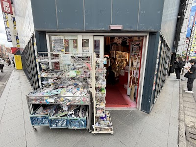

- **Place ID:** `ChIJm3WItR2MGGAR05t5cpt7U4w`
- **Address:** 3-chōme-11-12 Sotokanda, Chiyoda City, Tokyo 101-0021, Japan
- **Overall Rating:** 4.2 ⭐
- **Review Summary:** {'text': 'Visitors say this hobby and collectibles store offers an incredible selection of new and vintage items, including manga, figures, and toys, with each of its eight floors dedicated to different product categories. They also highlight the reasonable prices for many items, including rare finds, and the helpful, friendly, and English-speaking staff.', 'languageCode': 'en-US'}
- **Amenities Summary:** Accessibility: {"wheelchairAccessibleParking": false, "wheelchairAccessibleEntrance": false}
#### Top 10 Positive Reviews:
- 5 Stars: This is the place your little wee heart lusted after in your teens. Everything from kamen rider and super senti to big titty anime figures and lewd dolls. There are two 8 story buildings full of the junk you know and love. In all seriousness,  the selection is amazing, the staff is super helpful and everything is labeled and sectioned for your particular interests. One building is all toys and figures, the other (called building 2) is physical media like CDs and DvDs as well as trading card games and niche gotcha collectibles like a sheet of $20,000 DBZ trading cards (none TCG, just look at my pics). Prices really can't be beat as most of the items there are hard to find, rare, or simply out of production stuff as well as some more common stuff. You gotta see it to believe it.
- 5 Stars: Superb selection and service! Lots of rare art books and materials for good prices. The model kit section was very cool too! I had a great time here with a friend, and recommend it highly to anyone interested in Gundam or anime.
- 4 Stars: Mandarake Complex is a solid store with multiple floors of various anime, visual novel, and even hentai goods.  As far as visual novel merch goes (which is the main reason I even checked out the store), there’s only a shelf or two of physical copies and a handful of small merch items like body pillows or other stuff.  However, I do have to give props for the huge amount of content here otherwise — from anime to hentai to doujins, wall scrolls, and even a whole floor specifically for female-targeted lewd stuff (like BL).  If you just want a general store with a good amount of lewd anime stuff on the higher floors, check out Mandarake Complex.
- 4 Stars: This is a place where you can find secondhand goods at a pretty reasonable price if you're careful. The place is honestly a bit cramped, but it has seven floors, each with its own category.Here you have to be careful so you don't miss the item you are looking for, because here are a few instructions/notes.
- 4 Stars: Incredible collection of various degrees of tat or treasures. Multiple levels and two buildings. Lifts are slow, and stairs potentially exhausting (about 8 floors on each building). Staff were helpful in finding the right floor/building for the item I was after. When I eventually found my treasure, the floor assistant was extremely helpful in testing/checking the piece. Each floor is effectively unique, and items must be bought and paid for on the floor they are found. It can be quite tight manoeuvring around the shelves and cases, especially when busy. Best advice is to have an idea what you are looking for, check the floor menu, if not clear "ask", and then browse on the way out... or just run with your old treasure. Staff I spoke to all spoke English to a good level. A better floor plan and description of the type of items stocked would be useful. And potentially avoid having to ask the first question, "where do I go for..."

#### Top 10 Negative/Lowest Reviews:
No negative reviews available.

---
### Akihabara Gachapon Hall
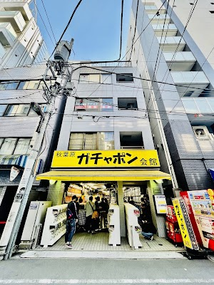

- **Place ID:** `ChIJBztW3x2MGGARadHYl5vTEK0`
- **Address:** Japan, 〒101-0021 Tokyo, Chiyoda City, Sotokanda, 3-chōme−15−５ MNビル 1F
- **Overall Rating:** 4 ⭐
- **Review Summary:** {'text': 'Visitors appreciate the wide variety of capsule toys available, including bizarre options, and note the convenient change machine. The staff is also commended for their quick resolution of machine issues.\n\nSome reviews mention the staff can be unhelpful.', 'languageCode': 'en-US'}
- **Amenities Summary:** Accessibility: {"wheelchairAccessibleParking": false, "wheelchairAccessibleEntrance": false}
#### Top 10 Positive Reviews:
- 5 Stars: Staff were mostly just chilling and the store was quite busy and many locals and tourists also come.  Decent selection and good models out for shows
- 5 Stars: A must see for the vintage fans Has all types of older consoles. Do note most games sold are in Japanese. The price of the older consoles are dependant upon status. So a newer looking one will cost a bit. They also sell you the adapters to go along with it. Game Room on top floor with snacks.  A bit hard to find as the entrance is a corridor. Look out for the potato on the sign outside.

#### Top 10 Negative/Lowest Reviews:
No negative reviews available.

---
### Suga Shrine Otokodan
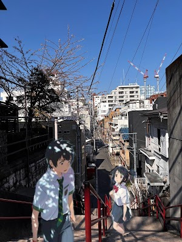

- **Place ID:** `ChIJFZmQijCNGGARTGdM5ATq-aw`
- **Address:** 5-6 Sugachō, Shinjuku City, Tokyo 160-0018, Japan
- **Overall Rating:** 4.7 ⭐
- **Review Summary:** {'text': 'Visitors say this shrine features the iconic stairs from the anime "Your Name," offering a memorable experience for fans, and a beautiful, calm shrine area. They also highlight the peaceful atmosphere, making it a nice place for quiet reflection. Others also say the shrine offers various omamori, goshuin stamps, and ema plaques.', 'languageCode': 'en-US'}
- **Amenities Summary:** Accessibility: {"wheelchairAccessibleParking": false, "wheelchairAccessibleEntrance": false}
#### Top 10 Positive Reviews:
- 5 Stars: I visited this place for the famous “your name”stairs, I wasn’t aware of the shrine that was located here. Turns out it was such an incredible discovery.  There are often a lot of people on the stairs, so it’s kind of complicated to take pictures. So it’s a good thing that the shrine is located there. The place isn’t too big and it is very calm so you can walk around freely.  I bought some lucky packages and landed on the word  “happiness”. I guess it is a good way to resume how I was feeling on the spot.  10/10 would recommend, please remain respectful as I saw some tourist acting very disrespectful in such places.
- 5 Stars: It's amazing how a story can turn an everyday place into something extraordinary! The shrine here is a nice, quiet place for a prayer and even has some benches for resting. What you're probably here for are the famous stairs leading to the shrine. I went on a weekday, so while there were always a few people here to take pictures, it wasn't that crowded. Seeing them in person and taking pictures was a great experience. Depending on who you come with and how brave you are, you could even ask strangers to recreate the movie poster and get to know each other! At least that's something I witnessed, and it was quite cute. You probably won't spend a lot of time here, but it's still a visit I would happily recommend.
- 5 Stars: Suga Shrine Otokodan is one of those spots in Tokyo that feels surprisingly quiet and understated despite how recognizable it has become online, especially because of its connection to Your Name.  The staircase itself is fairly simple in person, but what makes it memorable is the surrounding atmosphere. Tucked into a residential area, the space feels calm and local compared to many of Tokyo’s larger tourist-heavy landmarks.  What stood out most was the contrast between the cinematic reputation of the stairs and how ordinary the environment around them actually feels. Rather than feeling staged or heavily commercialized, it still feels like part of a functioning neighborhood where people casually walk past throughout the day.  The shrine area above the staircase is also much quieter than expected. There’s a slower pace once you move away from the photo spot itself, and the atmosphere becomes more reflective and relaxed.  Because of the popularity of the location, there are usually people stopping to take photos at the stairs, but the turnover is fairly quick. Most visitors spend a few minutes recreating scenes or taking pictures before moving on.  What I liked is that it still maintains a sense of authenticity despite becoming a recognizable pop culture landmark. It doesn’t feel transformed into a tourist attraction as much as it feels like a normal Tokyo location that happens to carry cultural significance for fans.
- 5 Stars: Small Shine near the popular Kimi no Nawa stairs. best visit and offer prayer, buy those lucky items and have a very relaxed and peaceful ambiance. respect the shrine and wash your hands and mouth before entering.
- 5 Stars: Must visit place if you're truly a fan of 君の名は, of course the stairs are the popular spot but the Shrine is also beautiful and it's worth visiting.  In the shrine store, you can buy many types of omamori, goshuin stamps and ema plaques.

#### Top 10 Negative/Lowest Reviews:
No negative reviews available.

---
### Shibuya Crossing
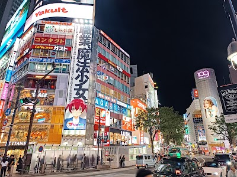

- **Place ID:** `ChIJK9EM68qLGGARacmu4KJj5SA`
- **Address:** 21 Udagawacho, Shibuya, Tokyo 150-0042, Japan
- **Overall Rating:** 4.5 ⭐
- **Review Summary:** {'text': 'Visitors say this pedestrian crossing offers an iconic, energetic, and unforgettable Tokyo experience, especially at night with its vibrant neon lights and giant screens. They also highlight the organized chaos of thousands crossing simultaneously and the numerous nearby shops and restaurants. Guests mention excellent vantage points from surrounding buildings like Starbucks or Shibuya Sky for impressive views.', 'languageCode': 'en-US'}
- **Amenities Summary:** Accessibility: {"wheelchairAccessibleParking": false, "wheelchairAccessibleEntrance": true}
#### Top 10 Positive Reviews:
- 5 Stars: This is my second time here and it hits just as hard as the first. Maybe harder. I've seen this place in movies, anime, music videos, and travel guides more times than I can count. None of it captures what it actually feels like to stand there when that light turns red and the whole world starts moving at once. The energy is real and it gets you every single time. I visited both during the day and at night in the rain. The daytime version is overwhelming in scale — thousands of people from every corner of the world converging at one point. But the rainy night? That's when it becomes something else. Neon signs bleeding into wet asphalt, Shibuya 109 glowing through the rain, umbrellas as far as you can see. It looks exactly like an anime frame. Except you're inside it. And yes — I desperately wanted to stop in the middle of the crossing and take the classic tourist photo. Couldn't bring myself to do it with that many people around. Maybe next time. Or the time after that. Because I already know I'm coming back. Some places you visit once. This one you keep returning to and never quite feel done with.
- 5 Stars: As an Indian, I arrived at Shibuya Crossing with two expectations:  1. I’d cross the road. 2. I’d leave.  Neither happened.  Instead, I spent the next hour standing around like a confused tourist, crossing the same road multiple times for absolutely no reason, taking photos, taking videos, and then taking photos of the videos.  There is something strangely satisfying about watching hundreds of people move in every direction with military precision while nobody crashes into anyone. If this happened at a busy Indian junction, there would probably be three horns, two arguments, and a tea stall discussion before everyone got across.  The crossing itself is just a crossing. Yet somehow it becomes an event, a performance, and a people-watching masterclass all at once.  My son loved the energy, I loved the organized chaos, and my phone storage definitely did not.  Verdict: Came to cross a road. Ended up experiencing a world-famous attraction.  10/10. Would cross again.
- 5 Stars: Shibuya Crossing is one of the most iconic urban intersections in the world and an absolute must-visit when in Tokyo. The sheer scale of coordinated pedestrian movement is impressive hundreds of people crossing from all directions in perfect rhythm, yet with complete order. The atmosphere is electric, surrounded by towering LED screens, neon lights, and the constant energy of the Shibuya district. It feels like the city is moving around you at full speed. Nearby viewpoints, especially from surrounding cafés and buildings, offer a great perspective to truly appreciate the flow of the crossing. It can get very crowded, particularly during peak hours, but that intensity is part of what makes the experience so unique and memorable. Even a short visit leaves a lasting impression. A true symbol of modern Tokyo and one of those places that is worth seeing at least once in a lifetime.
- 4 Stars: Visiting Shibuya Crossing was interesting, but personally, I found it a bit overrated.  Yes, it’s definitely very crowded and iconic as one of the busiest pedestrian crossings in the world. We passed through both during the day and at night since it was on our way, so we got to see both sides of it.  One thing that is truly impressive, though, is the way people move in sync. When the lights change, hundreds of people start walking at the same time from all directions, yet everything flows surprisingly smoothly. That sense of order within the chaos is actually quite fascinating to watch.  That said, while it’s worth seeing once, I don’t think it’s something to spend too much time on. Some people seem to stay for hours, but for us, it felt like a quick “see and move on” kind of place.  Tip: Walk through it once for the experience, maybe take a quick photo, and continue exploring the city.  An iconic spot, interesting for a short visit, especially for the synchronized crowd movement.
- 4 Stars: Shibuya Crossing is one of those places that somehow feels exactly like what people imagine Tokyo to be, loud, fast-moving, neon-lit, and endlessly alive.  What makes the crossing so fascinating isn’t just the number of people moving through it, but the rhythm. Hundreds of pedestrians surge into the intersection from every direction at once, yet everything somehow flows with near-perfect coordination. Though, in contrast to what everyone says about the place, it is not as magnificent when walking through it. We did not even notice we were at the crossing on first walkthrough, and it felt just like crossing another intersection through the bustling streets of Tokyo.  The atmosphere changes depending on the time of day. During daylight hours, it feels energetic and busy, surrounded by massive screens, department stores, cafés, and nonstop foot traffic. At night, though, the crossing becomes much more cinematic, with glowing advertisements, reflections from rainy streets, and the constant movement of people create the kind of urban atmosphere that’s become iconic worldwide.  This is definitely a place to look more from above however, as that brings the spectacle into true viewing. However, don't expect to feel wowed when just traveling across it.

#### Top 10 Negative/Lowest Reviews:
No negative reviews available.

---
### Shibuya Nonbei Yokocho
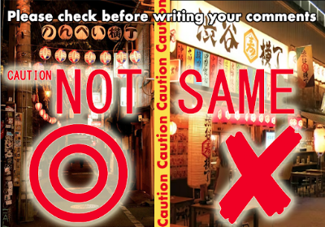

- **Place ID:** `ChIJpwDSAViLGGARVaJ_WUwQrt8`
- **Address:** 1-chōme-25-25 Shibuya, Tokyo 150-0002, Japan
- **Overall Rating:** 4.1 ⭐
- **Amenities Summary:** Accessibility: {"wheelchairAccessibleParking": false, "wheelchairAccessibleEntrance": false}
#### Top 10 Positive Reviews:
- 5 Stars: This was fun. It is very noisy and in a super busy part of Shibuya but the food was fresh and tasty. We sat inside and there was a cosy feel to the place. The staff were fast to meet orders. Definitely not a calm or quiet environment it felt more like a pub but that was great to mix it up a bit!
- 5 Stars: Great spot, Azumaichi junmai is a very smooth refined dink if you enjoy sake. Dishes are very good, bluefin tuna is out of this world!
- 5 Stars: Cute little Izakaya with about 5 seats. Great for the experience. Food is very simple.
- 5 Stars: As we got at Nonbei Yokocho early we have no problems to find a seat in one of those tiny and chaming izakayas. If you are looking for a homey atmosphere this is the right place. Besides, you can chat with the owner while you are drinking and meet others who are just like you away from home or to meet some locals which definitely will improve your experience of Japan.
- 4 Stars: Nice options of restaurants and bars for all tastes.  @gigicomidinhas

#### Top 10 Negative/Lowest Reviews:
No negative reviews available.

---
### Japan

- **Place ID:** `ChIJLxl_1w9OZzQRRFJmfNR1QvU`
- **Address:** Japan
- **Overall Rating:** N/A ⭐
#### Top 10 Positive Reviews:
No positive reviews available.

#### Top 10 Negative/Lowest Reviews:
No negative reviews available.

---
### Nakano Broadway
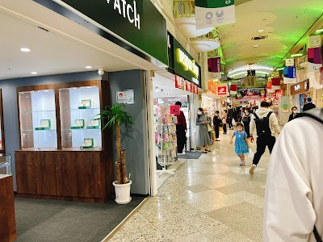

- **Place ID:** `ChIJg-7dspDyGGARvvDv4E5-tuE`
- **Address:** 5-chōme-52-15 Nakano, Nakano City, Tokyo 164-0001, Japan
- **Overall Rating:** 4.2 ⭐
- **Review Summary:** {'text': 'People say this shopping complex is a paradise for anime, manga, and collectible fans, offering a vast selection of rare figures, vintage toys, and unique items. Visitors also highlight the numerous luxury watch stores, providing a wide variety of new and pre-owned models. They also like the nostalgic, old-school vibe and the lively atmosphere, making it a fun place to explore for hours.', 'languageCode': 'en-US'}
- **Amenities Summary:** Accessibility: {"wheelchairAccessibleEntrance": true, "wheelchairAccessibleRestroom": true}
#### Top 10 Positive Reviews:
- 5 Stars: Amazing shops located in the indoor market place with multiple floors. If you're a fan of comics, luxury watches, pokémon, and anything nostalgic then this is the place for you. You can get lost in all the shops and spend hours on each floor. So many hidden treasures it's hard to move on to the next store. Definitely dedicate a lot of time to enjoy the ins and outs  Really nice steam dumpling place downstairs in the outdoor section on the east side of the market.
- 5 Stars: A paradise for manga lovers. It offers a huge selection of manga, figurines, anime merchandise, and more. You can also find some great second-hand collectibles here. Besides that, there are plenty of watch stores in the area as well.
- 5 Stars: Nakano Broadway is probably one of the best places in Tokyo to look for antique and vintage watches. There is an incredible variety of shops, and you can find everything from affordable second-hand pieces to rare collector models and luxury watches.  What makes the place great is that there’s really something for every budget. Whether you’re seriously collecting, casually browsing, or looking for your first vintage watch, you’ll find options at many different price points. Most stores also carry both brand-new and pre-owned models, so it’s easy to compare styles and prices.  Beyond the watches, the atmosphere of Nakano Broadway itself is fun to explore, with countless small specialty shops and a very unique retro Tokyo vibe. Definitely worth visiting if you’re into watches, vintage shopping, or collectibles in general.
- 5 Stars: It’s a building-style shopping arcade located at the back of Nakano Sun Mall. Compared to Sun Mall, I think Nakano Broadway has a lot more unique and quirky shops. The basement level is mostly food and fashion stores, while the first floor is a bit more subdued and has a variety of shops. The second floor is the quirkiest of all, with many Mandarage stores and other unique independent shops. It’s lined with items that enthusiasts will drool over, such as figures, magazines, CDs, and games. I felt the third floor had many shops dealing in luxury goods like watches, bags, and precious metals. There were also shops catering to otaku interests, but they were even more niche than those on the second floor. The fourth floor is mainly offices, with few shops. However, there are still some shops with a very unique vibe. They sell niche items like animation cels and ball-jointed dolls, so it’s probably irresistible for fans. Perhaps because they’re targeting inbound tourists, prices were on the high side everywhere. About 80% of the customers were foreigners, and there were few Japanese people. I’d be willing to buy something if it were something I couldn’t get anywhere else, but otherwise, I’d rather buy it somewhere else.
- 4 Stars: Nakano Broadway is well worth a visit, especially if you have an interest in a wide range of niche and fascinating items such as watches, collectibles, and retro memorabilia that offer a glimpse into the past.  It’s an intriguing place to explore, though it can feel a little overwhelming at times due to the sheer number of shops packed into the space.  Navigating the building isn’t always straightforward, and many of the stores cater to very specific interests, which may only appeal to those searching for particular items.  That said, even if you’re just browsing, it’s a unique experience with plenty to discover.

#### Top 10 Negative/Lowest Reviews:
No negative reviews available.

---
### DiverCity Tokyo Plaza
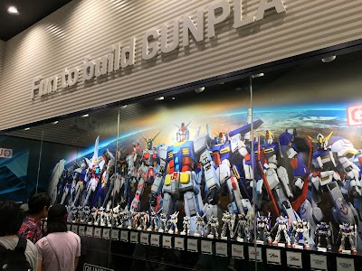

- **Place ID:** `ChIJpbpu0_mJGGARd9sJ-psh9Gc`
- **Address:** 1-chōme-1-10 Aomi, Koto City, Tokyo 135-0064, Japan
- **Overall Rating:** 4.2 ⭐
- **Review Summary:** {'text': 'Visitors say this shopping mall offers a wide variety of international and Japanese brands, including many character-themed stores, and features a life-size Unicorn Gundam statue that transforms and lights up. They also highlight the spacious and clean food court with diverse dining options. Guests mention the convenient access by public transportation and ample parking.', 'languageCode': 'en-US'}
- **Amenities Summary:** Parking: {"paidParkingLot": true, "paidGarageParking": true} | Accessibility: {"wheelchairAccessibleParking": true, "wheelchairAccessibleEntrance": true, "wheelchairAccessibleRestroom": true, "wheelchairAccessibleSeating": true}
#### Top 10 Positive Reviews:
- 5 Stars: Huge and incredible shopping, spent some hours on it and still haven't been able to explore it all. It's pretty, good designed and has various types of stores of all kinds of products of the most iconic brands (also with many gachapon on upper floor, so it was a joyful experience too). In front of it there is the awesome Unicorn Gundam and with the Gundam base store close to it, which makes it way enjoyable to look at. The stairs on the right of the statue also light up on the night, with rainbow colours, those were so beautiful that took me unexpected but made it amusing to my eyes. I recommend it, best to go close to evening hours.
- 5 Stars: We visited DiverCity Tokyo Plaza in Odaiba and it was a very enjoyable experience, especially if you love shopping, dining, and modern attractions all in one place. The mall is spacious and well-organized, with a wide variety of stores ranging from popular international brands to Japanese fashion and specialty shops. It’s easy to spend several hours here just exploring different sections.  One of the main highlights is the life-sized Gundam statue located just outside the mall. Seeing it up close is impressive, especially for anime fans. It’s a great photo spot and adds a unique character to the entire area. The atmosphere around the mall feels lively but not overly crowded, making it comfortable to walk around.  Inside, there are plenty of dining options, from casual food court meals to sit-down restaurants offering Japanese and international cuisine. We appreciated having many choices after a long day of sightseeing. The mall is also clean and well-maintained, with clear signage that makes navigation easy.  Overall, DiverCity Tokyo Plaza is a great destination if you’re visiting Odaiba. It combines shopping, entertainment, and iconic attractions in one convenient location. Whether you’re traveling with family or friends, it’s a fun and relaxing place to explore.
- 5 Stars: Nice mall with plenty of shops with wide range of assortment - including toy gift shops like the Hello Kitty, Doraemon and Gundam Annex Base.  The Main tourist attraction though is the life sized Gundam statue. It has a 1 min display every hour - just a couple of metal plates moving and the Gundam displaying its face. Nevertheless good fun.  Plan for a visit together with the nearby Toyosu market and TeamLabs although it can be a fair bit of walking. They are all on the Rinkai line within 1-2 stops apart.
- 5 Stars: One of my happy place, I absolutely love DiverCity Tokyo Plaza this place always makes me so happy every time I visit. Seeing the life-size Gundam statue in real life is just mind-blowing, it really feels like a dream come true. The Doraemon orchestra was super fun and heartwarming, and the Doraemon store is honestly a paradise if you love the character. The mall is huge, super comfortable to walk around, and the food court has so many great options that I always end up wanting to try everything. It’s one of those places that never gets boring, no matter how many times you come back. Definitely one of my favorite spots in Tokyo, and I’ll keep coming back for sure! ❤️
- 5 Stars: Mall offering different character stores! There was a Doraemon, One Piece, and Sanrio store to name a few. They also had plenty of food options and had a Round1. I think it’s a good place to hang out with friends! Also you can't forget the iconic Gundam figure standing tall at the entrance and the Unko (poop) Museum 😂

#### Top 10 Negative/Lowest Reviews:
No negative reviews available.

---
### Unicorn Gundam
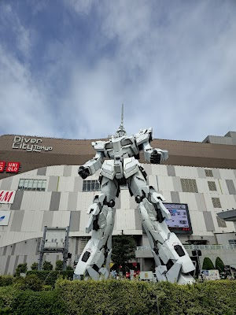

- **Place ID:** `ChIJF6xTyvmJGGARU8t5NIqkNeI`
- **Address:** Japan, 〒135-0064 Tokyo, Koto City, Aomi, 1-chōme−1−１０ ダイバーシティ東京プラザ内 2Fフェスティバル広場
- **Overall Rating:** 4.6 ⭐
- **Review Summary:** {'text': "Visitors say this life-sized Unicorn Gundam statue is massive, incredibly detailed, and a must-see for anime fans. They also highlight the impressive transformation sequence with lights and sound, especially at night. Guests mention it's conveniently located next to a mall with shops and food options, and it's free to view.", 'languageCode': 'en-US'}
- **Amenities Summary:** Parking: {"freeParkingLot": true, "paidParkingLot": true, "paidGarageParking": true} | Accessibility: {"wheelchairAccessibleParking": true, "wheelchairAccessibleEntrance": true}
#### Top 10 Positive Reviews:
- 5 Stars: I visited back in 2024 and it was one of the highlights of my short visit to Tokyo. I'm a fan of Gundam so getting to see a life-size statue of the Unicorn with my own eyes was such an amazing experience.  At the time I visited the transformation wasn't working properly so only the lights were functional, but given how complex the transformation for the Unicorn Gundam is, I'm impressed they managed to make it work under Earth's gravity.  Unfortunately it's set to be taken down a couple months after I post this review, but given that it's stood for almost a decade and been loved by so many people, I think it had a good run.
- 5 Stars: 🤖✨ One of Tokyo’s Most Iconic Anime Landmarks ✨🇯🇵  The life-sized Unicorn Gundam statue in Odaiba is honestly one of the most impressive attractions for anime lovers and even for people who are not hardcore Gundam fans. Standing in front of DiverCity Tokyo Plaza, the giant statue immediately becomes the center of attention the moment you arrive in the area. The statue itself stands around 19.7 meters tall and transforms between Unicorn Mode and Destroy Mode with lighting effects and special performances.  📸 Seeing the Unicorn Gundam in person feels very different compared to photos or videos online. The scale is massive, and the details on the body design look incredible especially when viewed up close.  🌃 The best time to visit is during the evening because the lighting show and transformation effects make the entire experience feel much more dramatic. The glowing psycho-frame lights combined with music and visual effects create a very cinematic atmosphere.  🛍️ Since it is located directly in front of DiverCity Tokyo Plaza, visitors can also enjoy shopping, restaurants, cafés, and the famous Gundam Base Tokyo nearby, making it a perfect destination for both anime fans and casual tourists.  👨‍👩‍👧‍👦 The area itself feels spacious, clean, and family-friendly. Even though it can become crowded especially during weekends and nighttime shows, the atmosphere still feels comfortable for sightseeing and photography.  🚆 Access is also relatively easy from central Tokyo using the Yurikamome Line or Rinkai Line, making it a popular stop for tourists visiting Odaiba.  ✨ Overall, the Unicorn Gundam statue is not just an anime attraction, but also one of Tokyo’s modern pop-culture landmarks that combines technology, entertainment, and Japanese fandom culture perfectly.  ⭐ 4.9/5  🤖 Massive life-sized Gundam statue 🌃 Amazing nighttime transformation show 📸 One of Tokyo’s best anime photo spots 🛍️ Connected to shopping and entertainment area 👨‍👩‍👧‍👦 Family-friendly attraction in Odaiba  — ✨ Some attractions are visited for sightseeing. 🤖 The Unicorn Gundam is visited for the experience and excitement.
- 5 Stars: Got to finally take this off from my childhood bucket list of things to do during this visit! What made it even more memorable personally was that I was able to share it with my Toddler who I introduced to Gundam that same day. Seeing his reaction after walking out from the food court is priceless! Now to try and see the other 2 remaining statues. 😅
- 4 Stars: A little bit out of the way but it does have a life size gundam! Nothing of note here with a large shopping complex although externally the area looks a little bit tired but very clean. The monorail servicing the area is very good with excellent views. Only go if you have a few hours to kill.
- 4 Stars: The walk to the statue is beautiful during the spring season. We passed by the Fuji tv building (digimon fans will appreciate this)  Pretty cool to see a life-sized gundam. We went on a tuesday weekday and caught the 3pm show. It lasted like 2-3 mins. Probably better to catch the nighttime show. The Gundam Base store is located in the Diver City at the 7th floor. We were issued numbered tickets to come back at 5pm.

#### Top 10 Negative/Lowest Reviews:
No negative reviews available.

---
### Omoide Yokocho Memory Lane

- **Place ID:** `ChIJP9eKBdeMGGAR0zzBXJNVj5A`
- **Address:** 1 Chome-2 Nishishinjuku, Shinjuku City, Tokyo 160-0023, Japan
- **Overall Rating:** 4.2 ⭐
- **Review Summary:** {'text': 'People say this alley offers delicious yakitori, ramen, and other Japanese street food, with many small eateries to choose from. Visitors also highlight the lively, nostalgic, and authentic old-Tokyo atmosphere, especially at night with glowing lanterns. They also mention the friendly staff and the convenient location near Shinjuku Station.', 'languageCode': 'en-US'}
- **Amenities Summary:** Accessibility: {"wheelchairAccessibleParking": false, "wheelchairAccessibleEntrance": false, "wheelchairAccessibleRestroom": false}
#### Top 10 Positive Reviews:
- 5 Stars: We visited Omoide Yokocho and had a really memorable experience. We mainly tried different skewers, and everything we ordered was simple but very tasty. The place was quite crowded, especially in the evening, but that actually added to the atmosphere rather than taking away from it.  What makes this spot special is how authentic it feels. The narrow alleys, small restaurants, and the smell of grilled food create a very traditional and lively vibe. It feels like stepping back in time compared to the modern parts of Tokyo.  Even though it’s busy, the energy is great and it feels very local rather than touristy. The setting is also surprisingly charming.  I highly recommend visiting this place if you come to Tokyo ! Especially at night !
- 5 Stars: A small stretch of alley with lots of yakitori izakaya shops that have been there for many many years. If you want to give their yakitori and izakaya a try, I feel that this place is good to try out the experience of eating at the small authentic shops. There's lots of tourists and the shops staffs are all friendly and welcoming to tourists. They have English menu and theres lots of food choices to choose from. It's also pretty and has its own vibe at night with the lights and lanterns.
- 5 Stars: I visited Omoide Yokocho and it honestly felt like stepping into a completely different side of Tokyo. The moment I walked in, the narrow alleyways, glowing lanterns, and smoky air from all the grills created a really unique atmosphere that I did not find anywhere else in the city. It’s right next to Shinjuku Station, but it feels much more old school and nostalgic compared to the modern surroundings.  What stood out to me the most was how compact everything is. The alley is packed with dozens of tiny bars and restaurants, many with just a few seats, so it feels very intimate and lively at the same time. I ended up squeezing into a small spot and trying some yakitori, and the whole experience felt very local and authentic. You are sitting close to strangers, hearing conversations, and just soaking in the vibe, which made it memorable for me.  I also liked how casual everything felt. There is no pressure, you just walk around, pick a place that looks good, and go for it. At the same time, it can get pretty crowded, especially at night, and some places are quite small, so it might not be the most comfortable if you prefer more space.  Overall, I really enjoyed the atmosphere more than anything. It’s not about luxury or perfect service, but about the experience. For me, Omoide Yokocho was a fun and slightly chaotic place to grab food and drinks, and it’s definitely worth visiting at least once if you are in Tokyo.
- 5 Stars: Cool tight alley jam packed with intimate eateries. Tried a couple of places.. one hit and one miss. The experience at the steak place that accommodated us got the 5 stars. The place is pretty popular so it can get pretty crammed but don't let that deter you from checking it out.
- 4 Stars: Walking through Omoide Yokocho Memory Lane felt like stepping into a different side of Tokyo. I really enjoyed the narrow alleyways, the lively atmosphere, and all the tempting smells drifting out from the tiny eateries. It’s a great spot if you’re into meat or fish dishes, though vegetarians may have fewer choices. Still, it was a memorable stop and well worth seeing.

#### Top 10 Negative/Lowest Reviews:
No negative reviews available.

---
### Shinjuku Golden-Gai

- **Place ID:** `ChIJr7mGZdmMGGARjxoMFeHApXE`
- **Address:** Japan, 〒160-0021 Tokyo, Shinjuku City, Kabukichō, 1-chōme−1−６ あかるい花園 五番街
- **Overall Rating:** 4.3 ⭐
- **Review Summary:** {'text': 'People say this nightlife spot offers a unique experience with its maze of tiny, themed bars, each having its own distinct personality. Visitors highlight the lively and intimate atmosphere, making it a great place to meet locals and fellow travelers. They also mention that many bars are welcoming to tourists, and some offer good value with reasonable drink prices.', 'languageCode': 'en-US'}
- **Amenities Summary:** Accessibility: {"wheelchairAccessibleParking": false, "wheelchairAccessibleEntrance": false}
#### Top 10 Positive Reviews:
- 5 Stars: This is a small nightlife district in Shinjuku known for its narrow alleyways and tiny bars packed closely together.  It is famous for:  * retro post-war atmosphere, * neon signs and lantern-lit streets, * very small themed bars, * and its connection to Tokyo’s nightlife and creative culture.  The area contains more than 200 small bars, many seating only a handful of customers. Some are open to tourists, while others are regular-only or charge a cover fee.  Golden Gai is especially popular at night for:  * bar hopping, * photography, * local drinking culture, * and experiencing a different side of Tokyo compared with modern districts like Shibuya.  Best time to visit:  * evening to late night, * especially after 7 PM when most bars open and the streets become livelier.
- 5 Stars: Shinjuku Golden Gai is clearly a place with a strong character—but timing really matters.  We visited during the day, and everything was closed. The streets were almost empty, which made it feel a bit lifeless at that moment.  That said, you can immediately tell this place comes alive at night. The narrow alleys, tiny bars, and unique storefronts give strong hints of an amazing atmosphere once the lights are on and the doors are open.  Even without experiencing it at night, it’s easy to imagine how vibrant and special it must be.  Tip: Definitely visit in the evening or at night—this is not a daytime destination.  A place with a lot of potential, but only if you catch it at the right time.
- 5 Stars: Hundreds of tiny bars line these alleys. The bars are so small you’ll end up in conversation with strangers almost definitely. It was full of very interesting discussions. Overall, it was a cultural melting pot. Great experience 5/5
- 4 Stars: Golden Gai or Golden Town, in Shinjuku, is a small alley area, composed of 6 small lanes, where there are many small pubs, bars and small diners which often sell simple BBQ food, soup noodle, etc., in addition to liquor and wine.  In addition to eating and drinking, the area is also one of Japanese folk-art and other performing arts' birthplaces and later becomes a living center for many young performers and artists to manage their pub business and, at the same time, waiting for the acting, performing art opportunities.  Many small pubs do have their own unique decorations inside and outside the stores, including posters, and it is worthy for tourists to take a walk of the area. If tourists want to take photos, then, day-time walk is recommended because not many customers in the area, and photo taking may be easier.  Many bars or pubs in Golden Kai section have history of 40 years or longer, and a few of them do not accept foreign customers or tourists as their customers; generally, these bars or pubs prefer their frequent customers.  But a few pubs do open for all customers, including foreign tourists, such as Kenzo’s Bar [Bar owner is a playwriter and an actor, and he is very friendly and bar plays 1980s music], Bar Darling [perhaps because it is owned by a female actress, staffs are all female; the bar welcomes female customers, even single female], Ace’s [it does not impose cover charge and staffs can communicate English and welcome foreign tourists, and these bars do have reasonable pricing for drink and food.  Most of the bars in Golden Kai do impose entrance fee, seating fee or cover charge per person, which is in the range of 500 Yen to $1,000 Yen per person, although there are few bars which do not have entrance fee pr cover charge.  Most of the bars open from later afternoon or early night, such as 08PM, although a few of the bars do open 24/7 daily.  Although there are many bars in Golden Kai, the area does not allow public drinking or smoking in public section, and it is strictly enforced for the no smoking or drinking in public street rules.  However, most of the bars do allow smoking inside their bars.  1st time foreign visitors or tourists, can take Tokyo Metro Marunouchi Line [M Line] and get off at M-09 Shinjuku Sanchome Station and then walk to Exit 2, and the Golden Gai is in very short walking distance.

#### Top 10 Negative/Lowest Reviews:
No negative reviews available.

---
### Mount Takao
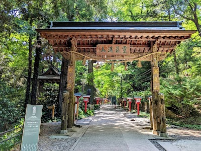

- **Place ID:** `ChIJb4ejXn8ZGWAR3y_2HoQLB8c`
- **Address:** Mount Takao, Takaomachi, Hachioji, Tokyo 193-0844, Japan
- **Overall Rating:** 4.5 ⭐
#### Top 10 Positive Reviews:
- 5 Stars: Visited Mt. Takao in early January right after the first snow in Tokyo, and it was absolutely beautiful. Most of the trees were covered in fresh snow from the night before, felt really magical.  It’s an easy day trip from Tokyo with a direct train to Takaosanguchi Station. You can take the cable car or chairlift, but I chose to hike. I’d say it’s doable with average fitness, though proper hiking shoes are definitely helpful as some parts can get slippery and a bit steep.  There are a few shops along the trail selling food and drinks, but still good to bring your own water. Since I went at the very beginning of the year, it was quite busy with people lining up for temple visits.  At the top, I was lucky enough to see Mt. Fuji as the backdrop, such a rewarding view. A really happy and memorable day!
- 4 Stars: Fun hike right after recent snowfall in the Tokyo area! We did the 6th trail which was definitely more nature-like than the 1st trail. If you chose to do the 6th trail, prepare properly with hiking boots and a good pair of socks. It took us about 80 minutes to reach the peak. The view is alright, not amazingly scenic by any stretch but cool nonetheless. The hike was not too difficult, but it depends on your physical ability. The stairs at the very end were somewhat steep. We went on a Monday afternoon and there were not many people around. Easily accessible from Tokyo. Bring food and drinks with you. The base of the mountain has some stores but not major food concessions. This was a pleasant hike in the winter, but I would never do this in the heat of summertime and tourist crowds. Hike at your own risk.
- 4 Stars: Really nice hike I would say with a really stunning view at the top at 599m there’s a cable chair swing and the tram up but do take note of timeings but overall really rewarding and do be careful after 6-7pm the trail back down is dark
- 4 Stars: Beautiful day with warm weather. We used trail #1 to walk all the way to the summit. The first 8 post of the 14post are pretty steep. Happy to have done it but if we go again will use the lift to go up. We were lucky to see Fuji san in its splendor. Parking only 800¥ for a day

#### Top 10 Negative/Lowest Reviews:
No negative reviews available.

---
### Ryogoku Kokugikan Sumo Arena
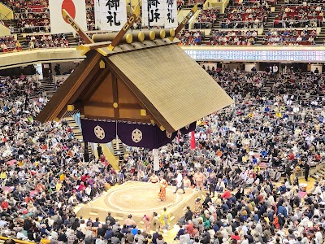

- **Place ID:** `ChIJGeu4VDWJGGARdPoda8d8I3A`
- **Address:** 1-chōme-3-28 Yokoami, Sumida City, Tokyo 130-0015, Japan
- **Overall Rating:** 4.4 ⭐
- **Review Summary:** {'text': 'People say this arena offers an unforgettable experience with the intense atmosphere of live sumo, highlighting the powerful clashes and traditional rituals. Visitors also appreciate the wide variety of food options, including popular yakitori and chanko stew, and the extensive selection of sumo merchandise. They also mention the venue is clean and the staff are helpful.', 'languageCode': 'en-US'}
- **Amenities Summary:** Accessibility: {"wheelchairAccessibleParking": true, "wheelchairAccessibleEntrance": true, "wheelchairAccessibleRestroom": true}
#### Top 10 Positive Reviews:
- 5 Stars: Watching sumo live at Ryogoku Kokugikan Sumo Arena was something I will remember for a very long time. There is nothing quite like experiencing sumo in person. The atmosphere inside the arena was electric yet deeply respectful, with a strong sense of tradition and ritual that you can really feel the moment you step in.  Seeing sumo up close gave me a much deeper appreciation of the sport, the discipline, and the culture behind it. The crowd was fully engaged, reacting together with gasps, applause, and quiet anticipation.  A truly unique experience that goes far beyond sport. If you ever have the chance to watch sumo here, do not miss it.
- 5 Stars: Fantastic!! If you are in Tokyo and there's a tournament on it's a must visit. Great entertainment and brilliant atmosphere. We were so lucky to get tickets but we booked months in advance. Would definitely recommend.
- 5 Stars: If you visit Japan during an odd numbered month, you should seriously consider taking in a sumo tournament day. Weekends are packed so weekday visits are recommended. January, May and September feature tournaments here in Ryogoku but there are charity sumo events taking place all the time so check the website for the latest events.  Sumo is so deep, ritualized, spiritual and ceremonial that I suggest you read up a little or watch a few broadcasts before a visit. You will get more out of the experience.  I never tell people what to do as travel is very personal and taste is very subjective BUT in Japan, I highly recommend visiting sumo, climbing Mount Takao and watching kabuki. I lived in Japan for 20+ years but these would still be my first choices today.  Sumo Spectator Sinay says: Most people attend sumo in the afternoon around 3:00PM but if you go in the morning, you can sit at the dohyo edge (ringside) and see the up and coming lower ranked wrestlers. Why miss out on the opportunity?
- 5 Stars: One of my favorite areas to spending time in. Located behind the national museum. Amazing Colour in the summer / events. Tickets can be difficult to get, but amazing place to visit if you have time.
- 5 Stars: I had seen sumo wrestling on TV before, so getting the chance to attend a live tournament in Tokyo was something I was really looking forward to. I researched how to buy tickets ahead of time , the process was surprisingly easy. I purchased the tickets online and collected them from a Seven Eleven convenience store in Japan, which I then brought with me to the arena on the day.  Walking into the Kokugikan, we were amazed by the size of the arena. It’s massive, with a huge number of spectator seats all surrounding a single raised ring. From our seats up high (way up in the “nosebleeds”), the ring looked smaller than I expected. But during breaks, we walked around the lower level and got a much closer view of the action, which added a whole new level of appreciation.  The matches themselves were fascinating, each bout was intense but over quickly, and the rituals before each one were just as interesting. We thought we’d stay for about three hours but ended up staying for over five. The energy in the arena was fantastic, and the crowd was fully engaged.  If you're in Tokyo, this is a must-see cultural and sporting experience. I’d absolutely go again.

#### Top 10 Negative/Lowest Reviews:
No negative reviews available.

---
