# Deep Dive: Reviews & Photos

### strategic geographic loop (Search Failed)
- No Place ID found.

---
### Japan
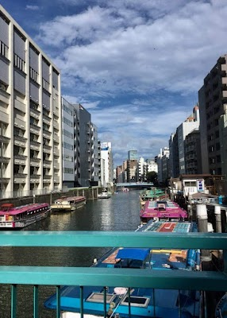

- **Place ID:** `ChIJLxl_1w9OZzQRRFJmfNR1QvU`
- **Address:** Japan
- **Overall Rating:** N/A ⭐
#### Top 10 Positive Reviews:
No positive reviews available.

#### Top 10 Negative/Lowest Reviews:
No negative reviews available.

---
### Ginza Itoya
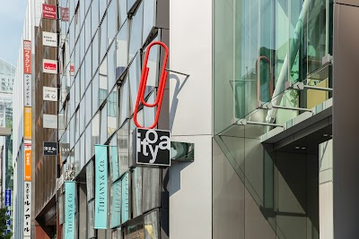

- **Place ID:** `ChIJKQAKAOSLGGARwGhpOXWgfYo`
- **Address:** 2-chōme-7-15 Ginza, Chuo City, Tokyo 104-0061, Japan
- **Overall Rating:** 4.4 ⭐
- **Review Summary:** {'text': 'People say this stationery store offers an extensive selection of high-quality items, including unique pens, notebooks, and art supplies across multiple themed floors. Visitors also highlight the helpful and knowledgeable staff, who provide excellent assistance. They also like the convenient on-site cafes and gift-wrapping services.', 'languageCode': 'en-US'}
- **Amenities Summary:** Parking: {"freeParkingLot": false, "paidParkingLot": false} | Accessibility: {"wheelchairAccessibleParking": false, "wheelchairAccessibleEntrance": true}
#### Top 10 Positive Reviews:
- 5 Stars: Itoya Ginza was honestly one of the most unexpectedly enjoyable places I visited in Tokyo. Even if you’re not heavily into stationery, the store is so beautifully designed and organized that it’s easy to spend a long time just browsing around.  Each floor has its own theme, with everything from high-end pens and notebooks to art supplies, travel accessories, and unique Japanese paper products. The quality and attention to detail in everything they sell is incredible.  The atmosphere feels calm and refined despite being in busy Ginza, and the staff were very polite and helpful. It’s the kind of place where you end up buying things you didn’t even know you wanted.  Definitely worth visiting if you appreciate good design, creativity, or simply want a different shopping experience in Tokyo.
- 5 Stars: Ginza Itoya is a massive stationery store located on Ginza’s main shopping street. Spanning 12 floors, it offers an impressive selection of products for writing, painting, decorating, and more. Everything is beautifully displayed, making the store a pleasure to explore. I really enjoyed visiting, even though I didn’t buy anything this time. Highly recommended !!!
- 5 Stars: It is truly the one stop holy grail shop for anything stationary.  Do note that for tourists, the tax-free amount is higher than the 5500 yen minimum spending. Instead, it was nearly the double, at least 100 000 yen (I cannot remember the exact amount).  You'll see most trafic on the "Work" floor, home of the prized and common gel\ballpoint pens. Do try to arrive with a plan to beam straight to your purchase of choice and don't hesitate to avoid lines at the cash register by just switching floors.
- 4 Stars: ​Ginza Itoya is a breathtaking 12-story vertical wonderland that is truly an artsy person’s dream. With eight floors of stationery heaven, it offers everything from artisanal papers to precision fountain pens in a beautifully curated space. ​Why You’ll Love It: ​Creative Bliss: Each floor is a deep dive into craft, color, and design. ​The Escape: Above the retail floors, you’ll find serene lounges and a cafe, perfect for testing out your new supplies over a coffee. ​Analog Magic: It’s a tactile, inspiring retreat from the digital world. ​If you’re in Tokyo, this is a must-visit for anyone who loves to create.
- 4 Stars: I was really happy to see that they have a good range of fountain pens, including some special ones from Sailor. I picked up a few inks too. My favorite part was the craft section because I loved seeing all the stamps and punchers. The only thing to watch out for is the area with the regular gel pens. It gets extremely crowded after 12 noon, so it is better to go earlier. There is barely any space to move around once it gets busy.

#### Top 10 Negative/Lowest Reviews:
No negative reviews available.

---
### teamLab Planets TOKYO DMM
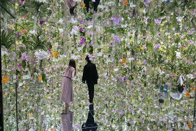

- **Place ID:** `ChIJSeco5wiJGGARItbTS8lQ5G0`
- **Address:** 6-chōme-1-16 Toyosu, Koto City, Tokyo 135-0061, Japan
- **Overall Rating:** 4.5 ⭐
- **Review Summary:** {'text': "People say this museum offers a unique, immersive art experience with stunning visuals, interactive light installations, and a water area where visitors walk barefoot through knee-deep water. They also highlight the well-organized facilities, including free lockers and towels, and mention the delicious vegan ramen available. Guests mention it's a fantastic and memorable experience for all ages, with many recommending booking tickets in advance.", 'languageCode': 'en-US'}
- **Amenities Summary:** Parking: {"freeParkingLot": false, "paidParkingLot": false, "freeStreetParking": false, "paidStreetParking": false, "freeGarageParking": false, "paidGarageParking": false} | Accessibility: {"wheelchairAccessibleEntrance": true, "wheelchairAccessibleRestroom": true, "wheelchairAccessibleSeating": false}
#### Top 10 Positive Reviews:
- 5 Stars: An Absolute Masterpiece – A Must-Do in Tokyo! If you are visiting Tokyo, teamLab Planets is an absolute must-visit. It is not just an art exhibit; it is a fully immersive, multi-sensory journey that completely redefines what an art museum can be. From the moment you step inside and take off your shoes, you are transported into a different world. Walking barefoot through varying textures—including actual water—adds a physical layer to the experience that makes you feel deeply connected to the art. The Infinite Crystal Universe: Mind-blowing scale and light synchronization. It feels like standing in the center of a beautiful, endless galaxy. Walking knee-deep in warm water filled with digital koi fish that respond to your movements was incredibly peaceful and magical. Floating Flower Garden: A breathtaking room filled with thousands of live, fragrant orchids that rise and fall around you. It’s an sensory overload in the best way possible. Practical Tips for Visitors Dress code:  Wear pants or shorts that can easily be rolled up above the knee. Wardrobe warning:  Many rooms have mirrored floors, so if you wear a skirt or dress, opt for shorts underneath (though they do offer wrap-arounds at the entrance if needed). Booking: Book your tickets weeks in advance, as prime time slots sell out quickly! We booked ours 2 months before our scheduled date. Arrive 30 mins prior to the timed entry slot. Some things that aren't mentioned in the website - there are no water fountains inside. Water and food are very pricy. Carry water bottles and packed food  if needed. Restrooms are avaliable at few spots. It is incredibly well-organized, clean, and transitions seamlessly from one stunning room to the next. Whether you are a photography lover, a tech enthusiast, or just looking for a unique cultural experience, this will easily be one of the highlights of your trip.  For Dubai Aya World visitors, you might find this one same or below that experience in my opinion.  10/10 highly recommend!
- 5 Stars: teamLab Planets TOKYO was one of the most unique attractions I visited in Tokyo. The exhibits are incredibly creative and immersive, combining art, light, sound, and technology in ways that constantly surprise you. Every room feels different, and there are plenty of opportunities to slow down and appreciate the artistry behind each installation  Some of the exhibits were absolutely stunning, especially the interactive digital displays and the spaces where the artwork responds to visitors. A few sections were quite overstimulating for me due to the intense visuals, lights, and sensory effects, but they were still fascinating to experience and unlike anything I have seen elsewhere  Visitors should be aware that parts of the experience require you to be barefoot, and in some areas you will walk through water. It’s worth wearing proper shoes that are easy to remove and put back on. The staff are well organised and provide clear instructions throughout the journey
- 5 Stars: TeamLab Planets is one of the most unique attractions I’ve visited in Tokyo. The experience is highly immersive and interactive, with beautiful digital art installations that make you feel like you’re part of the artwork. My favorite areas were the Water Area, where you walk through water surrounded by stunning visual effects, and the Floating Flower Garden, which was absolutely breathtaking. If you’re visiting the Water Area, note that shoes and bags are not allowed inside, but free lockers are provided and you can bring your phone for photos and videos. The Athletic Forest and Graffiti Nature sections are also great for families with children. There are food and drink options available in the Open Air area, making it easy to take a break after exploring. Since most of the attraction is indoors, it’s a great place to visit in any season or even on rainy days. I highly recommend booking tickets in advance, especially during weekends and holidays. A must-visit experience in Tokyo! ✨🇯🇵
- 5 Stars: If you’re visiting Tokyo and wondering whether TeamLab is worth it, the answer is an emphatic YES.  My family and I had an absolutely incredible experience. Calling it an art exhibit doesn’t do it justice—it’s a fully immersive adventure that engages every sense. From the moment we entered, we felt like we had stepped into another world.  The highlight for us was the water experience. Walking through warm water while surrounded by constantly changing lights, colors, and digital artwork was unlike anything we’ve ever experienced. It was a sensory overload in the best possible way. Every room seemed to surprise us with something new, making us feel like curious kids discovering a magical world together.  What impressed us most was how interactive everything was. The art isn’t something you simply look at—it’s something you become part of. The exhibits respond to movement, light, and the people around you, creating an experience that is different for every visitor.  Our family spent hours exploring, taking photos, laughing, and just soaking in the incredible creativity. Even after leaving, we found ourselves talking about our favorite exhibits throughout the rest of our trip.  Tokyo offers many amazing attractions, but TeamLab stands in a category of its own. Whether you’re traveling as a couple, with friends, or as a family, this is one experience you’ll remember long after your vacation ends.  Without question, it was one of the highlights of our entire trip to Japan. 🇯🇵

#### Top 10 Negative/Lowest Reviews:
No negative reviews available.

---
### NOTIME Shimokitazawa, Thrift Store
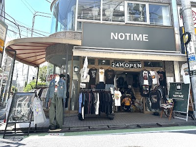

- **Place ID:** `ChIJ3dW4JQDzGGARRqcRBSeCqv0`
- **Address:** Japan, 〒155-0031 Tokyo, Setagaya City, Kitazawa, 2-chōme−19−１７ サザン石井ビル
- **Overall Rating:** 4.9 ⭐
- **Review Summary:** {'text': "Visitors say this vintage clothing store offers a wide and unique selection of well-curated items, including jackets, sweaters, and American brands. They also highlight the reasonable prices and the store's cool, welcoming atmosphere. Guests mention the staff are friendly, helpful, and provide excellent service.", 'languageCode': 'en-US'}
- **Amenities Summary:** Accessibility: {"wheelchairAccessibleParking": false}
#### Top 10 Positive Reviews:
- 5 Stars: Love the place so much, the shop has a lot of winter wear and will for sure come back again to get more jackets in the future.
- 5 Stars: Great thrift! Found some cool pieces.
- 5 Stars: Found some dope stuff for a great deal! Love this place!
- 5 Stars: So nice, came in and shopped right away.
- 5 Stars: Got a very cool Yamaha jacket here (although it was a little hard to pay as the shop is sometimes unmanned)

#### Top 10 Negative/Lowest Reviews:
No negative reviews available.

---
### JR Expressway Bus Ticket
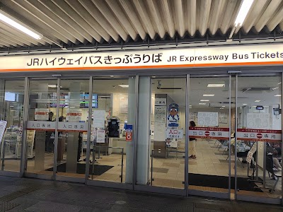

- **Place ID:** `ChIJV0pBv253A2AROGnuA65x-A4`
- **Address:** 6-4-1 Tsubakichō, Nakamura Ward, Nagoya, Aichi 453-0015, Japan
- **Overall Rating:** 3.2 ⭐
- **Review Summary:** {'text': 'Visitors say this bus terminal is helpful for waiting during bad weather, offers clear guidance for boarding, and has staff who are kind.\n\nOther reviews mention the staff can be unhelpful and the seating can be limited.', 'languageCode': 'en-US'}
- **Amenities Summary:** Accessibility: {"wheelchairAccessibleEntrance": true}
#### Top 10 Positive Reviews:
- 4 Stars: If you are going to for example Takayama. This is where the bus ticket station and waiting hall. Don’t get confused. Because there are different buses centre and train stations that can be confusing. Depending your angles, it is just in front of the BIG Camera
- 4 Stars: If you are going to for example Tokyo. This is where the bus ticket station and waiting hall You can buy the tickets here.  Because there are different buses centre and train stations that can be confusing. Depending your angles, is located in front of the Shinkansen exit of Nagoya Station make sure you don’t get the first seat same me because your feet can’t move at all
- 4 Stars: JR Tokai Bus, Nagoya Tourist Information Center  This is the second stop. The departure point is boarding area number 7 on the 3rd floor of Nagoya Bus Information Center. Those staying near the Sakura-dori exit can board at this location.  Those staying near the Taiko-dori exit can board at this station.  The bus station has four bus stops, each clearly indicating the routes. The stops have clear signage and timetables.  The ticket office, originally located next to stop number 2, is currently under renovation and has been moved to Nagoya Station (behind stop number 3).  The waiting area inside the ticket office has some seats for resting.  Toilet access is inside the station or in the underground shopping mall (the closest is the ESCA underground shopping mall, about 100 meters away).  This time, we're going to the Takayama Nohi Bus Information Center, located at stop number 2. We bought tickets and reserved seats in advance on the express bus website. The ticket price was ¥3600, but online payment was ¥3300. The bus arrived on time. Boarding was done by the bus driver scanning the QR code ticket on our phones. No need to print out paper documents. Luggage can be stored on the lower deck of the bus. There are restrooms and free Wi-Fi on board. The bus also has screens displaying the route and upcoming stops. There is a 10-minute rest stop in between. Remember the bus license plate number and board on time. Because it was a weekday, there weren't many passengers—only about 10. The bus seats can recline, and the ride is smooth enough to sleep comfortably.  There are other transportation options from Nagoya to Takayama. Taking the JR Limited Express Hida takes about 2 hours and 30 minutes. Reserved seats cost ¥5940. The journey time is about the same, but considering the price and the convenience of carrying luggage, I chose to take the express bus.

#### Top 10 Negative/Lowest Reviews:
- 1 Stars: I am confused with sakura bus stop so i asked the receptionist . He repond like 違う(repeatedly)。i know its different bus stop but i seek for help, at least he can say where i should go. Such Rude person i have never seen in Japan. Then the police person guided me and show me the correct spot.

---
### Tokyo Station
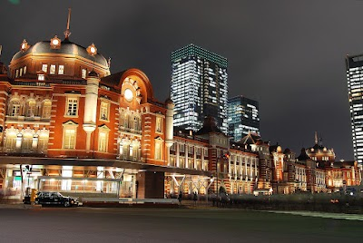

- **Place ID:** `ChIJC3Cf2PuLGGAROO00ukl8JwA`
- **Address:** 1 Chome-9 Marunouchi, Chiyoda City, Tokyo 100-0005, Japan
- **Overall Rating:** 4.3 ⭐
- **Review Summary:** {'text': 'People say this transit station offers a wide variety of shops, restaurants, and souvenirs, including regional specialties and limited-edition items. They highlight the convenient access to numerous train lines, including Shinkansen, JR, and subway, and the beautiful, historic architecture of the Marunouchi station building. They also like the helpful staff and clear signage.', 'languageCode': 'en-US'}
- **Amenities Summary:** Accessibility: {"wheelchairAccessibleParking": true, "wheelchairAccessibleEntrance": true, "wheelchairAccessibleRestroom": true}
#### Top 10 Positive Reviews:
- 5 Stars: Absolutely loved visiting Tokyo Station 🚆✨  The station itself was HUGE and honestly felt like a whole city inside 😭 There were endless shops, restaurants, cafes, souvenir stores, and underground passages connecting everywhere, which made exploring surprisingly fun even when I wasn’t taking a train.  One of my favorite parts was the beautiful red brick station building from the outside 🏛️🤍 It looked so elegant and historic, especially contrasted with all the modern buildings surrounding the area. The architecture made the station feel much more special than a regular train station.  Inside, everything was super organized and efficient despite how crowded it could get. I also loved browsing all the food and snack shops because there were SO many interesting Japanese treats, bentos, and souvenirs everywhere 🍱🍓✨ Definitely dangerous if you love shopping or food hunting 😂  The whole atmosphere felt very lively and exciting, especially knowing it’s one of the busiest stations in Japan. Even just walking around and people-watching there was an experience on its own. Definitely a must-visit spot in Tokyo whether you’re traveling around Japan or just exploring the city 🚄✨
- 5 Stars: We traveled as a family of four (2 adults and 2 kids) through Tokyo Station, taking the Shinkansen Nozomi to Osaka in Green Car reserved seats, and the experience was absolutely fantastic.  The station is immense yet impressively organized, with clear signage and helpful staff that made navigating easy even with children. Despite the crowds, everything felt smooth and efficient.  Boarding the Green Car was seamless, and the reserved seats were spacious, comfortable, and perfect for a family journey. The quiet atmosphere, clean interiors, and attentive service made the ride relaxing and enjoyable. The kids loved the excitement of the bullet train, while we appreciated the comfort and convenience.  The journey itself was fast, stress-free, and memorable — a highlight of our Japan trip.  Overall, Tokyo Station and the Shinkansen Green Car experience delivered world-class efficiency and comfort. Highly recommended for families looking for convenience with a touch of luxury.
- 5 Stars: Tokyo Station honestly surprised me more than I expected. From the outside, the red-brick building in Marunouchi looks really beautiful and almost historic, especially compared to the modern city around it.  Inside, it’s huge and definitely busy, but it’s still very well organized. Once you figure out the layout, it becomes pretty easy to move around, and everything is clearly marked even with all the different train lines and Shinkansen connections.  What I liked most is that it doesn’t just feel like a station you’ve got underground shopping, food spots, and places to just walk around if you have time between trains.  It’s hectic for sure, but in a very “Tokyo” way efficient, clean, and surprisingly smooth for how many people pass through every day.
- 5 Stars: Tokyo Station is one of those places that feels like a city within a city. The moment you step inside, you’re met with a mix of energy, order, and that unmistakable Tokyo efficiency. Trains glide in and out constantly — Shinkansen, JR lines, subways — yet everything runs so smoothly that even first‑time visitors can find their way with a bit of patience. The signage is clear, the staff are helpful, and the flow of people somehow feels organised despite the crowds.  The station is huge, but each area has its own personality. The Marunouchi side is elegant and historic, with its red‑brick façade and wide plaza. The Yaesu side is more modern and practical, packed with shops, restaurants, and entrances that lead directly into underground malls. Inside, you’ll find endless food options: bento shops, ramen alleys, bakeries, and the famous “Character Street,” where you can browse goods from popular Japanese brands and anime.  What makes Tokyo Station memorable is how much you can do without ever stepping outside. You can shop, eat, grab souvenirs, or simply wander through the clean, well‑designed corridors. Even if you’re just passing through for a train transfer, the station gives you a taste of Tokyo’s rhythm — fast, efficient, and full of small surprises. It’s a place that feels busy but never chaotic, and always worth exploring.
- 5 Stars: WOW. This is one massive Train Station. It is so clean. When I compare it to other large Cities like New York or Berlin, this Station is awesome. Never seen such a clean Subway any where in my travels. This puts other Cities to shame. It took me a while to figure out the system. I made a few errors such as going in the wrong direction and once not paying the correct fair. But there is a system in place and you can use a seperate machine to correct your ticket. Today I was not sure how to get back to Maihama Station. So I ask the conductor and he helped me out.

#### Top 10 Negative/Lowest Reviews:
No negative reviews available.

---
### Sogi-an
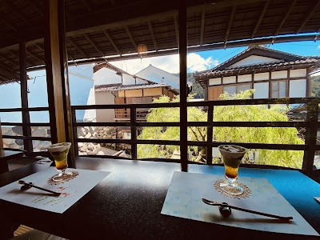

- **Place ID:** `ChIJI0kX9mnwAmARKIa3l1j3_58`
- **Address:** 862-10 Hachimanchō Honmachi, Gujo, Gifu 501-4216, Japan
- **Overall Rating:** 4.4 ⭐
- **Review Summary:** {'text': "Diners like this cafe's delicious matcha, parfaits, and other desserts, with many highlighting the unique matcha tasting experience. They also mention the peaceful, traditional Japanese atmosphere, often with views of a garden or river. Guests appreciate the attentive yet discreet staff, who ensure a relaxing and undisturbed visit.", 'languageCode': 'en-US'}
- **Amenities Summary:** Accessibility: {"wheelchairAccessibleParking": false, "wheelchairAccessibleEntrance": false, "wheelchairAccessibleSeating": false}
#### Top 10 Positive Reviews:
- 5 Stars: nice environment with all tatami seats and IGable dessert. Taste good and not too sweet. We come around 14:30 to get a seat without waiting but it was almost full around 3pm.
- 5 Stars: Visited on a Saturday afternoon and it was not that crowded. Shoes must be removed before entering. Very cozy traditional Japanese cafe. Had a relaxing tea time with desserts and tea drinks.
- 5 Stars: Stumble upon this shop on May 2025 visit. Very nice atmosphere especially that day with super nice weather, drizzle of rain. Felt at ease, enjoying the view and drinking coffee. That day only 4 of us, so can have a very nice place with good view. Dessert, drinks are so beautiful. Friendly service.
- 5 Stars: 🍨•Parfait: so tasty, many layers! Matcha then cream on top, green tea ice cream, ice puffs, shiratama mochi balls, jelly, anko, etc etc. Very satisfying! They have the regular (dancing lady) parfait or the GJ8Man character (what I got) parfait; I think they're the same, it's just the design.  🍵•Hojicha latte: not too sweet, and the right amount of milk; unlike some sweeter hojicha lattes, I could actually taste the tea. It also had a nice mouthfeel, with a proper amount of frothing for an iced latte.  💡•Atmosphere: Top. Knotch! Tatami floor seating, and 1 large table and chairs. Most seats are by a window overlooking the river/bridge/alley.  💁‍♀️Service: Friendly 😊  💴Price: certainly not the cheapest dessert in town, but I think you have to consider the atmosphere and quality. ¥1900 for my set isn't cheap, but parfaits often run high, and a similar dessert would probably be about the same in Kyoto, and this isn't the kind of place you come wanting a bargain.  📲•Menu: accessed via QR code and ordered on your phone.
- 4 Stars: This Tea house is perfectly located with stunning views. The parfait was delicious. We did have a small problem with the service which became quite an amusing anecdote of the trip; a waitress was talking with a customers behind us (we were the only other customers in the place). The customer was quite upset and they were speaking in Japanese. We waited for about 10mins before getting up to walk into the other part of the room to seek someone to take our order (as we didn't want to interrupt the waitress talking) As soon as we got up, the waitress recognised we were looking for someone and asked if we were ready to order. I replied in japanese, "yes, we would like to order when you're ready please". Her face was priceless as she looked back at the woman crying in horror and realizing we had heard everything they said.

#### Top 10 Negative/Lowest Reviews:
No negative reviews available.

---
### Takaragawa Onsen Osenkaku
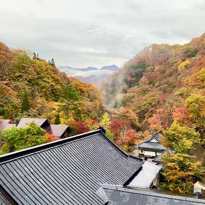

- **Place ID:** `ChIJ1RQ5vv09HmARxLIzTddSquc`
- **Address:** 1899 Fujiwara, Minakami, Tone District, Gunma 379-1721, Japan
- **Overall Rating:** 4.1 ⭐
- **Review Summary:** {'text': 'People say this onsen has magnificent outdoor baths with stunning river and mountain views, and appreciate the provided bathing garments for mixed-gender pools. Guests also highlight the delicious traditional Japanese meals and the convenient complimentary shuttle service from the train station.\n\nSome reviews mention the facilities can be poorly maintained.', 'languageCode': 'en-US'}
- **Amenities Summary:** Accessibility: {"wheelchairAccessibleParking": false, "wheelchairAccessibleEntrance": false}
#### Top 10 Positive Reviews:
- 5 Stars: This Onsen was the highlight of our Japan trip. We went the first week of November at the peak of fall colors and I couldn't believe how beautiful it was. Our room was right above the river and we had such a good view. The indoor and outdoor baths were clean and lovely to enjoy. I could not give this location a higher recommendation. The service and respect from the staff was top notch and we really enjoyed staying there. Having everyone in Yukatas was an added bonus - really added to the theme.  Some notes as mentioned in other reviews: 1)They only serve breakfast and dinner so you'll want to either bring cash to buy some ramen from the gift shop or bring some food in for lunch. 2)Yes they could dust more and get of some of the cobwebs on the ceilings. I'm tall and there were many short beams and ceilings I had to duck under. Hit my head a fair amount of times and had some cobwebs in my hair lol 3)They do not have western style beds and you sleep on a few tatami mats with comforters. I don't have an issue with these sleeping arrangements, but just something to note if you are more comfortable sleeping on softer surfaces  Overall - very relaxing and enjoyable experience. I would recommend going in fall/winter to avoid bugs (Nov - Mar).
- 5 Stars: We stayed here for two nights in mid-November—my sister, my 1-year-old baby, and myself—and absolutely loved our experience. The ryokan is older, but everything is clean and well maintained. The staff were truly wonderful and went above and beyond for us. Because the property was fully booked, we weren’t able to stay in the same room for both nights. The ryokan has three buildings with different room types: one with a toilet and shower, one with only a toilet, and one with neither, so be sure you know which one you’re reserving. We had a room with a toilet and shower on the first night and a room with only a toilet for the second. Honestly, having a shower in the room isn’t really necessary since you’ll probably spend most of your time enjoying their five beautiful onsens, where you can shower as well. We had to switch rooms after the first night, and this is where the staff really shined. Although check-out is normally at 10 a.m. and check-in at 2 p.m., they prioritized cleaning our second room so we could move in right away. We checked out at 10 and were in our new room by 10:30. Traveling with a baby, we were so grateful for the thoughtful touches: without us even asking, the staff provided a high chair, a bowl of rice with condiments, water, and baby dishes and utensils. Their attention to detail was incredible. The rooms are beautifully positioned along the river, and the entire ryokan has such charming character. We truly loved our stay and would happily return.
- 5 Stars: We very much enjoyed our stay. We were greeted by attentive staff, most of them speak in english but knowing a bit japanese is helpful (and you make them happy so why not). The rotenburo has amazing views and is very calm at the good times. The rooms are very spacious and while some complain about the cleanness, honestly, it was clean and the retro vibes are its charm! On another note, if you are a tourist, learn beforehand the onsen rules! The staff will kindly answer your questions about the food, how to wear a yukata... But please be respectful of the way to be, it can be very displeasing for the other guests and staff.
- 5 Stars: Beautiful, rustic onsen royokan in the mountains. For guest convenience, the onsen provided a free (prebooked) shuttle from Jomokogen station to the onsen (25 min ride). At the royokan, the staff provided Yakatas to wear around the property and bathing clothes for the mixed baths. Our room, Sakura 311 was a beautiful corner room with full view of the river and trees. We slept comfortably and cozily on mattesses on the tatami floor lulled by the sound of rushing water. Breakfast and dinner were in the main banquet area and were traditional Japanese fare. Outside there were 3 mixed bath options and one outdoor womens only bath. The baths were hot, had plenty of rocks for seating, and even tho it got busy, never felt crowded. Of note, if you get antsy easily, there isnt much to do other than enjoy the baths and relax and eat yummy foods. Two days for us were perfect but if youre a constant on the go traveling, one solid night is perfect as well.
- 4 Stars: Overnight stay. Friday night leaving Saturday My impression of the journey to the Onsen 1. Getting picked up from the train station was a great plus- no additional cost. A great courtesy. 2. About 45 minutes from the train station to the Onsen- the scenic views including waterfall, river and mountain made the ride worth it. 3. The roads are mountainous and narrow, not for the faint of heart. But overall I felt safe. driver was very cautious and experienced. 4. Upon arrival- the facility looked very much like a traditional Japanese structure. The staff was lined up at the entrance waiting- guests were greeted with a bow and a nice smiles. Then Once inside you were invited to take off shoes and invited to take an indoor slippers after which you went to the reception area. The staff at the reception area were not Japanese per appearance they  looked more European but spoke and acted like Japanese. Head front desk person gave us instructions, he was not mean, he was not nice, he simply was- doing his role as front desk, I didn’t feel offended, however, I can understand why some guests would review him as rude. I didn’t see that. You were given gives robes to roam about in and a swim cover for those that planned  to use the coed onsen. I won’t give everything a way because part of the wow factor is seeing everything yourself for the first time. The room I had was super awesome-clean and perfect. The food was an experience in and of itself. I won’t give to much away because again I think part of the allure is seeing and experiencing it for the first time one’s self. You do have an option of coed onsen outside and women only onsen inside also men’s  only onsen inside. Tattoo- I was not asked about tattoos when I checked in, so I can’t speak on that.  One recommendation I would make is to- Bring an extra towel if you can- you are given a towel but after it gets wet, that’s it, each time you go to the Onsen it’s wet cold towel for you. No dryer offered onsite. PS- cameras are not allowed in onsen, I also have pictures of the meal but sticking to my stance not to give too much away, I won’t post them here. I believe that a huge part of the mystery and appeal is seeing and experiencing this place for the first time in the flesh.  Would I recommend it Yes. However, let me say, if you don’t have appreciation for old things, THIS IS NOT FOR YOU. Old world charm is an acquired taste. Happy Exploring!

#### Top 10 Negative/Lowest Reviews:
No negative reviews available.

---
### Canyons キャニオンズ
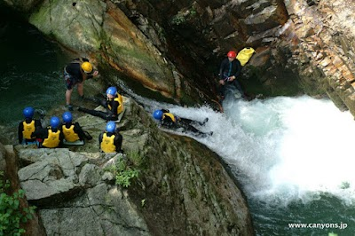

- **Place ID:** `ChIJUeEp5kYUHmAR0AolF0JkqdU`
- **Address:** 45 Yubiso, Minakami, Tone District, Gunma 379-1728, Japan
- **Overall Rating:** 4.8 ⭐
- **Amenities Summary:** Parking: {"freeParkingLot": true, "paidParkingLot": false, "freeStreetParking": false, "paidStreetParking": false, "freeGarageParking": false, "paidGarageParking": false}
#### Top 10 Positive Reviews:
- 5 Stars: Me and my wife an am amazing experience. The staff were friendly and knowledgeable. We felt safe the entire time while also having a thrilling experience. If you find yourself craving a little bit of of the outdoors and a bit of adrenaline then this is a great way to spend the day. Big shout out to Tom who made our adventure special and fun.
- 5 Stars: The most important things for rafting is safety, and you can see the whole team a very professional, we are rafting with two boats, and there are one guy to escort us along the whole journey to ensure our safety. Our guy Sam is a mixed, and native in both English and Japanese, so communication is not a problem, the whole journey goes through an extremely scenic gorge, the best rafting experience ever
- 5 Stars: We loved the canyoning and packrafting with Canyons! Packrafting down the small rapids was fun and surprisingly manageable. Our guides Daiki, Ashok, and Adam were great! Thanks for accommodating our last minute booking for the packrafting, and we also appreciated the hotel pickup and dropoff.
- 5 Stars: We had a full day of fun of river Canyon Fox plus and River rafting. The staff was great and helpful. Would definitely recommend to do this activities and really experiencing something you never did before Will certainly do it again!!
- 5 Stars: We had an amazing experience with Canyons. This is a well-run company that provides great service and great experiences. We took the Whitewater Rafting/Canyoning combo experience in Minakami and loved it. Our guides were awesome and it was the highlight of our Japan trip. Highly recommend Canyons. They take care of everything.

#### Top 10 Negative/Lowest Reviews:
No negative reviews available.

---
### | Shinkansen to Osaka, check-in, neon-lit street food tour of Dotonbori | Joetsu + Tokaido Shinkansen (approx. 4.5h total) |
| (Search Failed)
- No Place ID found.

---
### Universal Studios Japan

- **Place ID:** `ChIJXeLVg9DgAGARqlIyMCX-BTY`
- **Address:** 2-chōme-1-33 Sakurajima, Konohana Ward, Osaka, 554-0031, Japan
- **Overall Rating:** 4.5 ⭐
- **Review Summary:** {'text': 'Visitors say this theme park offers incredible, immersive themed areas like Super Nintendo World and The Wizarding World of Harry Potter, along with thrilling rides such as The Flying Dinosaur and Hollywood Dream. They also highlight the friendly and helpful staff, who contribute to a vibrant atmosphere. Guests mention that purchasing an Express Pass is highly recommended to manage long wait times and maximize the experience.', 'languageCode': 'en-US'}
- **Amenities Summary:** Parking: {"paidParkingLot": true, "paidStreetParking": true} | Accessibility: {"wheelchairAccessibleParking": true, "wheelchairAccessibleEntrance": true, "wheelchairAccessibleRestroom": true, "wheelchairAccessibleSeating": true}
#### Top 10 Positive Reviews:
- 5 Stars: This park is amazing we had a blast and would even come back on another trip to Japan. We went on a cloudy day after a typhoon had just passed so it wasn’t crowded at all. The Hollywood and Flying Dinosaur coasters where the most thrilling in our opinion. The Harry Potter one and Minecraft madness were also pretty cool.  The park has many food options that taste very good and aren’t overly expensive compared to other attraction parks.  The opening hours can change depending on the weather so I’d recommend checking on the official website on the same day before going.  The personal at the park are very kind and smiley, making you feel welcomed all the time.  There are multiple other activities besides rollercoasters so smaller kids can also enjoy this place.
- 5 Stars: A very fun and enjoyable experience. The rides were fun, every staff member was polite, friendly, and made it their mission to show they were happy to see you. If they were having a rough day, you would never know because of how happy they were. I really enjoyed the Flying Dinosaur. The only really good ride I didn't get to ride was the Hollywood Dreams ride. Toad's Cafe (called Kinopio Cafe) was very good as well. Butterbeer is definitely worth a try. It is non-alcoholic, so even kids can enjoy it. The experience can become expensive though, especially if you decide to buy a bunch of merch and souvenirs. Everything is quite pricey considering what you're getting. I focused on getting souvenirs that I'd actually use rather than merch that I thought looked cool. Everything was enjoyable. Inclement weather did come and caused the DK Minecart ride to shut down for a while and I waited in line for a good while, but the ride was very enjoyable. My favorite part of the park though was The Wizarding World of Harry Potter. Hogwarts was exceptional to see and the Forbidden Journey ride inside was really fun and I'm not even a big Harry Potter fan. So, even if you're not a Harry Potter fan, you can't help but appreciate the attention to detail and the work that went into bringing the place to life. Definitely worth the admission.
- 5 Stars: Universal Studios Japan is an absolutely fantastic theme park and an essential destination when visiting Osaka! The entire park is filled with incredible energy, and the immersive vibe makes you feel like you've stepped straight into the movies. A major highlight is the Wizarding World of Harry Potter, which is beautifully detailed and captures the magic of the films perfectly. Equally spectacular is Super Nintendo World, an amazingly interactive area where you feel completely fully immersed in a real-life video game. Both zones offer stunning attention to detail, incredible rides, and a wonderful atmosphere that fans will absolutely love. While the park gets exceptionally popular and crowded, the world-class entertainment, brilliant themes, and joyful vibe make it an unforgettable experience!
- 5 Stars: The best and most magical day.  Even though it doesn’t open until 9am, we got there at 7am to queue. We were glad we did as the waiting area was already close to full. At 8:30am they opened security to the actual gates, and 9am they opened the actual park.  We mainly visited Harry Potter world and it was AMAZING!! I would highly recommend for all Potterheads and enthusiasts! The interactive Wands are really good and the whole experience is amazing! We also visited Jurassic World and the Super Nintendo world and had a great time!  You do have to be patient with the queues, the Mario Kart one was a two hour wait or 80 minutes for a single rider, and it was similar times at all rides,  but so worth it!  The shop boutiques are great and the food is fair and what you would expect for a theme park.
- 5 Stars: Universal Studios Japan was a beautiful and fun themed day. We spent the morning exploring the park and the afternoon in Super Nintendo World, which was incredibly immersive and well designed. There are so many interesting activities and rides, making the whole experience exciting from start to finish. We chose not to pay the very high price for express passes to skip the lines. Personally, I don’t feel it’s fair to pay so much extra to avoid queues, especially when you don’t truly know what the attractions are like before arriving, unless you research everything in advance, which takes away some of the magic. So we took our time, queued calmly for the rides we were most interested in, and still had a fantastic day.

#### Top 10 Negative/Lowest Reviews:
No negative reviews available.

---
### GHOST
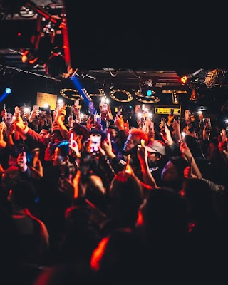

- **Place ID:** `ChIJDUzU0RHnAGARwuUicS6IiGI`
- **Address:** Japan, 〒542-0086 Osaka, Chuo Ward, Nishishinsaibashi, 2-chōme−17−３ 心斎橋アルティ・イン B1F
- **Overall Rating:** 4.3 ⭐
- **Review Summary:** {'text': 'Visitors say this club features excellent music, especially hip-hop and R&B, with DJs who keep the energy high. They also highlight the electric atmosphere, stylish interiors, and professional security and bar staff. Guests mention the diverse crowd, reasonable drink prices, and the ability of staff to speak English well.', 'languageCode': 'en-US'}
- **Amenities Summary:** Parking: {"freeParkingLot": false, "paidParkingLot": false, "freeStreetParking": false, "paidStreetParking": false, "valetParking": false, "freeGarageParking": false, "paidGarageParking": false} | Accessibility: {"wheelchairAccessibleEntrance": false}
#### Top 10 Positive Reviews:
- 5 Stars: Atmosphere was great, the DJs knew the mood, I just got hooked on two redbulls one for each wing. Then finished it with just natural water. And that was all I needed to have a good time. But you probably should bring a jacket though. This cold.  🥶
- 5 Stars: Aside from some funny Gen Z moments and the occasional gold digger vibe (yeah, I’m getting old 😄), we had an amazing evening. We were treated very professionally and courteously in the VIP lounge. If you enjoy urban music, this is definitely the right place to be. Thanks again to the entire Ghost staff!
- 5 Stars: Club Gala is hands down one of the best clubs I’ve visited in Osaka. From the moment you walk in, the atmosphere is electric—stylish interiors, top-tier lighting, and a sound system that hits perfectly without being overwhelming. The music selection is excellent, with DJs who really know how to read the crowd and keep the energy high all night long. The staff deserves special praise. Security is professional and respectful, bartenders are fast and friendly, and the overall service makes you feel welcome whether you’re a local or visiting from abroad. Drinks are well-made and reasonably priced for the quality and vibe of the club. What really sets Club Gala apart is the crowd—fun, diverse, and energetic. It’s easy to meet people, dance freely, and genuinely enjoy the night without any uncomfortable moments. The dance floor stays lively, and there’s never a dull moment. If you’re looking for a premium clubbing experience in Osaka with great music, great people, and a fantastic atmosphere, Club Gala is a must-visit. I’ll definitely be coming back whenever I’m in the city!
- 5 Stars: I had a fantastic time celebrating my birthday at this club. The staff was friendly and welcoming, and the music was amazing. If you're visiting from out of town and want to experience a great club, this is a must-visit spot! The only drawback of the place was the strong smell of smoke.
- 4 Stars: I had a time! There was a very mixed crowd here. People from all over the world, partying together to mostly American music. There was hip hop, reggaeton, afrobeats, pop. The night I went, on a cold Friday in January, there were discounted entry and drink tickets. The free, pre-made drinks on tap were pretty good considering. Despite the blast I had, I gave it only four stars because of the smoke. People smoked inside, and I walked out smelling like an ashtray. My new coat still reeks one week later. If you can't take that smell, you've been warned.

#### Top 10 Negative/Lowest Reviews:
No negative reviews available.

---
### Aman Tokyo
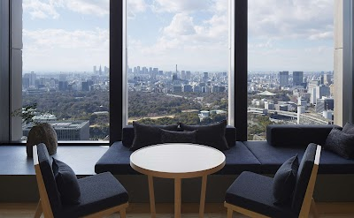

- **Place ID:** `ChIJfV9KdPiLGGARn4ma2GUEoJo`
- **Address:** The Otemachi Tower, 1-chōme-5-6 Ōtemachi, Chiyoda City, Tokyo 100-0004, Japan
- **Overall Rating:** 4.4 ⭐
- **Review Summary:** {'text': 'Guests mention this hotel offers spacious rooms with stunning city views, including Mount Fuji, and a serene, luxurious atmosphere with Japanese-inspired design. They also highlight the exceptional service from attentive staff who anticipate needs, and the well-equipped gym and beautiful, uncrowded pool. Many also praise the delicious and artfully presented afternoon tea and breakfast options.', 'languageCode': 'en-US'}
- **Amenities Summary:** Accessibility: {"wheelchairAccessibleParking": true, "wheelchairAccessibleEntrance": true}
#### Top 10 Positive Reviews:
- 5 Stars: Really nice spa overall. The space is beautiful and very calm, you immediately feel more relaxed when you walk in. Everything was clean and well organized, and the staff were polite and professional without being too much.  The treatment itself was good and did the job, nothing mind-blowing but definitely enjoyable. It’s the kind of place you go to unwind and switch off for a few hours, and it delivers on that.  Not cheap, but you’re paying for the whole experience and setting. I’d come back.
- 5 Stars: An exceptional stay at Aman Tokyo. The architecture, atmosphere, and attention to detail are truly world-class – calm, refined, and effortlessly elegant. Service was impeccable, striking the perfect balance between professionalism and warmth.  One minor detail that felt slightly below the usual Aman standard was the absence or quality of the Pyjamas, which didn’t quite match the otherwise flawless experience.  Overall, a remarkable property and without a doubt one of the most impressive stays in Tokyo.
- 5 Stars: Staying at Aman Tokyo is an exceptional luxury experience that blends the serene Aman resort style with modern Tokyo elegance. The hotel features refined design inspired by Japanese tradition, breathtaking city views, spacious and peaceful rooms, and impeccable service. Every detail reflects exclusivity and calm, making it a perfect choice for travelers seeking privacy and refined luxury in central Tokyo.
- 4 Stars: I stayed for a week in Aman Tokyo in the middle of December.  I've gone back and forth about whether I should post a review or not simply because a hotel like Aman Tokyo is in it's own world of hotel... in the sense that what you expect out of Aman shouldn't be the same as what you expect from an average hotel.  But I'll try my best to explain how I view Aman Tokyo as someone in a position where staying at an Aman would be considered as a very financially irresponsible decision.  tl;dr - You're paying for the service, not the hotel itself.  If this is how you want to spend your money, Aman is a 10/5.  If you value the room the most, the money to value ratio is stronger at many other hotels, including their sister hotel Janu.  Personally, I wish I could give it a 4.5/5 on Google but I can't so I'm rounding down to a 4.  The main reason would be the hotel room itself (I originally booked their Tokyo Suite but was upgraded to a Garden View Suite), so I'll talk about the room first.  I'll also say I booked through a luxury travel advisor, so a lot of things such as the room upgrade may be because of that, but I will never know for sure. For paying top dollar, I would expect the room to reflect the price, no matter how strong the reputation of the hotel is.  Don't get me wrong, the room at Aman Tokyo was very nice.  Extremely spacious, wonderful design, and great features like heated floors in the bathroom, one of the better beds in Japan, and some of the best blackout curtains for those who want to sleep in.  But some of the fixtures were a bit old, such as the bathroom and the room control console.  It's a bit unfair of a comparison because it's a new hotel, but their cheaper sister hotel Janu was much more modern while offering the same comforts and spaciousness in the room.  Housekeeping did a great job of keeping snacks and the mini-bar stocked, and I especially loved the bottles of juice, but they still paywalled certain things like alcoholic beverages.  Meanwhile I've stayed at a few $150-$200/n hotels in Japan that had it for free.  Was it just generic brand beers at those hotels?  Sure, but again, at the price point of Aman being asked to pay for a bottle of beer feels really weird, at least to me.  That being said, everything else about the Aman was either the best or tied for the best I've experienced in Japan, and this is truly where the value is... although this obviously won't apply or be relevant to most people.  Their staff is absolutely amazing and they seem to look for opportunities to go above and beyond for you, whether it's gifts or services.  When I was asking about transportation to the airport for my departure, the front desk extended my late checkout by half a day since my flight was at night, and before my stay they asked me about my flight into Tokyo and lo and behold, my room was ready for me even though I arrived in the morning and not during their regular check in time.  Every request I asked of concierge was responded to quickly and perfectly, and the best part was the concierge desk was always staffed and available.  Food and drinks at the Lounge were great and surprisingly priced comparably to other hotels (expensive, but mostly because you're eating in a hotel).  Musashi was also a fantastic omakase experience and again, comparably priced to other high-end omakase in Japan.  Spa and boutique staff were incredibly accommodating and patient as I was shopping for gifts and helped explain everything I had questions about while also giving me some great recommendations, not to mention the spa services I booked were some of the best I've experienced in the world.  The breakfast was a bit more limited than say a breakfast buffet at a chain hotel, but I felt the menu was expansive enough and they handle customization requests very well.  So in summary, the service is world class, and the rooms felt a bit lacking purely because of the price point.  If you are willing to spend a premium for that service, Aman Tokyo is one of the best hotels in Japan.

#### Top 10 Negative/Lowest Reviews:
- 1 Stars: I was excited to see the Aman Tokyo today and explore it for a future, planned trip with my family.  My son and I visited today (we are staying elsewhere on this trip), and thought it would be nice to have some drinks and appetizers in the Aman Lounge (Lobby area) while we visited.  Unfortunately, one of the employees asked if he could help us while we were waiting to be seated.  I told him we wanted to get some drinks and snacks.  He asked for our room number and I told him we were just visiting.  He said the lounge was open only to guests staying at the hotel.  The website says it is open to guests and non-guests (subject to availability).  The lounge was basically empty, but the gentleman did not even say it was subject to availability, he only said in a very firm and unfriendly manner that it was for guests staying at the hotel only.  The website should be updated if that is the case.  Needless to say, I won’t be planning to stay there in the future.  Thank you.

---
### MIMARU Tokyo Hatchobori
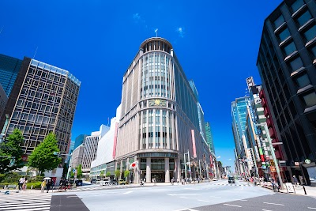

- **Place ID:** `ChIJOb6GcxGJGGARY4qiD7bmePI`
- **Address:** 3-chōme-8-8 Nihonbashikayabachō, Chuo City, Tokyo 103-0025, Japan
- **Overall Rating:** 4.8 ⭐
- **Review Summary:** {'text': 'People say this hotel offers spacious, clean, and well-equipped rooms, including popular Pokemon-themed options and bunk beds, perfect for families. They also highlight the convenient location near multiple subway stations and Tokyo Station, making it easy to explore the city. Guests consistently praise the staff for being exceptionally friendly, helpful, and fluent in English.', 'languageCode': 'en-US'}
- **Amenities Summary:** Accessibility: {"wheelchairAccessibleEntrance": true}
#### Top 10 Positive Reviews:
- 5 Stars: This was another excellent stay at Mimaru Tokyo Hatchobori. The apartment-style rooms provide plenty of space, which is an absolute lifesaver when traveling as a family. Having a kitchenette makes morning routines so much easier, and the overall layout gives everyone enough room to comfortably rest after a long day of sightseeing. The staff were fantastic as always, and the location is incredibly convenient for getting around the city without too much hassle. I highly recommend it to anyone looking for a practical and spacious base in Tokyo.
- 5 Stars: This hotel was a very comfortable place for our family to rest during a trip with a lot of walking. We were able to relax well, and we would definitely choose Mimaru again the next time we visit Japan.  All of the staff were very kind and helpful, which made our stay even better. The only small downside was that the water pressure in the shower was a bit weak, but overall it was such a satisfying and relaxing stay that it more than made up for it.  Thank you very much.
- 5 Stars: Had a very enjoyable stay at Mimaru Tokyo Hatchobori! Room was expensive but worth the price point, very spacious and clean, functional for a family of four with 2 toddlers. The kids had fun playing bath tub almost every other night. Location was great, near a few subway stations within 5mins walk. Staff was super friendly, we are always greeted by them when we walked in or leave the premises. The kids had so much fun playing the Christmas game & claiming their gifts organised by the staff. Overall a wonderful stay! :)
- 5 Stars: Our stay at Mimaru Tokyo Hatchobori will forever be memorable, not just because of the comfortable space, but because of the incredible people.  We were travelling as a family of four and the room was wonderfully spacious, clean, and thoughtfully designed, making it so comfortable and convenient for our family. The location is great and everything about the stay felt easy and family friendly.  What truly stood out, though, was the exceptional kindness of the staff. We encountered a stressful situation during check-in when we realised we had left our passports behind at our previous hotel. Riri and Sandra immediately stepped in and went far beyond their call of duty. They listened, stayed calm with us, and actively looked for solutions. Sandra even reached out to her personal contact to help retrieve our passports, something we never expected and will never forget.  Because of their initiative, care, and genuine kindness, what could have been a travel disaster turned into a moment of deep gratitude and relief. We are so thankful for Riri and Sandra, and for the heart behind the service at Mimaru.  We would absolutely stay here again and highly recommend Mimaru Tokyo Hatchobori to families looking for a comfortable, convenient, and truly caring place to stay in Tokyo.  Thank you for making our stay so special.  Anson + Serene Singapore
- 5 Stars: We are a family of four and we had a wonderful experience at this branch of Mimaru hotels!  When we arrived, the reception crew was very courteous and answered all our questions. Check-in was pretty straightforward, loved the tablet presentation. Checkout was even more straightforward and genuinely fun thanks to the guys at reception 🤩  The room itself was very spacious and meticulously clean, bed were comfy, kitchen had all necessary amenities and I was pleasantly surprised it had two induction plates that were pretty strong!  The hotel’s location is pretty good, there is a two minute walk to a big convenience store which has vegetables, wide variety of frozen goods etc. pretty close to hatchobori station so you can travel pretty much anymore in Tokyo.  Will def get back to Mimaru!

#### Top 10 Negative/Lowest Reviews:
No negative reviews available.

---
### MIMARU TOKYO STATION EAST
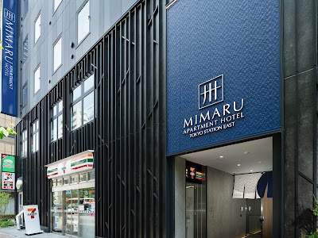

- **Place ID:** `ChIJJ3emEaGJGGAR2lIJ9aFffxU`
- **Address:** 1-chōme-12-8 Hatchōbori, Chuo City, Tokyo 104-0032, Japan
- **Overall Rating:** 4.8 ⭐
- **Review Summary:** {'text': 'People say this apartment-style hotel offers spacious, clean rooms with kitchenettes and in-room laundry, ideal for families. They also highlight the convenient location near multiple train stations and a 7-Eleven on the ground floor. Guests mention the staff are exceptionally friendly, helpful, and provide excellent service.', 'languageCode': 'en-US'}
- **Amenities Summary:** Accessibility: {"wheelchairAccessibleEntrance": true}
#### Top 10 Positive Reviews:
- 5 Stars: Comfortable, practical, luxurious, peaceful and simply the best hotel stay. For context; we are family with 2 toddlers, 3 teenagers and 3 adults. The connecting apartment room is perfect arrangement . Location to public transport and konbini (3 different ones) are definitely a huge positives. Finally the customer service puts the cherry on top for what a fabulous experience we had. They are especially caring and accommodating even though we are a large group. Definitely would stay here again
- 5 Stars: We had a wonderful experience during our stay. The one bedroom apartment is great, large and clean. It is the perfect choice travelling with a toddler. He has really enjoyed it!The staff were super nice and efficient solving any issues and providing information. A five star stay!
- 4 Stars: Great love.  15-18 min walk to Tokyo station. Not a lot of good places to eat around there, but just short walks to subways to major tourist areas. Rooms were clean and two separate rooms and bathrooms were a plus for a family of 4.  Only negatives were beds were hard as a rock and pillows not fluffy either.  Other than that, great place to stay with a washer in our room.
- 4 Stars: My stay at MIMARU TOKYO STATION EAST was one of the most comfortable and practical accommodation experiences I had in Tokyo. It felt less like a typical hotel and more like a thoughtfully designed apartment space, perfectly suited for travelers who want extra room, flexibility, and convenience.  One of the biggest highlights was the spacious layout. Compared to many hotels in central Tokyo, the room felt significantly larger and much more functional. Having a separate living and sleeping area made a huge difference, especially for relaxing after long days of exploring the city. The additional space made it easy to unpack, organize luggage, and simply feel at home.  The room was also extremely clean and well-maintained. Everything felt modern, minimalistic, and intentionally designed for comfort. The beds were comfortable, and the overall environment was quiet, allowing for restful nights even in a busy urban area.  The location was another strong advantage. Being near Tokyo Station East provided excellent access to major train lines and made it very easy to travel around Tokyo or take day trips to nearby cities. At the same time, the surrounding neighborhood felt calm and less chaotic than some of the more crowded tourist districts.  What I appreciated most was how well the hotel caters to families and groups. The apartment-style setup, with multiple beds and flexible living space, makes it especially ideal for shared stays. It removes the feeling of being cramped, which is often a challenge in Tokyo accommodations.  The staff were also friendly, professional, and helpful throughout my stay. They provided clear information, assisted with check-in smoothly, and were always available when needed. Their hospitality added a reassuring and welcoming touch to the experience.  Overall, MIMARU TOKYO STATION EAST exceeded my expectations. It offered space, comfort, convenience, and excellent functionality in a prime location. I would highly recommend it to families, groups, or anyone looking for a more relaxed, apartment-style stay in Tokyo, and I would gladly stay here again on a future trip.

#### Top 10 Negative/Lowest Reviews:
No negative reviews available.

---
### Shibuya
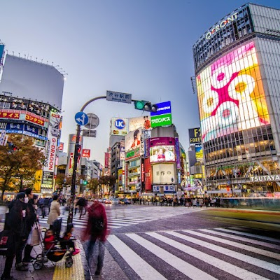

- **Place ID:** `ChIJ0Qgx67KMGGARd2ZbObLZHPE`
- **Address:** Shibuya, Tokyo, Japan
- **Overall Rating:** N/A ⭐
#### Top 10 Positive Reviews:
No positive reviews available.

#### Top 10 Negative/Lowest Reviews:
No negative reviews available.

---
### kakimori
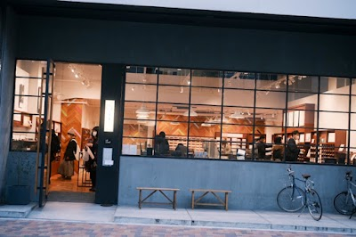

- **Place ID:** `ChIJYzGkb7eOGGARNSIHlHC_mbY`
- **Address:** Japan, 〒111-0055 Tokyo, Taito City, Misuji, 1-chōme−6−２ 小林ビル
- **Overall Rating:** 4.5 ⭐
- **Review Summary:** {'text': 'People say this stationery store offers a wide selection of pens, inks, and paper products, and highlight the fun experience of creating custom notebooks. They also mention the calm and stylish atmosphere, as well as the helpful and polite staff.', 'languageCode': 'en-US'}
- **Amenities Summary:** Accessibility: {"wheelchairAccessibleParking": false, "wheelchairAccessibleEntrance": true}
#### Top 10 Positive Reviews:
- 5 Stars: Kuramae is such an underrated place in Tokyo; cute cafes, shops abound with lots of character!  This is one such place; a stationery shop offering customised notebooks.  We each had notebooks customised with the covers, papers, spine and pen holders. Super cute, and the notebooks can be topped up with new papers for 300¥. 😍  We also browsed to our hearts’ content and bought a couple of pens with refills. 🥰
- 5 Stars: Had a wonderful experience with inkstand today. I had read online about the custom ink workshop it is 5500 yen and it comes with a bottle of ink included. It was a Tuesday and I showed up at 11 am when they opened and it was basically a private class. Naomi did my workshop- she was very kind. We did have to use Google Translate but the handouts were also supplied in English. She went above and beyond so I would highly recommend!
- 5 Stars: Self confessed stationary nerd and am so happy to have wondered into Kakimori.  Papers, bindings, inks and pens.  I am loving my new frost fountain pen.  Service was great, good selection of everything, I enjoyed the ink mixing suggestions, cool place.
- 5 Stars: Incredible experience where you get to design your own notebook - from the covers, paper to the fastenings. All for around £20. Was such a beautiful shop full of the best quality products. Could have spent all day in here.  A lovely touch - Whilst you wait for your notebook to be bound, they give you a little map with coffee shops nearby to visit. We went to Dandelion chocolate which was delicious.
- 5 Stars: Really nice store with their own brand of pens. Staff packs your purchase very nicely.

#### Top 10 Negative/Lowest Reviews:
No negative reviews available.

---
### Ginza Itoya

- **Place ID:** `ChIJKQAKAOSLGGARwGhpOXWgfYo`
- **Address:** 2-chōme-7-15 Ginza, Chuo City, Tokyo 104-0061, Japan
- **Overall Rating:** 4.4 ⭐
- **Review Summary:** {'text': 'People say this stationery store offers an extensive selection of high-quality items, including unique pens, notebooks, and art supplies across multiple themed floors. Visitors also highlight the helpful and knowledgeable staff, who provide excellent assistance. They also like the convenient on-site cafes and gift-wrapping services.', 'languageCode': 'en-US'}
- **Amenities Summary:** Parking: {"freeParkingLot": false, "paidParkingLot": false} | Accessibility: {"wheelchairAccessibleParking": false, "wheelchairAccessibleEntrance": true}
#### Top 10 Positive Reviews:
- 5 Stars: Itoya Ginza was honestly one of the most unexpectedly enjoyable places I visited in Tokyo. Even if you’re not heavily into stationery, the store is so beautifully designed and organized that it’s easy to spend a long time just browsing around.  Each floor has its own theme, with everything from high-end pens and notebooks to art supplies, travel accessories, and unique Japanese paper products. The quality and attention to detail in everything they sell is incredible.  The atmosphere feels calm and refined despite being in busy Ginza, and the staff were very polite and helpful. It’s the kind of place where you end up buying things you didn’t even know you wanted.  Definitely worth visiting if you appreciate good design, creativity, or simply want a different shopping experience in Tokyo.
- 5 Stars: Ginza Itoya is a massive stationery store located on Ginza’s main shopping street. Spanning 12 floors, it offers an impressive selection of products for writing, painting, decorating, and more. Everything is beautifully displayed, making the store a pleasure to explore. I really enjoyed visiting, even though I didn’t buy anything this time. Highly recommended !!!
- 5 Stars: It is truly the one stop holy grail shop for anything stationary.  Do note that for tourists, the tax-free amount is higher than the 5500 yen minimum spending. Instead, it was nearly the double, at least 100 000 yen (I cannot remember the exact amount).  You'll see most trafic on the "Work" floor, home of the prized and common gel\ballpoint pens. Do try to arrive with a plan to beam straight to your purchase of choice and don't hesitate to avoid lines at the cash register by just switching floors.
- 4 Stars: ​Ginza Itoya is a breathtaking 12-story vertical wonderland that is truly an artsy person’s dream. With eight floors of stationery heaven, it offers everything from artisanal papers to precision fountain pens in a beautifully curated space. ​Why You’ll Love It: ​Creative Bliss: Each floor is a deep dive into craft, color, and design. ​The Escape: Above the retail floors, you’ll find serene lounges and a cafe, perfect for testing out your new supplies over a coffee. ​Analog Magic: It’s a tactile, inspiring retreat from the digital world. ​If you’re in Tokyo, this is a must-visit for anyone who loves to create.
- 4 Stars: I was really happy to see that they have a good range of fountain pens, including some special ones from Sailor. I picked up a few inks too. My favorite part was the craft section because I loved seeing all the stamps and punchers. The only thing to watch out for is the area with the regular gel pens. It gets extremely crowded after 12 noon, so it is better to go earlier. There is barely any space to move around once it gets busy.

#### Top 10 Negative/Lowest Reviews:
No negative reviews available.

---
### Shibuya Sky
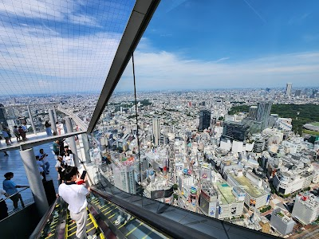

- **Place ID:** `ChIJ4Rr2JWiLGGARcyRSHuZ-9G8`
- **Address:** Japan, 〒150-6145 Tokyo, Shibuya, 2-chōme−24−１２ スクランブルスクエア 14階・45階 46階・屋上
- **Overall Rating:** 4.6 ⭐
- **Review Summary:** {'text': 'Visitors say this observation deck offers breathtaking 360-degree panoramic views of Tokyo, including landmarks like Tokyo Tower and Mount Fuji on clear days, with an open-air rooftop that feels spacious and immersive. They also highlight the well-organized entry process, efficient crowd control, and helpful staff. Guests mention the stunning sunset and night views, recommending advance booking for popular time slots.', 'languageCode': 'en-US'}
- **Amenities Summary:** Accessibility: {"wheelchairAccessibleEntrance": true, "wheelchairAccessibleRestroom": true, "wheelchairAccessibleSeating": true}
#### Top 10 Positive Reviews:
- 5 Stars: Good place to get an incredible view of Shibuya and far beyond. There’s a lot of people up top so I would encourage walking as far as you can since there are a lot of good spots for photos all around.  Something cool that they offer as well are photos from a professional for your whole group. The photos take 30 minutes to develop but it’s actually quite easy to pass even if you go inside and retrieve all your things from your locker immediately. There’s an area inside you can walk around, an interactive experience, benches, a souvenir shop, a specialty coin machine and a food court. By the time you finish with all of that your photos should be ready. You don’t have to purchase them though, once the photographer is done each group gets a minute to take as many pictures as they want in the same spot.  If it’s raining the rooftop may be closed so do be wary of that.  I think sunset is a great time to go and do recommend getting tickets in advance since it can get packed pretty easily depending on where you go.
- 5 Stars: SHIBUYA SKY is one of the most impressive observation decks in Tokyo, and it feels very different from other viewpoints because of how open and minimal it is.  From a visitor’s perspective, the experience starts inside Shibuya Scramble Square, where you move through a very controlled, timed-entry system. This is important entry slots are strict, and they don’t usually allow walk-ins, so booking in advance is almost necessary, especially for sunset times.  Once you reach the top, the transition is striking. Unlike enclosed observation decks, SHIBUYA SKY is mostly open-air, which gives you a completely unobstructed 360-degree view of Tokyo. On clear days, you can see landmarks like Tokyo Tower, Tokyo Skytree, and even Mount Fuji in the distance.  The rooftop “Sky Stage” is the main highlight. It’s a large open space with very minimal structures, designed for people to just sit, lie down, and watch the city. At sunset, the atmosphere becomes especially memorable as the lighting shifts and Shibuya below slowly turns into a sea of neon and movement.  From a practical point of view, timing matters a lot. Sunset slots are the most popular and sell out quickly, but they also offer the best experience. Night visits are also very beautiful, with the full Tokyo skyline lit up.  One useful tip: there are lockers provided before you go up, and you are required to store bags, loose items, and anything that could be affected by wind. It can get very windy at the top, so this is something to be prepared for.  Overall, SHIBUYA SKY is not just a viewpoint it’s a carefully designed experience that lets you feel the scale of Tokyo in a very direct and open way. It’s simple, modern, and visually powerful, especially compared to more traditional indoor observation decks.
- 5 Stars: Wow wow wow wow wow, It's not as modern, fancy, and high-tech as parallel observatories in western cities like New York City, but it's stunning (this is a 360° observatory: the horizon spreads dozens of kilometers away, so you can even see mount fuji on a bright, lucky day).  Pro tip: pay the extra penny for the sunset slot (so you can see the view in day light, dusk, twilight, and night time).  Good to know: you are asked yo leave your personal belongings including the very smallest bags in lockers (they are too strict so take that into account and try not to get mad).  Now, please enjoy our beautiful pictures and videos.
- 5 Stars: Back in November, my friends and I went to Shibuya Sky on a Wednesday at around 1:40 PM. We checked in, took an elevator and escalators up before we got to the top of the observation deck. Right before the top, we did need to stop by the storage room to leave our bags. There were plenty of lockers with a key on a wristband available.  The top had great views of the city and it was also a time with great lighting. There were a lot of people there at the time but there was plenty of space for walking and viewing since it was a large observation deck. As you head back down, you’ll also run into a gift shop as well. We spent roughly about an hour here.  When it comes to reserving, I highly recommend folks to look into the times well in advance. We were not able to grab a time for the ideal sunset even months before our trip. One thing to keep in mind is when you get on the observation deck, you can stay there for as long as you want.
- 4 Stars: Shibuya Sky almost lives up to the hype. Sitting high above one of the busiest intersections in the world, the observation deck gives you a completely different perspective of Tokyo, with its massive observation deck that seems almost endless in every direction.  The elevator ride up already feels cinematic with a video playing as you go up and down, but the real moment hits when you step onto the open-air rooftop. Shibuya Sky gives you an unobstructed panoramic view of the city even with the glass windows, which makes the experience feel much more immersive. On a clear day, you can spot landmarks stretching across Tokyo such as Tokyo Tower or the Skytree, and even catch Mount Fuji in the distance just before sunset.  Timing really matters here. Late afternoon into blue hour is easily the best window to visit because you get to watch Tokyo transition from daylight into a sea of neon lights. This is, however, one of the hardest timeslots to acquire, so plan accordingly. Seeing the Shibuya Crossing from above as the city starts glowing at night is one of those classic Tokyo moments that actually feels as impressive in person as it does online.  The space itself is sleek and thoughtfully designed, with lounge areas, photo spots, and enough room to move around without every corner feeling overcrowded. Staff manage the flow surprisingly well considering how popular the attraction has become, and the entire experience feels polished from start to finish.  It’s definitely one of the more tourist-heavy spots in Tokyo, but for good reason. Even people who normally skip observation decks would probably appreciate this one simply because of how open and cinematic it feels compared to most city viewpoints. However, if you're looking to secure an evening spot, there are other places that are free or less crowded that offer similar or even better views.

#### Top 10 Negative/Lowest Reviews:
No negative reviews available.

---
### CÉ LA VI TOKYO
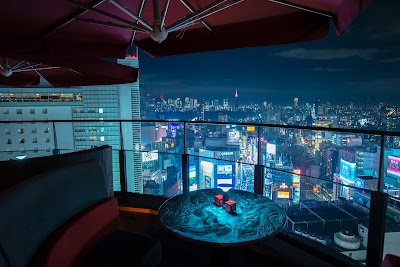

- **Place ID:** `ChIJgzpnLVCLGGARSJNqhxqG27U`
- **Address:** Japan, 〒150-0043 Tokyo, Shibuya, Dōgenzaka, 1-chōme−2−３ 東急プラザ渋谷17階 ＆18階
- **Overall Rating:** 4.3 ⭐
- **Review Summary:** {'text': 'People say this restaurant offers delicious Asian-inspired dishes, including flavorful Hainanese chicken rice and hearty soft-shell crab burgers, with many highlighting the stunning city views from the terrace. They also mention the elegant and lively atmosphere, with great music and a comfortable setting. Guests appreciate the attentive and friendly staff, who provide excellent service and make special occasions memorable.', 'languageCode': 'en-US'}
- **Amenities Summary:** Parking: {"freeParkingLot": false, "paidParkingLot": true} | Accessibility: {"wheelchairAccessibleParking": true, "wheelchairAccessibleEntrance": true, "wheelchairAccessibleRestroom": true, "wheelchairAccessibleSeating": true}
#### Top 10 Positive Reviews:
- 5 Stars: If you’re looking for an unforgettable night in Tokyo, stop scrolling and book a table at CÉ LA VI Tokyo immediately.  First, let’s talk about the view. We were lucky enough to get seated at one of the outdoor tables overlooking Shibuya Crossing, and I spent so much time staring down at the crowds below that I nearly forgot I came to eat. Watching thousands of people cross the intersection at once is oddly mesmerizing. It’s like watching human Tetris being played in real time.  The staff deserves a gold medal in hospitality. Not only were they incredibly friendly and professional, but they accommodated every request we made. We wanted an outdoor table, and they made it happen. We asked questions, requested adjustments, and generally behaved like tourists trying to maximize every second of our Tokyo experience—and they handled it all with a smile.  The atmosphere is what happens when luxury, fun, and one of the greatest city views on Earth decide to throw a party together.  At one point I looked around and realized I was sitting above the world’s busiest intersection, enjoying great service, incredible views, and wondering if I should cancel the rest of my sightseeing because I had already peaked.  If you’re visiting Tokyo and want to feel like the main character in your own movie for a few hours, CÉ LA VI is the place. Just be warned: after sitting on that terrace overlooking Shibuya Crossing, every other rooftop bar in the world may seem a little disappointing.  10/10. Would happily stare at pedestrians from 17 floors up again.
- 5 Stars: We booked the restaurant on Valentine’s Day. The atmosphere is brilliant. Koki is very helpful, he makes sure we enjoy every moment when we were there. We found a little rubber piece in the food. He immediately take the action and apologized us. We have a great time with a 7 course dinner. What a romantic place to be with your love.
- 5 Stars: Came for an engagement/proposal night called week ahead spoke to Nene and she was great, patient, and sweet. I’m so grateful for her. Got to the restaurant March 9th 2026, such great hospitality from Kai. He was so awesome, attentive, showed me options, GREAT FOOD those bao burgers awesome, and wagyu steak great. Atmosphere and view crazy cool! 10/10 recommend especially if you get lucky and are received by nene and Kai
- 5 Stars: Amazing first night in Tokyo was spent at Ce La Vi!! Highly recommend. I wasn’t expecting to get to grill our own food on a rooftop overlooking Tokyo but it was such a fun start to the trip! Drinks were great, music on point, service was outstanding, view was incredible!
- 4 Stars: Ambiance was great.  Got a bit noisy with other tables that were quite loud.  Food was good but a bit on the greasy end.  I supposed that’s passable for bar food.  All in all I prefer this venue as a club rather than for dining.

#### Top 10 Negative/Lowest Reviews:
No negative reviews available.

---
### teamLab Planets TOKYO DMM

- **Place ID:** `ChIJSeco5wiJGGARItbTS8lQ5G0`
- **Address:** 6-chōme-1-16 Toyosu, Koto City, Tokyo 135-0061, Japan
- **Overall Rating:** 4.5 ⭐
- **Review Summary:** {'text': "People say this museum offers a unique, immersive art experience with stunning visuals, interactive light installations, and a water area where visitors walk barefoot through knee-deep water. They also highlight the well-organized facilities, including free lockers and towels, and mention the delicious vegan ramen available. Guests mention it's a fantastic and memorable experience for all ages, with many recommending booking tickets in advance.", 'languageCode': 'en-US'}
- **Amenities Summary:** Parking: {"freeParkingLot": false, "paidParkingLot": false, "freeStreetParking": false, "paidStreetParking": false, "freeGarageParking": false, "paidGarageParking": false} | Accessibility: {"wheelchairAccessibleEntrance": true, "wheelchairAccessibleRestroom": true, "wheelchairAccessibleSeating": false}
#### Top 10 Positive Reviews:
- 5 Stars: An Absolute Masterpiece – A Must-Do in Tokyo! If you are visiting Tokyo, teamLab Planets is an absolute must-visit. It is not just an art exhibit; it is a fully immersive, multi-sensory journey that completely redefines what an art museum can be. From the moment you step inside and take off your shoes, you are transported into a different world. Walking barefoot through varying textures—including actual water—adds a physical layer to the experience that makes you feel deeply connected to the art. The Infinite Crystal Universe: Mind-blowing scale and light synchronization. It feels like standing in the center of a beautiful, endless galaxy. Walking knee-deep in warm water filled with digital koi fish that respond to your movements was incredibly peaceful and magical. Floating Flower Garden: A breathtaking room filled with thousands of live, fragrant orchids that rise and fall around you. It’s an sensory overload in the best way possible. Practical Tips for Visitors Dress code:  Wear pants or shorts that can easily be rolled up above the knee. Wardrobe warning:  Many rooms have mirrored floors, so if you wear a skirt or dress, opt for shorts underneath (though they do offer wrap-arounds at the entrance if needed). Booking: Book your tickets weeks in advance, as prime time slots sell out quickly! We booked ours 2 months before our scheduled date. Arrive 30 mins prior to the timed entry slot. Some things that aren't mentioned in the website - there are no water fountains inside. Water and food are very pricy. Carry water bottles and packed food  if needed. Restrooms are avaliable at few spots. It is incredibly well-organized, clean, and transitions seamlessly from one stunning room to the next. Whether you are a photography lover, a tech enthusiast, or just looking for a unique cultural experience, this will easily be one of the highlights of your trip.  For Dubai Aya World visitors, you might find this one same or below that experience in my opinion.  10/10 highly recommend!
- 5 Stars: teamLab Planets TOKYO was one of the most unique attractions I visited in Tokyo. The exhibits are incredibly creative and immersive, combining art, light, sound, and technology in ways that constantly surprise you. Every room feels different, and there are plenty of opportunities to slow down and appreciate the artistry behind each installation  Some of the exhibits were absolutely stunning, especially the interactive digital displays and the spaces where the artwork responds to visitors. A few sections were quite overstimulating for me due to the intense visuals, lights, and sensory effects, but they were still fascinating to experience and unlike anything I have seen elsewhere  Visitors should be aware that parts of the experience require you to be barefoot, and in some areas you will walk through water. It’s worth wearing proper shoes that are easy to remove and put back on. The staff are well organised and provide clear instructions throughout the journey
- 5 Stars: TeamLab Planets is one of the most unique attractions I’ve visited in Tokyo. The experience is highly immersive and interactive, with beautiful digital art installations that make you feel like you’re part of the artwork. My favorite areas were the Water Area, where you walk through water surrounded by stunning visual effects, and the Floating Flower Garden, which was absolutely breathtaking. If you’re visiting the Water Area, note that shoes and bags are not allowed inside, but free lockers are provided and you can bring your phone for photos and videos. The Athletic Forest and Graffiti Nature sections are also great for families with children. There are food and drink options available in the Open Air area, making it easy to take a break after exploring. Since most of the attraction is indoors, it’s a great place to visit in any season or even on rainy days. I highly recommend booking tickets in advance, especially during weekends and holidays. A must-visit experience in Tokyo! ✨🇯🇵
- 5 Stars: If you’re visiting Tokyo and wondering whether TeamLab is worth it, the answer is an emphatic YES.  My family and I had an absolutely incredible experience. Calling it an art exhibit doesn’t do it justice—it’s a fully immersive adventure that engages every sense. From the moment we entered, we felt like we had stepped into another world.  The highlight for us was the water experience. Walking through warm water while surrounded by constantly changing lights, colors, and digital artwork was unlike anything we’ve ever experienced. It was a sensory overload in the best possible way. Every room seemed to surprise us with something new, making us feel like curious kids discovering a magical world together.  What impressed us most was how interactive everything was. The art isn’t something you simply look at—it’s something you become part of. The exhibits respond to movement, light, and the people around you, creating an experience that is different for every visitor.  Our family spent hours exploring, taking photos, laughing, and just soaking in the incredible creativity. Even after leaving, we found ourselves talking about our favorite exhibits throughout the rest of our trip.  Tokyo offers many amazing attractions, but TeamLab stands in a category of its own. Whether you’re traveling as a couple, with friends, or as a family, this is one experience you’ll remember long after your vacation ends.  Without question, it was one of the highlights of our entire trip to Japan. 🇯🇵

#### Top 10 Negative/Lowest Reviews:
No negative reviews available.

---
### Traveler's Factory Nakameguro
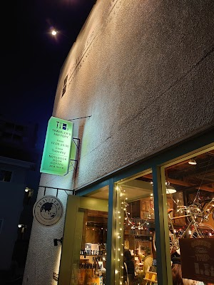

- **Place ID:** `ChIJAQABzE6LGGARgnqhPmipo_Q`
- **Address:** 3-chōme-13-10 Kamimeguro, Meguro City, Tokyo 153-0051, Japan
- **Overall Rating:** 4.5 ⭐
- **Review Summary:** {'text': 'Visitors say this store offers a wide variety of unique stationery, travel items, and leather goods, including exclusive stamps and limited edition items. They also highlight the cozy atmosphere and the kind, helpful staff who are passionate about the products.', 'languageCode': 'en-US'}
- **Amenities Summary:** Accessibility: {"wheelchairAccessibleParking": false, "wheelchairAccessibleEntrance": false}
#### Top 10 Positive Reviews:
- 5 Stars: Firstly, the location was a few minutes from Nakameguro Station; super accessible! When I arrived, it was around 1:00pm and there was a short queue. The inside was quaint and super cozy.  This place is a must visit! Especially if you are into stationary items.  10/10. Would go again.
- 5 Stars: Unfortunately I came on a day where a new product was released, and was not allowed to enter.  This shop sells world famous Traveller’s factory items, even recommended by famous YouTubers like MauriceMoves.
- 5 Stars: This location is awesome. It’s really small just like the one at Tokyo Station, but that kind of adds a charm to it. They limit the foot traffic because of this, but it’s worth the wait in line. Take some water. Some of the items I were looking for were out of stock, and after looking at the prices, I can see why. I really took it for granted and didn’t stock up! But I managed to get two journals for my fiends back home and decked them out with stamps from the stamp station. I didn’t grab a photo of it, but it’s there and it’s easy to get carried away, haha. If enjoy journaling, this place is a MUST on your trip to Tokyo! 10/10

#### Top 10 Negative/Lowest Reviews:
No negative reviews available.

---
### Karaoke Kan Shibuya
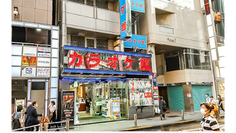

- **Place ID:** `ChIJ9fvGqKmMGGARMl8j1JuabWk`
- **Address:** Japan, 〒150-0042 Tokyo, Shibuya, Udagawachō, 30−８ K&F ビル
- **Overall Rating:** 4 ⭐
- **Review Summary:** {'text': 'People say this karaoke spot offers a good selection of songs, including English options, and has large, clear screens. They also highlight the friendly and helpful staff, quick drink service, and affordable all-you-can-drink plans.\n\nSome reviews mention there can be a lack of individual air conditioning.', 'languageCode': 'en-US'}
- **Amenities Summary:** Accessibility: {"wheelchairAccessibleParking": false}
#### Top 10 Positive Reviews:
- 5 Stars: Best €20 ive spent in ages for 2hrs karaoke and 2 beers! Took me a minute to work out how to skip my 10 repeated Alanis Morrisette songs ans phoned down to reception. He came up within 2minutes and helped me straight away! Used the phone to order my second beer and it arrived within 2minutes. So freidnly and English welcome. Even as a solo karaoke goer I loved it and would recommend everyone visiting to try it. The nerves go away in 2minutes when you realise noone cares! Have the fun. Sing that song!
- 4 Stars: Great place! We had all you can drink for 3.000 Yen. They have English songs but turning the tablet to English was only partially possible.

#### Top 10 Negative/Lowest Reviews:
- 2 Stars: The karaoke itself was good. The room was nice and the drinks arrived quickly. But it says 'welcome to foreigners', although in practice it doesn't feel that way. The staff spoke poor English and after we extended by an hour, we had to pay for an extra 1.5 hours. The karaoke itself simply stopped after this hour, but because we were 5 minutes late getting downstairs (to gather our things), we had to pay for another half hour. We received no warning about this beforehand, nor were we informed about the time we had left. Due to the poor English, it was impossible to discuss this. Extremely unreasonable. So be aware of this!!!
- 2 Stars: Diluted drinks. Great view. Good English selection. Charged us for the next 30min although we were 1min late and only agreed to 1H, so be careful. 4500Y / person for 1.5H.
- 2 Stars: The staff was super nice, nothing to say about that and served the drink very fast, also drinks were ok. But it said welcome to foreigners in front of the karaoke but the iPad is only in Japanese, so we lost minimum half of the time to try to use it, no one could really speak English, and the iPad is not at all intuitive. Also the room and the building are really old, look like abandoned, smell old cigarettes and it was so hot. So I blame the owner/owners of this place.

---
### WOMB
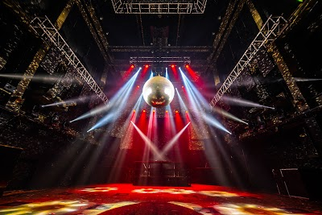

- **Place ID:** `ChIJQVW_FKqMGGARQwUFx1IqoEc`
- **Address:** 2-16 Maruyamachō, Shibuya, Tokyo 150-0044, Japan
- **Overall Rating:** 3.9 ⭐
- **Review Summary:** {'text': 'People say this club features a high-quality sound system, excellent lighting, and multiple floors with diverse electronic music genres. They also highlight the reasonable drink prices and the attentive security staff.\n\nOther reviews mention the entry fee can be expensive.', 'languageCode': 'en-US'}
- **Amenities Summary:** Parking: {"valetParking": false} | Accessibility: {"wheelchairAccessibleParking": false, "wheelchairAccessibleEntrance": false}
#### Top 10 Positive Reviews:
- 5 Stars: This place is a world-class, multi-floor joint tucked in a back alley behind Shibuya's main nightlife row. Without a line, it's very easy to walk right by it without noticing. This place is built like a bunker, the sound isolation is excellent.  But once you pass the lockers and hit the stairwell, you can feel the bass from the high-quality sound system in your soul. This system is good, like really good, and so are the DJs behind them.  I didn't catch it on a multi-floor night, but the main floor uses a 4-table top-notch Pioneer setup in a mid floor configuration. If there's any sonic deadspots in this place, I couldn't find them, you can even feel the bass pumping in the bathrooms.  One of the most stand-put things about this dancefloor was that it's high-ceiling and we'll ventilated. Most clubs like this would turn into a sweat lodge, but this one stayed comfortable from 12 til 5 AM.  The club is internationally renowned, and has been thatw way for a long time; this weekend marks their 26th anniversary, and hopefully with many more to come. If you're in Shibuya, you gotta check this out.
- 5 Stars: Tuesday was awesome. I had a great time at that underground nightclub since I’m really into House music.  I was also super lucky to catch Justin Owen’s set definitely one of the highlights of the night
- 5 Stars: Was a little quiet, but I did go on a Tuesday night to be fair. Music was definitely the most interesting I've heard in Tokyo, and I'm sure it would be incredible on a weekend. Would recommend if you're into more bass/techno edm instead of generic top 40 stuff.
- 5 Stars: It's my 2nd time here (1st time in 2019) and I love this place; great crowd and the music was more on the experimental side.

#### Top 10 Negative/Lowest Reviews:
- 1 Stars: Exceptionally lame. 3,500 per person for the Same slow beat for hours. Equally probably to see people playing chess or dancing.  Also for some reason dudes were cooking sausages on the dance floor in one of the rooms. Like literally

---
### Loft
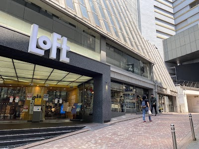

- **Place ID:** `ChIJv1LdWqiMGGARtLjjcZL2Qsk`
- **Address:** 21-1 Udagawachō, Shibuya, Tokyo 150-0042, Japan
- **Overall Rating:** 4.3 ⭐
- **Review Summary:** {'text': 'Visitors say this multi-floor store offers an incredible variety of high-quality stationery, cosmetics, home goods, and unique Japanese souvenirs. They also highlight the well-organized layout, making it easy to explore and find items. Guests mention the friendly, knowledgeable staff and the convenient tax-free service.', 'languageCode': 'en-US'}
- **Amenities Summary:** Accessibility: {"wheelchairAccessibleEntrance": true}
#### Top 10 Positive Reviews:
- 5 Stars: Loft Shibuya is probably my favorite Loft branch because of its incredible variety of products. I ended up buying so many things here, including KISS brand accessories, a Shupatto bag, and a Moma × Miffy (Van Gogh exclusive collection) doll.  It's a great one-stop shop, especially if you're short on time and want to explore a wide range of Japanese goods in one place. You'll find stationery, character merchandise, phone and electronic accessories, home décor, bedding, beauty products, travel items, and much more.  Highly recommended for both tourists and shoppers looking for unique souvenirs.👍🏻✨
- 5 Stars: I stumbled upon Loft Shopping in Shibuya during my trip to Tokyo, and honestly, it was one of the best surprises of the entire vacation! From the moment I walked in, I was blown away by the sheer variety of unique, high-quality products.  The stationery section alone is worth the visit—think washi tape, fountain pens, and planners you won’t find anywhere else. But it doesn’t stop there. The home goods, skincare (love the Japanese natural brands!), and even the quirky gifts on the upper floors had me filling my basket within minutes.  What really stood out was how well-organized everything is. Even with the crowds, the aisles are easy to navigate, and the staff were incredibly polite and helpful, even with my limited Japanese. The tax-free checkout was quick and seamless.  Whether you’re hunting for souvenirs, trendy home decor, or just want to experience a next-level lifestyle store, Loft Shibuya is a must. I left with bags full of treasures and zero regrets. Can’t wait to go back!
- 5 Stars: Great Loft store (largest as it has 7 floors)  Sells everything from simple bags and travel stuff to even more stationery.  Expect to spend some time here, easily accessible by JR or train.
- 5 Stars: Loved it, the best shopping - multiple floors. Had to return the next day. They have beautiful stuff, great for thoughtful souvenirs, homeware, beauty, fashion, stationary.
- 4 Stars: This is basically a multi-floor playground of lifestyle goods. Think stationery, homeware, beauty products, travel accessories, and a ton of uniquely Japanese finds all under one roof.  That said, it does get crowded, and prices aren’t exactly cheap compared to Donki or other discount stores. You’re paying a bit more for design, quality, and curation.  Overall, if you enjoy browsing and discovering cool everyday items, this place hits hard. Just don’t expect to walk out empty-handed.

#### Top 10 Negative/Lowest Reviews:
No negative reviews available.

---
### Omoide Yokocho Memory Lane
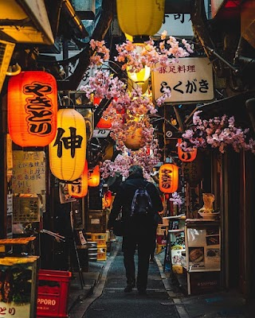

- **Place ID:** `ChIJP9eKBdeMGGAR0zzBXJNVj5A`
- **Address:** 1 Chome-2 Nishishinjuku, Shinjuku City, Tokyo 160-0023, Japan
- **Overall Rating:** 4.2 ⭐
- **Review Summary:** {'text': 'People say this alley offers delicious yakitori, ramen, and other Japanese street food, with many small eateries to choose from. Visitors also highlight the lively, nostalgic, and authentic old-Tokyo atmosphere, especially at night with glowing lanterns. They also mention the friendly staff and the convenient location near Shinjuku Station.', 'languageCode': 'en-US'}
- **Amenities Summary:** Accessibility: {"wheelchairAccessibleParking": false, "wheelchairAccessibleEntrance": false, "wheelchairAccessibleRestroom": false}
#### Top 10 Positive Reviews:
- 5 Stars: We visited Omoide Yokocho and had a really memorable experience. We mainly tried different skewers, and everything we ordered was simple but very tasty. The place was quite crowded, especially in the evening, but that actually added to the atmosphere rather than taking away from it.  What makes this spot special is how authentic it feels. The narrow alleys, small restaurants, and the smell of grilled food create a very traditional and lively vibe. It feels like stepping back in time compared to the modern parts of Tokyo.  Even though it’s busy, the energy is great and it feels very local rather than touristy. The setting is also surprisingly charming.  I highly recommend visiting this place if you come to Tokyo ! Especially at night !
- 5 Stars: A small stretch of alley with lots of yakitori izakaya shops that have been there for many many years. If you want to give their yakitori and izakaya a try, I feel that this place is good to try out the experience of eating at the small authentic shops. There's lots of tourists and the shops staffs are all friendly and welcoming to tourists. They have English menu and theres lots of food choices to choose from. It's also pretty and has its own vibe at night with the lights and lanterns.
- 5 Stars: I visited Omoide Yokocho and it honestly felt like stepping into a completely different side of Tokyo. The moment I walked in, the narrow alleyways, glowing lanterns, and smoky air from all the grills created a really unique atmosphere that I did not find anywhere else in the city. It’s right next to Shinjuku Station, but it feels much more old school and nostalgic compared to the modern surroundings.  What stood out to me the most was how compact everything is. The alley is packed with dozens of tiny bars and restaurants, many with just a few seats, so it feels very intimate and lively at the same time. I ended up squeezing into a small spot and trying some yakitori, and the whole experience felt very local and authentic. You are sitting close to strangers, hearing conversations, and just soaking in the vibe, which made it memorable for me.  I also liked how casual everything felt. There is no pressure, you just walk around, pick a place that looks good, and go for it. At the same time, it can get pretty crowded, especially at night, and some places are quite small, so it might not be the most comfortable if you prefer more space.  Overall, I really enjoyed the atmosphere more than anything. It’s not about luxury or perfect service, but about the experience. For me, Omoide Yokocho was a fun and slightly chaotic place to grab food and drinks, and it’s definitely worth visiting at least once if you are in Tokyo.
- 5 Stars: Cool tight alley jam packed with intimate eateries. Tried a couple of places.. one hit and one miss. The experience at the steak place that accommodated us got the 5 stars. The place is pretty popular so it can get pretty crammed but don't let that deter you from checking it out.
- 4 Stars: Walking through Omoide Yokocho Memory Lane felt like stepping into a different side of Tokyo. I really enjoyed the narrow alleyways, the lively atmosphere, and all the tempting smells drifting out from the tiny eateries. It’s a great spot if you’re into meat or fish dishes, though vegetarians may have fewer choices. Still, it was a memorable stop and well worth seeing.

#### Top 10 Negative/Lowest Reviews:
No negative reviews available.

---
### Shinjuku Golden-Gai
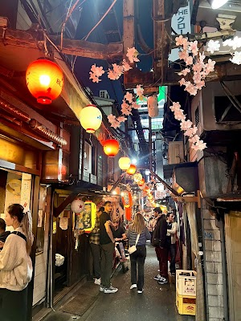

- **Place ID:** `ChIJr7mGZdmMGGARjxoMFeHApXE`
- **Address:** Japan, 〒160-0021 Tokyo, Shinjuku City, Kabukichō, 1-chōme−1−６ あかるい花園 五番街
- **Overall Rating:** 4.3 ⭐
- **Review Summary:** {'text': 'People say this nightlife spot offers a unique experience with its maze of tiny, themed bars, each having its own distinct personality. Visitors highlight the lively and intimate atmosphere, making it a great place to meet locals and fellow travelers. They also mention that many bars are welcoming to tourists, and some offer good value with reasonable drink prices.', 'languageCode': 'en-US'}
- **Amenities Summary:** Accessibility: {"wheelchairAccessibleParking": false, "wheelchairAccessibleEntrance": false}
#### Top 10 Positive Reviews:
- 5 Stars: This is a small nightlife district in Shinjuku known for its narrow alleyways and tiny bars packed closely together.  It is famous for:  * retro post-war atmosphere, * neon signs and lantern-lit streets, * very small themed bars, * and its connection to Tokyo’s nightlife and creative culture.  The area contains more than 200 small bars, many seating only a handful of customers. Some are open to tourists, while others are regular-only or charge a cover fee.  Golden Gai is especially popular at night for:  * bar hopping, * photography, * local drinking culture, * and experiencing a different side of Tokyo compared with modern districts like Shibuya.  Best time to visit:  * evening to late night, * especially after 7 PM when most bars open and the streets become livelier.
- 5 Stars: Shinjuku Golden Gai is clearly a place with a strong character—but timing really matters.  We visited during the day, and everything was closed. The streets were almost empty, which made it feel a bit lifeless at that moment.  That said, you can immediately tell this place comes alive at night. The narrow alleys, tiny bars, and unique storefronts give strong hints of an amazing atmosphere once the lights are on and the doors are open.  Even without experiencing it at night, it’s easy to imagine how vibrant and special it must be.  Tip: Definitely visit in the evening or at night—this is not a daytime destination.  A place with a lot of potential, but only if you catch it at the right time.
- 5 Stars: Hundreds of tiny bars line these alleys. The bars are so small you’ll end up in conversation with strangers almost definitely. It was full of very interesting discussions. Overall, it was a cultural melting pot. Great experience 5/5
- 4 Stars: Golden Gai or Golden Town, in Shinjuku, is a small alley area, composed of 6 small lanes, where there are many small pubs, bars and small diners which often sell simple BBQ food, soup noodle, etc., in addition to liquor and wine.  In addition to eating and drinking, the area is also one of Japanese folk-art and other performing arts' birthplaces and later becomes a living center for many young performers and artists to manage their pub business and, at the same time, waiting for the acting, performing art opportunities.  Many small pubs do have their own unique decorations inside and outside the stores, including posters, and it is worthy for tourists to take a walk of the area. If tourists want to take photos, then, day-time walk is recommended because not many customers in the area, and photo taking may be easier.  Many bars or pubs in Golden Kai section have history of 40 years or longer, and a few of them do not accept foreign customers or tourists as their customers; generally, these bars or pubs prefer their frequent customers.  But a few pubs do open for all customers, including foreign tourists, such as Kenzo’s Bar [Bar owner is a playwriter and an actor, and he is very friendly and bar plays 1980s music], Bar Darling [perhaps because it is owned by a female actress, staffs are all female; the bar welcomes female customers, even single female], Ace’s [it does not impose cover charge and staffs can communicate English and welcome foreign tourists, and these bars do have reasonable pricing for drink and food.  Most of the bars in Golden Kai do impose entrance fee, seating fee or cover charge per person, which is in the range of 500 Yen to $1,000 Yen per person, although there are few bars which do not have entrance fee pr cover charge.  Most of the bars open from later afternoon or early night, such as 08PM, although a few of the bars do open 24/7 daily.  Although there are many bars in Golden Kai, the area does not allow public drinking or smoking in public section, and it is strictly enforced for the no smoking or drinking in public street rules.  However, most of the bars do allow smoking inside their bars.  1st time foreign visitors or tourists, can take Tokyo Metro Marunouchi Line [M Line] and get off at M-09 Shinjuku Sanchome Station and then walk to Exit 2, and the Golden Gai is in very short walking distance.

#### Top 10 Negative/Lowest Reviews:
No negative reviews available.

---
### Gujo Hachiman Castle Town Plaza
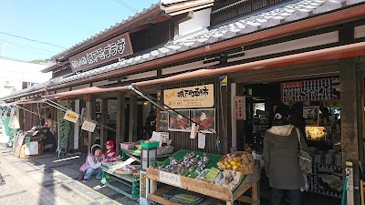

- **Place ID:** `ChIJy2524EHwAmARWPLlprXJBvs`
- **Address:** 69 Hachimanchō Tonomachi, Gujo, Gifu 501-4213, Japan
- **Overall Rating:** 3.8 ⭐
- **Review Summary:** {'text': 'Visitors say this plaza offers a good selection of local vegetables and souvenirs, and provides accessible restrooms and parking. They also highlight the traditional architecture and peaceful atmosphere, making it a great base for exploring the castle town.\n\nOther reviews mention parking can be limited.', 'languageCode': 'en-US'}
- **Amenities Summary:** Accessibility: {"wheelchairAccessibleParking": true, "wheelchairAccessibleEntrance": true, "wheelchairAccessibleRestroom": true}
#### Top 10 Positive Reviews:
- 5 Stars: Gujo Hachiman also known for little Kyoto and town of water..  located almost center of Gifu. The town is surround by water and but you can easily walk just about anywhere.. Also a lot of local restaurants and stores in the area.. you can also visit the well known “Castle in the Sky” in the town. Be ready to have great experience on foot. Try to check small streets in the town and you will be surprised what is hidden..
- 4 Stars: If you love traditional Japanese architecture and peaceful vibes, Gujo Hachiman is a must-visit. It’s famously called the "City of Water" due to the endless canals and clear streams running through it.  The town is on the smaller side, mostly made up of picturesque bridges connecting the streets, which makes for some fantastic photo spots by the water. Pro-tip: look for Igawa Lane if you want to see the vibrant koi fish swimming in the channels. Unlike other historic towns, this one isn't overrun by tourists, making it a perfect, tranquil escape.
- 4 Stars: Gujo Hachiman Castle Town Plaza is a convenient and pleasant spot to take a break while exploring the historic town. It’s designed more like a small rest area and souvenir center, but it still has a cozy, welcoming vibe. The selection of souvenirs includes local sweets, crafts, and a few fake food items, though not as many as you’d expect from a town famous for them. It’s a good place to grab some snacks or small gifts without feeling overwhelmed. The area is clean and spacious enough to rest your feet for a bit. While not a major attraction, it’s a nice stop for travelers wanting a quick breather and a few mementos before heading up to the castle or strolling along the river.
- 4 Stars: The castle is very beautiful with a lot of history to discover. I recommend wearing comfortable clothes and shoes as there are several flights of stairs to climb. The road to the castle is a bit narrow and steep, so I recommend a small car. The parking lot is not very large. The castle is very beautiful in the autumn with the reddish leaves and in the winter with the snow on its roof. The castle is also very beautiful to see from the city where you will see it at the top of the mountain.
- 4 Stars: It's a nice small traditional town. Not too urbanized nor crowded. You can hear the flow of water in almost all the streets. The drainga system including the canals are well designed and it gives an amazing feeling.

#### Top 10 Negative/Lowest Reviews:
No negative reviews available.

---
### Nakashimaya
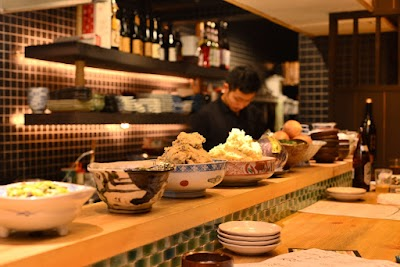

- **Place ID:** `ChIJp6mRMJYIAWARor6AwBA1B4Y`
- **Address:** 115 Butsukōji Higashimachi, Shimogyo Ward, Kyoto, 600-8054, Japan
- **Overall Rating:** 4.7 ⭐
- **Review Summary:** {'text': "Diners like this restaurant's delicious obanzai and a wide variety of other dishes, with many highlighting the fresh ingredients and flavorful seasoning. They also appreciate the reasonable prices and the cozy, authentic Japanese atmosphere. Guests mention the staff are very friendly, attentive, and provide excellent service, making for a welcoming experience.", 'languageCode': 'en-US'}
- **Amenities Summary:** Parking: {"freeParkingLot": false, "paidParkingLot": false, "freeStreetParking": false, "freeGarageParking": false} | Accessibility: {"wheelchairAccessibleParking": false, "wheelchairAccessibleEntrance": false, "wheelchairAccessibleSeating": false}
#### Top 10 Positive Reviews:
- 5 Stars: This is a place where even solo diners can feel relaxed and comfortable. I sat at the counter yesterday and really enjoyed my meal. The staff were incredibly friendly, and ordering is done through LINE with photos of the dishes, which makes it very convenient for foreigners who don't speak Japanese.  They also recommended half-sized portions for solo diners, which was very thoughtful and helpful. The food was absolutely delicious, and you could truly taste the natural flavors and quality of the ingredients.  I highly recommend this restaurant to anyone who wants to experience authentic Kyoto cuisine. I will definitely come back the next time I visit Kyoto! ☺️
- 5 Stars: Food here's great! And for the experience and taste, the price is reasonable. Though there is a time limit for eating and they'll remind you politely (at first I thought they were closing), but it's more than enough for a full enjoyable meal. Service is pretty good too, and the chefs were friendly.  Their obanzai is simply incredible. And get their pork steak, it's juicy, soft, chewy, and the taste is out of this world. It's not a stretch to say that this is the best meal I've had in Kyoto! (The other places were great too, but Nakashimaya is simply top tier amongst already amazing places).  Their sashimi is fresh, and I would also recommend their tofu skin. Layers of tofu, soft and tasty, that the wasabi brings even more flavour out of. And if you get a counter seating (couples or solo diners are more likely to get this I guess, as the group seats are further behind), you get to see the chef in action and get tempted by even more food.  I highly recommend Nakashimaya, you wouldn't regret stepping in (neither will your wallet, it's affordable but oh so tasty).
- 5 Stars: This was hands down the best meal we had in Japan. The pork was the best thing we’ve eaten in our entire LIVES and the atmosphere was incredible as well. Highlights were the pork stirfry, duck, tempura pepper and corn, and the tuna yuba. House made ginger ale was also super tasty. Would HIGHLY recommend this joint over any other restaurant on the main strip. There were so many locals dining there as well. Reservations are a must!
- 5 Stars: Delicious home style cooking! Our party size was only 2 but I think this is a great restaurant for sharing small bites in a larger group setting. It was great after days of eating just plain carbs with little veggies. Wouldve booked for all 3 nights in Kyoto if possible.  Reservations are required! Photos show only 3 dishes but we ordered a couple more items not shown.
- 5 Stars: What a wonderful experience! A beautiful place on a quiet side street only a 10 minute walk from downtown Kyoto. A true traditional experience. Greeted genuinely and warmly by the host, chefs and wait staff and asked to remove our shoes. Taken to a beautiful horigotatsu. The hosts were AMAZING and REALLY COOL! I loved their style, happiness, generosity and kindness! The food was OUTSTANDING! Simple dishes with complex and mouth watering flavors! I think we will go back before our trip is over LOL! I loved it so much! It is my favorite restaurant Kyoto :) Thank you everyone for a BEAUTIFUL experience :)

#### Top 10 Negative/Lowest Reviews:
No negative reviews available.

---
