# Deep Dive: Reviews & Photos

### Kishiwada Danjiri (Festival Float) Hall

- **Place ID:** `ChIJ8UkEOwzGAGARo4MASnxj16c`
- **Address:** 11-23 Honmachi, Kishiwada, Osaka 596-0074, Japan
- **Overall Rating:** 4.1 ⭐
- **Review Summary:** {'text': 'Visitors say this museum offers a close-up view of elaborate danjiri floats and their intricate carvings, along with engaging theater presentations and hands-on taiko drumming experiences. They also highlight the helpful staff and the convenient combined ticket option with Kishiwada Castle.\n\nSome reviews mention the information can be unclear.', 'languageCode': 'en-US'}
- **Amenities Summary:** Accessibility: {"wheelchairAccessibleParking": true, "wheelchairAccessibleEntrance": true, "wheelchairAccessibleRestroom": true}
#### Top 10 Positive Reviews:
- 5 Stars: This is one of the most famous festivals in Japan. It was so cool and fun actually. The most exciting part was where the large danjiri are pulled at high speed around corners. There is carpenter (Daikugata) dancing on top of the gloat while it is moving. There's a vibrant and exhilarating atmosphere filled with rythmic drumming, flute music, and chants of the danjiri pullers
- 5 Stars: It was really hard looking for info in English on the Kishiwada Danjiri Festival Map or parade route online when we went in 2024 so I'm uploading it here!
- 5 Stars: Nice museum where you can have a close see to Daijiri (vehicles of matsuri)
- 5 Stars: Great environment, inetersting knowledge, fantastic experience !!
- 5 Stars: Nice cultural experience!

#### Top 10 Negative/Lowest Reviews:
No negative reviews available.

---
### Nui. Hostel & Bar Lounge

- **Place ID:** `ChIJ4U-9KsiOGGARARhaBLZLqS0`
- **Address:** 2-chōme-14-13 Kuramae, Taito City, Tokyo 111-0051, Japan
- **Overall Rating:** 4.5 ⭐
- **Review Summary:** {'text': "People say this hostel offers clean, comfortable rooms with privacy curtains and spacious, well-maintained shared bathrooms. They also highlight the delicious food and coffee available at the lively downstairs cafe and bar, which attracts both locals and travelers. Guests mention the friendly, helpful staff and the hostel's convenient location near public transport and local attractions.", 'languageCode': 'en-US'}
- **Amenities Summary:** Accessibility: {"wheelchairAccessibleParking": false}
#### Top 10 Positive Reviews:
- 5 Stars: Nui. is the perfect hostel for people who want a little bit of everything. The rooms had a perfect level of people between them, the beds were comfortable and everything was extremely clean. I loved that the downstairs café/bar was filled with locals and tourists alike making an incredible atmosphere when you arrive or when you want to have a few drinks after a long day of sightseeing making it easy to socialise with others. I ended up meeting so many people during my stay who I'm lucky enough to call my friends.  If you want to get away from the hustle and bustle and take in a great view of Tokyo Skytree and Sumida River, head to the top floor where there is a balcony.  The hostel is located right next to Asakusa where Sensō-ji temple is located making it a great spot for sightseeing, restaurants and bars. If you would like to head out for the day to another district, the subway is a 5 minute walk away making it easy to get around stress-free.  Big shoutout to Maki-san, Miku-san, Sora-san and all the bar staff for making my stay here as amazing as possible.  I genuinely cannot express how amazing of a stay I had here but one thing's for sure. I'll definitely be back in the future!
- 5 Stars: I didn’t stay at the hostel, but a friend of mine did and she enjoyed her experience. This was a nice place to meet up in the morning before heading out on our Tokyo adventures. They have a great soy latte and the atmosphere lends itself to making friends. While waiting one morning I made friends with someone else stopping over for a coffee and we all went to hangout together afterwards.
- 5 Stars: Really solid for a classic hostel. The 8 person mixed gender dorm room is clean, each bed is surrounded by privacy curtains which really help with the noise/light. The AC works great! The staff is all so friendly and kind. It’s on a quiet side street and it was really nice to come back to a less busy part of town each night for some calmness.
- 5 Stars: I highly recommend this place. It was great location imo (quiet neighborhood but ten min walk to Asakusa or twenty min train to Ginza or Shibuya). Room was so clean and they have curtains for the dorms. Bathroom also very clean. The one critique I have is that it was not as social as I was hoping for and people kinda ignored me when I tried to talk to them with like one exception. I’ve never experienced that before and I am super respectful so I promise it’s not just me. I’m not sure if that’s usually how it’s like at this place but regardless, I still highly recommend as everything that was in Nui’s control was beyond expectations.

#### Top 10 Negative/Lowest Reviews:
- 2 Stars: I ordered the rigatoni because they were the only dish on the menu that caught my attention and, most importantly, they did not have the spicy symbol. Since I have stomach issues, I chose them thinking it was a safe option. Unfortunately, the pasta turned out to be spicy. When I pointed this out to the waiter, he denied that it was spicy instead of checking or being helpful. I’m giving two stars because the pasta was well cooked and the ingredients were of good quality. However, the bartender’s attitude was not appropriate toward a customer who was simply pointing out a mistake on the menu, especially regarding something as important as spiciness.

---
### UNPLAN Shinjuku

- **Place ID:** `ChIJCd85CYONGGAROzjK0EgWo9E`
- **Address:** 5-chōme-3-15 Shinjuku, Shinjuku City, Tokyo 160-0022, Japan
- **Overall Rating:** 4.2 ⭐
- **Amenities Summary:** Accessibility: {"wheelchairAccessibleParking": false}
#### Top 10 Positive Reviews:
- 5 Stars: I really recommend this hotel ! We stayed in a 3 person room, with one double bed and 2 futons.  The room was quite big for Tokyo. We could fit our 3 big luggages. The breakfast was perfect, which good bread. There was salty options : eggs, sausages, salad.  The commune bathroom are super clean !!  The location was perfect. There is a 7-Eleven in from of the hotel.  The - : - we had a private bedroom, but if you take a room in a dormitory, i can imagine it could be difficult to chill in the lobby in the night with all the people chatting very loudly. - the room was noisy, you can hear the street and people could be noisy in the corridor at night. But I don’t think it’s relevant since every hotel we did in Japan was noisy. It was perfectly fine with earplugs. - the curtains doesn’t hide the sun so bring a sleeping mask - the hairdryer doesn’t dry anything
- 5 Stars: I stayed at Unplan Shinjuku and honestly, it's a place I can't wait to return to.  The common areas are fantastic. There's always a great mix of people from all sorts of countries and backgrounds, so striking up a conversation comes naturally — even if you're a bit shy, you'll fit right in. They also host events regularly, which meant my longer stay never got boring; in fact, I looked forward to every day. I made genuine friends here, and we even went out for drinks together after the stay.  What really stood out, though, was the quality of the beds. Even as a dormitory, each bunk is built solidly and gives you a real sense of private space. The bed was perfectly comfortable — no complaints at all. Compared to the many hostels I've stayed at around the world, this place is on a completely different level.  On top of that, breakfast is included for free — something genuinely rare for hostels in Japan, and a lovely way to start the morning.  Ease of meeting people, quality of the facilities, value for money — it nails all three. Whether you're looking to connect with fellow travelers or just want a comfortable, well-made place to rest, I can recommend Unplan Shinjuku without hesitation.
- 5 Stars: I stayed in a few places on my trip, and this was absolutely my favorite hostel. It felt clean and safe, and I really liked the bed space. I was able to put my packing cubes and stuff in there and felt like I had plenty of room, in a cozy way. Shower always had hot water, breakfast was actually very convenient and nice, and the vibes overall were just great. Location was perfect too, the area was nice and just a short walk to so many cool bars. And, I wanted to be near a big station (Shinjuku), but also a smaller one so I didn’t have to traverse Shinjuku every time, and that was perfect. I stayed a week in the female dorm, and I’d do that again in a heartbeat.
- 5 Stars: Stayed in the mixed dorm in March 2026. Hostel is decently close to most of the attractions in Shinjuku.  Beds and rooms are clean. Bathrooms are spotless. There is a safe in every bunk with a removable key. The free breakfast was nice and had variety. Each floor requires access via pin code for added security. Definitely would recommend for other travellers with a budget in the low to mid range.

#### Top 10 Negative/Lowest Reviews:
No negative reviews available.

---
### Takasaki Station
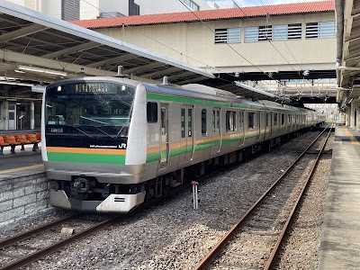

- **Place ID:** `ChIJh3ZzfZuSHmARSljV8hrRWhE`
- **Address:** Yashimacho, Takasaki, Gunma 370-0849, Japan
- **Overall Rating:** 3.9 ⭐
- **Review Summary:** {'text': 'People say this station is a convenient transportation hub with numerous train lines, including Shinkansen, and a wide variety of stores and restaurants inside. Visitors also highlight the clean and well-maintained facilities, as well as the helpful staff.\n\nOther reviews mention the staff can be impolite.', 'languageCode': 'en-US'}
- **Amenities Summary:** Parking: {"paidParkingLot": true} | Accessibility: {"wheelchairAccessibleParking": true, "wheelchairAccessibleEntrance": true, "wheelchairAccessibleRestroom": true}
#### Top 10 Positive Reviews:
- 5 Stars: Great Joetsu shinkansen and local JR rail station, well connected  and situated to the wonderful city of Takasaki with lots of nearby stores, restaurants, and lodgings.  As always, JR Rail keeps the station clean and efficient, and, also as always, the trains do run on time.  I was especially impressed with the large courtyard area outside the front of the station, which offered places to hang out and chat with friends.  There is a large department store adjacent to the courtyard, as well as an APA hotel.  The connection of the station to the city is really well done overall.  Clean and wonderful.
- 5 Stars: It’s a really convenient station in Takasaki for both bus and trains! You can go to Tokyo and Narita directly from here! We always use this place for our trips! Around the station, there are bunch of stores and restaurants to enjoy and do shopping! Keep up the great work! Cheers 🥂
- 5 Stars: This train station links up to hotels and mall which definitely great. There's a lot of shop too inside the station building. It's not hard for foreigner like me to seek for directions with the great clear sign boards around. I bought my ticket at the counter, the lady was very helpful despite the language barrier we facing.
- 5 Stars: A bustling cradle of travel where city rhythm meets gentle countryside promise. Trains slide out like quiet thoughts heading west, leaving Takasaki’s lively hum behind. The station feels like a lantern in broad daylight — bright, welcoming, and ready to send you along a slower, greener path toward silk towns and mountain breaths. 🌆🚉🍃  Tourist Tip: Great place to gather supplies before rural stretches. Clear signage for transfers; expect crowds at peak times. 🧭 The Takasaki Line rests here, its long journey fulfilled. Final stop. Visit Takasaki’s Daruma Temple and Mount Kannon. Transfer to Joetsu or Shinetsu Lines for mountain travel. The city offers both art and serenity.  Joshin Line: From Takasaki’s lively hum I drift into quieter air, the little Jōshin cars carrying me past fields brushed with sun. Yamana’s shrine wind greets me, Tomioka whispers its silk-spun history, and hills gather close as the rails wind toward Shimonita’s cool valley. Each stop feels like a gentle hand guiding me deeper into Gunma’s warm countryside—where slow travel becomes a kind of blessing. 🌾🍃🚉
- 4 Stars: Quite a large train station but it’s conveniently linked with buses/stops to bring one to the surrounding areas. There are also souvenir shops n food outlets(mall) here so it’s easy to catch a meal before your bus ride. Most bus Drivers can speak a little English but are very accommodating n helpful. It’s not difficult to catch the right bus, just inquire politely n always confirm your destination when boarding the bus with the driver. The train station is itself comfortable and nice to browse around for 30 minutes or have a meal break or just to pick up some souvenirs! The Daruma Bento is a good buy because after eating one can retain the red plastic container (which is a Daruma) for a souvenir keepsake.

#### Top 10 Negative/Lowest Reviews:
No negative reviews available.

---
### Joshin-etsu Expressway

- **Place ID:** `ChIJ8TI1rUbkHWARpgKmEgIfxls`
- **Address:** Joshin-etsu Expy, Japan
- **Overall Rating:** N/A ⭐
#### Top 10 Positive Reviews:
No positive reviews available.

#### Top 10 Negative/Lowest Reviews:
No negative reviews available.

---
### Minakami Station
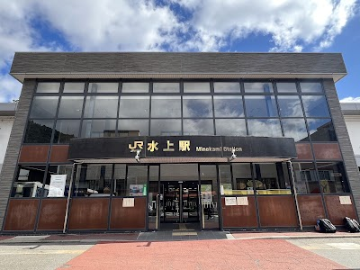

- **Place ID:** `ChIJwySJbX0UHmARsdqeJ9Jo4Mk`
- **Address:** Kanosawa, Minakami, Tone District, Gunma 379-1611, Japan
- **Overall Rating:** 3.8 ⭐
- **Amenities Summary:** Accessibility: {"wheelchairAccessibleParking": true, "wheelchairAccessibleEntrance": true, "wheelchairAccessibleRestroom": true}
#### Top 10 Positive Reviews:
- 5 Stars: Japanese people here are friendly and not afraid of foreigners. Went for a day trip to see a snow and and twice on different situation, one at the station and one the the park nearby approached us and offer to take the photo of us ( with wife). Been living in Japan for already 10 years and this is unusual and I like it.
- 5 Stars: I went there few days before it was snowing i enjoy but there is not so many peoples and almost it seems ghost town lol
- 5 Stars: This is a small train station and it has everything you would expect. The bathrooms are large clean and relatively recently redone. There are vending machines with hot and cold drinks. There's a covered outdoor sitting area with a taxi stand and, surprisingly, a taxi.
- 4 Stars: A station that is easy to reach from Tokyo and also convenient to go to many attractions around Minakami. You can get on the bus from here to get to the Tanigawadake Ropeway Station (and enjoy powder snow at the top during winter) or get the combination bus ticket for Takaragawa Onsen at the Tourist Information center right beside the platform gate. There are many other options, do check with the tourist info lady~ The downside is that other than a few souvenir shops in front of the station, all the other cafe and restaurants are either closed down or closed really early (they were closed around 2pm+ during winter) so there is no place to pass time other than the station's waiting room...
- 4 Stars: Neat small station with comfortable waiting room, ticket machines and manned counter with helpful staff who provided change. Coin lockers are available both inside the waiting room and outside, along with toilets. Nowhere to buy takeaway snacks in the immediate vicinity. There are also apparently some heritage train events here

#### Top 10 Negative/Lowest Reviews:
No negative reviews available.

---
### Tone River
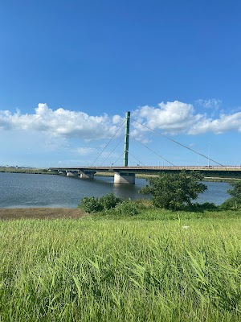

- **Place ID:** `ChIJDdVWrnlpHmARmXuwYMrkb9Q`
- **Address:** Tone River, Japan
- **Overall Rating:** 3.8 ⭐
#### Top 10 Positive Reviews:
- 5 Stars: Best sunset viewing spots.
- 5 Stars: From inside the car.  This is the Tone River, which I've only ever seen on maps.  Amazing!
- 5 Stars: This time we're back with the "To" part of the Jomo Karuta series. Tone is the greatest river in Bando. The Tone River is the greatest river in Bando, and as the eldest son of all Japan's rivers, he is affectionately known as Bando Taro, meaning the most sacred river in Japan. It is followed by Chikushi Jiro (Chikushi River) and Shikoku Saburo (Yoshino River). Ever since I was a child, I remember playing in the river until dark every day. I've been reminded once again of the greatness of the Tone River. Thank you.
- 5 Stars: We took a drive along the Tone River with our family this past weekend, enjoying cycling and a picnic along the way. The wide river and the expansive view of the sky stretching into the distance were even more breathtaking than in pictures. The breeze on top of the embankment was refreshing, and the seasonally changing flowers and plants along the banks, along with the seagulls and herons gliding across the water, made for a picturesque scene. There were well-maintained parks and benches scattered throughout, allowing us to relax while the children played. In spring, there are cherry blossom trees; in summer, fireworks and water play; in autumn, golden rice fields and sunsets; and in winter, crisp air and starry skies. No matter how many times you visit, the scenery is different, and you never get tired of walking the same places.  There were also many people fishing, canoeing, and road cycling, making it a perfect field for outdoor enthusiasts. There are some sections with fast currents, so those with children should be careful of life jackets and the "no entry" signs along the river. Toilets and parking vary depending on the area, so it's best to check a map app beforehand. There are also sections without nearby convenience stores, so bring plenty of drinks, sun protection, and insect repellent. The rules for barbecuing along the riverbank vary by section, so following the signs will ensure a smooth and enjoyable experience.  Despite its easy access from the city center, the area boasts a vast sky and a tranquil atmosphere. In the evening, the silhouette of the bridges spanning the Tone River against the reddish-orange glow was breathtakingly beautiful, making you want to capture it on camera. While close to nature, the area is well-maintained, making it perfect for beginners. It's a place I'd love to visit again in different seasons and would recommend to family and friends.  Early morning walks are also highly recommended. The moment the sun shines on the misty river surface is incredibly quiet, with only the sounds of birdsong and water. The cycling path has a relatively clean surface, and the straight sections with good visibility are easy even for beginners. However, there are some steep downhill sections along the embankment, so be careful not to speed. History buffs will enjoy observing the river's flood control measures, such as the levees, sluice gates, and weirs. Seasonal event information is posted on the local bulletin board, giving a warm and welcoming feeling to the community.   Things to note are that on windy days, dust can easily be blown around, and there are sections with little shade. Bringing a hat, sunglasses, and a picnic blanket is recommended. If you're bringing a pet, don't forget a trash bag and water. If everyone follows the rules, everyone can enjoy themselves. Drones and bonfires are prohibited in many areas, so check the rules beforehand. Overall, it was a river space where nature and human activity blended together nicely, a place I'd want to visit again and again. Next time, I plan to go in the spring when the rapeseed blossoms are in bloom, bringing a packed lunch.
- 4 Stars: This is the Tone River as seen from Shibukawa City during a trip to Gunma. 😽 Rivers are one of the joys of traveling, but the great thing about the Tone River is that because it spans prefectures, you can see its many different faces. ✨

#### Top 10 Negative/Lowest Reviews:
No negative reviews available.

---
### 天神ロッジ (Tenjin Lodge)

- **Place ID:** `ChIJ6Xn9VMkWHmARMlaXO_izH2I`
- **Address:** 220-4 Yubiso, Minakami, Tone District, Gunma 379-1728, Japan
- **Overall Rating:** 4.6 ⭐
#### Top 10 Positive Reviews:
- 5 Stars: We stayed at Tenjin Lodge for 1 night during our visit to the Doai and Tanigawadake area. The lodge is located about 10–15 minutes walk from Doai Station, around another 10 minutes to the Tanigawadake Information Center, and about 15 minutes walk to the Tanigawadake Ropeway station. The location is very convenient for hikers, skiers and nature lovers exploring this beautiful mountain region.  Compared to many traditional Japanese guesthouses nearby, Tenjin Lodge has a very different atmosphere. It is run by an Australian owner and international staff, giving the place a cozy mountain lodge vibe that feels both relaxed and welcoming. After several nights sleeping on futons during our Japan trip, it was such a nice surprise to finally sleep on a comfortable king-size bed 😄.  The common area is spacious and warm, with large dining tables, comfortable sofas, bookshelves filled with interesting books, a piano, and even a hammock. The lodge sits next to the Yubiso River, so throughout the day you can hear the relaxing sound of flowing water outside.  Downstairs there is a Japanese-style bathing area with a large hot bath, perfect after a day of walking or hiking. Meals were simple but delicious, and there is also a small bar corner where guests can enjoy sake, beer or wine while relaxing at night. One of the highlights of the stay was Lucky, the friendly lodge dog who quickly became everyone’s furry companion during the stay.  The owner, Kieren, was also extremely kind and even helped fetch us to Yubiso Station, which we truly appreciated.  If you are planning to hike, ski, visit Doai Station or simply enjoy the peaceful mountain atmosphere around Tanigawadake, Tenjin Lodge is a warm and comfortable place to stay.
- 5 Stars: The lodge is a vibe! Stay here if you want to meet other snow enthusiasts. Kieren and his staff work hard to provide guests with an experience, so you'll have a great time if you come with a good attitude. The dinner is amazing- big hearty, healthy meals that fill you up after a big day of riding. The rooms are traditional and functional and worked well for us.  We did 3 days of guiding with Patrick and he was super fun and knowledgeable to ride with. He made sure we got plenty of fresh powder, and was professional throughout.  Thank you Tenjin Lodge for a memorable stay!
- 5 Stars: Nice cozy lodge, particularly like the bar living room, very chilled out. Sauna nice and hot! Western beds comfy and warm shower. They also do guiding around Mt T, hiked up to the peak, they really know the area and are very safety conscious.
- 5 Stars: Came there as a last resort if i couldnt make it back to toyko after climbing mt tanigawa. Just wanted some place to rest my head, but got a full experience with sauna, cold plunge, onsen and Kirin even took us to the local bar. There is wildlife there and the stars at night are great. Kirin is a top bloke and would put this one my to do list if your in the area

#### Top 10 Negative/Lowest Reviews:
No negative reviews available.

---
### Canyons キャニオンズ

- **Place ID:** `ChIJUeEp5kYUHmAR0AolF0JkqdU`
- **Address:** 45 Yubiso, Minakami, Tone District, Gunma 379-1728, Japan
- **Overall Rating:** 4.8 ⭐
- **Amenities Summary:** Parking: {"freeParkingLot": true, "paidParkingLot": false, "freeStreetParking": false, "paidStreetParking": false, "freeGarageParking": false, "paidGarageParking": false}
#### Top 10 Positive Reviews:
- 5 Stars: Me and my wife an am amazing experience. The staff were friendly and knowledgeable. We felt safe the entire time while also having a thrilling experience. If you find yourself craving a little bit of of the outdoors and a bit of adrenaline then this is a great way to spend the day. Big shout out to Tom who made our adventure special and fun.
- 5 Stars: The most important things for rafting is safety, and you can see the whole team a very professional, we are rafting with two boats, and there are one guy to escort us along the whole journey to ensure our safety. Our guy Sam is a mixed, and native in both English and Japanese, so communication is not a problem, the whole journey goes through an extremely scenic gorge, the best rafting experience ever
- 5 Stars: We loved the canyoning and packrafting with Canyons! Packrafting down the small rapids was fun and surprisingly manageable. Our guides Daiki, Ashok, and Adam were great! Thanks for accommodating our last minute booking for the packrafting, and we also appreciated the hotel pickup and dropoff.
- 5 Stars: We had a full day of fun of river Canyon Fox plus and River rafting. The staff was great and helpful. Would definitely recommend to do this activities and really experiencing something you never did before Will certainly do it again!!
- 5 Stars: We had an amazing experience with Canyons. This is a well-run company that provides great service and great experiences. We took the Whitewater Rafting/Canyoning combo experience in Minakami and loved it. Our guides were awesome and it was the highlight of our Japan trip. Highly recommend Canyons. They take care of everything.

#### Top 10 Negative/Lowest Reviews:
No negative reviews available.

---
### Canyons キャニオンズ

- **Place ID:** `ChIJUeEp5kYUHmAR0AolF0JkqdU`
- **Address:** 45 Yubiso, Minakami, Tone District, Gunma 379-1728, Japan
- **Overall Rating:** 4.8 ⭐
- **Amenities Summary:** Parking: {"freeParkingLot": true, "paidParkingLot": false, "freeStreetParking": false, "paidStreetParking": false, "freeGarageParking": false, "paidGarageParking": false}
#### Top 10 Positive Reviews:
- 5 Stars: Me and my wife an am amazing experience. The staff were friendly and knowledgeable. We felt safe the entire time while also having a thrilling experience. If you find yourself craving a little bit of of the outdoors and a bit of adrenaline then this is a great way to spend the day. Big shout out to Tom who made our adventure special and fun.
- 5 Stars: The most important things for rafting is safety, and you can see the whole team a very professional, we are rafting with two boats, and there are one guy to escort us along the whole journey to ensure our safety. Our guy Sam is a mixed, and native in both English and Japanese, so communication is not a problem, the whole journey goes through an extremely scenic gorge, the best rafting experience ever
- 5 Stars: We loved the canyoning and packrafting with Canyons! Packrafting down the small rapids was fun and surprisingly manageable. Our guides Daiki, Ashok, and Adam were great! Thanks for accommodating our last minute booking for the packrafting, and we also appreciated the hotel pickup and dropoff.
- 5 Stars: We had a full day of fun of river Canyon Fox plus and River rafting. The staff was great and helpful. Would definitely recommend to do this activities and really experiencing something you never did before Will certainly do it again!!
- 5 Stars: We had an amazing experience with Canyons. This is a well-run company that provides great service and great experiences. We took the Whitewater Rafting/Canyoning combo experience in Minakami and loved it. Our guides were awesome and it was the highlight of our Japan trip. Highly recommend Canyons. They take care of everything.

#### Top 10 Negative/Lowest Reviews:
No negative reviews available.

---
### Yubiso Station
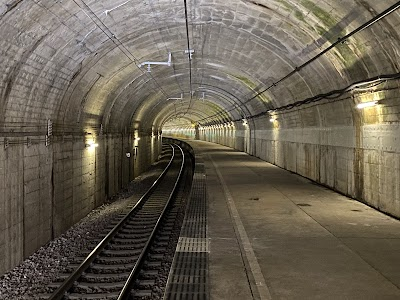

- **Place ID:** `ChIJP0RlWUcUHmAR1V63l8iLqFw`
- **Address:** Yubiso, Minakami, Tone District, Gunma 379-1728, Japan
- **Overall Rating:** 4.3 ⭐
- **Review Summary:** {'text': 'Visitors say this train station features unique underground platforms for southbound trains and offers views of trains descending a loop line from the northbound platform. They also highlight the ease of access to the underground platform, noting it has fewer stairs than other similar stations. Guests mention the station is surrounded by peaceful nature and is the closest stop for Yubiso Onsen.', 'languageCode': 'en-US'}
- **Amenities Summary:** Accessibility: {"wheelchairAccessibleParking": false, "wheelchairAccessibleEntrance": false}
#### Top 10 Positive Reviews:
No positive reviews available.

#### Top 10 Negative/Lowest Reviews:
No negative reviews available.

---
### Kubota
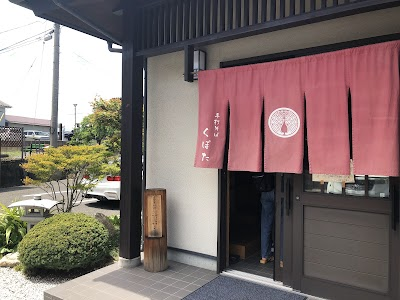

- **Place ID:** `ChIJWYha5QcPHWARSQj_ccf-uiU`
- **Address:** 10-17 Ichiba, Matsumoto, Nagano 399-0004, Japan
- **Overall Rating:** 3.9 ⭐
- **Amenities Summary:** Parking: {"freeParkingLot": true} | Accessibility: {"wheelchairAccessibleParking": false, "wheelchairAccessibleEntrance": false, "wheelchairAccessibleSeating": false}
#### Top 10 Positive Reviews:
- 5 Stars: It's great that they offer complimentary homemade Kyuchan and large portions of tempura set meals at reasonable prices. Because the area is home to many workers, the kakaeshi and tempura bowls are quite strong in flavor. If you want to eat a lot of soba, you should go to a restaurant away from the city center.
- 5 Stars: Kubota's Tempura Zaru (Matsumoto City, Nagano Prefecture)  Amidst the glossy soba noodles, the crispy, oily flavor moistens the mouth.  Tonkotsu Shotaro  When I go to a soba restaurant, I usually order tempura. Biting into it between bites of the bland soba leaves a hint of oil on the rim. Slurping the soba with the oil adds a richer flavor, making it even more delicious.  At Kubota in Matsumoto City, Shinshu. A colleague told me it was delicious, so I immediately went there. A restaurant beloved by locals. Looking at the menu, I found that in addition to soba, they also offer udon, rice bowls, a la carte dishes, and more, all packed with ideas to keep you entertained.  Since it was my first visit, I started with the classic tempura Zaru. I took a bite of the glossy, smooth, truly "hand-made" soba noodles. Delicious. The aroma of soba gently wafts from my mouth to my nose, bringing a smile to my face. After two or three bites, I bite into the eggplant tempura. Crunchy.  Then I return to the soba. I slurp, slurping as if to wash away the fine oil that has clung to my lips. When the broth and oil combine in my mouth, the mild flavor of the soba is magnified twice as much. Excellent.  Next time I'd like to try the rice bowl as well. Thank you for the meal.  #HandmadeKubota #HandmadeSoba #Soba #Shinshu #MatsumotoCity #Handmade #TonkotsuShotaro #GourmetTanka #Gourmet #BusinessTrip #BusinessTripGourmet #FoodieConnects #Yummy
- 4 Stars: Located in a corner of the market, this well-established restaurant has been in business for around 30 years, but its immaculately clean interior and hand-made soba noodles are a local favorite, renowned for their "great value for money." The vegetable tempura soba I had this time was as generous as rumored. The tempura, made with plenty of seasonal vegetables, had a crispy batter and a wide variety of options, making it very satisfying to eat.   The main dish, soba noodles, are unevenly thick, with the flavor and firm texture you'd expect from hand-made noodles, making it a delicious dish with a pleasant texture. The friendly staff are also very welcoming, but perhaps due to the careful preparation, the kitchen seems to be run by a single person. The restaurant is so busy that the parking lot fills up during weekday lunchtime, so it's best to visit with plenty of time to relax and enjoy a delicious bowl of noodles.

#### Top 10 Negative/Lowest Reviews:
- 2 Stars: Mixed reviews… Seeing is believing Please see and taste for yourself… I had a sudden craving for Japanese soba noodles and decided to go to a restaurant I'd never been to before. I generally prefer to go spontaneously without doing any research beforehand, so I deliberately avoided reading reviews. I finally got to enjoy the soba I'd been looking forward to, but while noodle tastes are subjective, the noodles were so watery that I wondered if they'd been properly drained, and the dipping sauce was diluted. A bit disappointing… The tempura was said to take some time to prepare, but it upset my stomach so much I couldn't eat dinner. There was also a rice bowl set, which this time was meatballs, which might be good for those who prioritize volume…

---
### Tanigawadake Joch by Hoshino Resorts
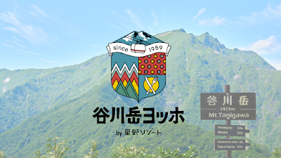

- **Place ID:** `ChIJJSz0C80WHmARlxi8fMSxOnw`
- **Address:** Japan, 〒379-1728 Gunma, Tone District, Minakami, Yubiso, 吹山国有林
- **Overall Rating:** 4.2 ⭐
- **Review Summary:** {'text': 'People say this mountain resort offers stunning panoramic views of the Tanigawa mountain range and features well-maintained hiking trails suitable for all levels. They also highlight the delicious local specialty, the "pan gratin," and the clean, well-maintained restrooms. Others also like the friendly and helpful staff, and the convenient indoor parking.', 'languageCode': 'en-US'}
- **Amenities Summary:** Parking: {"paidGarageParking": true} | Accessibility: {"wheelchairAccessibleParking": true, "wheelchairAccessibleEntrance": true}
#### Top 10 Positive Reviews:
- 5 Stars: I came  here on 10/21/23 to take photo of mountain Koyo. Because is not clear blue sky day I was lucky to see rainbow. The experience of sitting at cable car alone with colourful autumn leaves around was absolutely amazing !! Then rainbow did a magic touch  to the whole landscape  !! You can buy set ticket to go up to the top cost 3500yen including cable car and a lift . I was advice not to take lift since it is raining . At the 1319m top I saw many hikers , they told me 4 hours to hike to the top. My ticket cost 2000yen round trip . I should come back in summer to do the hike . If you like colourful autumn leaves 🍁 it is highly recommended. Only 2 hours from tokyo station, easy to do a day trip .
- 5 Stars: A grueling but highly rewarding winter hike with spectacular views.  Winter hike not advised for beginners.  Cramp ons, ice axe required, ski poles highly recommended.
- 4 Stars: We visited the Tenjindaira Observatory, transformed into a silver world by the heavy snowfall the night before. We took the ropeway and lift up, and the hike to the top took about 10 minutes. We enjoyed a 360-degree view. Perhaps because it was right after the snowfall, the air was incredibly clear. We could see Mt. Tanigawa right in front of us, and even distant peaks like the Yatsugatake and Mt. Fuji.
- 4 Stars: Beautiful ski resort and mountain. A little expensive. A little dated. Great ropeway and view. Many lifts and runs. Not crowded and fun. Good restaurant with nice workers.
- 4 Stars: Great experience. On a clear day you can see many distant mountains. Wish I had come better prepared for a little hike but there was so much snow.

#### Top 10 Negative/Lowest Reviews:
No negative reviews available.

---
### Mount Tanigawa
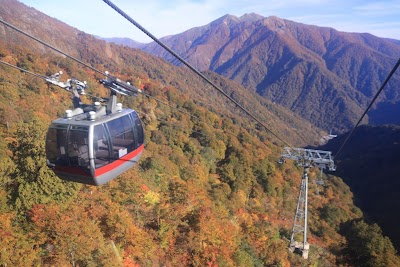

- **Place ID:** `ChIJmzCINf0QHmARoy3beRJ09SI`
- **Address:** Mount Tanigawa, Yubiso, Minakami, Tone District, Gunma 379-1728, Japan
- **Overall Rating:** 4.7 ⭐
#### Top 10 Positive Reviews:
- 5 Stars: Excellent place to check out. Quite an easy and short drive from Echigo Yuzawa station along the Joetsu Shinkansen line. Went in June and it was still rather chilly (about 10-12C in the day).
- 5 Stars: I climbed through Nishiguro ridge. the wind was strong and I can't see the trail path because of the clouds. I almost died. never forget that experience
- 5 Stars: rain rain and rain but we got it, it was hard and slippery the whole way but worth it. I can only recommend it.. we had only 10 minutes of open sky 😍 so beautiful!
- 5 Stars: Nature beauty at its finest. Took the doai route to the summit for 3hrs 9-25-22
- 4 Stars: Hiked Mt. Tanigawa (1977m) and was rewarded with stunning alpine scenery. The trail was rich with summer flowers, busy bees, and colorful butterflies. Though the weather was partly cloudy, the views of the surrounding green mountains were breathtaking. The ropeway ride offered a relaxing start, and the fresh mountain air made the climb refreshing. A beautiful destination for both nature lovers and hiking enthusiasts.

#### Top 10 Negative/Lowest Reviews:
No negative reviews available.

---
### Nagano Station
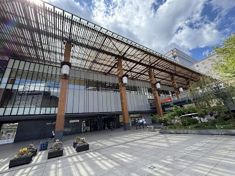

- **Place ID:** `ChIJh0bai5KGHWARO9I7pK11KTU`
- **Address:** Kurita, Nagano, 380-0921, Japan
- **Overall Rating:** 4.1 ⭐
- **Review Summary:** {'text': 'Visitors consistently describe this station as clean, modern, and well-organized, offering a wide variety of shops, restaurants, and souvenir stores. Convenient parking options are available, including 30 minutes of free underground parking.\n\nSome reviews mention the service can be inefficient.', 'languageCode': 'en-US'}
- **Amenities Summary:** Parking: {"freeParkingLot": true, "paidParkingLot": true} | Accessibility: {"wheelchairAccessibleParking": true, "wheelchairAccessibleEntrance": true, "wheelchairAccessibleRestroom": true}
#### Top 10 Positive Reviews:
- 5 Stars: Very clean, lots or food options before we go onto our bullet train to Tokyo. There is a Becks Coffee shop for more Western coffees NewDays convenience store to pick up snacks.
- 5 Stars: Shinkansen stop on our way to Snow Monkey Park.  Station is easy to navigate.  For bus tickets to the park, hang a right after exiting the turnstiles, vending machines that dispense tickets will be to your right inside the ticket offices.  English instructions can be selected.  Not very intuitive but manageable.  There is a tourism office across from the big passageway where the staff were super helpful.  I highly recommend stopping here 1st.  They provided clearer and more information for us to get to Snow Monkey Park, like bus timetables and location of bus stop.  We used a locker as we had a small roller and a backpack coming from Tokyo.  Paid using Suica.  On our return, we lingered a bit at Nagano Station.  There are many places to eat.  We decided on a ramen place downstairs near the escalators.  There was also a supermarket with a fantastic Japanese prepared food selection to include local desserts, which I loved during my time in Japan.  We also grabbed some snacks from a convenience store (Family Mart or Lawson) at the main station level before taking the Shinkansen out.  There is also a mural commemorating Nagano as an Olympic city.  Overall very robust and functional station as Nagano benefited in terms of infrastructure from the Olympics.
- 5 Stars: Came for the Tateyama Kurobe Alpine route. Very helpful guide at the tourist information centre. You can buy tickets for the express bus to Ogizawa at the bus stop itself (Bus stop 25- East side). There are no reserved seats so no point buying early. We came 30 min early for the 750am bus mid November. Bus wasn't full and only 15 or so people on the bus. Very easy process.
- 4 Stars: A mid-size train station, quite typical of many stations in Japan. Clean, efficient, and well organized. Trains — including the Hokuriku Shinkansen — run very smoothly and on time.  The station is easy to navigate and less overwhelming than the major hubs like Tokyo or Shinjuku. It also has a decent selection of shops, restaurants, and souvenir stores inside and around the station.
- 4 Stars: The JR station is nice and modern. But the subway station is old and totally outdated without even IC card capability.

#### Top 10 Negative/Lowest Reviews:
No negative reviews available.

---
### Alpico Bus Ticket Office
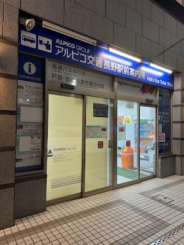

- **Place ID:** `ChIJ5SEdJ5OGHWARyjHm6TuPnSk`
- **Address:** Suehirochō-1355-5 Minaminagano, Nagano, 380-0825, Japan
- **Overall Rating:** 3.5 ⭐
- **Review Summary:** {'text': 'Visitors report that this bus station offers tickets for various routes, accepts cash and other payment methods, and has staff who provide suitable advice.\n\nOther reviews mention bus scheduling information can be lacking and service can be inefficient.', 'languageCode': 'en-US'}
- **Amenities Summary:** Accessibility: {"wheelchairAccessibleParking": false, "wheelchairAccessibleEntrance": true}
#### Top 10 Positive Reviews:
- 4 Stars: If you want to explore the wonderful Togakushi Shrine area by bus, this is the starting point of your journey. Buy the ticket and get onboard the bus from this shop. Make sure to check the timetable in advance, and be aware that the bus did not had toilet inside.

#### Top 10 Negative/Lowest Reviews:
- 1 Stars: Lacking information that there are reserved buses and free seating buses. We though we where going to our scheduled activity in the morning. We ended up going a lot later. It was also not said the last scheduled bus going was also a reserved seating bus. When we got to our destination we learned the reserved seating bus going back was already full and we where forced to leave way early also. The end result we only had an hours and half for our activity. Only enough to get a pic. Not even slightly worth it. If only we could our time or money back.
- 1 Stars: We bought reserved return tickets on the highway bus for pick up at Togakushi Soba Museum but the bus didn’t stop even as we were waiting there early. We found a local bus but the Aloico Bus Company wouldn’t even give us a full refund. Very poor service after making us stressed and wasting our precious holiday time.
- 1 Stars: A lady told me not to buy a ticket for my ride back from Togakushi to Nagano on Saturday. She told me to take the last public (not Alpico) bus from Chusha at 17:20, this is actually the LAST transport ever during the day. Really? At 16:00 everything was already dead there. It was getting very cold. Iformation office in Chusha does not speak English. THERE IS NO TAXI IN TOGAKUSHI to take you back home. I decided not to risk with this last bus which would ride long after sunset when all the drivers would be gone, and started hitch-hiking. Luckily, 2 kind Japanese ladies picked up me and an Australian female traveler who had the same problem. I invite all the members of this company to Europe, so they could probably learn how this job has to be done.
- 1 Stars: Travel at own risk. Came on Saturday at 745am for 820am bus. There is already a super long queue.  Basically they want to sell tickets but don’t bother to account for the pax volume.  Make everyone queue up and wait in turn, based on their existing bus frequencies. No effort to increase load volume.

---
### Togakushi
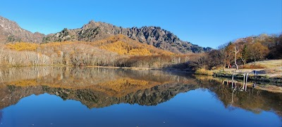

- **Place ID:** `ChIJp2dCGr4u9l8RWHLkTFFrG5s`
- **Address:** Togakushi, Nagano, 381-4101, Japan
- **Overall Rating:** N/A ⭐
#### Top 10 Positive Reviews:
No positive reviews available.

#### Top 10 Negative/Lowest Reviews:
No negative reviews available.

---
### Togakushi-Jinja Chusha
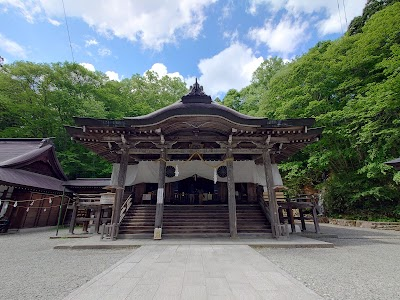

- **Place ID:** `ChIJqUaopGuF918R6vpw-DMDtyo`
- **Address:** Chūsha-3506 Togakushi, Nagano, 381-4101, Japan
- **Overall Rating:** 4.4 ⭐
- **Review Summary:** {'text': 'Visitors say this shrine features impressive, centuries-old cedar trees and a serene atmosphere, with a small, beautiful waterfall on the grounds. They also highlight the convenient free parking and the unique omikuji fortune-telling experience where a priest recites prayers. Many appreciate the clean restrooms and the proximity to delicious soba restaurants.', 'languageCode': 'en-US'}
#### Top 10 Positive Reviews:
- 5 Stars: 2.Mar.2026: snow has melted and the path is slippery. **Right Togakushi Chusha middle temple, You can see very large cedar trees here. If you are looking for Togakushi Okusha, top high temple, with the famous path lined by two rows of cedar trees, you must walk about 2 km further from Chusha. Many visitors mistakenly think Chusha is Okusha. You can save nearly half the walking time by taking the bus from Kagami Pond instead ò Togakushi Chusha. However, opposite the bus stop at Togakushi Chusha there is a tourist information center where you can rent boots for snowy heavy condition if you walk from Chúha to Okusha.
- 5 Stars: We came during the snowy winter. For travelers coming via public transport, be prepared for a long and slippery hike. The forest and trail covered in snow are absolutely breathtaking, but the cold mountain can also, quite literally take your breath. We had a great time there and took quite some amazing photos along the way.
- 5 Stars: Supposedly one of Japan's holiest shrines, taking a walk down a path in the middle of a dense forest before being greeted by the stunning sight of massive cedar trees lining the sides was really relaxing.  Along the way, you'll also be treated to stunning snowy landscapes (if the weather's good) and the incredible sight of residue snow flying off tree tops as a cooling breeze blows through the forest. However, I wasn't able to reach the shrine itself as the path was blocked due to concerns of a possible avalanche.
- 4 Stars: Nice shrine, made even more special with the 700 year old ancient tree. So many amulets for sale but no English translation; and frowned upon when using phone and GoogleTranslate. No picture policy. I also saw a local getting a stamp in her souvenir book. She paid ¥1,000. I always thought those stamps were free.
- 4 Stars: Drive through the middle shrine. If walking from the lower shrine estimated time will be 1.30 -2 hours

#### Top 10 Negative/Lowest Reviews:
No negative reviews available.

---
### Togakushi Campsite
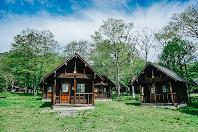

- **Place ID:** `ChIJod13la8v9l8RPEMZJWsl3PI`
- **Address:** Japan, 〒381-4101 Nagano, Togakushi, 大洞沢３６９４
- **Overall Rating:** 4.3 ⭐
- **Review Summary:** {'text': 'People say this campground offers spacious sites, clean restrooms with bidets, and well-maintained cooking areas with hot water. Visitors also highlight the wide variety of amenities, including a shop, coin showers, and a cafe, as well as the beautiful views of the Togakushi mountain range. Guests mention the staff are helpful and responsive, and the location is convenient for nearby attractions.', 'languageCode': 'en-US'}
- **Amenities Summary:** Parking: {"freeParkingLot": true, "paidParkingLot": true, "freeStreetParking": false, "paidStreetParking": false, "freeGarageParking": false, "paidGarageParking": false} | Accessibility: {"wheelchairAccessibleParking": true, "wheelchairAccessibleEntrance": true, "wheelchairAccessibleRestroom": true}
#### Top 10 Positive Reviews:
- 5 Stars: One of our best caming-experiences in Japan! For 1500 Yen per night with a camper you cant really go cheaper. The camping-ground itself is pretty big. We could park our camper wherever we wanted and had lots of space for us. Toilets and showers were superb, however a coin-exchange machine was missing for the 300 for the shower. However the shower itself was ideal! There was even a nice route around the area for a short jogg. All in all a wonderful experience! 10/10, would camp again
- 5 Stars: Lovely.with flgreat hiking courses around .farm coin shower.bbq and tent to rent
- 5 Stars: Beautiful site
- 5 Stars: Wonderful
- 5 Stars: 

#### Top 10 Negative/Lowest Reviews:
No negative reviews available.

---
### Upper Togakushi Shrine
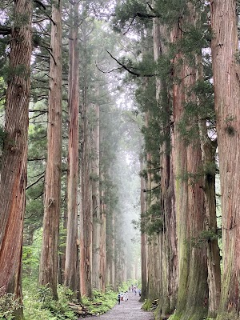

- **Place ID:** `ChIJy80iekYu9l8RmSU5rs3-acA`
- **Address:** 3506 Togakushi, Nagano, 381-4101, Japan
- **Overall Rating:** 4.6 ⭐
- **Amenities Summary:** Accessibility: {"wheelchairAccessibleParking": false, "wheelchairAccessibleEntrance": false}
#### Top 10 Positive Reviews:
- 5 Stars: Went there 31/12/2025. Need to walk from main road to this big tree. Icy condition. Snow shoes/spike would be great to have.  Walk is around 15-20 mins normal pace.
- 5 Stars: We trekked in with our snowshoes and had no issues getting to the shrine. We saw many others walking, which I would not recommend. The path becomes slippery and at the end, it is very easy to fall as you’re walking up or down from the shrine. Do not stand too close to the buildings as you just don’t know when the snow might slide from the top. The pathway up is beautiful thanks to the huge cedar trees. If you’re in the area don’t miss your chance!
- 5 Stars: Great time. I came there at the beginning of April and I only can walk pass the first Shrine, they blocked the way to second and third shrines due to bad road conditions (too much icy snow on the path). I do not know where to check this information, so wish you much more luck than us. If you travel with a group of at least 4 people, it’s better to take a taxi there cause the waiting time for a bus and travel time is quite long. Taxi costs around 12k. Worth visiting even though I could not complete the whole three shrines
- 5 Stars: We decided to hike the upper shrine and parked our car nearby. The trek took us about 40 mins each way or about 2km. Steep climbing of steps and bring a walking stick. The journey was wonderful and must say both my legs felt wobbly after 4km.
- 4 Stars: 4 out of 5, minus 1 only because it's basically a lovely walk through the forest and for the 1.5 hours from Tokyo plus the hour to the shrine at a cost of over $70, it wasn't worth it IMHO.  If one is in Nagano (for Obuse also, and other stuff, then a decent day trip, but I wouldn't just do Togakushi from Tokyo). By comparison, Nikko would be a way better day trip from Tokyo.  But it was nice and I'm glad I did it, but I don't see me ever doing this again.  Basically an lovely walk in the forest to see a very small shrine.  More than one way to get here but I used the private bus from Bus Stop #7  by Nagano Station (it's actually across the street fro the bus roundabout).  There is a bus ticket office right there, and I bought a round trip reserved seat ticket that left within 20 minutes.  There were quite a few people there already (and arriving after me), the bus was full.  This bus stops at six? 7 stops in the little village where all the shrines are, and also goes to a camping ground past this stop.  There are great maps for the area (in English), and shows you the hiking paths and distances/times.  You can get on the return bus from any of the stops.  I also had a reserved time for 2 PM but was done early and tired and was able to get on the 1230 bus. I just showed my return ticket and he gave me a new reserved seat. I do recommend buying a reserve seat for the return if you are day-tripping, your last bus might be sold out.  Once you leave the village (takes about 10-15 minutes to stop at all the stops) the bus doesn't stop for 30 minutes until it is back at Nagano station.  BTW, the last 10-15 minutes of hike to the shrine are stairs.  All the instagram photos shows the trees and path, but yeah, lots and lots of stairs, 5 stories worth (ish).  There is a restroom at the bus stop and a restaurant for soba and ice cream.  There are way more restaurants at the main shrine area. There is a bathroom along the trail.

#### Top 10 Negative/Lowest Reviews:
No negative reviews available.

---
### Togakushi Shrine Okusha (Main Shrine) Zuishinmon
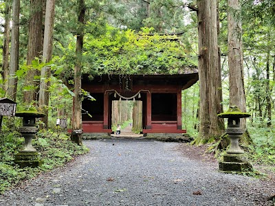

- **Place ID:** `ChIJh-a7rVsu9l8R_A6PXgFs0hs`
- **Address:** Togakushi, Nagano, 381-4101, Japan
- **Overall Rating:** 4.6 ⭐
- **Review Summary:** {'text': 'Visitors say this shrine features a beautiful, historical red gate with a roof covered in lush plants, marking the entrance to a sacred area. They also highlight the serene atmosphere and the impressive, towering cedar trees lining the path. Guests mention the walk is peaceful and offers stunning natural scenery, making it a worthwhile experience in any season.', 'languageCode': 'en-US'}
- **Amenities Summary:** Accessibility: {"wheelchairAccessibleParking": false, "wheelchairAccessibleEntrance": false}
#### Top 10 Positive Reviews:
- 5 Stars: 随神门 (Zuishinmon Gate)  The Boundary: Human vs. Divine: It marks the exact point where the human world ends and the sacred realm of the gods begins.  Official Entrance: Passing through this red gate signifies you have officially left the "mortal world" behind.  The air cools noticeably the moment you step across the threshold.
- 5 Stars: My fiancé and I went in the winter so the upper shrine was closed unfortunately, but the cedar trees were well worth the visit. The towering lumber makes you really feel minuscule compared to nature. It was beautiful with the snow as well. I don’t think I’ve seen a more fitting combination. We ended up making a snow man to stand watch and warn future guests of the dangers that lie ahead.
- 5 Stars: This place is so magical in winter. Once in a lifetime experience. The cedar trees and snowy landscape completely displaying an out of this world scenery.  Be mindful of very very slippery road when you are on your way to the shrine, its no joke.
- 5 Stars: Such a beautiful shrine in the woods.  A steep stair walk up to the shrine and all part of the pilgrimage. If you’re carrying on up to the other shrines, though,  we might recommend starting above it and taking the trail down. Buy Alpico bus tickets in advance.
- 5 Stars: Absolutely stunning in winter. We went on 02/11/2025 and we arrived at around 9am and huge crowds came after us so it’s best to go a bit early. It’s around a 20min walk from the entrance to see the towering cedar trees. It was worth driving up here. Parking costs ¥800 for the first 3 hours.

#### Top 10 Negative/Lowest Reviews:
No negative reviews available.

---
### Togakushi Ninja Museum・Ninja Trick Mansion
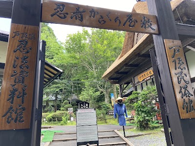

- **Place ID:** `ChIJqb-wPfcu9l8Rl4esSWxms54`
- **Address:** 3688-12 Togakushi, Nagano, 381-4101, Japan
- **Overall Rating:** 4.4 ⭐
- **Review Summary:** {'text': 'Visitors say this ninja house offers a challenging and fun "karakuri yashiki" (trick house) experience with hidden doors and rotating walls, along with a thrilling "bikkuri-do" (shaking room) and shuriken throwing. They also highlight the reasonable admission fee and the friendly, helpful staff. People recommend visiting during less crowded times to fully enjoy the puzzles and avoid spoilers.', 'languageCode': 'en-US'}
#### Top 10 Positive Reviews:
- 5 Stars: this was so fun and worth the time and ticket price. we went here after visiting Togakushi Okusha and waiting for our Alpico bus. i won a stamp notepad after hitting 5/7 times at the shuriken dojo.  the ninja trick mansion is a must-go. it might take around 1 hour or so but very worth the try. it's so interesting, one hint is to try to move anything to find the way; going with a bigger group can make it easier. highly recommend for family and friends! i went on weekday so no wait and no queue at all.
- 5 Stars: After you come off of the bus from Nagano Station, cross the road immediately and climb the stairs, that's the museum location. It's absolutely a bargain, the ticket price compared to the experience that we had together as a family with young children. The highlights were definitely the ninja house, where you have to solve your way out, and also the ¥200 for 7 times throwing shuriken. You will even get a notepad for stamps if you hit it 5 times. The obstacles such as balancing beams and ropes were also fun and exhausting at the same time. Definitely a must if you have teenagers and children in your group. I recommend skipping the artifacts, the building was smelly.
- 5 Stars: Worth the cost of bus ride up there from nagano station, ninja house a def must especially for us big kids, then the walk through the cedar forest, but if your going to do the walk grab bus to ninja village then walk to shrine then down hill from there if your going to do that then def go early as and def buy a bear bell
- 5 Stars: Interesting museum full of old ninja tools. The ninja house is the most exciting part of this museum. So you enter this house and you have to find the exit just like how the ninjas were trained to find values and hidden doors (similar to an escape room experience). Another fun part was the shuriken throw, for ¥700 you get 7 shuriken and you have to hit the target. This was a fun place to visit and I'd definitely go back!
- 4 Stars: Brought my kids here to experience the life of a ninja on a Monday. No crowds at all, maybe around 3 families were here.  This place is not wheelchair friendly. However, can ask staff to open the side door instead going down the slope which is dangerous for wheelchair.  There's a cafe that sells delicious food. We enjoyed the rice with chicken which has smokey taste and ramen. Also has many cute items and lunch such as pizza, burger, udon, drinks, and desserts. Payment via cash or QR code. Free flow cold water, soup or hot green tea dispenser machine available.  Can buy admission only ticket or the all-inclusive passes. Also ninja costume rental is 500 yen per child and comes in different colours. We started from the adventure trail followed by indoor games. There were only 2 main staffs that assisted us in the indoor games.  The outdoor adventure trail has different levels. We accidentally tried the advance 5 star challenge which was abit scarry for us but managed to overcome as a family (youngest 6 years old) after a few tears due to fear of heights.  One of my child with special needs fell into the water during the "water walking spider" activity. The wooden float went faster than his hands that was holding the rope. Luckily we brought extra clothes to change. Managed to buy new socks and shoes from the souvenir shop. Credit card payment available at the shop.  Generally a memorable experience although it's smaller than the Uzumasa Kyoto Village Ninja escape room in Kyoto which also includes ninja performance and more indoor games for children.

#### Top 10 Negative/Lowest Reviews:
No negative reviews available.

---
### Uzuraya
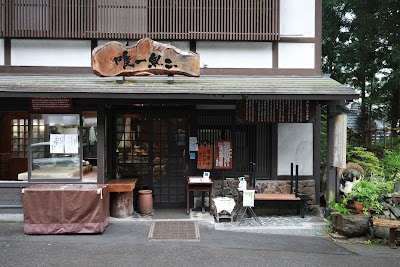

- **Place ID:** `ChIJHZ_ui74u9l8Ry0pNBkGOHcA`
- **Address:** 3229 Togakushi, Nagano, 381-4101, Japan
- **Overall Rating:** 4.5 ⭐
- **Review Summary:** {'text': "Diners like this soba restaurant's delicious, freshly made soba noodles and crispy tempura, especially the seasonal vegetables and sobagaki. They also highlight the warm, attentive, and professional service from the staff, who often offer helpful guidance. Guests mention the traditional, cozy atmosphere and appreciate the convenient system for waiting, which allows for nearby sightseeing.", 'languageCode': 'en-US'}
- **Amenities Summary:** Parking: {"freeParkingLot": true} | Accessibility: {"wheelchairAccessibleParking": false, "wheelchairAccessibleEntrance": false, "wheelchairAccessibleSeating": false}
#### Top 10 Positive Reviews:
- 5 Stars: The tempura was excellent!!! The best I’ve ever tasted- super thin coating, light and crispy. The services were so warm and cute. The staffs don’t speak much English but they tried their best to communicate and always smiling. The chef came out to talk to us about his Sake haha. Definitely coming back!!!!!! Soba size is a bit on the thinner size less chewy so that’s up to your preferences. They have this unique wasabi/ginger/peppery sauce that we love but they don’t sell when asked. If you guys know what it is please share.
- 5 Stars: Went on New Years (1st Jan), had a reservation at 1pm, and got in at around 2pm due to a huge crowd.  Soba Dumpling: (3/5) Big enough for 4 pax, soft texture and interesting taste (has no filling inside, just soba!) Served with miso wasabi sauce and other flavourings. It wasn’t our favourite but is interesting!  Hot Soba Soup: (5/5) Simple and delicious 😋  Zaru Soba (Cold): (5/5) I’ve only had a few sobas in Japan, but this is the best so far, being especially springy and smooth. It tasted so good we had to order more!
- 5 Stars: "I think this soba restaurant is the most popular in the Togakushi area, but they make a limited number of noodles each day. Here’s a tip: you should sign in early in the morning before you start visiting the shrines. You can sign up starting at 4 AM, and then you can come back to the restaurant whenever you want until 3 PM.
- 5 Stars: One of the best zaru soba place i visited in Japan. The soba noodle are freshly made here, soft and chewy super delicious. Great service with very friendly owner. Highly recommened.
- 5 Stars: Wonderful service staff who welcomed foreigners warmly in the magical and spiritual town of Togakushi.  Ordered the seasonal mountain vegetable tempura oroshi soba- what a feast of the season.  Texture of soba was thin and smooth, with a hint of buckwheat aroma.  Pro tip: long waiting time- leave your name with the staff once you arrive and start visiting the nearby temples and other attractions.

#### Top 10 Negative/Lowest Reviews:
No negative reviews available.

---
### Okusha-mae Naosuke
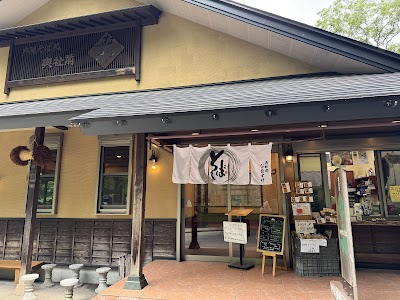

- **Place ID:** `ChIJNQfMB_cu9l8RmCY4-bhH1PE`
- **Address:** Japan, 〒381-4101 Nagano, Togakushi, 奥社3688-1
- **Overall Rating:** 4.3 ⭐
- **Review Summary:** {'text': "Diners like this restaurant's delicious soba, especially the cold soba, and the tempura is frequently described as crispy and flavorful. They also highlight the unique and tasty soba and kumazasa soft-serve ice cream, along with the spotless restrooms. Guests mention the staff are kind and attentive, and many appreciate the scenic counter and terrace seating.", 'languageCode': 'en-US'}
- **Amenities Summary:** Parking: {"paidParkingLot": true} | Accessibility: {"wheelchairAccessibleParking": false, "wheelchairAccessibleEntrance": false}
#### Top 10 Positive Reviews:
- 5 Stars: We only tried the warm oyaki from their side store. Vegetable, sweet walnut miso and red bean.  It was very tasty and I prefer the vegetable one. There are benches to sit on and enjoy the view as you relish the oyaki.
- 5 Stars: Nice staff and delicious food Recommend the 蓮根天婦羅 Lucky to have the window side seat Enjoy a pleasant lunch
- 4 Stars: Fairly priced soba compared to nearby restaurants. Also have the ability to just get tempura without the soba. Soba and tempura were good, not sure what the other reviews are about. Would recommend getting the shiso juice, unique but in a good way! Could be quite cramped due to seating being close together.

#### Top 10 Negative/Lowest Reviews:
- 2 Stars: Compared to other places, the price here was quite steep. Unfortunately, the food quality didn't justify the high cost. We waited in a long line to get in, but it turned out to be a letdown

---
### Matsumoto Backpackers
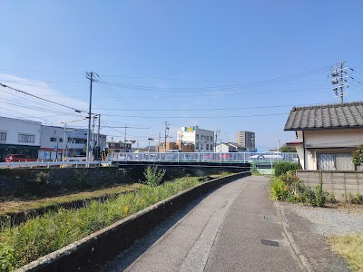

- **Place ID:** `ChIJiyCxO4gOHWAR85d9ZL2b53I`
- **Address:** 1-chōme-1-6 Shiraita, Matsumoto, Nagano 390-0863, Japan
- **Overall Rating:** 4.3 ⭐
- **Review Summary:** {'text': 'People say this hostel offers comfortable, well-maintained rooms with amenities like air conditioning, heating, and free Wi-Fi, and some rooms provide cooking utensils. Visitors also highlight the excellent value for money and the welcoming, social vibe. They also mention the staff are very friendly and accommodating, offering helpful local tips.', 'languageCode': 'en-US'}
- **Amenities Summary:** Accessibility: {"wheelchairAccessibleParking": false, "wheelchairAccessibleEntrance": false}
#### Top 10 Positive Reviews:
- 5 Stars: Would strongly recommend!  The place couldn’t have been tidier, safer, or more welcoming. The host Brian was lovely. He greeted me upon arrival with a smile (even though I was 45 minutes later than I said I would be), showed me around, and recommended locations in the area. He also helped direct me to Norikura where I was staying the next night - without him I would’ve been walking for 2+ hours.  Moreover, it’s located about 5 minutes walk from the station, making it awfully convenient.
- 5 Stars: Super convenient, quiet and well maintained. If you're lucky enough to bump into the owners during your stay, they are the kindest people in the world. Booked direct for the best deal.
- 5 Stars: The rooms were very comfortable and homely. The staff were incredibly friendly and welcoming. The location is perfect, just outside the busy hotel area of the city and adjacent to the river. It is also a 5 minute walk from the main shrine and a 10 minute walk from the castle. Would highly recommend this as high quality and very affordable accommodation for matsumoto.
- 5 Stars: I definitely recommend this place! We took family room at the second floor. It is neat complete with beddings air conditioner and heater and free wifi.  You can also bring food and cook since cooking utensils are provided.The place is just a short walk from the train station. The owner is also very accommodating, he even gave us tips on the places we have to visit.

#### Top 10 Negative/Lowest Reviews:
- 2 Stars: There is absolutely no reception space, anybody can come in and out, no security, the door code is useless. No one available in case of questions about the surroundings or possible issues around the house. Tried to use the heating in the bedroom and a lot of smoke came out, very dangerous with tatami floors. Absolutely no isolation from outside or through the walls, you can hear everyone's business in the bathroom, kitchen, very small communal room. Disappointing

---
### Matsumoto Castle
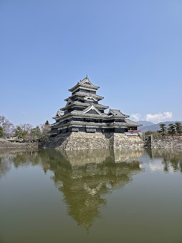

- **Place ID:** `ChIJmVmaCoUOHWARVPa8-iAOLZA`
- **Address:** 4-1 Marunouchi, Matsumoto, Nagano 390-0873, Japan
- **Overall Rating:** 4.5 ⭐
- **Review Summary:** {'text': 'People say this castle is beautiful, with a striking black exterior, and features interesting historical displays, including a collection of firearms. Visitors also highlight the well-maintained grounds, which are perfect for photography, and the option to purchase e-tickets for smoother entry. They also mention the staff are friendly and helpful, with some offering free English-speaking tours.', 'languageCode': 'en-US'}
- **Amenities Summary:** Parking: {"freeParkingLot": true, "paidParkingLot": true, "paidStreetParking": true} | Accessibility: {"wheelchairAccessibleParking": false, "wheelchairAccessibleEntrance": false}
#### Top 10 Positive Reviews:
- 5 Stars: Unlike many other rebuilt castles in Japan, this is an original castle, one of Japan's twelve original keeps. You can really feel the age and authenticity as you climb through the interior.  The exterior and the surrounding moat are impeccably kept and look very classy.  The wooden stairs inside are incredibly steep and narrow (almost like ladders in some spots). You’ll need to take your shoes off at the entrance, so wear nice socks!  They have free English-speaking volunteer guides, they are very friendly and knowledgeable.  The night illumination and light projection are a must-see. The reflection of the castle in the moat during the show is perfect for photos.
- 5 Stars: The exterior of the castle was my highlight along with the staff. The grounds were beautiful and I have a huge appreciation for the beautiful structure that is 3x older then our country! Truly impressive. We only just stumbled across this castle and last minute decided to stop as we were passing through and so pleased we did! We ended up buying a ticket and entering the castle - line was minimal but as we left we could see the line growing, so possibly worth purchasing online and getting there early.
- 5 Stars: Matsumoto Castle was an absolutely wonderful experience. We were lucky to visit on a stunning day with relatively light crowds, which made it even more enjoyable to take in the history and atmosphere of the castle.  Exploring inside really gives you a sense of its past, though be prepared — some of the stairs are quite steep and may be challenging for those with mobility issues.  The cherry blossoms were just beginning to bloom, adding a beautiful touch to the setting. One of my favorite moments was seeing all the koi fish gliding through the water around the castle — it made the whole scene feel especially peaceful and picturesque.  Highly recommend visiting if you’re in the area!
- 5 Stars: We stopped by Matsumoto Castle and even just seeing it from the outside was impressive. The castle looks stunning and striking against the surroundings and definitely has that classic, majestic feel.  There are quite a few parking lots around the area, so it’s easy enough to find a spot and just walk over. There are also clean public toilets right outside, which is convenient. We didn’t go inside this time, but honestly, even just taking in the view from the outside felt worth it. If you’re in the area, it’s an easy and worthwhile stop.
- 4 Stars: Beautiful Castle, But Not for Everyone  Matsumoto Castle is undoubtedly one of the most beautiful castles in Japan. The striking black exterior, the surrounding grounds, and the reflections in the moat make it a wonderful place to visit and photograph. The castle has a genuine historic feel and is far more authentic than many other castles that have been heavily reconstructed.  However, visitors should be aware that the interior is not suitable for everyone. The wooden staircases inside are extraordinarily steep, narrow, and, at times, quite claustrophobic. Going up is challenging enough, but coming down requires considerable care. A slip could easily result in a serious fall, particularly for older visitors or anyone with mobility issues.  That said, the steep staircases are part of the castle’s original character and history, so they do provide an authentic glimpse into how these structures were built centuries ago.  Overall, a fascinating and beautiful historic site that is well worth visiting, but it is important to know what to expect before climbing to the upper levels.

#### Top 10 Negative/Lowest Reviews:
No negative reviews available.

---
### Nawate Shopping Street
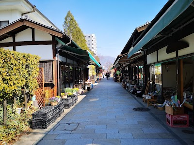

- **Place ID:** `ChIJR-XzQo4OHWAR3o9GleBXoi0`
- **Address:** Japan, 〒390-0874 Nagano, Matsumoto, Ōte, 3-chōme−4−３ 松本Ｍ―１
- **Overall Rating:** 4 ⭐
- **Amenities Summary:** Parking: {"paidParkingLot": true} | Accessibility: {"wheelchairAccessibleParking": false}
#### Top 10 Positive Reviews:
- 5 Stars: A charming little street on the way to Matsumoto Castle. Nawate Street is short but packed with character. I loved the scenic riverside walk with beautiful vintage lamp posts. It’s right next to Yohashira Shrine, where you can sit and enjoy a peaceful moment. Great local snacks and lovely small shops. Highly recommend for a relaxing break!"
- 4 Stars: Came here around first week of February 2026 at night time but there were no open stores, not sure why, thought I’ll be seeing food stalls or yatais. It’s the gateway towards Matsumoto castle and the views during my walk from Matsumoto station to here was pretty neat.
- 4 Stars: I think if you’re walking to the castle it’s worth the detour down here, there were a few shops selling a variety of things. It was very quiet and there’s a few cafes at the end. Wasn’t exactly a life changing experience but cute.
- 4 Stars: Long shopping street but it is not so happening. Slow and relaxing stroll with many shops selling food and sounviners. There is a big frog statue for photographing, and a frog shrine too
- 4 Stars: I visited this area in mid-July 2023. There are plenty of souvenir shops, cafes, and snack stalls around. Right at the entrance, you’re welcomed by a frog statue—super cute and unique! I really loved the retro vibe of the whole place. If you walk further in, there are lots of charming little alleys to explore. Definitely worth taking your time to wander around!

#### Top 10 Negative/Lowest Reviews:
No negative reviews available.

---
### Nakamachi Dori
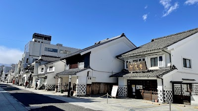

- **Place ID:** `ChIJURknZY4OHWARiO7O3rM2h4k`
- **Address:** Nakamachi Dori, Chūō, Matsumoto, Nagano 390-0811, Japan
- **Overall Rating:** N/A ⭐
#### Top 10 Positive Reviews:
No positive reviews available.

#### Top 10 Negative/Lowest Reviews:
No negative reviews available.

---
### Matsumoto Karaage Center
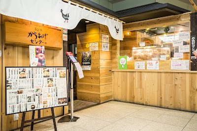

- **Place ID:** `ChIJ25LHw4sOHWARGO_jEMazFKk`
- **Address:** Japan, 〒390-0815 Nagano, Matsumoto, Fukashi, 1-chōme−1−１ MIDORI 4階
- **Overall Rating:** 3.7 ⭐
- **Review Summary:** {'text': "Diners like this restaurant's crispy and juicy karaage and sanzoku-yaki, which are generously portioned and flavorful. They also highlight the convenient location within the train station and the reasonable prices.\n\nOther reviews mention the service can be inattentive.", 'languageCode': 'en-US'}
- **Amenities Summary:** Parking: {"paidParkingLot": true} | Accessibility: {"wheelchairAccessibleParking": false, "wheelchairAccessibleEntrance": false, "wheelchairAccessibleSeating": false}
#### Top 10 Positive Reviews:
- 5 Stars: Amazing fried chicken! I’m genuinely confused by the low ratings here. The chicken is perfectly fried—crispy, juicy, and not dry at all. They have 3 varieties of sauces to choose from and great side dishes to balance out the grease. Ordering via QR code is super convenient, and the service is lightning fast. Highly recommended!
- 5 Stars: This was recommended by the Lonely Planet- Japan book, and definitely worth the recommendation. They had a variety of food sets at very affordable prices. The chicken is so tender juicy and crunchy. They also offer takeout.
- 5 Stars: The two-style chicken menus were delicious, offering a tasty flavor and crispy texture while keeping the meat juicy. Various sauces were available on the table. Additionally, the all-you-can-eat pickled bean sprouts were very yummy. However, when it comes to the service, it was a little uncomfortable. I arrived there around 6:30 PM and joined the queue around 7 PM. While I was eating, I felt like the staff really wanted to go home because they came and looked at me many times, and not just one staff, but all of them. They did this to many tables around me as well.
- 4 Stars: Upon arrival at Matsumoto station at around lunchtime, our group of five excitedly hurried to the fourth floor of the Midori mall to eat at the interestingly-named Matusmoto Karaage Center to try the local specialty of sanzoku-yaki. We saw a short line that was moving fast and wrote our names down on a queuing list outside the entrance and were guided to our table within 10-15 minutes. The interior was painted in black with a seating section that required you to remove your shoes, with a slightly noisy interior playing music and with slightly loud conversations. Japanese and English menus are available.  We ordered the sanzoku-yaki curry, double chicken (katsu and sanzoku-yaki) with tartar sauce and apple sauce, and regular sanzoku--yaki. Our food was served within 10-15 minutes. The highlight of this restaurant, the sanzoku-yaki, was larger than the average karaage and resembled a katsu in size, being very crispy, juicy, and tasty, bearing a hint of garlic in its inherent flavor - giving a unique experience to those looking for a new way to enjoy karaage. The curry was standard and more on the sweet side, not being too spicy and was complimented by fukujinzuke on the side. The double chicken was served with a small portion of chicken katsu, which was standardly juicy, crispy, and tasty. However, we found that the mustard-based dipping sauce served with the other sanzoku-yaki set was tastier than either the tartar and apple sauce and thus paled in comparison. In general, the portions were large and reasonably filled our stomachs prior to exploring Matsumoto. We spent about 1000-2000 JPY per person.  Overall, I would recommend this place for karaage enthusiasts looking for a large meal with a short wait and reasonable prices.
- 4 Stars: Conveniently located on the 4th floor of the Matsumoto Train Station. Menu has only a few options, but whatever is there is great! The karaage is fantastic - batter is light and cripsy and the chicken is sooo tender and juicy. And the rice was really fluffy and addictive!  Best to arrive really early because of limited seating and also long queues due to popularity. They close at 8 sharp; last order is at 7.30 and payment has to be made by 7.50pm - so it can be rushed for latecomers. They do takeaways too.

#### Top 10 Negative/Lowest Reviews:
No negative reviews available.

---
### Shinshimashima Station
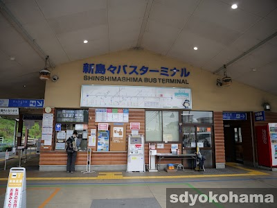

- **Place ID:** `ChIJr1vJiiIUHWARybTUdPnBmEM`
- **Address:** Hata, Matsumoto, Nagano 390-1401, Japan
- **Overall Rating:** 4.1 ⭐
- **Amenities Summary:** Accessibility: {"wheelchairAccessibleParking": true, "wheelchairAccessibleEntrance": true, "wheelchairAccessibleRestroom": true}
#### Top 10 Positive Reviews:
- 5 Stars: A small station that serves as the junction between Kamikochi and Matsumoto. There’s a small waiting area where you can stay until just before your train arrives.
- 5 Stars: A very small train station at the end of the line.  A jumping off spot to Kamikochi through bus transfer.  Very clean restroom and a sizable waiting room with lots of vending machines for drinks but I don't see food vendors.
- 5 Stars: A small station with toilets, coin lockers, and vending machines. Signs were easy to understand. Also, the staff were really helpful.
- 5 Stars: Bus to Kamikochi and a few other locations from here. Credit cards are accepted. Quiet and peaceful. The staff is helpful and will guide you well.
- 4 Stars: A small terminal station of Matsumoto Dentetsu Kamikochi line. It's also a bus terminal for travelling to Kamikochi. There are some basic facilities such as toilets and vending machines.

#### Top 10 Negative/Lowest Reviews:
No negative reviews available.

---
