# Deep Dive: Reviews & Photos

### Japanese Spa 都 Miyako
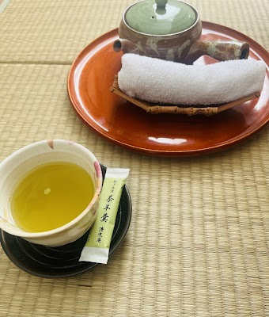

- **Place ID:** `ChIJh6juMFyxxUcRHsdBM_EbOEE`
- **Address:** Lobelialaan 13, 2555 PA Den Haag, Netherlands
- **Overall Rating:** 4.9 ⭐
- **Amenities Summary:** Parking: {"freeStreetParking": true}
#### Top 10 Positive Reviews:
- 5 Stars: I was gifted a Japanese head spa and a Japanese massage, and both were absolutely wonderful. Chisako is an incredibly friendly and welcoming masseuse. Her knowledge and technique are truly professional, and you can feel that she knows exactly what she’s doing. I felt completely renewed after the treatments.  I will definitely be coming back and would highly recommend her to anyone in The Hague or even further away. Her massages are absolutely worth the trip.
- 5 Stars: I wish I booked here earlier! Today was the first time here having a facial massage, I think this was the best massage I had so far! Chisako really knew what she was doing, the massage was relaxing and having the right pressure, and the oil smelled amazing. I have booked my next appointment right away. Highly recommend! :)
- 5 Stars: I am very satisfied, with the different treatments/massages, in this salon. The salon is very clean and Chisako is professional and kind.
- 5 Stars: The massage was a relax treat for myself, it was exactly what I needed. Chisako is very sweet and considerate and you will get pampered from beginning to end.
- 5 Stars: Excellent Japanese spa, we tried aromatic tea here for the first time, it was simply divine, thank you))

#### Top 10 Negative/Lowest Reviews:
No negative reviews available.

---
### Hotel Amanogawa in Shirabiso highlands.
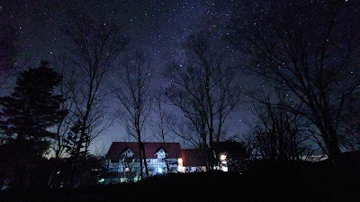

- **Place ID:** `ChIJ4WaTK_B-G2ARWUPCiIK0ZbM`
- **Address:** 979-53 Kamimura, Iida, Nagano 399-1403, Japan
- **Overall Rating:** 4.3 ⭐
- **Review Summary:** {'text': 'Guests mention this hotel offers delicious, voluminous meals with seasonal ingredients, and many highlight the stunning panoramic views of the Southern Alps. They also appreciate the cool temperatures, even during summer, and the quiet, peaceful atmosphere. Visitors say the staff are kind and helpful, and the hotel provides binoculars for stargazing.', 'languageCode': 'en-US'}
- **Amenities Summary:** Accessibility: {"wheelchairAccessibleParking": true, "wheelchairAccessibleEntrance": true}
#### Top 10 Positive Reviews:
- 5 Stars: I stay in Nagano several times a year. I wanted to stay at a place I hadn't been to before, so I made a reservation. The stars are beautiful. There is a large public bath with hot springs, but the water is heated. It seems that many people who love stargazing are repeat customers.
- 5 Stars: Shirabiso Plateau Milky Way in the Southern Alps  Accommodation in the Southern Alps  Spring Menu [Appetizer: Yoro Tofu] [Appetizer: Five Seasonal Dishes] [Sashimi: Tenryu Salmon, Horse Sashimi] [Grilled: Shinano Snow Trout, Toyama Konnyaku and Akamoku Seaweed Marinated in Soy Sauce] [Cold Dishes: Sous Vide Chicken with Butterbur Miso and Colorful Vegetables] [Steamed: Steamed Habutae with Shungiku, Clams, Yuba, and Scallops] [Simmered Bamboo Stew with Grilled and Marinated Sockeye Trout] [Daimono: Pork and Tomato Shabu-Shabu with Vegetable Dashi] [Rice: Bamboo Shoot Rice] [Miso Soup] [Pickles: Local Pickled Vegetables] [Dessert: Seasonal Fruits]  [Drinks] [Shimoguri Sweet Potato Shochu "Amanosato": ¥600
- 4 Stars: I stayed here on November 2, 2025.  Even though it's at a high altitude, the food was delicious and the scenery was beautiful.  I got there by motorcycle, and since the hotel is just over the mountain pass, I enjoyed the curves as I arrived. I think bikers will enjoy it.  It snowed around 7:00 AM, and it seems to have been the first snowfall of the season.  The whole area quickly became covered in white, and I thought it would be impossible to return, but the hotel staff spread salt and calcium carbonate on the roads and helped me shovel the snow.  Checkout was at 10:00 AM, but they allowed me to stay until around noon. The snow stopped, and thanks to the salt and calcium carbonate, the roads were clear, so I was able to depart.  Maybe because I stayed with the Biker Support Plan... I even received a local sticker.  The day I stayed, it was cloudy, so I couldn't see the starry sky, but it was a hotel that made me want to stay again and try again! Thank you!

#### Top 10 Negative/Lowest Reviews:
No negative reviews available.

---
### Narita International Airport

- **Place ID:** `ChIJVze90XnzImARoRp3YqEpbtU`
- **Address:** 1-1 Furugome, Narita, Chiba 282-0004, Japan
- **Overall Rating:** 4.3 ⭐
- **Review Summary:** {'text': 'Visitors say this airport is exceptionally clean, well-organized, and easy to navigate, with clear English signage throughout. They also highlight the wide variety of shops and restaurants, including duty-free options, and the efficient immigration and security processes. Guests mention the staff are consistently polite, helpful, and provide excellent service.', 'languageCode': 'en-US'}
- **Amenities Summary:** Parking: {"paidParkingLot": true, "paidGarageParking": true} | Accessibility: {"wheelchairAccessibleParking": true, "wheelchairAccessibleEntrance": true, "wheelchairAccessibleRestroom": true, "wheelchairAccessibleSeating": true}
#### Top 10 Positive Reviews:
- 5 Stars: Narita International Airport is a large and well-organized international airport, and overall a solid entry point into Japan. The layout is straightforward once you get familiar with it, and signage in English makes navigation easier for international travelers.  Immigration and baggage processes were fairly efficient, though it can feel a bit busier and slower compared to Haneda, especially during peak arrival times. That said, everything still moves in an orderly way.  The airport has a good selection of shops, restaurants, and duty-free options, so there’s plenty to do if you have time before your flight. Seating areas are comfortable and generally well-maintained.  It’s a bit farther from central Tokyo, but transport connections are reliable and well integrated. Overall, a functional and dependable airport experience that gets the job done smoothly for international travel.
- 5 Stars: One of the most efficient and well-organized airports I’ve experienced. Everything runs smoothly — from check-in to security and immigration — with minimal waiting time. The airport is exceptionally clean, clearly designed, and easy to navigate. Staff are polite and helpful, and there’s a great mix of dining and shopping options. Overall, a calm, high-quality travel experience. The only downside is the distance from central Tokyo, but the efficiency more than makes up for it. 9.5/10 — highly recommended.
- 5 Stars: ## A Review of Narita International Airport (NRT) Narita International Airport serves as the primary international gateway to Tokyo and the rest of Japan. Although it is located about 60 kilometers outside of central Tokyo in Chiba Prefecture, it remains a favorite for many international travelers due to its efficiency and high standards of service. ### Transport and Connectivity One of the best things about Narita is the variety of transportation options. The **Narita Express (N'EX)** is a fast and comfortable way to reach major stations like Shinjuku and Tokyo Station. Alternatively, the **Keisei Skyliner** offers an incredibly quick route to Ueno. For those on a budget, several "Limousine Bus" services provide direct drops at many major hotels across the city. ### Terminal Experience The airport is divided into three terminals. Terminal 1 and Terminal 2 are spacious and filled with high-end shops and diverse dining options. You can enjoy a final bowl of authentic ramen or fresh sushi before your flight. Terminal 3 is dedicated to low-cost carriers and features a unique "running track" floor design that makes navigation simple and fun. ### Amenities and Hospitality Narita excels in passenger comfort. The airport offers clean shower rooms, nap rooms, and plenty of charging stations for your electronics. The staff are famously polite and helpful, reflecting the high level of Japanese hospitality. Whether you are browsing for last-minute souvenirs like Matcha-flavored sweets or relaxing in a quiet lounge, Narita provides a stress-free and pleasant environment. It is a world-class facility that makes every journey feel special.
- 5 Stars: I passed through Narita International Airport and it feels like a proper gateway into Japan rather than just a transit point. The airport is large and well organized, with clear signage in multiple languages, so it is easy to navigate even if it is your first time arriving. It mainly handles international flights and sits about 60 km from central Tokyo, which means getting into the city takes a bit of time but the transport options are very reliable.  The terminals are clean and efficient, with a calm atmosphere compared to some other major airports. Immigration and security can take time during peak hours, but the process is structured and moves steadily. Once inside, there is a wide range of shops and restaurants, from quick snacks to proper sit down meals, plus plenty of duty free options for last minute shopping.  One thing that stands out is how easy it is to get into Tokyo. The Narita Express and Keisei Skyliner are fast and comfortable, making the journey straightforward even if it takes around an hour or more depending on your destination.  Overall, Narita feels efficient, clean, and well managed. It might not be the closest airport to Tokyo, but it works smoothly and gives a solid first impression of Japan.
- 5 Stars: May26- an amazingly efficient airport. Easy to get to by rail. Terminal 1 visited. It has a wonderful viewing platform over the runway and it's great to be there plus it has a foot bath! And greenery. All not airside somopen for guests too. The airside has shops and duty free as well as a Pokémon and Lego stores! Two dining experiences too. Well appointed and clean and large enough but small enough to get round.

#### Top 10 Negative/Lowest Reviews:
No negative reviews available.

---
### MIMARU TOKYO STATION EAST

- **Place ID:** `ChIJJ3emEaGJGGAR2lIJ9aFffxU`
- **Address:** 1-chōme-12-8 Hatchōbori, Chuo City, Tokyo 104-0032, Japan
- **Overall Rating:** 4.8 ⭐
- **Review Summary:** {'text': 'People say this apartment-style hotel offers spacious, clean rooms with kitchenettes and in-room laundry, ideal for families. They also highlight the convenient location near multiple train stations and a 7-Eleven on the ground floor. Guests mention the staff are exceptionally friendly, helpful, and provide excellent service.', 'languageCode': 'en-US'}
- **Amenities Summary:** Accessibility: {"wheelchairAccessibleEntrance": true}
#### Top 10 Positive Reviews:
- 5 Stars: Comfortable, practical, luxurious, peaceful and simply the best hotel stay. For context; we are family with 2 toddlers, 3 teenagers and 3 adults. The connecting apartment room is perfect arrangement . Location to public transport and konbini (3 different ones) are definitely a huge positives. Finally the customer service puts the cherry on top for what a fabulous experience we had. They are especially caring and accommodating even though we are a large group. Definitely would stay here again
- 5 Stars: We had a wonderful experience during our stay. The one bedroom apartment is great, large and clean. It is the perfect choice travelling with a toddler. He has really enjoyed it!The staff were super nice and efficient solving any issues and providing information. A five star stay!
- 4 Stars: Great love.  15-18 min walk to Tokyo station. Not a lot of good places to eat around there, but just short walks to subways to major tourist areas. Rooms were clean and two separate rooms and bathrooms were a plus for a family of 4.  Only negatives were beds were hard as a rock and pillows not fluffy either.  Other than that, great place to stay with a washer in our room.
- 4 Stars: My stay at MIMARU TOKYO STATION EAST was one of the most comfortable and practical accommodation experiences I had in Tokyo. It felt less like a typical hotel and more like a thoughtfully designed apartment space, perfectly suited for travelers who want extra room, flexibility, and convenience.  One of the biggest highlights was the spacious layout. Compared to many hotels in central Tokyo, the room felt significantly larger and much more functional. Having a separate living and sleeping area made a huge difference, especially for relaxing after long days of exploring the city. The additional space made it easy to unpack, organize luggage, and simply feel at home.  The room was also extremely clean and well-maintained. Everything felt modern, minimalistic, and intentionally designed for comfort. The beds were comfortable, and the overall environment was quiet, allowing for restful nights even in a busy urban area.  The location was another strong advantage. Being near Tokyo Station East provided excellent access to major train lines and made it very easy to travel around Tokyo or take day trips to nearby cities. At the same time, the surrounding neighborhood felt calm and less chaotic than some of the more crowded tourist districts.  What I appreciated most was how well the hotel caters to families and groups. The apartment-style setup, with multiple beds and flexible living space, makes it especially ideal for shared stays. It removes the feeling of being cramped, which is often a challenge in Tokyo accommodations.  The staff were also friendly, professional, and helpful throughout my stay. They provided clear information, assisted with check-in smoothly, and were always available when needed. Their hospitality added a reassuring and welcoming touch to the experience.  Overall, MIMARU TOKYO STATION EAST exceeded my expectations. It offered space, comfort, convenience, and excellent functionality in a prime location. I would highly recommend it to families, groups, or anyone looking for a more relaxed, apartment-style stay in Tokyo, and I would gladly stay here again on a future trip.

#### Top 10 Negative/Lowest Reviews:
No negative reviews available.

---
### Hire Taxi Japan

- **Place ID:** `ChIJZddQgfaLGGARaqtZrBpHNKA`
- **Address:** 4-chōme-46-11 Yahiro, Sumida City, Tokyo 131-0041, Japan
- **Overall Rating:** 4.8 ⭐
- **Review Summary:** {'text': 'People say this taxi service offers clean, comfortable, and well-maintained vehicles, including vans with ample luggage space and Wi-Fi. They also highlight the punctual and professional drivers who provide excellent guidance and helpful recommendations. Guests mention the responsive communication and flexible service, which makes booking and travel arrangements seamless.', 'languageCode': 'en-US'}
#### Top 10 Positive Reviews:
- 5 Stars: Ryue was an exceptional driver who was assigned to us. Punctual and highly responsible, he proactively kept in touch to ensure we were safely picked up at the right location. I noted his highly detailed nature as he repeatedly counted all of us at every pit stop. He is also highly knowledgeable and friendly and our journey didn’t feel long as he shared many tips and highlights on the destinations we were headed. He also provided many good recommendations and managed our time well which didn’t feel rushed at all. We were so blessed to be able to see many beautiful scenery at Mt Fuji defying the weather forecast! And Ryue happily volunteered to help us take many family pictures! We had a lovely time and the arrangement of the trip was also pretty smooth and highly responsive. We will definitely want to be accompanied by Ryue from Hire Taxi Japan again when we return to Japan next time!
- 5 Stars: I arrived in Narita airport and a very welcoming friendly driver was there to greet me with my name on the sign so you can spot it easily in the arrival bay. He was very knowledgeable about Japan and places around the specific area where I was staying, it was a great 1 hour ride to the city. The car was basically a nice big silent van with plenty of luggage and space for 4- 5 people. I highly recommend this service to any others who want a very smooth and nice first impression out of the airport 😊
- 5 Stars: We used Hire Taxi Japan in both Tokyo and Osaka. We did 3 different trips and all three we were gifted an amazing driver. His name was Ryu. I am a nervous passenger, however I never felt unsafe with Ryu at the wheel. He also went above and beyond to ensure our family had a stress free and enjoyable time with every stop. We were so lucky to have him. If we ever return, I will be requesting him. Thank you Ryu. 🙂
- 5 Stars: My travel company had to rearrange my flight due to the situation in the middle East. I was booked into a hotel 90 minutes drive from Haneda Airport in Tokyo but my transfer to the airport had not been arranged.  I contacted Hire Company Japan and explained that I needed assistance to get to the airport as I am disabled and could not do the journey alone.  Sakura was the gentleman who handled my booking,  he was very patient and actually filled out the booking request for me as I was struggling to do it on line.The driver arrived promptly at the arranged time and I was transferred to the airport in a very comfortable and clean vehicle. The driver was very professional and helpful.  Thank you to Hire Taxi Japan for solving my transfer problem so effectively. I highly recommend them to anyone travelling in Japan.
- 5 Stars: We hired a grand hiace for our mt.fuji and hakone trip. Our Driver for the day was Sei and he was very good and co-operative. He was always smiling and helpful. Kids enjoyed talking to him.

#### Top 10 Negative/Lowest Reviews:
No negative reviews available.

---
### Hatchōbori Station
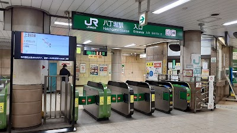

- **Place ID:** `ChIJO1wpfl6JGGARjNtDmO2lRrI`
- **Address:** 3 Chome-22 Hatchobori, Chuo City, Tokyo 104-0032, Japan
- **Overall Rating:** 3.5 ⭐
- **Review Summary:** {'text': 'The station is praised for its attentive staff and the variety of nearby eateries and cafes.\n\nOther reviews mention accessibility can be limited and it can be crowded.', 'languageCode': 'en-US'}
- **Amenities Summary:** Accessibility: {"wheelchairAccessibleParking": false, "wheelchairAccessibleEntrance": true, "wheelchairAccessibleRestroom": true}
#### Top 10 Positive Reviews:
- 5 Stars: The river glints between quiet warehouses and new towers. A worker’s Tokyo hides here — efficient, unpretentious, yet full of rhythm. The Hibiya Line hums beneath, a constant current beneath calm waters.  Tourist Tip: Transfer to JR Keiyō Line and Hibiya Line; explore small eateries near Shinkawa’s canals.
- 5 Stars: Quick access to Tokyo Disney.  Perfect place for us to stay on our trip to Japan.  Very clean station.  I saw workers vacuuming the stairs.  Busy but efficient to use.
- 5 Stars: One station before Tokyo Station, it's convenient stop to change line because not as big as Tokyo station which very tiring when changing line. The English poster and warning are also available. So it's very helpful for foreigners. The bad thing is there is no elevator, so it's not convenient for stroller and wheelchair. So if you have luggage or baby stroller, you can ask the security or staff around there to help. Sometimes they wait near the stairs to help people who can't go down by the stairs.
- 5 Stars: Came here on my way to Mitsui Outlet Park from ASAKUSA. Easy to navigate and find your way around

#### Top 10 Negative/Lowest Reviews:
- 1 Stars: Traditionally high level of service from japanese people become lower and lower in in these recent years.  Issue with the ticket provided by the machine and staff said it is from different company without any help.you will have to buy new ticket from this point.

---
### teamLab Planets TOKYO DMM

- **Place ID:** `ChIJSeco5wiJGGARItbTS8lQ5G0`
- **Address:** 6-chōme-1-16 Toyosu, Koto City, Tokyo 135-0061, Japan
- **Overall Rating:** 4.5 ⭐
- **Review Summary:** {'text': "People say this museum offers a unique, immersive art experience with stunning visuals, interactive light installations, and a water area where visitors walk barefoot through knee-deep water. They also highlight the well-organized facilities, including free lockers and towels, and mention the delicious vegan ramen available. Guests mention it's a fantastic and memorable experience for all ages, with many recommending booking tickets in advance.", 'languageCode': 'en-US'}
- **Amenities Summary:** Parking: {"freeParkingLot": false, "paidParkingLot": false, "freeStreetParking": false, "paidStreetParking": false, "freeGarageParking": false, "paidGarageParking": false} | Accessibility: {"wheelchairAccessibleEntrance": true, "wheelchairAccessibleRestroom": true, "wheelchairAccessibleSeating": false}
#### Top 10 Positive Reviews:
- 5 Stars: An Absolute Masterpiece – A Must-Do in Tokyo! If you are visiting Tokyo, teamLab Planets is an absolute must-visit. It is not just an art exhibit; it is a fully immersive, multi-sensory journey that completely redefines what an art museum can be. From the moment you step inside and take off your shoes, you are transported into a different world. Walking barefoot through varying textures—including actual water—adds a physical layer to the experience that makes you feel deeply connected to the art. The Infinite Crystal Universe: Mind-blowing scale and light synchronization. It feels like standing in the center of a beautiful, endless galaxy. Walking knee-deep in warm water filled with digital koi fish that respond to your movements was incredibly peaceful and magical. Floating Flower Garden: A breathtaking room filled with thousands of live, fragrant orchids that rise and fall around you. It’s an sensory overload in the best way possible. Practical Tips for Visitors Dress code:  Wear pants or shorts that can easily be rolled up above the knee. Wardrobe warning:  Many rooms have mirrored floors, so if you wear a skirt or dress, opt for shorts underneath (though they do offer wrap-arounds at the entrance if needed). Booking: Book your tickets weeks in advance, as prime time slots sell out quickly! We booked ours 2 months before our scheduled date. Arrive 30 mins prior to the timed entry slot. Some things that aren't mentioned in the website - there are no water fountains inside. Water and food are very pricy. Carry water bottles and packed food  if needed. Restrooms are avaliable at few spots. It is incredibly well-organized, clean, and transitions seamlessly from one stunning room to the next. Whether you are a photography lover, a tech enthusiast, or just looking for a unique cultural experience, this will easily be one of the highlights of your trip.  For Dubai Aya World visitors, you might find this one same or below that experience in my opinion.  10/10 highly recommend!
- 5 Stars: teamLab Planets TOKYO was one of the most unique attractions I visited in Tokyo. The exhibits are incredibly creative and immersive, combining art, light, sound, and technology in ways that constantly surprise you. Every room feels different, and there are plenty of opportunities to slow down and appreciate the artistry behind each installation  Some of the exhibits were absolutely stunning, especially the interactive digital displays and the spaces where the artwork responds to visitors. A few sections were quite overstimulating for me due to the intense visuals, lights, and sensory effects, but they were still fascinating to experience and unlike anything I have seen elsewhere  Visitors should be aware that parts of the experience require you to be barefoot, and in some areas you will walk through water. It’s worth wearing proper shoes that are easy to remove and put back on. The staff are well organised and provide clear instructions throughout the journey
- 5 Stars: TeamLab Planets is one of the most unique attractions I’ve visited in Tokyo. The experience is highly immersive and interactive, with beautiful digital art installations that make you feel like you’re part of the artwork. My favorite areas were the Water Area, where you walk through water surrounded by stunning visual effects, and the Floating Flower Garden, which was absolutely breathtaking. If you’re visiting the Water Area, note that shoes and bags are not allowed inside, but free lockers are provided and you can bring your phone for photos and videos. The Athletic Forest and Graffiti Nature sections are also great for families with children. There are food and drink options available in the Open Air area, making it easy to take a break after exploring. Since most of the attraction is indoors, it’s a great place to visit in any season or even on rainy days. I highly recommend booking tickets in advance, especially during weekends and holidays. A must-visit experience in Tokyo! ✨🇯🇵
- 5 Stars: If you’re visiting Tokyo and wondering whether TeamLab is worth it, the answer is an emphatic YES.  My family and I had an absolutely incredible experience. Calling it an art exhibit doesn’t do it justice—it’s a fully immersive adventure that engages every sense. From the moment we entered, we felt like we had stepped into another world.  The highlight for us was the water experience. Walking through warm water while surrounded by constantly changing lights, colors, and digital artwork was unlike anything we’ve ever experienced. It was a sensory overload in the best possible way. Every room seemed to surprise us with something new, making us feel like curious kids discovering a magical world together.  What impressed us most was how interactive everything was. The art isn’t something you simply look at—it’s something you become part of. The exhibits respond to movement, light, and the people around you, creating an experience that is different for every visitor.  Our family spent hours exploring, taking photos, laughing, and just soaking in the incredible creativity. Even after leaving, we found ourselves talking about our favorite exhibits throughout the rest of our trip.  Tokyo offers many amazing attractions, but TeamLab stands in a category of its own. Whether you’re traveling as a couple, with friends, or as a family, this is one experience you’ll remember long after your vacation ends.  Without question, it was one of the highlights of our entire trip to Japan. 🇯🇵

#### Top 10 Negative/Lowest Reviews:
No negative reviews available.

---
### Urban Dock LaLaport Toyosu

- **Place ID:** `ChIJRZuDqpiJGGARCb20R0epFcI`
- **Address:** 2-chōme-4-9 Toyosu, Koto City, Tokyo 135-0061, Japan
- **Overall Rating:** 3.9 ⭐
- **Review Summary:** {'text': 'Visitors say this shopping mall offers a wide variety of shops, restaurants, and entertainment options like a cinema and KidZania, making it a great place for families to spend a day. They also highlight the beautiful waterfront location with stunning views and convenient access directly from the station.\n\nOther reviews mention it can be crowded.', 'languageCode': 'en-US'}
- **Amenities Summary:** Parking: {"paidParkingLot": true, "paidGarageParking": true} | Accessibility: {"wheelchairAccessibleParking": true, "wheelchairAccessibleEntrance": true, "wheelchairAccessibleRestroom": true}
#### Top 10 Positive Reviews:
- 5 Stars: This must be one of the most huge mall in Tokyo. Supermarkets, furniture, cloths, cafes, theater, gym.. you can buy anything you want. When I was young, I worked around here. At that time, this mall was not so big like currently. I believe here would also be expanded one by one going forward.
- 5 Stars: I want to say a huge thank you to a young lady at the information desk on January 23th 2026 around 6:30–7:00 PM. She was so kind, informative, and friendly. She had cute front bangs. I’ve asked for help at the customer center on other days, but the lady on the desk wasnt as nice and welcoming as her. I hope you always happy!
- 5 Stars: This isn’t about Toyosu specifically, and I’m not sure if they’ll ever see this—but I am so incredibly grateful to the two wonderful ladies who helped me today.  I took my eyes off my child (kid with the blue t-shirt) for a moment, and he wandered off. I was panicking, and truly terrified. One kind lady with two white dogs, and another wearing a baseball cap, found him.  Thank you so, so much. I am so grateful, but could not utter too many words in that moment.
- 5 Stars: Urban Dock LaLaport Toyosu is a great shopping mall located at an actual dock.  The mall is pretty full of stores with a large variety to pick from. The mall was clean and well organized. The restroom was very clean as well. The mall has an odd shape but is easy to navigate the multiple floors.

#### Top 10 Negative/Lowest Reviews:
- 2 Stars: We went to TeamLabs, They recommended parking in LaLaport, parking is daylight robbery! ¥5600 for 8H! Not even in London, Normal shopping mall, nothing special, avoid as parking is very expensive if you use private transport.

---
### Toyosu Sta.
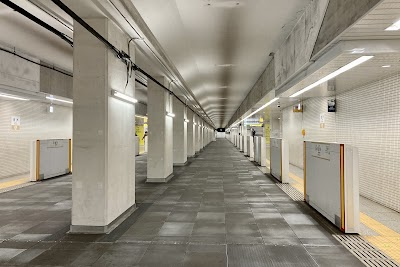

- **Place ID:** `ChIJad51rqOJGGARdIdtRPmM120`
- **Address:** 2 Chome-2 Toyosu, Koto City, Tokyo 135-0061, Japan
- **Overall Rating:** 3.6 ⭐
- **Amenities Summary:** Accessibility: {"wheelchairAccessibleEntrance": true, "wheelchairAccessibleRestroom": true}
#### Top 10 Positive Reviews:
- 5 Stars: Very clean station with lots of amenities around. Very open and bright with more upgraded ticket machines that allow you to buy tickets in a bulk.
- 4 Stars: Toyosu Station (豊洲駅) is a clean and modern station that works well as a gateway to the waterfront areas of Tokyo.  The station is straightforward to navigate, with clear signage and well-organised platforms that make transfers and exits easy to manage. Even during busier times, the flow of passengers feels smooth and controlled, which adds to the convenience.  It’s particularly useful for access to nearby attractions like the Toyosu market area and Odaiba connections, making it a practical stop for both commuters and visitors. The station itself is well-maintained, bright, and functional, with lifts and escalators making movement easy.  While it may not be a particularly exciting station in itself, it does its job very well and provides reliable, hassle-free travel connections.  Overall, Toyosu Station is a solid and efficient transport hub—simple, easy to use, and very convenient for exploring the surrounding waterfront districts.
- 4 Stars: It was very busy and still managed to get on the train. Very good people and very accommodative

#### Top 10 Negative/Lowest Reviews:
No negative reviews available.

---
### Odaiba Marine Park
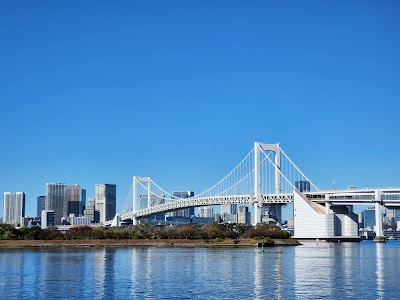

- **Place ID:** `ChIJ18IK6x2KGGARKTc2yLS-030`
- **Address:** 1-chōme-4-4 Daiba, Minato City, Tokyo 135-0091, Japan
- **Overall Rating:** 4.4 ⭐
- **Review Summary:** {'text': 'Visitors say this park offers stunning views of the Rainbow Bridge, Tokyo Tower, and the city skyline, with a clean sandy beach perfect for leisurely strolls and picnics. They also highlight the peaceful and relaxing atmosphere, especially during sunset and at night, making it a great escape from city bustle. Others mention the convenient access to nearby shopping, restaurants, and water bus services.', 'languageCode': 'en-US'}
- **Amenities Summary:** Parking: {"freeParkingLot": true, "paidParkingLot": true, "paidStreetParking": true} | Accessibility: {"wheelchairAccessibleParking": true, "wheelchairAccessibleEntrance": true}
#### Top 10 Positive Reviews:
- 5 Stars: "A Harmonious Blend of Modern Icons and Tranquil Nature" If you're looking for a spot that captures the essence of Tokyo’s modern beauty without the chaotic bustle of the city center, this is it. As a photographer, I find this park to be a magnificent place for capturing layers of history and modernity in one frame. • The Icons: Standing in front of the Statue of Liberty with the Rainbow Bridge stretching across the bay is an awe-inspiring sight. The architecture here feels grand and purposeful. • Sakura Season: During spring, the cherry blossoms add a delicate, ethereal touch to the waterfront. The pink petals against the blue bay are absolutely breathtaking. • Peaceful Atmosphere: What impressed me most was how orderly and quiet the park felt. Even with people gathering to see the flowers, it never felt crowded or rowdy. Everyone was very mindful of personal space, which made the experience incredibly relaxing. • A Great Find: This park is a hidden gem for those who want to "treat themselves" to a slow afternoon. It's much more tranquil and refined compared to other mainstream tourist spots. Whether you're here for a stunning sunset shoot or just a quiet stroll, the sheer beauty and civic-minded atmosphere of this place won't disappoint.
- 5 Stars: This is one of the most beautiful viewpoints in Tokyo. The atmosphere by the sea at sunset is very romantic. You can clearly see the Rainbow Bridge and the replica Statue of Liberty. The park area is spacious, perfect for a leisurely stroll along the sea. It's a great place to relax and take beautiful photos of Tokyo Bay as souvenirs.
- 5 Stars: An incredible park! Lots of cherry blossoms in full bloom, stunning views, you can look at the ocean through binoculars, take a photo with the Statue of Liberty, there's a giant robot nearby, and clean restrooms. A wonderful place — I recommend it to everyone!
- 5 Stars: Odaiba Marine Park is one of those places that really shows how a destination can evolve over time. What used to feel like just a sightseeing spot has turned into a much more interactive and enjoyable space for everyone.  Now, it’s not just about the views of Tokyo Bay but it’s a place where you can actually spend a whole day. You can relax with a picnic, let children play freely on the sand, and even enjoy swimming during the warmer months. The availability of shower rooms makes it convenient and comfortable, especially after being in the water or on the beach.  What makes it even more special is its location right in the heart of Tokyo. It’s easy to access, yet it offers a refreshing escape from the busy city atmosphere. Whether you're visiting with family, friends, or even solo, Odaiba Marine Park has become more than just a sightseeing destination but it’s a place to unwind, have fun, and make memories.
- 5 Stars: If you love photography, this is a must-visit. The shoreline provides incredible angles for both day and night shots.  It was a lot of fun just roaming around the beach area and capturing the skyline. Whether you're using a professional camera or just your phone, you're guaranteed to leave with some amazing pictures!

#### Top 10 Negative/Lowest Reviews:
No negative reviews available.

---
### Ootoya Chelsea
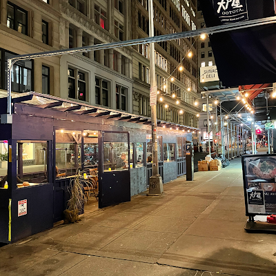

- **Place ID:** `ChIJ4Ylp5KJZwokRfWfiyXz6m1w`
- **Address:** 8 W 18th St, New York, NY 10011, USA
- **Overall Rating:** 4.3 ⭐
- **Generative Summary:** Casual restaurant serving traditional Japanese dishes such as tonkatsu and yakitori, plus sake.
- **Review Summary:** {'text': 'Diners say this Japanese restaurant serves delicious crispy rice sushi, karaage, grilled fish, soba, and matcha ice cream. They also highlight the friendly staff, spacious and clean atmosphere, and great lunch sets.\n\nSome reviews mention the food can be pricey.', 'languageCode': 'en-US'}
- **Amenities Summary:** Parking: {"paidStreetParking": true} | Accessibility: {"wheelchairAccessibleParking": false, "wheelchairAccessibleEntrance": true, "wheelchairAccessibleRestroom": true, "wheelchairAccessibleSeating": true}
#### Top 10 Positive Reviews:
- 5 Stars: Since Ootoya Chelsea first opened I have been a fan of this authentic Japanese restaurant. Lots of Japanese visitors came to din in, a proof that food is good and has quality. Food is made freshly, ingredients are also fresh from Japan. There is also a bento box style. I got the salmon saikyo yaki set for U$25. Delicious
- 5 Stars: Great izakaya restaurant. Nice vibe. Kids love the katsu ju. The winter gozen is yummy. The tonkatsu is crispy and not greasy. Delish.
- 4 Stars: Shared this experience with my daughter and enjoyed the atmosphere and service. She loved it and wants to return for another experience. The food was good.

#### Top 10 Negative/Lowest Reviews:
- 1 Stars: Used to be so good. Now they barely give you any food. They charging arm and leg. Also reducing portions.. They don’t even have a paper menu.  They add sesame seeds to a multigrain rice. It’s far from authentic.  Their agedashi tofu is literally sour.
- 2 Stars: The ambiance and service at Ootoya Chelsea were both quite nice when we walked in, and we were initially excited about the meal. We ordered the beef croquettes, assorted sushi platter, and sashimi rice bowl.  However, I was extremely disappointed with the uni from the sushi platter. Its appearance was off, and the taste was overwhelmingly fishy — clearly not fresh. When I raised the issue, the staff responded politely and explained that it’s “out of season,” and eventually agreed to remove the dish from the bill.  While I appreciate the service, I don’t think uni — especially in that condition — should have been served at all. If you’re visiting, I would not recommend ordering any raw seafood here. Other items were decent and reasonably priced, but the uni really ruined the experience for me.

---
### Tokyo Toy Museum
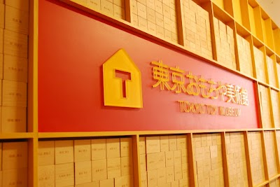

- **Place ID:** `ChIJHeBCIOyMGGAR7BktETlUP_w`
- **Address:** Japan, 〒160-0004 Tokyo, Shinjuku City, Yotsuya, 4-chōme−２０−２０ 内
- **Overall Rating:** 4.3 ⭐
- **Review Summary:** {'text': 'Visitors say this museum, housed in a renovated old school, offers a wide variety of engaging wooden and traditional toys for all ages, including a dedicated baby play area. They also highlight the warm, friendly, and helpful staff who often teach visitors how to play with the toys. Guests mention the reasonable admission fees, especially with online advance purchase, and appreciate it as a great indoor option for rainy days.', 'languageCode': 'en-US'}
- **Amenities Summary:** Parking: {"freeParkingLot": false, "paidParkingLot": false, "freeStreetParking": false, "paidStreetParking": false, "freeGarageParking": false, "paidGarageParking": false} | Accessibility: {"wheelchairAccessibleParking": true, "wheelchairAccessibleEntrance": true, "wheelchairAccessibleRestroom": true, "wheelchairAccessibleSeating": false}
#### Top 10 Positive Reviews:
- 5 Stars: Tokyo Toy Museum was one of our favorite experiences in Tokyo. What I enjoyed the most was seeing so many old and traditional toys that reminded me of my childhood — I am the daughter of a Japanese mother, so it felt very nostalgic and special for me.  I also loved how many of the toys are sustainable and beautifully made from natural materials like wood and kimono textiles. The museum has such a warm and thoughtful atmosphere.  The staff is amazing, very kind and organized, and everything runs smoothly. We especially loved the workshops, which were fun and memorable for both children and adults.  One important tip: make sure to buy tickets in advance because it can get busy. Highly recommended for families and anyone interested in Japanese culture, creativity, and traditional toys.
- 5 Stars: I went at 10:00 AM on a tuesday morning and there was no waiting. I did not realize this is for children, but I enjoyed looking as an adult too. The staff are very friendly, very kind, and helpful. The shop has lots of beautiful products including some of the games and toys that were on display.
- 5 Stars: This was a fantastic find. It is housed in an old elementary school and itnis the sweetest museum that is well thought out.  The staff are so helpful and friendly and love to show you how to use different toys. The selection of toys to try is really appreciated and the 100 good toys museum display is rare to see. We loved our time here!  The wooden forest is a magical place for children. So nice to see wooden toys and not a place filled with plastic junk.
- 5 Stars: We visited during a trip to Tokyo with our child and had a wonderful time. Although it is a museum, it offers many activities that both children and parents can enjoy together. What made it especially memorable was the kindness and warmth of the staff. Our child loved playing with the spinning top with Mr Yamaguchi on the 3rd floor, and it became a very special memory for our family. Thank you to Mr Yamaguchi and all the wonderful staff for such a lovely experience.
- 5 Stars: An amazing place for toddlers to be spending a few hours. Quality award winning toys available for them to play with. Highly recommend anyone with a baby or toddler to spend some time here.

#### Top 10 Negative/Lowest Reviews:
No negative reviews available.

---
### Fire Museum
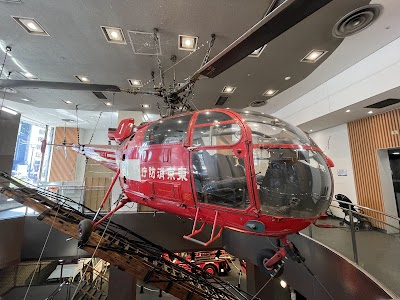

- **Place ID:** `ChIJG99Bp-2MGGARK9sWy49hBq8`
- **Address:** Japan, 〒160-0004 Tokyo, Shinjuku City, Yotsuya, 3-chōme−１０−１０
- **Overall Rating:** 4.4 ⭐
- **Review Summary:** {'text': 'Visitors say this museum offers a comprehensive and engaging look into the history of firefighting in Tokyo, featuring real fire engines, helicopters, and interactive exhibits. They also highlight the free admission and the variety of hands-on activities, such as simulators and dress-up areas, which are particularly enjoyable for children. Guests mention the friendly and helpful staff, and the convenient direct access from the train station.', 'languageCode': 'en-US'}
- **Amenities Summary:** Accessibility: {"wheelchairAccessibleParking": false, "wheelchairAccessibleEntrance": true, "wheelchairAccessibleRestroom": true}
#### Top 10 Positive Reviews:
- 5 Stars: This is a super cool museum! Most, if not all exhibits include an English translation. The special “100-year Showa”exhibition on the 6th floor is nicely done and very interesting. I went solo, but I think younger kids would love this museum. There’s a place to try on a fire fighter uniform for pictures.
- 5 Stars: This museum was so wonderfully curated (there was something for all ages). My 2.5 year old absolutely loved Level 3 with the interactive fire engine, helicopter, and dressing up like a fire fighter. We could have spent hours here. All of the staff were so lovely. Would highly recommend.
- 5 Stars: An amazing free museum with tons of fun (and hands-on!) exhibits. :) I didn't brave the line to sit inside the helicopter, but posing for pics in the old fire truck was hilarious.  Upper floors have a lot of cool old-timey equipment, as well as a firefighting Harley Davidson from a century ago. 😎 The educational displays were informative and occasionally hilarious. Great way to spend 2-3 hours!
- 5 Stars: Great fun with my grandson, it free and the staff is very friendly, takes about 2 to 3 hours to complete. Lots of activities for the toddlers and above
- 5 Stars: A gem for kids!!!! We love it here. My son enjoyed it. They even sell.tomica firetrucks and the disneycar firetruck version.

#### Top 10 Negative/Lowest Reviews:
No negative reviews available.

---
### North Observation Deck, Tokyo Metropolitan Government Building No. 1
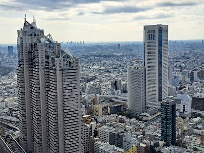

- **Place ID:** `ChIJnctryNSMGGARLv4MknPFseU`
- **Address:** Japan, 〒163-8001 Tokyo, Shinjuku City, Nishishinjuku, 2-chōme−8−１ Tochomae Station, 45F
- **Overall Rating:** 4.5 ⭐
- **Review Summary:** {'text': 'Visitors say this observation deck offers spectacular panoramic views of Tokyo, including landmarks like the Tokyo Skytree and, on clear days, Mount Fuji. They also highlight the convenience of free admission, a cafe with snacks, and a souvenir shop. Guests mention the helpful and efficient staff, making for a smooth and pleasant experience.', 'languageCode': 'en-US'}
- **Amenities Summary:** Parking: {"paidParkingLot": true} | Accessibility: {"wheelchairAccessibleParking": true, "wheelchairAccessibleEntrance": true}
#### Top 10 Positive Reviews:
- 5 Stars: Tokyo Metropolitan Government Building North Observation Deck is easily one of the best free things to do in Tokyo. The panoramic city views are incredible, especially at sunset or after dark when the skyline lights up. It’s less crowded than other observation decks, completely free, and on a clear day you can even spot Mount Fuji. Highly recommend stopping by if you’re in Shinjuku. The view honestly feels like something you should be paying for.
- 5 Stars: Went for the free view of the city. The map wasn’t entirely clear on where to enter by but you enter through the garage looking area until you see signs for the “observatory”  You walk in and there is option for north tower or south tower view. After a quick security check you are ushered into the elevator up.  There are lots of massive windows to see the view from. At 4/5pm it was lively but not crowded. They have a piano open for people to play. The gift shop and small concession stand & cafe tables were nice as well.  I wish i had brought a book or sketchbook so I could sit for a while; but i just came to see the view peruse the shop and left - about a 15-20 minute experience.  I’d come back to see the night view and view from the other tower :)
- 5 Stars: We soaked in spectacular views from both the North Deck and the South Deck, they’re close enough that doing both is a must, especially when the lines are mercifully short. Free admission too!  On October 30, 2025, we practically waltzed in: a five-minute wait, basically just one elevator cycle. Locals told us that on busier days, the wait can stretch to an hour, so we counted ourselves lucky.  Each tower has its own charm: one with a gift shop, the other with a café, and restrooms in both. From the top, we were treated to sweeping 360-degree views of Tokyo, and even a crystal-clear glimpse of Mount Fuji—a sight that feels like a blessing when the weather cooperates.  It’s absolutely worth the excursion, and an easy walk from Shinjuku Station.
- 5 Stars: There are two observation decks, so you can make a choice for the North or the South Tower. The views can be incredible on a crisp, clear day (Mt Fuji views are possible!). Great views over the skyline and a great place to buy a refreshment and or snack.  I was there three times and enjoyed the early morning view (9.30am) more than the hazier midday. The sunset and night views were stunning..  It is free of charge and there is often a short line and a bag security check. Like most places in Japan it so well organised, clean and pleasant. Downstairs is a very friendly tourist information.
- 5 Stars: Amazing building and experience inside and out. Seeing the light shows at night or going up to the observatory were amazing. Elevator lines were not that bad at all and there are souvenirs at the top for purchase. Free entry and free to watch the light show.

#### Top 10 Negative/Lowest Reviews:
No negative reviews available.

---
### Shinjuku Gyoen National Garden
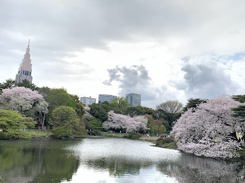

- **Place ID:** `ChIJPyOTG8KMGGARh_IXobWxHmo`
- **Address:** 11 Naitōmachi, Shinjuku City, Tokyo 160-0014, Japan
- **Overall Rating:** 4.6 ⭐
- **Amenities Summary:** Parking: {"paidParkingLot": true, "paidStreetParking": true} | Accessibility: {"wheelchairAccessibleParking": true, "wheelchairAccessibleEntrance": true, "wheelchairAccessibleRestroom": true, "wheelchairAccessibleSeating": true}
#### Top 10 Positive Reviews:
- 5 Stars: Beautiful park ideally located close to the city center.  The park is incredibly clean. The entrance fee is around 500 yen (about €3), but it is absolutely worth every penny !  There are various buildings to visit, including a stunning greenhouse. The traditional Japanese architecture and structures add so much charm to the entire place.  A beautiful, must-see stop during your trip to Japan! Highly  Recommended by French tourists !🇫🇷
- 5 Stars: Visited Shinjuku Gyoen National Garden during peak spring and honestly, this is one of the best sakura spots in Tokyo.  The cherry blossoms here feel different. Instead of being packed shoulder to shoulder like other parks, the space is huge, calm, and almost therapeutic. You can actually sit on the grass, look up, and just take in waves of soft pink blooms without feeling rushed.  What really stood out is how long the sakura season lasts here. With dozens of different cherry blossom varieties, you don’t just get a single peak moment. Some trees are in full bloom while others are just starting, so the whole park feels alive with layers of pink and white. (japan.travel)  Walking through the garden feels like moving through different worlds. Wide open lawns covered in petals, quiet Japanese garden paths with ponds and bridges, and pockets of blossoms tucked away from the crowd. It’s peaceful but still vibrant.  No alcohol allowed, which actually keeps the vibe clean and relaxed. Perfect for a slow picnic or just lying down under the trees.  If you’re in Tokyo during sakura season, this is the place where you actually enjoy the cherry blossoms, not just fight crowds for them.
- 5 Stars: Shinjuku Gyoen National Garden is a fantastic place to bring a picnic blanket and enjoy a relaxing lunch outdoors. The entry fee is very affordable, and it was completely free for our 5-year-old, which made it even better. Make sure to bring a blanket so you can spread out comfortably on the grass. The on-site cafe offers delicious drinks, ice cream, and light meals, and there are also vending machines with cheap cold drinks scattered throughout the park. What I really appreciated was how clean the entire area is — there are plenty of trash cans everywhere, so it’s easy to keep things tidy. We came specifically for the cherry blossoms, and we were not disappointed at all. They were absolutely gorgeous! The sweet, delicate scent of the blossoms filled the air, and the magical sight of millions of pink petals gently floating around us was truly breathtaking. It created such a peaceful and beautiful atmosphere that made our family picnic unforgettable. Highly recommend visiting, especially during cherry blossom season!
- 5 Stars: Great park with excellent plants, flowers and open spaces to unwind and relax. I enjoyed the walk around the garden with my wife. I would recommend this place if you just want peace and quiet from the busy city life. I would say it has one of the most impressive rose gardens.
- 4 Stars: I visited Shinjuku Gyoen on a rare sunny day during Japan's rainy season, and the weather could not have been better. The humidity was low, and it was warm without being uncomfortably hot—perfect for a leisurely stroll through the park.  I entered through the Sendagaya Gate and was pleasantly surprised to find that transportation IC cards are now accepted for admission, making entry quick and convenient.  There's also a Starbucks inside the park, and mobile ordering made grabbing a drink effortless. I spread out a picnic blanket under the shade of the trees and took some time to simply relax. It felt like a small luxury in the middle of Tokyo.  A friend of mine describes Shinjuku Gyoen as a "power spot," a place where you can recharge your energy, and I can understand why. Surrounded by beautiful greenery and peaceful scenery, it was easy to forget the bustle of the city and just enjoy the moment.  If you're looking for a quiet escape from Tokyo's busy streets, Shinjuku Gyoen is a wonderful place to slow down and appreciate nature.

#### Top 10 Negative/Lowest Reviews:
No negative reviews available.

---
### Ueno Park
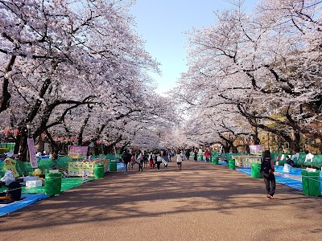

- **Place ID:** `ChIJw2qQRZuOGGARWmROEiM2y7E`
- **Address:** 4 Uenokoen, Taito City, Tokyo 110-0007, Japan
- **Overall Rating:** 4.4 ⭐
- **Review Summary:** {'text': "Visitors say this park offers a beautiful escape with diverse attractions like museums, shrines, and a zoo, making it a cultural hub. They also highlight the stunning seasonal scenery, especially the cherry blossoms and lotus flowers, and appreciate the well-maintained, spacious grounds. Guests mention the park's lively yet peaceful atmosphere, with many events and food stalls, and its convenient accessibility.", 'languageCode': 'en-US'}
- **Amenities Summary:** Parking: {"freeParkingLot": true, "paidParkingLot": true} | Accessibility: {"wheelchairAccessibleParking": true, "wheelchairAccessibleEntrance": true, "wheelchairAccessibleSeating": true}
#### Top 10 Positive Reviews:
- 5 Stars: We loved our visit to Ueno Park. It felt quaint and peaceful, especially early in the morning before it got busy. We also really enjoyed visiting Toshogu Shrine, where we purchased entrance tickets and picked up a few amulets for family. The walk through the shrine grounds was very pleasant, and we loved seeing the intricate decorative art.  Afterward, we strolled through the park and also visited some of the Buddhist temples and shrines nearby, which made the whole area feel especially rich in culture and history. For those interested in art or animals, Ueno Zoo and the National Museum are both close by as well. Overall, this is a wonderful area to explore and one we would definitely highly recommend.
- 5 Stars: Ueno Park is one of the most well-known public parks in Tokyo and feels like a cultural and everyday-life hub rather than just a green space.  From a local perspective, it’s a place people naturally come back to throughout the year. In spring, it becomes one of Tokyo’s busiest cherry blossom spots, with long rows of sakura trees and very lively hanami gatherings. In other seasons, it feels much more relaxed, with people jogging, walking, visiting museums, or just sitting under trees taking a break from city life.  What makes Ueno Park unique is how much is packed into and around it. Inside the park, you have major cultural institutions like the Tokyo National Museum, Ueno Zoo, and several art museums. Because of this, it doesn’t feel like a single attraction but more like a cultural district where you can easily spend half a day or more without repeating the same experience.  The central pond area, Shinobazu Pond, is especially interesting. It changes completely depending on the season lotus plants in summer, calm reflective water in other months, and always a mix of nature and city skyline in the background.  From a practical travel point of view, it’s very easy to access directly from Ueno Station, which is a major transport hub. The park has multiple entrances, and you can enter casually without much planning. That’s why locals often use it as a meeting point or a place to relax between errands rather than a “planned destination.”  One thing visitors should know is that weekends and holidays can get very crowded, especially during cherry blossom season, but the park is large enough that you can usually find quieter corners if you walk a bit further away from the main paths.  Overall, Ueno Park feels like a balance between nature, culture, and daily city life. It’s not polished or overly curated it’s lived-in, active, and always changing with the rhythm of Tokyo.
- 5 Stars: An absolutely incredible park !  I’ve rarely seen such a pleasant place to stroll around so freely.  The green spaces are beautiful, and the park is full of pathways leading to unique, distinct areas.  A huge plus for tourists: the zoo and the museums are right next to it, making it the perfect day out! Thank you for this wonderful discovery.  Two friends and tourists from France 🇫🇷
- 5 Stars: After spending the afternoon strolling the streets and shopping at Ameyayokocho it was nice to grab some street food and head to Ueno Park for a quiet, peaceful sunset picnic and get away from the crowd for a while. We found a spot not too far off the street next to the pond and just took it all in while we enjoyed our meal. The park and pond are beautiful this time of day. My question is……where are all the frogs sitting on the lily pads?  Shouldn’t there be frogs somewhere croaking away?  Anyway it’s a nice diversion from the bustling shopping streets and by the time we were done eating the city was starting to light up giving a totally different vibe!
- 4 Stars: Large and pleasant park in Tokyo (Ueno)with a lively atmosphere.  Especially beautiful during spring when the sakura are in full bloom. The cherry blossom trees attract many visitors and locals who come to enjoy hanami under the flowers.  It can get very crowded during that season, but the atmosphere remains festive and enjoyable. A nice place to walk and relax in the city.  Enjoy 🌸🌸🌸🌸🙏🧘🧘‍♀️

#### Top 10 Negative/Lowest Reviews:
No negative reviews available.

---
### Ueno Zoo
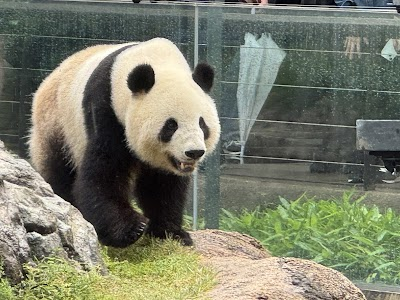

- **Place ID:** `ChIJf2129yiMGGAR9I6Yoe-1uHY`
- **Address:** 9-83 Uenokōen, Taito City, Tokyo 110-8711, Japan
- **Overall Rating:** 4.2 ⭐
- **Review Summary:** {'text': 'Visitors say this zoo offers a wide variety of animals, including giant pandas, gorillas, and polar bears, with many exhibits providing great viewing angles. They also highlight the affordable ticket prices and the spacious, clean environment with plenty of shaded walking paths and resting areas. Others also mention the friendly, helpful staff and the convenient location within Ueno Park.', 'languageCode': 'en-US'}
- **Amenities Summary:** Parking: {"freeParkingLot": false, "paidParkingLot": false, "freeStreetParking": false, "paidStreetParking": false, "freeGarageParking": false, "paidGarageParking": false} | Accessibility: {"wheelchairAccessibleEntrance": true, "wheelchairAccessibleSeating": false}
#### Top 10 Positive Reviews:
- 5 Stars: Ueno Park in Tokyo has an amazing atmosphere and is perfect for all kinds of activities. This sprawling park features beautiful historic temples, relaxing green pathways, and even a baseball field.The absolute highlight is the historic Ueno Zoo, where you can see incredible animals like adorable red pandas and majestic polar bears. If you visit right now, you can also enjoy the stunning, vibrant hydrangeas blooming beautifully all along the park's walking trails. No giant panda. You must see the beautiful Thai Pavilion (Sala Thai) built inside the park, which stands as a proud symbol of the deep, long-standing friendship between Thailand and Japan.
- 5 Stars: ⭐️⭐️⭐️⭐️⭐️ Ueno Zoo – A beautiful mix of history, nature & family fun  Ueno Zoo is such a lovely day out in Tokyo. Set inside the gorgeous Ueno Park, it’s easy to wander, explore and take your time. The zoo has a surprisingly peaceful feel, with different zones to explore and plenty of shaded walkways — perfect for families, travellers, and anyone wanting a slower-paced day in the city.  The highlights for me were the incredible variety of animals, the iconic panda area, and the way the zoo blends history with modern exhibits. Everything is well-signed, clean, and easy to navigate. Lots of little food spots and rest areas too, which makes it really accessible.  As a health executive, mum, pet mum and someone who loves to travel, I appreciated how family-friendly and spacious it felt. Great for all ages, and a lovely way to enjoy a calmer side of Tokyo.  Highly recommend spending a few hours here, especially if you’re already exploring Ueno Park or the museums nearby.
- 5 Stars: Visiting Ueno Zoo in Tokyo was a fantastic experience, especially for animal lovers. The zoo is spacious, well-organized, and full of interesting species from all over the world. The highlights of the visit were definitely the adorable giant panda and the impressive polar bear. Seeing the panda up close was truly special, while the polar bear was fascinating to watch with its strength and elegance. The whole zoo offers a great mix of fun, education, and relaxation, making it a perfect place to visit in Tokyo for families and anyone who enjoys nature and wildlife.
- 4 Stars: This zoo was genuinely amazing. Normally, my ethics and beliefs are against all kinds of zoos, but this one felt different to me. I believe it serves an important purpose in raising awareness, promoting responsibility toward animals, and helping people connect with wildlife in a meaningful way.  What I appreciated the most was the opportunity to observe the gorillas socializing and simply going about their day. Watching them felt almost like a window into their natural behavior and habitat, which was a very powerful experience.  That said, I can’t give it 5 stars because I personally felt that some animals did not have enough space. I’m not a biologist or an expert, so this is only my personal impression, but at times I felt a bit overwhelmed by the size of certain enclosures. I think there is still room for improvement regarding the living space provided for some animals.  I also found it difficult to see a polar bear living in Tokyo’s 28-degree weather, even if there are systems in place to adapt the environment. It still felt unnatural to me.  Overall, the zoo is incredibly interesting and worth visiting, especially for the educational and conservation aspects, but there are still areas where animal welfare could be improved.

#### Top 10 Negative/Lowest Reviews:
No negative reviews available.

---
### Parkside Diner
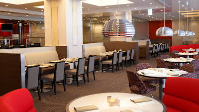

- **Place ID:** `ChIJT7wVXe6LGGARvrQ1Xj9ZboI`
- **Address:** Japan, 〒100-8558 Tokyo, Chiyoda City, Uchisaiwaichō, 1-chōme−1−１ 本館 1階
- **Overall Rating:** 4.3 ⭐
- **Review Summary:** {'text': "Diners like this restaurant's delicious and hearty dishes, including their famous pancakes, juicy hamburg steaks, and flavorful curries. They also highlight the attentive and professional staff, who provide excellent service and accommodate special requests. Guests mention the relaxed and comfortable atmosphere, making it suitable for various occasions and family gatherings.", 'languageCode': 'en-US'}
- **Amenities Summary:** Parking: {"paidParkingLot": true, "paidGarageParking": true} | Accessibility: {"wheelchairAccessibleParking": true, "wheelchairAccessibleEntrance": true, "wheelchairAccessibleRestroom": true, "wheelchairAccessibleSeating": true}
#### Top 10 Positive Reviews:
- 5 Stars: Very nice diner inside the Imperial Hotel Tokyo. The service is great and the atmosphere is what a diner should have. The food is also very good. But of course, this is nothing like a traditional Japanese, and may not be what I was expecting when coming to Tokyo.
- 4 Stars: The chocolate milkshake is GOOD! Wagyu burger is okay, potato wedges were GOOD. Escargot was GOOD. Curry is okay.  The only downside was they forgot to serve the salad that came with the food. And wishes they could serve the cold water right after you are seated instead of us asking for it.

#### Top 10 Negative/Lowest Reviews:
- 1 Stars: The Lunch Service was professional and polite, but the space lacks any sense of atmosphere and the food portions were small, and mediocre at best. I understand I’m paying a hotel premium, but a 5 star hotel restaurant should be able to create better value for the price tag..  - ¥2,500 for a Caesar Salad which was essentially a plate of lettuce - ¥3,200 for the club sandwich which was not bad, but too small. The fries were lacking any inspiration. - ¥1,800 for a 350ml Japanese draft beer
- 2 Stars: Very disappointed. We’ve ordered a Cobb salad (2500 JPY) and mix sandwich. Cobb salad uses a cheap lettuce and sliced cheddar cheese. It looks like it just came out of package from seven eleven. Sandwich came with chips and again, it looked like chips came out of package. It made us miss the club sandwich at Royal Host which is a cheap family restaurant chain and their price is half of what this place charges. Staff didn’t seem so professional for a 5 star hotel. They are not bad and well meaning but based on my experience, staff at 5 star hotel usually look very sharp, on top of everything, and well dressed.

---
### Sumida Park
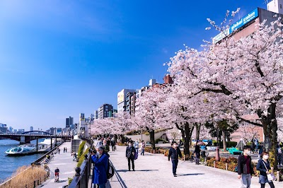

- **Place ID:** `ChIJZ4oTScOOGGAR16BfN7ADXMk`
- **Address:** 1 Chome-1 Hanakawado, Taito City, Tokyo 111-0033, Japan
- **Overall Rating:** 4.2 ⭐
- **Review Summary:** {'text': 'People say this park offers stunning views of the Tokyo Skytree and Sumida River, with beautiful seasonal flowers like cherry blossoms and hydrangeas. Visitors also highlight the clean, well-maintained restrooms and the convenient location for a peaceful stroll or run. They also like the calm atmosphere, making it a refreshing escape from nearby crowds.', 'languageCode': 'en-US'}
- **Amenities Summary:** Accessibility: {"wheelchairAccessibleParking": false, "wheelchairAccessibleEntrance": true}
#### Top 10 Positive Reviews:
- 5 Stars: There is plenty of space to sit down and enjoy a snack, you can view and see the skytree tower from this park. There is a convenient store close by to the park incase you want to buy some food or drinks. This park also has a smoking area available
- 5 Stars: Sumida Park is one of Tokyo’s most scenic riverside parks, stretching along both sides of the Sumida River near the historic Asakusa area. With its open spaces, iconic views, and seasonal beauty, it’s a favorite spot for both locals and tourists looking to relax while enjoying a classic Tokyo atmosphere.  One of the park’s biggest highlights is its incredible view of Tokyo Skytree, which rises prominently in the background. The contrast between the modern tower and the traditional surroundings of Asakusa creates a uniquely photogenic scene, especially during sunset and nighttime when the lights reflect beautifully on the river.  Sumida Park is particularly famous for its cherry blossoms. During sakura season, hundreds of cherry trees bloom along the riverbanks, forming a picturesque tunnel of pink. It’s one of the best hanami (flower viewing) spots in Tokyo, attracting large crowds who come to picnic under the blossoms and enjoy the festive atmosphere. The combination of sakura, river views, and Tokyo Skytree makes it one of the most iconic spring scenes in the city.  Beyond cherry blossom season, the park remains a peaceful escape from the busy streets of Asakusa. Wide walking paths make it ideal for strolling, jogging, or simply sitting and enjoying the river breeze. You’ll often see locals fishing, couples relaxing, and street performers adding a bit of life to the area.  Another highlight is its role during the Sumida River Fireworks Festival, one of Tokyo’s most famous summer events. The park becomes a prime viewing location for spectacular fireworks displays, creating an energetic and festive environment.  Overall, Sumida Park offers a perfect balance of nature, culture, and city views. Whether you visit during cherry blossom season, a summer festival, or a quiet afternoon, it’s a beautiful and accessible spot that captures the charm of Tokyo from a riverside perspective.
- 5 Stars: This is a very nice place to walk around and relax, especially with the beautiful view of the Tokyo Skytree. I visited during cherry blossom season, and there were so many sakura trees blooming along the park. You can also enjoy walking along the Sumida River, which feels very peaceful and relaxing.
- 5 Stars: Great park to chill just 2 blocks away from Senso-Ji temple. Great view of the river and Tokyo Skytree across the river. Its quiet and not particularly crowded. Ample space for runs or easy stroll along the river banks. Love this park
- 5 Stars: A peaceful park along the river, alongside with many cheery blossoms. The Tokyo sky tree are opposite of the book, so you can take a great photo with cherry blossoms and sky tree in the same frame.

#### Top 10 Negative/Lowest Reviews:
No negative reviews available.

---
### Co., Ltd. Funayado Tsurishin
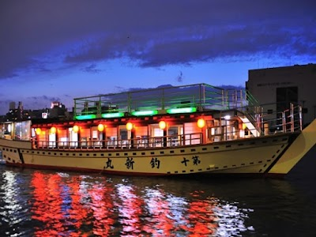

- **Place ID:** `ChIJgY7NdMmOGGARvhIIltbrU54`
- **Address:** 1-chōme-3-11 Honjo, Sumida City, Tokyo 130-0004, Japan
- **Overall Rating:** 4.4 ⭐
- **Review Summary:** {'text': "People say this yakatabune cruise offers delicious, freshly fried tempura and a wide variety of drinks, including alcoholic beverages. They also highlight the stunning views of Tokyo's landmarks and the comfortable, chair-style seating. Guests mention the staff are attentive and provide excellent service, making for a memorable experience.", 'languageCode': 'en-US'}
- **Amenities Summary:** Accessibility: {"wheelchairAccessibleParking": false, "wheelchairAccessibleEntrance": false, "wheelchairAccessibleRestroom": false, "wheelchairAccessibleSeating": false}
#### Top 10 Positive Reviews:
- 5 Stars: A relatively easy-to-reserve houseboat with reasonable prices. The food looks sober but the taste is high class. The houseboat is also standard. There is an English brochure, but the staff does not speak English.  #letsguide
- 5 Stars: The food was incredible, especially the tempura! Amazing views, and the staff were so lovely and welcoming. One of my favourite experiences in Tokyo - cannot recommend enough.
- 5 Stars: All the ppl there are really nice and caring ❤️‍🔥 I feel like home when I go on board! You must try this cruise when you come to Asakusa this will be a spark in your journey!
- 5 Stars: Enjoyable dinner cruise experience with friendly and helpful staff. One staff member on our cruise was a fluent English speaker.
- 5 Stars: Great experience, tempura was amazing! We were a bit late to the meetup time and they sent someone out to the bridge to help us catch the boat on time!

#### Top 10 Negative/Lowest Reviews:
No negative reviews available.

---
### Yamato Transport Tokyo Station Marunouchi North Exit Baggage Service Counter
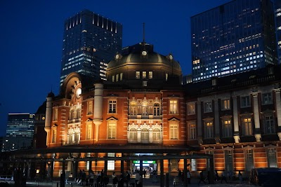

- **Place ID:** `ChIJoYkEoq-LGGARN5Qn598MMP4`
- **Address:** 1-chōme-9-1 Marunouchi, Chiyoda City, Tokyo 100-0005, Japan
- **Overall Rating:** 4.2 ⭐
- **Amenities Summary:** Accessibility: {"wheelchairAccessibleParking": false, "wheelchairAccessibleEntrance": true}
#### Top 10 Positive Reviews:
- 5 Stars: It takes 2 days for luggage to be send to Narita airport. Queue is long but the staff is super efficient in processing the luggage. Location at street level outside the gantry. You don’t have to tap your Suica card to reach the place. Hope this short video will help you to find the place. 🤗
- 5 Stars: Its under the sign JR EAST Travel Service Center. Walk in to the Marunouchi North Entrance Sign and look right
- 5 Stars: First off, ignore the other reviewers when they say it’s B1. It’s at the Marunouchi north exit. It’s easy to miss. It’s in the corner right before you exit the building. If you’re inside after coming in on JR, you will have to exit the JR section.  The cost was very reasonable but they need 2 days to deliver to Haneda.

#### Top 10 Negative/Lowest Reviews:
- 1 Stars: Used their service in May25, from Tokyo to Osaka, arrived broken. Emailed their customer service, only receive initial reply asking for details , follow up after 2 weeks no more reply from them.   Service sucks. Deliver at your own risks

---
### Inokashira Park
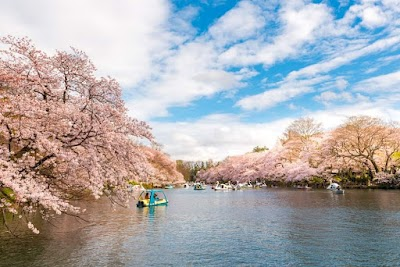

- **Place ID:** `ChIJLWaVdDXuGGART_Pg1R3CZ4A`
- **Address:** 1-chōme-18-31 Gotenyama, Musashino, Tokyo 180-0005, Japan
- **Overall Rating:** 4.4 ⭐
- **Review Summary:** {'text': 'Visitors say this park is a beautiful, spacious green space with a large pond where people can enjoy swan boats and rowing boats. They also highlight the well-maintained walking paths, which are perfect for leisurely strolls, jogging, and enjoying nature. Guests mention the park is ideal for picnics and offers a peaceful escape from city life, with clean restrooms and a small zoo.', 'languageCode': 'en-US'}
- **Amenities Summary:** Accessibility: {"wheelchairAccessibleParking": true, "wheelchairAccessibleEntrance": true}
#### Top 10 Positive Reviews:
- 5 Stars: I visited Inokashira Park and had a very relaxing experience. The park is very spacious and full of beautiful greenery, which makes it a perfect place to escape the busy city life of Tokyo. One of the most attractive parts of the park is the large pond in the center where people can enjoy swan boats and small rowing boats. Watching the boats on the water creates a very peaceful and pleasant atmosphere.  The walking paths around the pond are great for taking a slow walk, jogging, or simply enjoying nature. There are also many benches where visitors can sit and relax while enjoying the view of the water and trees. During spring, the park becomes even more beautiful because the cherry blossoms bloom around the pond, making it a very popular place for hanami (flower viewing).  The park is also family-friendly because it has a small zoo, playground areas, and open spaces where people can have picnics. Many locals, couples, and tourists come here to spend time with friends or family.  Overall, Inokashira Park is a wonderful place for relaxation, nature walks, photography, and enjoying seasonal scenery. I highly recommend visiting if you want a calm and refreshing place in Tokyo.
- 5 Stars: One of the most underrated parks in Tokyo. Inokashira has it all.. the quietness, the beauty and wildlife. There's a lake which spans through the park which is an absolute joy to circuit around and you can even take a ride through the waters by hiring a boat. There's even a zoo within the park! Perfect for a relaxing afternoon or morning walk.
- 5 Stars: Very beautiful and well-laid-out urban park with everything you’d expect for a relaxing escape. Public toilets are easy to find, there’s a small temple in the middle, and a lovely lake with swan pedal boats that adds to the charm.  It’s within walking distance from the station and conveniently connected to the zoo and the Ghibli Museum. The atmosphere is very tranquil and feels like a true pause from the hustle and bustle of Tokyo. I can easily imagine how stunning this place would be during autumn. A perfect spot to slow down and breathe.
- 5 Stars: Inokashira Park in Tokyo felt like the perfect example of “a place to breathe in the middle of the city.”  It’s easily accessible on foot from Kichijoji Station, and the atmosphere shifts noticeably the moment you enter. The walking paths around Inokashira Pond are well maintained, making it naturally calming just to stroll. The sight of boats floating on the water makes you momentarily forget that you’re still in Tokyo.  Even though it was slightly chilly due to the early spring cold snap, it was hard to find an empty bench. That, in itself, made a strong impression—it’s clearly a park that locals genuinely use and enjoy. What stood out most was that it feels like a “lived-in park,” completely different from the busier areas like Shibuya or Shinjuku. Rather than a typical tourist spot, it’s a place where you can experience how Tokyo residents actually relax.  A well-balanced place between sightseeing and rest. If you want to slow down your pace in Tokyo, it’s definitely worth a visit.
- 5 Stars: beautiful spacious park.  Has benches, pathways, paddle boats and is tidy and well kept. popular spot for dog walkers with a VERYdog friendly cafe at northern  point of gardens. a quiet nature respite in the midst of tokyo busy-ness. Well worth a visit.

#### Top 10 Negative/Lowest Reviews:
No negative reviews available.

---
### Inokashira Park Zoo
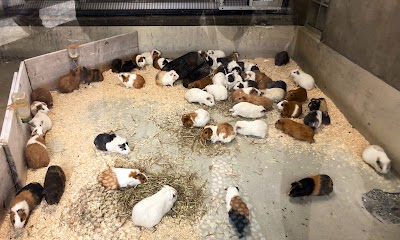

- **Place ID:** `ChIJLRZy90ruGGAR7AqksIECQr8`
- **Address:** 1-chōme-17-6 Gotenyama, Musashino, Tokyo 180-0005, Japan
- **Overall Rating:** 4.2 ⭐
- **Review Summary:** {'text': 'People say this zoo offers a unique experience with its "Squirrel Path" where Japanese squirrels run freely, and a "Guinea Pig Petting Corner" for close interaction. Visitors also highlight the reasonable 400 yen adult admission fee and the convenient size, perfect for a relaxed 1-2 hour visit. They also appreciate the peaceful atmosphere, the variety of small animals, and the integrated sculpture garden.', 'languageCode': 'en-US'}
- **Amenities Summary:** Parking: {"freeParkingLot": false, "paidParkingLot": false, "freeStreetParking": false, "paidStreetParking": false, "freeGarageParking": false, "paidGarageParking": false} | Accessibility: {"wheelchairAccessibleParking": true, "wheelchairAccessibleEntrance": true, "wheelchairAccessibleRestroom": true, "wheelchairAccessibleSeating": false}
#### Top 10 Positive Reviews:
- 5 Stars: An interesting zoo which is divided into 2 parts n also comprises of a sculpture park. Due to time constraint, we didn't cross over to d other side.  No panda, but there r capybara, guinea pigs, woolly sheep n squirrel. It's a quiet zoo where one can immense in nature n observe d animals.  Admission is 400¥ for adults. Local residents n students enter free (I think). There's cafeteria, souvenir shop n toilets in d zoo. Reasonably-priced.  Also, it's walking distance fr Ghibli Museum.
- 5 Stars: Fairly small but well kept zoo separated into two sections a 5 minute walk apart.  Again, an interesting collection of animals -- especially the Japanese squirrel enclosure! They are so cute and so fast...
- 5 Stars: A beautiful park located in the wonderful city of Kichioji near Tokyo. The park is a popular tourist attraction during the cherry blossom season.
- 4 Stars: This zoo is great! There is a lot to see and do with the sculpture garden and history museum areas as well as a number of areas with animals.  What I like about this one is it was very open and animals weren't squished into tiny pens like we have seen before (at Ueno Zoo for example).  There is also a second area across the bridge to see the water birds and to walk through more of the area. It's very beautiful and nice for a relaxing day wandering around.
- 4 Stars: Lovely local zoo with both land and aquatic sections. Squirrel habitat is adorable! We spent a couple of hours there enjoying both sides of the zoo, and it's an easy walk to the Ghibli Museum.

#### Top 10 Negative/Lowest Reviews:
No negative reviews available.

---
### Squirrel Trail

- **Place ID:** `ChIJSwro30ruGGARKhhvhpc12s0`
- **Address:** 2-chōme-4-2 Gotenyama, Musashino, Tokyo 180-0005, Japan
- **Overall Rating:** 4.5 ⭐
- **Review Summary:** {'text': 'Visitors say this animal park offers a unique opportunity to observe many Japanese squirrels up close in a large, naturalistic enclosure. They also highlight the well-maintained grounds with benches for resting and the convenient double-door system to prevent escapes.', 'languageCode': 'en-US'}
- **Amenities Summary:** Accessibility: {"wheelchairAccessibleEntrance": true}
#### Top 10 Positive Reviews:
- 5 Stars: Nestled in the heart of Inokashira Park in Kichijoji, Tokyo, Inokashira Squirrel Park is a charming, family-friendly attraction that offers a unique and delightful experience. This small, well-kept park is dedicated to our furry friends—the squirrels—and provides visitors with a chance to get up close and personal with these playful creatures in a natural, safe environment.  A Squirrel Lover’s Dream Inokashira Squirrel Park is home to hundreds of squirrels that roam freely within the park’s spacious enclosures. The highlight of the park is the large open area where visitors can walk among the squirrels as they scurry around, climb trees, and playfully interact with each other. The squirrels are accustomed to people, and while they aren’t overly tame, they’re curious and often come quite close, making for some adorable photo opportunities. The park’s design allows visitors to get an intimate view of the squirrels in their natural habitat, without any barriers between them and the animals.  For those looking for a more immersive experience, the park also has a small area where you can feed the squirrels. While feeding is limited to specific areas where the animals are encouraged to interact with people, it’s still a joy to see the squirrels taking food from your hands, adding an extra layer of fun and excitement to the visit.  Park Features and Atmosphere The park itself is relatively small but well-maintained, with plenty of green space and shaded areas. It is set amidst the scenic beauty of Inokashira Park, providing a relaxing environment for visitors. The layout includes paths lined with trees, picnic areas, and benches where you can sit and enjoy the peaceful surroundings while watching the squirrels and other small wildlife.  In addition to squirrels, there are also several other animals in the park, including birds, rabbits, and some other small critters. While the squirrels steal the spotlight, these additional animals add variety and charm to the experience. The park is especially popular with families and children, but it offers a warm and inviting space for people of all ages to unwind and enjoy nature.  Visitor Experience Inokashira Squirrel Park is a delightful, low-key experience that provides visitors with a hands-on way to engage with nature. The park is not overly crowded, making it a peaceful retreat within the busy Kichijoji area. The squirrels are playful and fun to watch, and the atmosphere is both relaxed and playful, offering a break from the more typical tourist spots in Tokyo.  The park has a very friendly and casual vibe, and visitors can enjoy the simple joy of watching the squirrels interact with their environment. There’s also a small admission fee, but it’s quite affordable and definitely worth it for the chance to experience something unique and charming. The park is clean and well-organized, and staff are friendly and ensure that visitors treat the animals with respect.  Best Time to Visit The park can be visited year-round, but the best times are in spring and autumn, when the weather is mild and the surroundings are at their most beautiful. Spring brings cherry blossoms to the nearby Inokashira Park, enhancing the overall charm of the area, while autumn provides a stunning backdrop of colorful foliage. The squirrels are active throughout the year, but you might find them especially lively during these seasons. Summer can be a bit warm, but the shaded areas in the park provide a cool and pleasant spot to relax.  Final Thoughts A charming and whimsical spot that’s perfect for animal lovers, families, and anyone looking for a relaxing, fun-filled experience in the heart of Tokyo.
- 5 Stars: There were so many cute squirrels there!
- 5 Stars: It seems almost everything in Japan is better, even the squirrels.  My wife hates squirrels and still loved this walk and seeing the cute squirrels up close.  We swear they're cuter than our own squirrels back home.
- 5 Stars: Note, this is a part of the zoo and not a separate location or attraction. Zoo admittance is required to see the squirrels. They have a large enclosure that you walk through where squirrels are just running around and doing cute things. Lots of people taking photos and going cute overload for them. Note, these are Japanese squirrels so if you were expecting one like you have in your backyard in America, these little ones are even cuter.
- 5 Stars: Squirrel trail is the bomb, you see all these cute critters like hella up close and sometimes they'll even climb on you if you're cool

#### Top 10 Negative/Lowest Reviews:
No negative reviews available.

---
### Pepa Cafe Forest
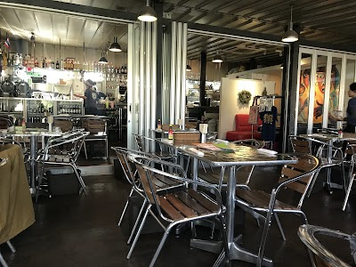

- **Place ID:** `ChIJl7alBTfuGGARrk-lOYlVuY4`
- **Address:** 4-chōme-1-5 Inokashira, Mitaka, Tokyo 181-0001, Japan
- **Overall Rating:** 4.2 ⭐
- **Review Summary:** {'text': "Diners like this cafe's authentic Thai dishes, including flavorful pad thai and green curry, and appreciate the generous portions. They also highlight the lively, nature-filled atmosphere and the staff's friendly and attentive service. Guests mention the convenient dog-friendly policy, with water provided for pets, and the availability of baby changing facilities.", 'languageCode': 'en-US'}
- **Amenities Summary:** Accessibility: {"wheelchairAccessibleParking": false, "wheelchairAccessibleEntrance": false}
#### Top 10 Positive Reviews:
- 5 Stars: The food was excellent and reasonably priced. The staff are so efficient. It's like a bee hive of activity from serving, bussing, cooking, and payments. Even though there is almost always a queue, it's not from the staff being slow. I don't think they could have been any faster.  The only slight drawback was the tables and chairs were cheap and a little unstable, but it's a restaurant in a park, so it's arguably to be expected.  I had the egg noodle but the pad thai looked far better.
- 5 Stars: I love Thai food to begin with and it’s also in Inogashira park, gives it a nice feel to dine there. Good for family, friends or a casual date, if you will. You can take pets there as well. The menu is good but a little limited. Tom Yum noodles and pork stew over rice are a must try.
- 5 Stars: Delicious Thai food, which reminded me immediately of teal Thai cuisine, within a beautiful spot at Inokashira. Easy to access. Staff is very friendly and professional. The deserts are also good and cute! Coconut ice cream and coconut pudding are recommend.
- 5 Stars: Such a very nice! With hip interior design for all the hipper the hopper young kids. Went with the tea much enjoyment and hot. Also coming to you in the cold variety! Much recommendation, yolo for life.
- 4 Stars: The pictures are from last fall, but I've come here several times since then. I love that this is in the middle of the park, it’s surrounded by nature, so it feels like eating in an exotic location. The food here tastes good, but like most Japanese restaurants, the portion of meat seems too small. I’m used to hulking portions of meat in my Thai dishes back in America, so I’m usually leaving here a little hungry . But overall, solid lunch spot for a decent price.

#### Top 10 Negative/Lowest Reviews:
No negative reviews available.

---
### Kichijōji Petit Mura
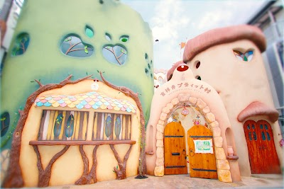

- **Place ID:** `ChIJC_BkRUnuGGAR3tojGiIY-RA`
- **Address:** Japan, 〒180-0004 Tokyo, Musashino, Kichijōji Honchō, 2-chōme−33−２ 吉祥寺プティット村
- **Overall Rating:** 3.9 ⭐
- **Review Summary:** {'text': 'Visitors say this complex offers a whimsical, storybook-like atmosphere with charming cat-themed decor and unique shops selling handmade goods. They also highlight the delicious food and drinks, reasonable prices, and attentive staff.\n\nOther reviews mention the cat cafe can be crowded.', 'languageCode': 'en-US'}
- **Amenities Summary:** Parking: {"freeParkingLot": false, "paidParkingLot": false, "freeStreetParking": false, "paidStreetParking": false, "valetParking": false, "freeGarageParking": false, "paidGarageParking": false} | Accessibility: {"wheelchairAccessibleParking": false, "wheelchairAccessibleEntrance": false}
#### Top 10 Positive Reviews:
- 5 Stars: A beautifully whimsical, storybook-like café filled with charming tiny details everywhere you look — just note the doors are smaller than usual, so tall people beware 😭  Visited with pre-booking and it was a really pretty, fairytale-like experience . The whole place has a very whimsical, almost “royal” vibe, and I loved all the tiny doors and miniature details around the space — it really feels like stepping into a storybook.  The cats were mostly sleeping and quite chill. They’re very used to people and will tolerate gentle pats, but don’t expect them to be very playful or interactive. It’s more of a calm, observe-and-enjoy kind of experience.  We ordered food and drinks, which were nice, but I appreciated that there’s no pressure to keep ordering after paying the entry fee. There’s also no time limit, so you can just relax and take your time, which is a big plus compared to many other cat cafés.  Overall, I’d recommend coming for the atmosphere and aesthetic rather than expecting lots of cat interaction. Great for a slow, cosy visit.
- 5 Stars: Please must visit this cat cafe if you are cat lover. There is some distance from city area and we decide to give it a try and totally no regret.  The counter will explain the rule and we only can purchase the cat snack at the beginning and some cat (cat wearing collar with large bell) are not advise with the cat snack. We want to ensure the stay time per ticket and to our surprise there is no time limit, this is first time we counter cat cafe with not time limit at all. The other bonus point of there service which they offer to keep your jacket/coat and bag at the counter.  There are two storey inside the cat cafe and what impress us is they keep the cat cafe so clean and no weird smell at all and we don't really see any hair on the floor, you can sit anywhere you want. The most important is the cats are healthy and playful and they will come forward you, very comfortable with human being. The cafe also provide WIFI for customer to use, no worry about WIFI strength as level one and level two having different WIFI connection.
- 5 Stars: Loved it! We were seated in a private cubby area but a lot of the cats popped in to say hello, you can definitely explore around to see all the cats, there’s a second story. Their coats were all soft and clean and everyone seemed to be enjoying their time there. Assorted Bread dish was surprisingly great!
- 5 Stars: A calm, heart-healing space in the middle of the city.  I spent about three hours here and honestly didn’t feel the time pass at all. There are many cats (more than I expected), each with their own personality, and the space is thoughtfully designed so both humans and cats feel relaxed.  What I appreciated most was the atmosphere — it’s quiet, gentle, and respectful. The staff clearly care about the cats, and nothing feels rushed or commercial.  I came in a bit tired from traveling and left feeling recharged. If you’re looking for a place to slow down, breathe, and just be, this café does exactly that.  Highly recommended, especially for solo travelers.

#### Top 10 Negative/Lowest Reviews:
No negative reviews available.

---
### Katsura River
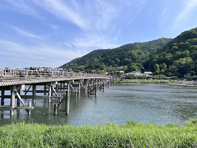

- **Place ID:** `ChIJ5SxhmN0EAWARcDGJMBvJFsg`
- **Address:** Katsura River, Japan
- **Overall Rating:** 4.4 ⭐
#### Top 10 Positive Reviews:
- 5 Stars: Elizabeth is best waifu
- 5 Stars: looks nice👍
- 4 Stars: This is my favorite dog walking trail.
- 4 Stars: They've put in a lot of effort to prevent flooding. It's amazing! I took this photo of the Katsura River from the Hankyu train.

#### Top 10 Negative/Lowest Reviews:
No negative reviews available.

---
### Hakone Yuryo
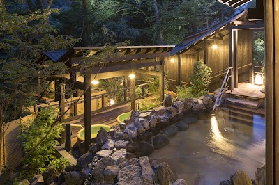

- **Place ID:** `ChIJAdpH56ajGWARpFe4ALTyfas`
- **Address:** 4 Tōnosawa, Hakone, Ashigarashimo District, Kanagawa 250-0315, Japan
- **Overall Rating:** 4.3 ⭐
- **Review Summary:** {'text': 'People say this onsen offers a variety of baths, including spacious outdoor pools surrounded by lush greenery, and a sauna with enjoyable "loyly" services. They also highlight the convenient free shuttle bus from Hakone Yumoto Station and the delicious food at the on-site restaurant. Guests mention the clean, well-maintained facilities and the welcoming atmosphere, making it a relaxing escape.', 'languageCode': 'en-US'}
- **Amenities Summary:** Parking: {"freeParkingLot": true, "paidParkingLot": false, "freeStreetParking": false, "paidStreetParking": false, "valetParking": false, "freeGarageParking": false, "paidGarageParking": false} | Accessibility: {"wheelchairAccessibleParking": true, "wheelchairAccessibleEntrance": true, "wheelchairAccessibleRestroom": true, "wheelchairAccessibleSeating": true}
#### Top 10 Positive Reviews:
- 5 Stars: We rented a private onsen with our 13 year old in April. We loved our day trip there! We took the Romancecar train from Shinjuku and the free shuttle from the Hakone train station that takes you right to the onsen. The grounds were very lush and tranquil, our private room (type 3 room) and onsen were lovely and plenty big for us. The water was so warm, almost too warm. It was a chilly rainy day so it felt amazing! We also had lunch at the onsite restaurant. It was really good. Great option to people who don’t want to stay overnight for an onsen experience!
- 5 Stars: Super clean and well worth the price. We upgraded to type 2 and had a larger onsen to soak in and it was great. There’s everything you need in the room including face lotion, body lotion, soaps to shower, q tips, combs and hair ties. We rented robes for 100 yen and they provided towels. Highly recommend doing this and you can bring your own snacks so go to the Lawson beforehand. There’s a mini fridge in the room with two free bottles of water too.
- 5 Stars: PROS ➕ Large onsen with nature view ➕ Other amenities ➕ Affordable  CONS ➖ None  Date visited: 05/06/2024  We arrived at the Hakone Yuryo bathhouse on foot. There were buses running from the train station, but it was already late.  According to the staff, we had about an hour to bathe, so we got right to it. For a low price, we were handed a locker key and directed to the men’s section.  On the way, I noticed the facility had plenty to offer—souvenirs, snacks, a garden, and a rest area complete with shelves of manga, just to name a few. There were even private baths, which I was glad I hadn’t reserved. It was already dark outside, so I didn’t linger too long. We headed straight to the onsen.  After stripping and placing our belongings in a locker, we met a local who explained all the onsen etiquette we needed to know—in fluent English. I’m still grateful for that. I’d recommend looking up the rules before you even consider visiting one of these public bathhouses. Armed with fresh bathing knowledge, we entered the onsen hall.  There were several pools with varying temperatures—all hot and steamy, in my opinion. I washed myself at one of the two washing stations before jumping into a pool, which turned out to be the warmest one.  I say “pool,” but they were designed to resemble natural hot springs, with rocks and boulders. Fallen leaves from nearby trees floated on the surface, adding beautifully to the ambience. A low fence bordered the onsen. Beyond it was darkness, but I could imagine the view would be stunning in daylight.  I soaked for a short while, hopping between pools to find the most comfortable one. I also tried the sauna, which was still running—thankfully. By then, it was just the two of us in there, but I wasn’t about to complain. We spent about half an hour bathing, just as I felt a headache starting to kick in.  A variety of vending machines were installed in the locker room, offering snacks and bathing necessities. I bought and drank a small bottle of milk to stay in the spirit of things.  We left just as quickly as we arrived. The process was swift and effortless. We returned the key and thanked the staff for their work, then left—but not before picking up some hotspring–boiled eggs.  Overall, I highly recommend this bathhouse and any bathhouses if you’re in Hakone. While private services are available, nothing beats bathing butt-naked with strangers in a public pool.
- 5 Stars: This was my second time visiting Hakone Yuryo (after coming here in April last year), and I honestly couldn’t have enjoyed it more.  We booked a private onsen room, which was spotless, very well maintained, and truly private. The onsen itself was incredibly relaxing and felt very healing, we enjoyed every minute of it.  After the onsen, we had a massage appointment, and it was outstanding. We chose a 30-minute full body massage combined with a 20-minute facial, and the masseuses were absolutely amazing. We left feeling completely refreshed and honestly wishing we had booked even longer.  For our next trip, we’re already planning to stay overnight instead of just doing a day trip, it’s that good.  The staff is very friendly, speaks English well, and the whole experience is very smooth. You can pay both by card and cash, which is convenient.  I highly recommend this onsen, a perfect place to relax and unwind in Hakone.
- 4 Stars: Very nice place. There should be more places where to sit or lie down, to relax after sauna or hot water. It would be also useful to have shower before cold pool after sauna, washing with bucket of water is not so effective. Restaurant is extremely delicious! You must to create registration number and wait in the queue, but it diseased it.

#### Top 10 Negative/Lowest Reviews:
No negative reviews available.

---
### Limited Express Odoriko (Search Failed)
- No Place ID found.

---
### Katsuragawa
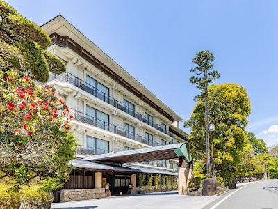

- **Place ID:** `ChIJRbOtY8XsGWAR2Zlbc9BUTss`
- **Address:** 860 Shuzenji, Izu, Shizuoka 410-2416, Japan
- **Overall Rating:** 4.2 ⭐
- **Review Summary:** {'text': 'People say this hotel offers a wide variety of free amenities, including seven private onsen baths, welcome drinks, and late-night ramen. They also highlight the diverse and delicious buffet meals for breakfast and dinner, featuring local ingredients and freshly prepared hot food. Guests mention the staff are consistently kind, welcoming, and provide excellent service, making for a comfortable and enjoyable stay.', 'languageCode': 'en-US'}
- **Amenities Summary:** Accessibility: {"wheelchairAccessibleParking": true, "wheelchairAccessibleEntrance": true}
#### Top 10 Positive Reviews:
- 5 Stars: We stayed at Shuzenji Onsen Katsuragawa from 18-19 February to celebrate my sister’s birthday on the 19th.  Before our stay, I asked our travel agent whether the hotel could help arrange a surprise birthday cake (I was willing to pay for the cake and any additional fees). Unfortunately, the hotel informed us that they were unable to provide this service. I completely understood and appreciated their clear response.  From the moment we checked in, we were impressed. The hotel facilities are wonderful, the room was very nice and comfortable, and the amenities were complete. The staff members were all kind and welcoming. We especially enjoyed the onsen and the amusement room, it made our stay even more memorable.  We booked a plan that included both dinner and breakfast, and the meals were excellent. During dinner, one of the staff members came to our table and asked if someone in our family had a birthday. They then handed my sister a small paper bag as a gift; it was matcha powder. Such a simple yet thoughtful gesture truly touched our hearts.  Even though they couldn’t arrange the cake, they still found a way to make my sister feel special. We are very grateful for their kindness and hospitality.  We will definitely recommend this hotel to our family and friends. Thank you for making our stay so memorable!
- 5 Stars: Exceptional, stayed for three nights and will definitely return some day. The hotel/Onsen is lovely and very clean throughout. We only used the private spa baths but all were differently themed and totally relaxing. The food at both breakfast and dinner was superb, really good quality, plenty of choice and variety. What most impressed and made our stay very special was the staff, from the greetings and help from the all the gentleman at the front of the hotel, the receptionists, waiting staff, housekeeping, chefs at mealtime and all encountered, always polite, friendly and helpful, a credit to the hotel/ Onsen. Thank you all. Highly recommended.
- 5 Stars: Great rooms, good hotel facilities and warm service. Private onsens available. Wide buffet spread with freshly made hot food as well. Good value for money.  It’s a large hotel chain by Dormy Inn but we love the consistently good customer experience in their hotels.
- 4 Stars: It's a large hotel. The dinner buffet offers a wide variety of food, including a soft-serve ice cream machine. Late at night, they have noodles and ice cream. In the morning, they serve Yakult. The onsen has both communal and private baths (7 rooms in total), but you might have to queue if it's busy. Importantly, it's free. You can walk to the bamboo garden or Shuzenji Temple, which are not far away.

#### Top 10 Negative/Lowest Reviews:
No negative reviews available.

---
